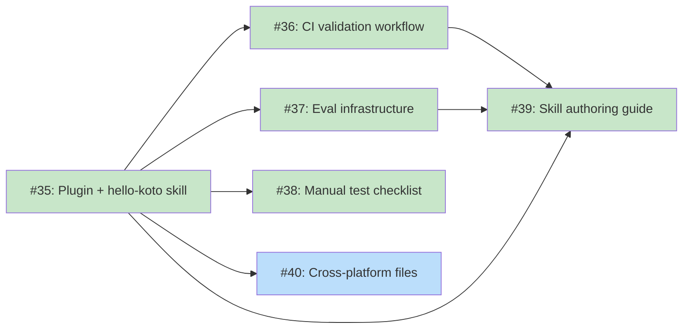

# DESIGN: koto Agent Integration

## Status

**Planned**

## Implementation Issues

### Milestone: [koto Agent Integration](https://github.com/tsukumogami/koto/milestone/5)

| Issue | Dependencies | Tier |
|-------|--------------|------|
| ~~[#35: feat(plugin): add koto-skills plugin with hello-koto skill](https://github.com/tsukumogami/koto/issues/35)~~ | None | testable |
| _~~Creates the marketplace manifest, plugin structure, Stop hook, and hello-koto skill. Establishes the file layout that all downstream issues build on and answers the template locality question.~~_ | | |
| ~~[#36: ci(plugin): add template and hook validation workflow](https://github.com/tsukumogami/koto/issues/36)~~ | [#35](https://github.com/tsukumogami/koto/issues/35) | testable |
| _~~Adds a GHA workflow that validates template compilation, hook behavior, and manifest schemas on PRs touching plugins/. Uses the koto binary built from the PR -- no external dependencies or API keys.~~_ | | |
| ~~[#37: test(plugin): add prompt regression eval infrastructure](https://github.com/tsukumogami/koto/issues/37)~~ | [#35](https://github.com/tsukumogami/koto/issues/35) | testable |
| _~~Sets up a GHA eval harness that sends SKILL.md content to the Anthropic API and checks the model produces the expected koto command sequence. Catches behavioral regressions that structural validation misses.~~_ | | |
| ~~[#38: docs(plugin): add manual test checklist for agent flow](https://github.com/tsukumogami/koto/issues/38)~~ | [#35](https://github.com/tsukumogami/koto/issues/35) | simple |
| _~~Documents a structured manual test plan covering plugin install, skill invocation, workflow loop, Stop hook behavior, and failure modes. Run before releases that change plugin content.~~_ | | |
| ~~[#39: docs(plugin): add custom skill authoring guide](https://github.com/tsukumogami/koto/issues/39)~~ | [#35](https://github.com/tsukumogami/koto/issues/35), [#36](https://github.com/tsukumogami/koto/issues/36), [#37](https://github.com/tsukumogami/koto/issues/37) | simple |
| _~~Writes the guide for creating custom koto workflow skills, covering SKILL.md structure, template locality, contributing to the plugin, and testing with CI and evals. Uses hello-koto as the reference implementation.~~_ | | |
| [#40: feat(plugin): add cross-platform agent files](https://github.com/tsukumogami/koto/issues/40) | [#35](https://github.com/tsukumogami/koto/issues/35) | simple |
| _Creates AGENTS.md for Codex/Windsurf and .cursor/rules/koto.mdc for older Cursor versions. Translates the hello-koto SKILL.md content into each platform's expected format._ | | |

### Dependency Graph



**Legend**: Green = done, Blue = ready, Yellow = blocked, Purple = needs-design, Orange = tracks-design

## Context and Problem Statement

koto has a working state machine engine (v0.1.0) that enforces workflow progression through evidence-gated transitions. It's installable via GitHub Releases and an install script. But there's a gap between "koto is on PATH" and "an AI agent uses koto to run a workflow."

The gap is a distribution problem, not a feature problem. An agent needs a skill that tells it koto exists, what commands to call, and which template to use. The skill bundles two things that always travel together. A constraint shapes the answer: koto stores absolute template paths in state files and verifies SHA-256 hashes on every operation, so templates must live at stable filesystem paths for the duration of a workflow.

1. **The workflow template** -- the `.md` file defining states, transitions, and evidence gates
2. **Agent instructions** -- how to call koto, what evidence to supply, how to interpret responses

Without a skill, the agent doesn't know koto exists. Without a template in the skill, there's nothing to run. And because koto needs a stable absolute path to the template, the template can't live in a transient location like a plugin cache -- it needs to be somewhere in the project that won't move. The question is: how do these skills get from "someone wrote them" to "they're installed in a developer's project" with the template at a stable path?

Two flows need support:

**Agent-driven flow.** A skill is installed in the project (by any mechanism). The agent reads it and follows the instructions: call `koto init --template <path>`, then loop `koto next` / execute / `koto transition`. koto compiles and caches the template on first init (existing behavior). The cache at `~/.koto/cache/` keys on the SHA-256 of the template source, so the same template is compiled only once.

**Author-driven flow.** A template author validates their work with `koto template compile <path>`, which already exists. It reports errors and outputs compiled JSON. No new infrastructure needed.

### Distribution Landscape

The Agent Skills open standard (agentskills.io, launched December 2025 by Anthropic) defines a `SKILL.md` format that works across Claude Code, OpenAI Codex CLI, Cursor, Windsurf, Gemini CLI, and GitHub Copilot. This means a skill written once works across platforms.

Claude Code provides a full distribution stack:

| Mechanism | How it works | Friction |
|-----------|-------------|----------|
| Git commit | `.claude/skills/` in the repo. Auto-discovered on clone. | Zero for collaborators |
| Personal install | Copy to `~/.claude/skills/`. Available in all projects. | Manual per-user |
| Plugin | `/plugin install name@marketplace`. Bundles skills + hooks + commands. | One command |
| Team auto-install | `settings.json` with `enabledPlugins`. Prompts on folder trust. | Zero after setup |

Other platforms rely on simpler conventions: Cursor uses `.cursor/rules/`, Codex uses `AGENTS.md`, Windsurf uses `.windsurfrules`. All support the Agent Skills standard for cross-platform skills.

### Scope

**In scope:**
- Plugin structure for distributing reference workflow skills
- Skill file structure (SKILL.md content for a koto workflow)
- Template locality: ensuring templates live at stable project-local paths
- Stop hook for session continuity (bundled in the plugin)
- Cross-platform support via Agent Skills standard
- Documentation for custom template skill authoring

**Out of scope:**
- koto CLI changes (none needed)
- Template search paths or built-in embedding
- `koto generate` command (deferred; may be useful later as a convenience)
- MCP server integration
- Template registry or community sharing marketplace

## Decision Drivers

- Agent platforms already have distribution mechanisms -- use them, don't reinvent
- The Agent Skills standard provides cross-platform reach for free
- koto already compiles and caches templates on first `koto init` -- no engine changes needed
- Templates need stable filesystem paths: the engine stores absolute paths in state files and verifies SHA-256 hashes on every operation
- The solution must work for both reference templates (published by koto) and custom templates (written by project teams)
- Minimize koto code changes -- the distribution problem is solved by the ecosystem, not by koto

## Considered Options

### Decision 1: How Workflow Skills Reach Users

A koto workflow skill consists of a SKILL.md (agent instructions) and a template file. It needs to get into a position where the agent platform can discover and load it. For reference templates published by the koto project (like quick-task), there's a publishing question: where do they live and how do users install them?

#### Chosen: Plugin for Reference Templates, Project-Scoped for Custom

**Reference templates** are published as a Claude Code plugin inside the koto repository (under `plugins/koto-skills/`), just as tsuku keeps recipes in a folder under its repo. The plugin bundles:
- One skill per workflow template (SKILL.md + template file)
- A Stop hook that detects active koto state files

Users install with `/plugin install koto-skills@koto`. The plugin's skills appear in Claude Code's skill list. When invoked, the skill instructs the agent to copy the template to a project-local path and then call koto.

The plugin is also published to a marketplace for discoverability. Teams can enable it automatically via `settings.json`.

**Custom templates** are project-scoped. The author writes a template, validates it with `koto template compile`, then writes a SKILL.md alongside it in `.claude/skills/<name>/`. Both files are committed to the project repo. The skill is available to anyone who clones the project.

**koto itself needs no code changes.** The compile-and-cache infrastructure already handles template processing. The skill file is just a markdown document with instructions -- koto doesn't need to know about it.

#### Alternatives Considered

**Project-scoped only (no plugin).** Publish reference skill directories in koto's repo. Users copy them into their project manually.
Rejected as the primary path because it requires users to find the skill files in koto's repo, copy them, and keep them updated. The plugin model reduces this to a single install command and provides automatic updates. Project-scoped remains the right model for custom templates.

**Git repository distribution (no plugin layer).** Publish `koto-skills` as a plain git repo that users submodule or subtree into `.claude/skills/`.
Rejected because it adds git submodule management overhead to every project that wants koto skills. Submodules are notoriously friction-heavy (initial setup, update commands, detached HEAD state). The plugin system provides the same "install once" experience without burdening the project's git history.

**`koto generate` as the primary distribution mechanism.** A `koto generate claude-code --template <path>` command scaffolds skill files from a template.
Rejected as the primary distribution mechanism because the hard part isn't generating the SKILL.md -- it's getting the skill to the user. A generate command couples every distribution path to koto releases. The plugin model decouples them. As a secondary tool for custom skill authoring, `koto generate` could reduce the manual effort of extracting evidence keys and state descriptions from templates. That's a convenience feature for a future release, not the distribution mechanism.

### Resolved During Design

- **Template delivery from plugin to project.** Claude Code injects SKILL.md content as text -- the agent doesn't receive a filesystem path to the skill directory. Resolution: the SKILL.md includes the template content inline (fenced code block or `references/` directory). The agent writes it to a project-local path on first use. See Template Locality in Solution Architecture.
- **Stop hook failure modes.** The hook fails silently if cwd isn't the project root or if `koto` isn't on PATH. Resolution: both failure modes are safe (no false positives, just missed detection). Documented as limitations in the Stop Hook section. The SKILL.md also includes resume instructions as a fallback.
- **Evidence supply at transition time.** `koto transition` in v0.1.0 has no `--evidence` flag. Resolution: the first skill (quick-task) uses `command` gates that verify conditions independently (e.g., running tests, checking file existence) rather than relying on agent-supplied evidence fields. This is a cleaner pattern for agent workflows -- koto verifies instead of trusting the agent's claims. The `--evidence` flag can be added in a future koto release for templates that need agent-asserted evidence, but it's not a prerequisite.
- **SKILL.md drift.** The SKILL.md documents koto's CLI behavior. Resolution: since skills and engine live in the same repo, the convention is that CLI-changing PRs must update the affected skills in the same commit. No automated check, but code review enforces it.
- **Cross-platform support scope.** Resolution: Phase 1 targets Claude Code only (plugin + SKILL.md). AGENTS.md for Codex/Windsurf is Phase 4 (optional). Cursor supports the Agent Skills standard directly, so SKILL.md works there without additional files.

### Remaining Uncertainties

- **Plugin system maturity.** Claude Code's plugin system is relatively new (v1.0.33+, late 2025). Plugin installation is confirmed working, but marketplace discovery and team auto-install are still being adopted. Team auto-install (`extraKnownMarketplaces`) does not work in headless mode -- a known open issue. Fallback: project-scoped skills work without the plugin system.

## Decision Outcome

### Summary

Reference koto workflow skills are distributed as a Claude Code plugin. Users install with `/plugin install`. Custom workflow skills are committed to the project repo under `.claude/skills/`. koto itself needs no code changes.

The Agent Skills standard means koto's SKILL.md files work across platforms. The Stop hook (which prevents agents from quitting mid-workflow) is bundled in the plugin for Claude Code and documented for manual setup on other platforms.

### Rationale

Agent platforms already solve the distribution problem. Claude Code has plugins, marketplaces, and team auto-install. Cursor has a marketplace. Codex and Windsurf have filesystem conventions. The Agent Skills standard provides cross-platform portability.

Building distribution into koto (search paths, `go:embed`, registries, generate commands) would duplicate ecosystem capabilities. The plugin model uses Claude Code's native distribution stack. Skills and the engine live in the same repo, so CLI changes and skill updates can be coordinated in the same PR.

koto's compile-and-cache path already handles the engine side. `koto init --template <path>` compiles the template, caches the result keyed by source hash, and records the absolute path in the state file. Every subsequent `koto next` re-reads and re-verifies the template. No modifications needed.

### Plugin Layering: Core + Workflow Plugins

A natural structure would be a `koto-core` plugin with shared building blocks (Stop hook, koto CLI reference, common error handling) and separate workflow plugins (`koto-quick-task`, `koto-feature-dev`) that depend on it. Each workflow plugin would carry only its SKILL.md and template, inheriting the hook and CLI docs from core.

Claude Code's plugin system does not support inter-plugin dependencies. There's no `dependencies` field in the manifest schema, no automatic resolution, and plugins can't reference files outside their own directory. This is tracked as a feature request (anthropics/claude-code#9444). Until dependency support ships, each plugin must be self-contained -- duplicating the Stop hook and CLI reference across workflow plugins.

For now, we bundle everything into a single `koto-skills` plugin. The duplication cost is low (the hook is one JSON entry, the CLI reference is a few paragraphs). If plugin dependencies are added later, we can split into core + workflow plugins without changing anything about how users interact with koto.

### Trade-offs Accepted

- **No built-in templates.** koto doesn't ship with templates embedded in the binary. Users need to install the plugin or copy skill files into their project. Acceptable because the plugin install is a single command, and project-scoped skills are just files committed to git.
- **Template must be project-local.** The state file stores absolute template paths. Templates from plugins must be copied to a stable project-local path before `koto init`. This adds a step to the agent-driven flow, but it's handled by the SKILL.md instructions -- the user never sees it.
- **Plugin system dependency.** The primary distribution path depends on Claude Code's plugin system, which is newer than the core CLI. Acceptable because project-scoped skills remain a fully functional fallback, and the Agent Skills standard provides cross-platform reach beyond any single plugin system.
- **Manual authoring for custom skills.** Authors write SKILL.md by hand for custom templates. A `koto generate` command could automate this later, but the manual path works and keeps koto's scope minimal.

## Solution Architecture

### Overview

The implementation produces two artifacts, neither of which requires koto code changes:

1. **Plugin and marketplace directories** inside the koto repo -- reference workflow skills, Stop hook, and marketplace manifest
2. **Documentation** -- a guide for creating custom koto workflow skills

### Plugin and Marketplace Layout

The plugin lives inside the koto repo, following the same pattern as Anthropic's own `claude-code` repo (which hosts plugins under `plugins/`). The marketplace manifest at the repo root points to plugin subdirectories via relative paths.

```
koto/
├── .claude-plugin/
│   └── marketplace.json              # Marketplace catalog (repo root)
├── plugins/
│   └── koto-skills/
│       ├── .claude-plugin/
│       │   └── plugin.json           # Plugin manifest
│       ├── skills/
│       │   └── quick-task/
│       │       └── SKILL.md          # Agent instructions + embedded template
│       └── hooks.json                # Stop hook for session continuity
└── ... (engine source, cmd/, pkg/, etc.)
```

**`marketplace.json`** (at repo root):

```json
{
  "name": "koto",
  "owner": { "name": "tsukumogami" },
  "plugins": [
    {
      "name": "koto-skills",
      "source": "./plugins/koto-skills",
      "description": "Workflow skills for koto"
    }
  ]
}
```

**`plugin.json`** (in `plugins/koto-skills/`):

```json
{
  "name": "koto-skills",
  "version": "0.1.0",
  "description": "Workflow skills for koto -- the state machine engine for AI agent workflows",
  "skills": ["./skills/quick-task"]
}
```

Users install:
```
/plugin marketplace add tsukumogami/koto
/plugin install koto-skills@koto
```

Claude Code clones the koto repo and resolves the `./plugins/koto-skills` path from the marketplace source field. Only the plugin subtree is cached locally.

Each workflow template gets its own skill directory under `skills/`. Adding a new workflow means adding a new directory with a SKILL.md -- no separate repo, no coordination with the koto binary release beyond a normal commit.

Teams can auto-install by adding to their project's `.claude/settings.json`:

```json
{
  "extraKnownMarketplaces": {
    "koto": {
      "source": { "source": "github", "repo": "tsukumogami/koto" }
    }
  },
  "enabledPlugins": {
    "koto-skills@koto": true
  }
}
```

### Skill File Structure

A koto workflow SKILL.md follows the Agent Skills standard:

```yaml
---
name: quick-task
description: |
  Run a quick development task using koto workflow guidance. Use when the user asks to
  implement a small feature, fix a bug, or complete a well-scoped task.
---
```

The body covers:

1. **Prerequisites** -- koto must be installed and on PATH
2. **Template setup** -- ensure the template exists at a project-local path
3. **Execution loop** -- the init / next / execute / transition cycle
4. **Evidence keys** -- what to supply at each transition, extracted from the template's gate definitions
5. **Response schemas** -- JSON shapes returned by koto commands
6. **Error handling** -- how to recover from common errors
7. **Resume** -- how to continue an interrupted workflow

The skill content is authored by hand. Evidence keys and state descriptions come from reading the template. For reference skills published in the plugin, these are maintained by the koto project.

### Template Locality

koto stores the absolute template path in state files and verifies the SHA-256 hash on every operation. If the template moves or changes, the workflow breaks. This creates a constraint: **templates used by active workflows must be at stable paths.**

For **project-scoped skills**, this is automatic. The template lives at `.claude/skills/<name>/<template>.md`, which is committed to the repo and doesn't move.

For **plugin-distributed skills**, the template lives in the plugin's skill directory alongside the SKILL.md. The question is whether the agent can resolve this path at runtime. Two possibilities:

1. **Direct use.** The agent resolves the template's path in the plugin cache and passes it to `koto init`. The path is stable for the duration of a workflow (plugins don't update mid-session). If the plugin updates between sessions while a workflow is paused, the state file's stored path may break -- an edge case the agent can recover from by re-initializing.

2. **Copy to project.** The SKILL.md instructs the agent to copy the template to a project-local path (e.g., `.koto/templates/hello-koto.md`) before calling `koto init`. The path is stable regardless of plugin updates.

Phase 1 validates which approach works: can the agent access the template file from the plugin directory? If yes, direct use is simpler. If not, the copy fallback is straightforward. The hello-koto skill tests this explicitly.

### Stop Hook

The plugin includes a `hooks.json` that detects active koto workflows on session stop:

```json
{
  "hooks": {
    "Stop": [
      {
        "type": "command",
        "command": "koto workflows 2>/dev/null | grep -q '\"path\"' && echo 'Active koto workflow detected. Run koto next to continue.'"
      }
    ]
  }
}
```

`koto workflows` outputs a JSON array of active state files. If the array contains entries (workflows in progress), grep matches on the `"path"` field and the hook outputs a reminder. If no workflows are active (empty array), the hook stays silent.

The hook runs on every Claude Code Stop event. It executes `koto` from PATH and has no side effects -- `koto workflows` only reads state files.

**Limitations.** `koto workflows` scans `wip/` relative to the current working directory. Claude Code hooks typically run from the project root, which is the expected case. If the cwd is different, the hook fails silently -- no false positives, just missed detection. The hook also fails silently if `koto` isn't on PATH in the hook's shell environment. Both failure modes are safe (the agent just doesn't get a reminder).

For non-Claude Code platforms, the hook must be configured manually according to each platform's conventions. The documentation covers this.

### Cross-Platform Support

The Agent Skills standard means koto's SKILL.md files work in any platform that supports the standard: Claude Code, OpenAI Codex CLI, Cursor, Windsurf, Gemini CLI, GitHub Copilot.

For platforms without the Agent Skills standard, the same information goes into platform-specific formats:
- **AGENTS.md** -- for Codex and Windsurf (a markdown file at the repo root with koto workflow instructions)
- **`.cursor/rules/koto.mdc`** -- for older Cursor versions that don't support Agent Skills

The koto repo includes these alternative formats as documentation or as ready-to-copy files under `plugins/`. Cross-platform authoring guidance is part of the documentation artifact.

### Author-Driven Flow

No changes needed. The existing flow:

1. Author creates or edits a template (`.md` file with YAML frontmatter + `## STATE:` sections)
2. Author runs `koto template compile <path>` to validate
3. Compiler reports errors to stderr, outputs compiled JSON to stdout on success
4. Author fixes errors and repeats

Once the template compiles cleanly, the author writes a SKILL.md alongside it. The SKILL.md documents the workflow's states, evidence keys, and execution loop. The author can reference the compiled output to extract state names and gate definitions.

For project-scoped skills, the author commits both files to `.claude/skills/<name>/`. For contributing to the koto-skills plugin, the author submits a PR to the koto repo adding a skill directory under `plugins/koto-skills/skills/`.

## Implementation Approach

The focus is proving the end-to-end flow works: plugin installs, skill loads, agent calls koto, workflow completes, tests catch regressions. The first skill and tests should be minimal -- just enough to validate the plumbing. Content quality improves iteratively once the infrastructure exists.

### Phase 1: Plugin Infrastructure

Set up the plugin and marketplace structure in the koto repo, plus a minimal skill that proves the flow:

- **`.claude-plugin/marketplace.json`** at the repo root
- **`plugins/koto-skills/.claude-plugin/plugin.json`** -- plugin manifest
- **`plugins/koto-skills/hooks.json`** -- Stop hook
- **`plugins/koto-skills/skills/hello-koto/SKILL.md`** -- a hello-koto skill invoked as `/hello-koto <name>`. The template has two states (awakening + terminal), one variable (`SPIRIT_NAME`), and one `command` gate (`test -f wip/spirit-greeting.txt`). Exercises: template compilation, cache, variable interpolation, command gate, state transition, and the full next/execute/transition/done loop.

The flow:

| # | User | Agent | koto |
|---|------|-------|------|
| 1 | `/hello-koto Hasami` | | |
| 2 | | Reads SKILL.md, runs `koto init --template <path>/hello-koto.md --name hello --var SPIRIT_NAME=Hasami` | Compiles template, caches by SHA-256, writes state file, returns `{"state":"awakening"}` |
| 3 | | Runs `koto next` | Interpolates `{{SPIRIT_NAME}}`, returns directive: "You are Hasami, a tsukumogami... Create `wip/spirit-greeting.txt`" |
| 4 | | Writes `wip/spirit-greeting.txt` | |
| 5 | | Runs `koto transition eternal` | Gate: `test -f wip/spirit-greeting.txt` passes. Returns `{"state":"eternal"}` |
| 6 | | Runs `koto next` | Returns `{"action":"done"}` |
| 7 | | "Hasami has manifested." | |

Validate manually: `/plugin marketplace add tsukumogami/koto`, `/plugin install koto-skills@koto`, `/hello-koto Hasami`. Also validates Phase 1 question: can the agent resolve the template path from the plugin directory, or does it need to copy the template to a project-local path first?

### Phase 2: CI Pipeline

Add a GHA workflow that runs on PRs touching `plugins/`:

- **Template compilation**: run `koto template compile` on every template under `plugins/koto-skills/skills/`. Fail if any template has errors.
- **Hook smoke test**: create a mock state file, run the hook command, assert output. Remove state file, assert silence.
- **Schema validation**: check `plugin.json` and `marketplace.json` have required fields (name, version/owner, skills/plugins arrays).

This uses the koto binary (built from the same PR) and shell assertions. No API keys, no external dependencies.

### Phase 3: Eval Infrastructure

Set up prompt regression testing in GHA:

- Add `ANTHROPIC_API_KEY` as a repo secret
- Write a test harness that sends the SKILL.md content + a user prompt to the Anthropic API and checks the model's response contains the expected koto command sequence
- First eval: given the quick-task SKILL.md and "implement a small task: add input validation", verify the model calls `koto init` with the right template path, then `koto next`
- Runs on PRs that modify files under `plugins/`. A few cents per run.
- The harness should be simple (a shell script or Go test calling the API) and easy to extend as skills are added

### Phase 4: Manual Test Checklist

Document a structured manual test plan for validating the full agent flow before releases:

- Plugin install from marketplace in a fresh project
- Skill invocation, template write to `.koto/templates/`, full workflow loop
- Stop hook triggers resume on session restart
- Hook fails silently when koto isn't on PATH (no error messages leak)

This is a markdown checklist committed to the repo, not automation. Run it manually before tagging a release that changes plugin content.

### Phase 5: Documentation

Write the custom skill authoring guide once the infrastructure is validated:

- How to structure a koto workflow skill (SKILL.md + template)
- How to handle template locality (project-scoped vs plugin-distributed)
- How to add a skill to the koto-skills plugin
- How to test a skill (using the CI pipeline and eval harness)

### Phase 6: Cross-Platform Files (Optional)

Create the alternative format files:

- AGENTS.md template for Codex/Windsurf
- `.cursor/rules/koto.mdc` for older Cursor versions
- Include under `plugins/` or publish separately

## Security Considerations

### Download Verification

**Not applicable.** This design doesn't download anything. Templates are local files -- either committed to the project or copied from a locally-installed plugin. The plugin itself is installed by Claude Code's plugin system, which handles git clone and verification. koto's compile step validates template structure; the state file's SHA-256 hash catches any post-init modification.

### Execution Isolation

**Stop hook.** The plugin's hook executes `koto workflows` on every Claude Code Stop event. This runs the `koto` binary from PATH. The command is read-only (scans for state files, outputs JSON). A malicious `koto` binary earlier on PATH would be invoked automatically. Mitigation: the hook file is part of the plugin and reviewed before installation; `koto workflows` has no side effects.

**Template copy.** The skill instructs the agent to write the template to `.koto/templates/`. The write target must not be a symlink to prevent arbitrary file overwrites. The agent's Write tool handles this (writes content to the specified path). If the template is copied via a shell command, the copy should reject symlink targets. This uses the same guard as koto's state file writes.

**Skill file content.** SKILL.md files are loaded into the agent's context as instructions. They influence agent behavior. A malicious SKILL.md in a plugin could instruct the agent to run harmful commands. Mitigation: plugins are installed explicitly by the user (or team admin); the plugin source is a git repository that can be audited; Claude Code prompts for trust confirmation.

### Supply Chain Risks

**Plugin source.** The koto-skills plugin lives inside the koto repo under `plugins/`. Users trust the plugin by installing it. A compromised GitHub account could push a malicious plugin update. Mitigation: the koto repo follows standard GitHub protections (branch protection, required reviews). Plugin changes go through the same PR review as engine changes. Users can pin to a specific commit.

**Marketplace trust.** The marketplace manifest at the koto repo root points to the plugin subdirectory. A compromised repo could modify both. Mitigation: marketplace and plugin are in the same repo under the same protections; Claude Code displays the source before installation.

**Template content.** The workflow template contains directive text in `## STATE:` sections. These directives are returned by `koto next` and displayed to the agent as instructions. Unlike inert metadata, directive text directly influences agent behavior -- a malicious directive could instruct the agent to run harmful commands. Mitigation: templates are either committed to version control (reviewed via PR) or installed from a trusted plugin. The documentation for custom skill authoring should call out that directive text is agent-visible and must be reviewed with the same scrutiny as the SKILL.md itself.

### User Data Exposure

**No network transmission.** All operations are local. koto reads and writes local files only. The plugin installation uses git clone (handled by Claude Code, not koto).

**Template metadata in skills.** SKILL.md files contain state names, evidence key names, and descriptions from the template. These are workflow structure, not secrets or user data.

### Mitigations

| Risk | Mitigation | Residual Risk |
|------|------------|---------------|
| Malicious `koto` on PATH invoked by Stop hook | Hook is part of auditable plugin; `koto workflows` is read-only | Binary substitution before PATH resolution |
| Template write target is a symlink | Reject symlinks before writing (same guard as state file writes) | None identified |
| Compromised plugin pushes malicious skill | GitHub branch protection; user trust prompt on install | Compromised maintainer account |
| Malicious directive text in template | Templates reviewed via PR; documentation warns about directive scrutiny | Agent executes directive instructions without further validation |
| Stop hook fails (cwd wrong or koto not on PATH) | Safe failure mode: no reminder, no false positives | Agent may not resume interrupted workflows automatically |
| Stale template after plugin update | Template is project-local after first copy; doesn't auto-update | User must manually update if they want newer template version |

## Consequences

### Positive

- No koto code changes required -- the engine already has everything it needs
- Uses established distribution mechanisms (plugins, marketplaces) instead of building new ones
- Agent Skills standard provides cross-platform reach (Claude Code, Codex, Cursor, Windsurf, Gemini CLI)
- Skills and engine in the same repo -- CLI changes and skill updates coordinated in one PR
- Project-scoped custom skills are version-controlled and reviewed via PR
- The Stop hook addresses the most common failure (agents quitting mid-workflow)

### Negative

- No built-in templates in the koto binary -- users need to install the plugin or copy skill files
- Plugin system is relatively new (Claude Code v1.0.33+, late 2025)
- Template locality adds a step: the agent copies the template before first init
- Manual SKILL.md authoring for custom templates requires reading the template to extract evidence keys and state descriptions

### Mitigations

- The plugin install is a single command; project-scoped skills are just files committed to git
- Project-scoped skills work without the plugin system -- it's a fully functional fallback
- Template copy is a one-time operation handled by skill instructions; the user never sees it
- A `koto generate` convenience command could be added in a future release to scaffold SKILL.md files from templates, reducing manual authoring effort
