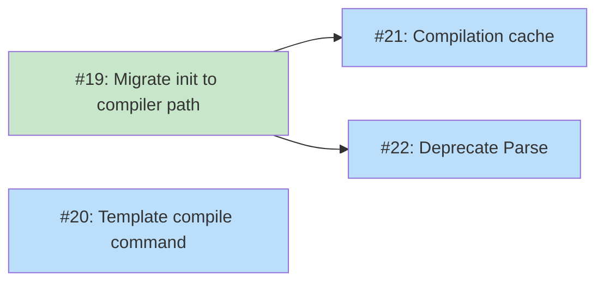

# DESIGN: koto CLI and Template Tooling

## Status

**Planned**

## Implementation Issues

### Milestone: [koto CLI and Template Tooling](https://github.com/tsukumogami/koto/milestone/3)

| Issue | Dependencies | Tier |
|-------|--------------|------|
| ~~[#19: refactor(cli): migrate init and post-init commands to compiler path](https://github.com/tsukumogami/koto/issues/19)~~ | ~~None~~ | ~~critical~~ |
| ~~_Switches `cmdInit` and `loadTemplateFromState()` from the legacy `Parse()` path to `compile.Compile()` + `ParseJSON()`. Adds `ToTemplate()` adapter and dual-hash comparison so existing workflows initialized with the legacy parser keep working._~~ | | |
| [#20: feat(cli): add koto template compile command](https://github.com/tsukumogami/koto/issues/20) | None | testable |
| _Adds the `koto template compile <path>` authoring command that compiles a source template and writes compiled JSON to stdout. This is the Path 2 feedback loop for template authors._ | | |
| [#21: feat(cli): add compilation cache for deployed templates](https://github.com/tsukumogami/koto/issues/21) | [#19](https://github.com/tsukumogami/koto/issues/19) | testable |
| _Creates `pkg/cache/` and integrates it into `cmdInit` so repeated calls with the same deployed template skip recompilation. This is the Path 1 optimization for skills and scripts._ | | |
| [#22: chore(template): deprecate legacy Parse function](https://github.com/tsukumogami/koto/issues/22) | [#19](https://github.com/tsukumogami/koto/issues/19) | simple |
| _Adds a Go-style deprecation notice to `Parse()` and migrates integration tests to the compiler path. No production behavior changes._ | | |

### Dependency Graph



**Legend**: Green = done, Blue = ready, Yellow = blocked, Purple = needs-design, Orange = tracks-design

## Upstream Design Reference

This design builds on [DESIGN-koto-template-format.md](DESIGN-koto-template-format.md), which specifies the source format, compiled format, and compilation rules. That design explicitly deferred CLI/tooling concerns:

> The CLI/tooling layer (compile commands, search paths, linter) needs its own design that builds on this format specification.

Relevant decisions from the upstream design:
- Source format is YAML frontmatter + markdown body (Decision 3)
- Compiled format is JSON, parsed with Go stdlib only (Decision 2)
- LLMs must never be in the compilation path (Design Boundary)
- Compilation is deterministic: same source always produces same output

## Context and Problem Statement

The template format specification is fully implemented: the compiler converts source templates to JSON, the engine evaluates gates (field checks and commands), and evidence accumulates across transitions. But none of this is reachable from the CLI.

Today, `koto init --template <path>` loads templates through a legacy parser (`pkg/template/Parse()`) that predates the format specification. This parser can't handle evidence gates, nested YAML structures, or the source/compiled separation. Meanwhile, `koto transition <target>` has no `--evidence` flag, so states with gates are unreachable from the command line. The only way to use the new template features is through Go code.

Three specific gaps block real-world usage:

1. **No compilation path in the CLI.** The compiler exists as `pkg/template/compile.Compile()` but there's no way to invoke it from `koto`. Users can't compile templates, inspect compiled output, or validate source files. **(This design addresses this gap.)**

2. **No template discovery.** `--template` requires a file path. There's no way to say `koto init --template quick-task` and have koto find the template. Projects can't ship templates alongside their code in a discoverable way. **(Deferred to a future design -- search paths and `template list`.)**

3. **No evidence from the CLI.** The engine's `WithEvidence()` option works, but `koto transition` doesn't expose it. Any state with a `field_not_empty` or `field_equals` gate is a dead end from the command line. **(Deferred to a future design -- `--evidence` flag.)**

### Distribution Paths

Before designing the CLI, we need to understand how templates reach the user's machine. There are two distinct paths, and each has different UX needs.

**Path 1: Deployed templates (installed from an external source)**

A template ships as part of a larger package -- a Claude Code plugin, a project's `.claude/` directory, or a shared skill library. The template file is a supporting artifact alongside the skill/command that uses it. The skill already knows the template's location (it's a sibling file or a path in its configuration). Example: a `/work-on` skill installed via a Claude Code plugin includes a `work-on.md` template in its own directory.

In this path:
- The template is expected to be valid (tested by the author before distribution)
- The caller passes an explicit path to `koto init --template <path>`
- Name-based search is irrelevant -- the skill knows where its template lives
- Compilation should be fast and can be cached (the template doesn't change between runs)
- Error messages are unexpected; when they occur, they indicate a broken installation

**Path 2: User-authored templates (created manually)**

A user writes a template for their own project or for personal use. They're iterating: writing the source, compiling, hitting errors, fixing them, inspecting the output. The template might live in a project directory or in `~/.koto/templates/`.

In this path:
- The template is expected to have errors (the user is developing it)
- Compilation feedback is the primary value -- clear errors, warnings, and a way to inspect the result
- The user passes an explicit path to `koto init --template ./templates/my-workflow.md`
- Caching is counterproductive (the source changes on every edit)
- `koto template compile` is the authoring tool

These two paths have different priorities but share the same underlying compilation machinery. The design should handle both without forcing one path's UX on the other.

### Scope

**In scope:**
- How `koto init` compiles and loads templates (implicit compilation, both paths)
- Compilation caching for deployed templates (Path 1)
- Template authoring tool: `koto template compile` (Path 2)
- Deprecation of the legacy `Parse()` path

**Deferred to future designs:**
- Template search path resolution and `koto template list` (name-based lookup for Path 2)
- `koto transition --evidence key=value` flag (unblocking gate-based workflows)
- LLM-assisted validation or linting

**Out of scope:**
- Template distribution mechanism (plugins, registries -- that's the distribution platform's job)
- Built-in template content (that's the quick-task template, separate work)
- Template versioning or dependency resolution
- Changes to the engine or compiler packages (those are done)

## Decision Drivers

- **Deployed templates stay invisible**: For Path 1, `koto init --template <path>` should compile and start the workflow with no user-visible overhead. The caller (a skill or script) passes an explicit path; koto compiles, caches, and gets out of the way.
- **Authoring templates provides feedback**: For Path 2, the user is iterating. Compilation errors and warnings are the primary value. The feedback loop matters more than speed.
- **Both paths use the same compiler**: One compilation pipeline, two UX modes. No separate "dev mode" compiler.
- **No new dependencies in the engine**: The engine reads compiled JSON with stdlib only. All new dependencies (if any) stay in the CLI or compiler packages.
- **Backward compatibility**: Existing `koto init` invocations that pass a file path should keep working during the transition.

## Considered Options

### Decision 1: Compilation Flow

`koto init --template <path>` needs to compile the source template before starting the workflow. The two distribution paths have different needs: deployed templates (Path 1) should compile silently with optional caching, while user-authored templates (Path 2) should provide feedback and never cache stale results.

#### Chosen: Implicit compilation with optional caching

`koto init` always compiles the template automatically. The caller passes a source path, koto compiles it to JSON, validates it, and starts the workflow.

**Path 1 (deployed):** The compiled output can be cached in `~/.koto/cache/` keyed by source file hash. On subsequent runs, if the source hash matches a cached entry, koto skips compilation and uses the cached JSON. This is a performance optimization for templates that don't change between runs -- a skill calling `koto init` repeatedly with the same template shouldn't pay compilation cost each time. Cache invalidation is by source hash: if the source changes, the cache misses and recompilation happens.

**Path 2 (authoring):** No caching by default. The user is editing the source between runs, so the cache would miss every time anyway. `koto template compile` provides the feedback loop: compile to see errors and the compiled output.

The existing `koto validate` command (which checks template hash against state file) continues to work. It recompiles the source template at validation time and compares the hash.

#### Alternatives Considered

**Explicit compilation required**: Users run `koto template compile` first, then `koto init --compiled output.json`. This is how many build systems work, but it adds a mandatory step to Path 1 (where the caller just wants to start a workflow) and adds friction to Path 2 (where the user is iterating).
Rejected because it makes both paths harder without clear benefit.

**Cache next to source file**: `koto init` writes `.compiled.json` files alongside the source template. This pollutes the user's project directory and plugin directories with side effects. Path 1 callers shouldn't need to grant write access to the template directory.
Rejected because caching belongs in koto's own directory, not the template's directory.

### Decision 2: Template Search Path

**Deferred.** Both distribution paths use explicit file paths for now. Path 1 callers already pass explicit paths (the skill knows where its template lives). Path 2 users pass explicit paths too (`koto init --template ./templates/my-workflow.md`). Name-based resolution, search path conventions, and `koto template list` are deferred until we have enough usage patterns to design them well.

### Decision 3: LLM-Assisted Validation

The upstream design mentions "optional LLM-assisted validation" for helping authors write correct source. Should this design include a `koto template lint` command?

#### Chosen: Defer entirely

LLM validation is out of scope for this design. The compiler already validates source files and produces clear error messages. A linter that uses LLMs to suggest fixes (ambiguous headings, missing states, unclear directives) is a separate feature with its own design surface: model selection, API keys, cost, offline behavior, prompt engineering.

The `koto template compile` command serves as a basic validator. If the source is invalid, compilation fails with a specific error. If it produces warnings (heading collisions), those are printed. This covers the mechanical validation needs.

#### Alternatives Considered

**Design a lint command stub**: Define `koto template lint` now with deterministic checks only, leaving LLM integration for later. Adds a command that duplicates what `compile` already does (source validation). Having both `compile` and `lint` with overlapping scope is confusing.
Rejected because compile already validates, and the LLM surface is the interesting part of linting.

**Full linter design**: Design the LLM integration surface now. Premature -- we don't know which LLM checks are useful, what the prompt engineering looks like, or whether users want inline suggestions vs batch validation.
Rejected because we'd be designing around unknowns.

### Decision 4: Template Authoring Command

Path 2 users need a feedback tool: compile to see errors, see the result, iterate. This is an authoring tool that Path 1 callers (skills, scripts) don't need.

#### Chosen: `koto template compile`

A single command under `koto template`:

- `koto template compile <path>` -- compile source to JSON, write to stdout. Errors and warnings go to stderr. Exit non-zero on failure.

This is the only authoring tool needed. The compiled JSON output serves both machine consumption (pipe to `jq`) and human review (the JSON structure is readable). A `--summary` flag can be added later if the full JSON proves too verbose, but it's not needed to start.

Grouping under `koto template` keeps the top-level namespace reserved for workflow operations (`init`, `transition`, `next`, etc.). Future additions like `template list` (deferred with search path) fit naturally under this group.

#### Alternatives Considered

**Separate compile and inspect commands**: `koto template compile` for JSON, `koto template inspect` for a human-readable summary. Both compile the template internally; the only difference is output format. Two commands for one operation adds surface area without clear benefit.
Rejected because one command with parseable output covers both use cases.

## Decision Outcome

### Summary

Templates reach users through two distribution paths, and the CLI serves each differently.

**Path 1 (deployed templates):** A skill or script calls `koto init --template <explicit-path>`. koto compiles the source, caches the compiled JSON in `~/.koto/cache/` (keyed by source hash), and starts the workflow. On subsequent runs with the same template, the cache eliminates compilation. The caller never interacts with template authoring tools.

**Path 2 (user-authored templates):** A user developing their own template uses `koto template compile` as their feedback loop -- compile to see errors, pipe to `jq` to explore the output. When ready, they run `koto init --template ./templates/my-workflow.md` with an explicit path.

**Both paths:** The `--template` flag always takes an explicit file path. The legacy `Parse()` function is deprecated; `koto init` switches to the compiler path internally.

**Deferred:** Name-based template search (`koto init --template my-workflow`), `koto template list`, and `koto transition --evidence` are deferred to future designs.

### Rationale

Separating the two distribution paths avoids forcing one path's UX on the other. Path 1 callers (skills, scripts) want silent compilation with no overhead -- caching serves this. Path 2 users (template authors) want feedback -- authoring tools serve this. Both paths use the same compiler; the difference is in what koto does around the compilation (cache vs feedback).

Deferring the search path and evidence flag keeps this design focused on the compilation pipeline, which is the foundation that both deferred features build on. The search path needs usage patterns to design well. The evidence flag is a CLI concern that can be added independently once the compiler migration is stable.

### Trade-offs Accepted

- **Cache adds filesystem state**: `~/.koto/cache/` accumulates compiled templates. This is bounded (one file per unique source hash, small files) and can be cleared manually.
- **Explicit paths only**: Both paths require explicit file paths for now. This is slightly verbose for Path 2 users but avoids designing search path conventions prematurely.
- **No linter**: Template authors get compiler errors but no suggestions or LLM-powered fixes. The compiler's error messages are specific enough for now.
- **Legacy parser not removed**: `Parse()` is deprecated but not deleted. Removing it is a separate cleanup once all callers are migrated.

## Solution Architecture

### Modified Commands

#### `koto init`

The init command changes internally but keeps the same interface:

```
koto init --template <path> --name <workflow-name> [--var KEY=VALUE]... [--state-dir <dir>]
```

New behavior:
1. Read the source file at `--template` path
2. Hash the source file
3. Check `~/.koto/cache/` for a cached compilation matching the source hash
4. On cache miss: compile via `compile.Compile(sourceBytes)`, write to cache
5. Validate via `template.ParseJSON(compiledJSON)`
6. Build `engine.Machine` from `CompiledTemplate.BuildMachine()`
7. Compute compiled hash via `compile.Hash(compiledJSON)` for state file
8. Call `engine.Init()` with the machine and metadata

The `--template` argument is always treated as a file path (absolute or relative to CWD). Both distribution paths pass explicit paths.

#### `koto validate`

Currently checks template hash. Updated to use the compiler path:
1. Read state file to get `template_path`
2. Recompile the source template
3. Compare hash against state file's `template_hash`

### New Commands (Path 2: Authoring Tools)

These commands serve template authors during development. Path 1 callers (skills, scripts) don't use them.

#### `koto template compile`

```
koto template compile <path> [--output <file>]
```

Compiles a source template and writes the compiled JSON to stdout (or `--output` file). Prints warnings to stderr. Exits non-zero on compilation error.

This is the primary feedback tool for Path 2. The author edits their template, runs `compile`, sees errors or the compiled output, and iterates.

Use cases:
- Authoring feedback: see compilation errors and warnings as you develop
- CI: validate templates as part of a build pipeline
- Debug: pipe to `jq` for ad-hoc queries on the compiled structure

### Compilation Cache

Compiled templates are cached in `~/.koto/cache/` to avoid redundant compilation. This primarily benefits Path 1 (deployed templates that don't change between runs) but works for both paths.

Cache key: SHA-256 of the source file contents. Cache value: compiled JSON.

```
~/.koto/cache/
├── a1b2c3d4...json    # compiled output, keyed by source hash
├── e5f6g7h8...json
└── ...
```

Behavior:
- `koto init`: checks cache before compiling, writes to cache on miss
- `koto template compile`: always compiles fresh (authoring tool, skips cache)
- `koto validate`: always compiles fresh (needs to detect source changes)

The cache has no expiration. Old entries accumulate but are small (compiled JSON is a few KB). A `koto cache clear` command (or just `rm -rf ~/.koto/cache/`) handles cleanup if needed.

### Package Changes

#### `cmd/koto/main.go`

- Add `template` subcommand dispatcher
- Add `cmdTemplateCompile` handler
- Modify `cmdInit` to use compiler path with cache lookup

#### `pkg/template/template.go`

- Add deprecation comment to `Parse()` function
- No code changes (backward compat)

#### New: `pkg/cache/cache.go`

Compilation cache backed by `~/.koto/cache/`:

```go
package cache

// Get returns the cached compiled JSON for the given source hash, or nil on miss.
func Get(sourceHash string) ([]byte, error)

// Put stores compiled JSON keyed by source hash.
func Put(sourceHash string, compiledJSON []byte) error

// Clear removes all cached compilations.
func Clear() error
```

### Hash Migration

The legacy `Parse()` hashes the raw source file. The compiler hashes the compiled JSON. These produce different values for the same template. Workflows initialized with the legacy parser will have old-format hashes, and the new compiler path will compute different ones.

This is a breaking change. The migration strategy:

1. `koto init` always uses the new compiler hash going forward. New workflows get compiler hashes.
2. `koto validate` and `loadTemplateFromState()` try the compiler hash first. If it doesn't match, fall back to hashing the raw source file (legacy mode). If the legacy hash matches, print a warning: `note: workflow uses legacy template hash; re-init to upgrade`.
3. No automatic migration. Users who need the new hash can re-initialize their workflow.

This dual-hash check is confined to the hash comparison logic. Once all legacy workflows age out, the fallback can be removed.

### Post-Init Command Migration

Six commands besides `init` load templates through `loadTemplateFromState()`: `transition`, `next`, `rewind`, `validate`, `cancel`, and `status`. Today this function calls the legacy `Parse()`. It must migrate to the compiler path atomically with `cmdInit` -- if init stores compiler hashes but post-init commands compute legacy hashes, every operation fails with `template_mismatch`.

The migration updates `loadTemplateFromState()` to:
1. Read the source file from the path stored in the state file
2. Compile via `compile.Compile(sourceBytes)`
3. Validate via `template.ParseJSON(compiledJSON)`
4. Build the controller's `Template` via `CompiledTemplate.ToTemplate()` (see below)
5. Hash comparison uses the dual-hash strategy described above

### Controller Adapter

The `controller.Controller` takes a `*template.Template`, but the compiler produces a `*template.CompiledTemplate`. Rather than changing the controller interface, add an adapter method:

```go
// ToTemplate converts a CompiledTemplate to a legacy Template struct
// for use with the controller. Sections are populated from StateDecl.Directive
// fields, Variables from VariableDecl, and the Machine from BuildMachine().
func (ct *CompiledTemplate) ToTemplate() (*Template, error)
```

This keeps the controller unchanged and confines the migration to the CLI and template packages.

## Implementation Approach

### Phase 1: Compiler Path Migration (atomic)

This phase must land as a single unit -- `cmdInit` and `loadTemplateFromState()` must migrate together to avoid hash mismatches. After this phase, both distribution paths use the compiler.

- Add `CompiledTemplate.ToTemplate()` adapter in `pkg/template/`
- Modify `cmdInit` to use compiler path (`compile.Compile` + `template.ParseJSON` + `BuildMachine`)
- Modify `loadTemplateFromState()` to use compiler path with `ToTemplate()` adapter
- Implement dual-hash comparison (compiler hash with legacy fallback)
- Update `koto validate` to use compiler path

### Phase 2: Template Authoring Commands (Path 2 tools)

- Add `template` subcommand dispatcher
- Add `koto template compile` command (always compiles fresh, no cache)

### Phase 3: Compilation Cache (Path 1 optimization)

- Create `pkg/cache/` package for `~/.koto/cache/`
- Integrate cache into `cmdInit` (check before compile, store on miss)
- `koto template compile` bypasses cache (authoring tool)

### Phase 4: Cleanup

- Add deprecation notice to `Parse()` function
- Update integration tests to use new source format

## Security Considerations

### Download Verification

Not applicable. This design doesn't download templates from external sources. Templates are local files read from the filesystem. No network requests are made.

### Execution Isolation

Template compilation doesn't execute any code. The compiler parses YAML and extracts markdown -- no shell commands, no file writes beyond the state file and cache directory.

Command gates (defined in the template) execute during transitions, but that's the engine's responsibility (already implemented in #17). This design doesn't change gate execution.

The compilation cache writes to `~/.koto/cache/`, which is within koto's own home directory. Cache files contain only compiled JSON derived from the source template -- no user data, no credentials.

### Supply Chain Risks

Templates are local files, not downloaded packages. The trust model matches Makefiles: the project owner defines templates, users review them before use. There's no template registry, no automatic updates, and no dependency resolution.

The risk is that a user runs `koto init` with a template they haven't reviewed. This is the same risk as running `make` in an untrusted repo. Mitigation: `koto template compile` shows the full compiled output before init, including command gates.

For Path 1 (deployed templates), the trust boundary is the distribution platform (Claude Code plugin system, project `.claude/` directory). koto trusts the template at the path it's given.

### User Data Exposure

Template compilation reads the source file and produces JSON. No data leaves the machine. The compiled output contains only what's in the source file.

The compilation cache stores compiled JSON on disk (`~/.koto/cache/`). This is derived from the source template and contains no user data beyond what's already in the template file.

### Mitigations

| Risk | Mitigation | Residual Risk |
|------|------------|---------------|
| Malicious template at explicit path | `koto template compile` shows gates before init | User must remember to review |
| Symlink at template path | Go's os.ReadFile follows symlinks | Template could reference unexpected file |
| Cache poisoning | Cache keyed by source hash; attacker needs write access to `~/.koto/cache/` | If attacker has write access to home dir, cache is the least of the problems |

## Consequences

### Positive

- Path 1 (deployed): compilation cache eliminates redundant work for skills that call `koto init` repeatedly
- Path 2 (authoring): `compile` provides a feedback loop for template development
- The compiler path replaces the legacy parser, using the validated format specification
- Both distribution paths use the same compiler, avoiding divergent behavior
- Focused scope (no search path, no evidence flag) means fewer moving parts to get wrong

### Negative

- Two template loading paths exist during the transition (legacy `Parse()` and new compiler)
- Compilation cache adds filesystem state (`~/.koto/cache/`) that can grow unbounded
- Gate-based workflows remain blocked from the CLI until the evidence flag is designed separately

### Mitigations

- Legacy `Parse()` gets a deprecation notice pointing to the compiler path
- Cache files are small and clearable (`rm -rf ~/.koto/cache/` or future `koto cache clear`)
- Evidence flag is the next logical design after this one lands
