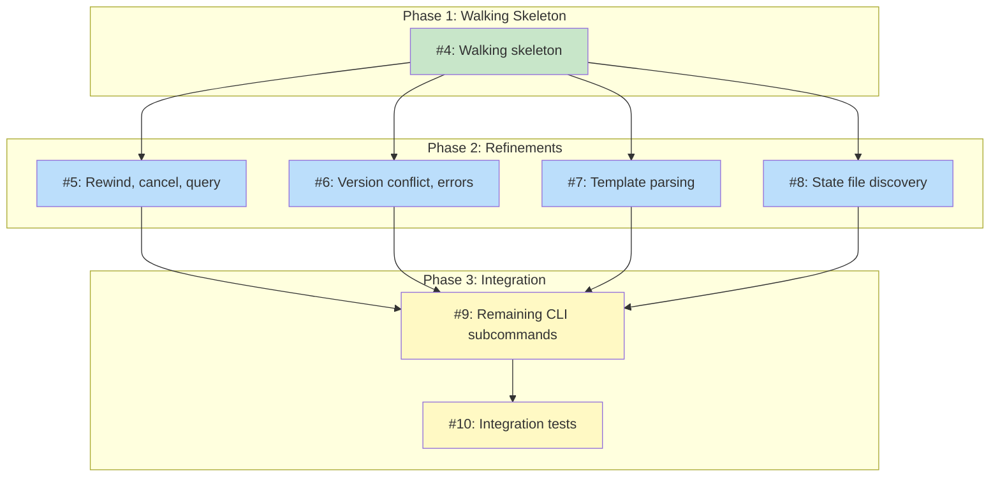

# DESIGN: koto State Machine Engine

## Status

**Planned**

## Implementation Issues

### Milestone: [koto State Machine Engine](https://github.com/tsukumogami/koto/milestone/1)

| Issue | Dependencies | Tier |
|-------|--------------|------|
| ~~[#4: feat(engine): implement walking skeleton with init, transition, and next](https://github.com/tsukumogami/koto/issues/4)~~ | ~~None~~ | ~~testable~~ |
| ~~_Establishes the Go module, core types (`State`, `Machine`, `Engine`), `Init`/`Load`/`Transition` methods, atomic persistence, and a minimal CLI with `init`/`transition`/`next` subcommands. Uses a hardcoded `Machine` -- real template parsing comes later._~~ | | |
| [#5: feat(engine): add rewind, cancel, and query methods](https://github.com/tsukumogami/koto/issues/5) | [#4](https://github.com/tsukumogami/koto/issues/4) | testable |
| _Builds on the engine from #4 to add `Rewind` (with history preservation), `Cancel` (state file deletion), and copy-safe query methods. Completes the full Engine API surface._ | | |
| [#6: feat(engine): add version conflict detection and TransitionError JSON serialization](https://github.com/tsukumogami/koto/issues/6) | [#4](https://github.com/tsukumogami/koto/issues/4) | testable |
| _Hardens the error layer: every engine failure returns a structured `TransitionError` with a machine-parseable code. Adds version conflict detection (optimistic concurrency) and template hash mismatch checking._ | | |
| [#7: feat(template): implement template parsing and interpolation](https://github.com/tsukumogami/koto/issues/7) | [#4](https://github.com/tsukumogami/koto/issues/4) | testable |
| _Creates `pkg/template/` with `Parse`, `Interpolate`, and SHA-256 hash computation. Converts template files into `engine.Machine` instances, replacing the hardcoded stub from #4._ | | |
| [#8: feat(discover): implement state file discovery](https://github.com/tsukumogami/koto/issues/8) | [#4](https://github.com/tsukumogami/koto/issues/4) | simple |
| _Small, self-contained package that scans a directory for `koto-*.state.json` files and returns workflow metadata. Enables the `workflows` command and auto-selection when only one state file exists._ | | |
| [#9: feat(cli): add remaining CLI subcommands](https://github.com/tsukumogami/koto/issues/9) | [#5](https://github.com/tsukumogami/koto/issues/5), [#6](https://github.com/tsukumogami/koto/issues/6), [#7](https://github.com/tsukumogami/koto/issues/7), [#8](https://github.com/tsukumogami/koto/issues/8) | testable |
| _Integration point: wires template parsing into `init`/`next`, adds `query`/`status`/`rewind`/`cancel`/`validate`/`workflows` subcommands, and implements `--state` flag with auto-selection. Completes the full CLI surface._ | | |
| [#10: test(engine): add integration tests for full workflow lifecycle](https://github.com/tsukumogami/koto/issues/10) | [#9](https://github.com/tsukumogami/koto/issues/9) | testable |
| _CLI-level integration tests that exercise the complete lifecycle: init from template, advance through states, rewind, cancel, multi-workflow discovery, and all error paths (invalid transition, template mismatch, version conflict)._ | | |

### Dependency Graph



**Legend**: Green = done, Blue = ready, Yellow = blocked, Purple = needs-design, Orange = tracks-design

## Context and Problem Statement

AI coding agents running multi-step workflows don't have reliable execution control. When an agent follows a 7-phase development workflow (assess, plan, implement, test, review, clean up, submit), several failure modes occur regularly:

- **Step skipping**: The agent jumps from planning to submitting a PR, bypassing implementation testing.
- **Resume failure**: After a session interruption, the agent can't determine where it left off and either restarts from scratch or resumes at the wrong point.
- **Evidence loss**: Work products from earlier phases (baseline metrics, analysis findings) aren't systematically tracked, so later phases operate without context.
- **State divergence**: Multiple tracking mechanisms (file existence, commit messages, checkbox state in plan files) give conflicting signals about progress.

These failures have two distinct causes. First, agents lack enforcement: prompt-only instructions tell the agent what to do but can't prevent it from skipping steps. Second, existing implementations use fragile state tracking: file-existence heuristics (check whether `wip/plan.md` exists to decide which phase to resume) break when files are partially written, deleted but still in git history, or created out of order. Common implementation-level problems (non-atomic writes, no transition history, no template integrity checking) compound the fragility.

koto addresses this by providing a dedicated state machine engine that sits between the workflow template and the agent. The engine is the sole authority on workflow progression: it tracks the current state, validates transition requests, and persists everything atomically. The agent doesn't decide which state to enter -- it requests a transition and the engine approves or rejects it.

This design covers the engine itself: the core library that manages state and validates transitions. The engine is koto's foundation -- every other component (CLI, controller, template parser, agent integration) depends on it. Evidence gates (requiring proof before state advancement) are a planned extension designed separately.

### Scope

**In scope:**
- Engine public Go API (the `Engine` struct and its methods)
- State file JSON schema and persistence strategy
- Transition validation logic (blank transitions -- no evidence requirements)
- Atomic write pattern for state files
- Template hash verification
- Rewind semantics
- State file integrity
- Package boundaries (engine, controller, template, discover)
- Error response format

**Out of scope:**
- Evidence gates and accumulation semantics (separate design)
- Template format specification (separate design)
- CLI command implementation details
- Agent integration protocol
- Distribution and installation
- Specific workflow templates
- Template registry and community sharing

## Decision Drivers

- **Library-first design**: The engine must work as an importable Go package, not just a CLI backend. Other projects should be able to `go get github.com/tsukumogami/koto` and use the engine directly.
- **Atomic persistence**: State writes must survive process crashes. A partial write must never leave a corrupted state file.
- **Multiple concurrent workflows**: The engine must handle multiple active state files in the same directory without confusion.
- **Extensible transition model**: The engine must support blank transitions now and accommodate evidence gates later without API changes.
- **Progressive disclosure**: The agent should receive only the current state's directive, not the full template. The engine/controller boundary enforces this.
- **Machine-parseable output**: All agent-facing operations must return structured JSON, including errors.
- **Resumability**: After any interruption, the engine must pick up exactly where it left off from the state file alone.
- **Debuggability**: The state file should be human-readable JSON. Transition history should capture enough detail to trace what happened.
- **Template integrity**: The engine must detect if a template was modified mid-workflow.

## Implementation Context

### Industry Patterns

Research into how production tools handle workflow state reveals two key patterns:

**State location**: Tools split into two camps. Some store state in the home directory (keeping it out of git entirely), while others store state in the project directory (making it portable but requiring git-friendly formats). koto's engine is agnostic about location -- it takes a file path and doesn't care where it lives. The CLI layer will default to `wip/` (existing convention) but accept a `--state-dir` flag.

**File format**: Append-only JSONL with hash-based IDs works well for git-tracked state where merge conflicts matter. Monolithic JSON creates merge conflicts in multi-branch scenarios. For koto, single-file JSON is appropriate because state files are ephemeral (created per workflow, cleaned before merge). The merge-friendly properties of JSONL don't add value when each state file has a single writer.

**Concurrency**: No file-based tool has fully solved concurrent access. Database-backed tools handle it properly but lose portability. File-based tools use last-write-wins or append-only formats. For koto Phase 1, a single-writer assumption with atomic writes and a version counter for detection is sufficient.

**Evidence-gated transitions**: The StateFlow paper (COLM 2024) formalizes this pattern as part of a state machine sextuple, achieving 13-28% higher success rates than ReAct-style prompting at 3-5x lower cost. koto's planned evidence gates draw from this pattern, using file-checkable conditions (field values, command exit codes) rather than LLM evaluation.

## Considered Options

### Decision 1: State Machine Implementation

The engine needs a state machine that maps named states to allowed transitions and validates transition requests. Evidence gates (entry requirements on states) will be added in a separate design. The question is whether to use an existing Go library or build a custom implementation.

The state machine's core logic is fundamentally simple: check if the target state is reachable from the current state, update the state. The complexity in koto lives elsewhere -- in the persistence layer, template parsing, and the controller's directive generation. A library that adds indirection or opinions about state management could complicate the design without proportional benefit.

#### Chosen: Custom implementation

Build the state machine as a ~200-line implementation within `pkg/engine/`. The `Machine` struct is a map of state names to `MachineState` values, each containing allowed transitions and a terminal flag. Transitions are validated by checking the map.

This keeps the state machine logic visible, testable, and free of abstraction layers. The `Machine` struct is constructed by the template parser and passed to the engine -- no runtime state machine configuration API is needed. The `MachineState` struct provides a clear extension point for evidence gates when that design is complete.

#### Alternatives Considered

**qmuntal/stateless** (1.2K stars): Provides external state storage callbacks, guard functions, and hierarchical states. Rejected because the external storage API adds a level of indirection that doesn't match koto's file-based persistence pattern (we load the full state, operate on it, and write it back -- not read/write individual fields through callbacks). Hierarchical states may be useful in a later phase (multi-issue orchestration) and the library can be adopted then if needed.

**looplab/fsm** (3.3K stars): More adoption but weaker feature set for koto's needs. No external storage abstraction, guards via callback cancellation rather than first-class functions, no documented thread safety. Rejected because guards trigger on transitions (edges) whereas koto will eventually need entry requirements on states (nodes) -- the mismatch would require an adapter layer that adds complexity without value.

**Port existing implementation**: Take existing ~40-line transition-checking functions and fix only the atomic write issue. Rejected because the existing logic is tangled with type-specific business rules (separate transition tables for different item types). Untangling these into a clean library API requires roughly the same effort as the custom implementation, and the result would carry patterns (hardcoded variable allowlists, dual validation paths) that the new design explicitly avoids.

### Decision 2: Concurrency Strategy

Multiple processes could access the same state file: the agent calling `koto transition` while the user calls `koto rewind`, or a retry running while the original agent is still active. The question is how to handle concurrent access.

File locking is the correct solution for truly concurrent access, but it adds cross-platform complexity (different implementations on Linux, macOS, Windows) and introduces the possibility of orphaned locks. For koto's initial release, the primary concurrency scenario isn't two writers racing -- it's detecting that something unexpected happened.

#### Chosen: Atomic writes with optimistic versioning

Every state file write uses the write-to-temp-then-rename pattern (atomic on all platforms via POSIX `rename(2)` / Windows `MoveFileEx`). The state file includes a `version` integer that increments on every write.

The version counter serves a detection role: if an operation reads version N and finds version N+1 on disk when it tries to write, something happened between reads. In Phase 1, this is a diagnostic signal rather than a retry mechanism. The engine does not re-read and retry -- it fails with a clear error.

#### Alternatives Considered

**File locking via gofrs/flock**: Cross-platform file locking with `flock(2)` on Unix and `LockFileEx` on Windows. Rejected for Phase 1 because it introduces orphaned lock risks (process crash leaves lock file) and koto's primary use case is single-agent workflows. File locking remains the path forward for a later release if multi-agent coordination becomes a real need.

**Single-writer assumption without versioning**: Trust that only one process writes at a time. Rejected because silent corruption is worse than noisy failure. The version counter costs nothing (one integer field) and turns invisible bugs into visible errors.

**SQLite with WAL mode**: Use a SQLite database for state storage, getting atomic writes, concurrent access, and single-file portability for free. Rejected because it makes state files binary (not human-readable, not diffable in git), adds a CGo dependency (or a pure-Go SQLite driver with its own trade-offs), and is significant overhead for what amounts to reading and writing a single JSON document. SQLite solves concurrent multi-writer access well, but koto's Phase 1 use case is single-writer.

### Decision 3: Package Layout

The engine code needs clear boundaries between the state machine, controller, template parser, and discovery logic. The question is how to organize these as Go packages, considering both internal structure and the public API surface for library consumers.

#### Chosen: Four packages under pkg/ with engine as the anchor

```
pkg/
  engine/       State, Machine, Engine, atomic persistence
  controller/   Controller, Directive, template hash verification
  template/     Template parsing, section parsing, interpolation
  discover/     Find active state files in a directory
cmd/
  koto/         CLI entry point, subcommand handlers, JSON/text output formatting
```

Import direction: `template` imports `engine` (to return `*engine.Machine`). `controller` imports `engine` and `template`. `discover` imports only `engine` (to read state file headers). CLI imports all four.

The `engine` package is the anchor: it defines the core types (`State`, `Machine`, `MachineState`) that other packages reference. This prevents circular imports and makes the dependency direction clear.

#### Alternatives Considered

**Single `engine` package**: Everything in one package. Rejected because it mixes template parsing (string manipulation, YAML) with state management (file I/O, transitions), making the public API surface unclear for library consumers who want to use the engine with their own template format.

**Shared `types` package**: Define core types in a separate `types` package that engine, controller, and template all import. Rejected because it spreads the core abstraction across two packages without real benefit. The Go convention is to define types where they're primarily used.

### Decision 4: Rewind Semantics

When `koto rewind --to <state>` is called, the engine resets the current state to the target. This is the recovery path when something goes wrong and the agent (or user) needs to retry from an earlier point.

#### Chosen: Reset current state with history tracking

Rewind sets the current state to the target and adds a history entry with type `"rewind"` recording the from/to states. The transition history is preserved (not truncated), providing a complete audit trail of what happened.

Rewinding to a state that doesn't appear in the history (never visited) returns an error -- except for the machine's initial state, which is always a valid rewind target. You can rewind from a terminal state to a non-terminal state (this is the recovery path when a workflow reaches an undesired terminal state like "escalated"). Rewinding to a terminal state is not allowed (it would leave the workflow stuck).

When evidence gates are added in a later design, rewind semantics will need to account for evidence cleanup. The history's per-transition records provide the foundation for that.

#### Alternatives Considered

**Truncate history on rewind**: Remove history entries after the rewind target. Rejected because it destroys the audit trail. The history should reflect what actually happened, including failures and retries.

**No rewind**: Require `koto cancel` and restart. Rejected because restarting from scratch when only the last step failed is wasteful for multi-step workflows.

### Decision 5: State File Integrity

The state file is plain JSON writable by any local process. Between koto invocations, something could modify it -- a user editing it manually, a bug in another tool, or intentional tampering. The question is whether and how to detect modifications.

#### Chosen: Template hash plus version counter

Two integrity mechanisms work together:

**Template hash**: Computed at `koto init` time (SHA-256 of the full template file content) and stored in the state file. Verified on every `koto next` and `koto transition` call. If the hash doesn't match, the operation fails with a `template_mismatch` error. This detects TOCTOU attacks where someone modifies the workflow definition mid-execution.

**Version counter**: Incremented on every state write. Used for optimistic concurrency detection (see Decision 2).

A full hash chain (each history entry hashing the previous) is deferred to a later release. The primary threat model for Phase 1 is bugs and accidents, not adversaries. The template hash catches the most dangerous modification (changing the rules mid-game), and the version counter catches unexpected concurrent writes.

Template hash verification is a blocking failure -- there is no flag to bypass it. If the template needs to change, the user must `koto cancel` and start a new workflow. This prevents a "just force it through" escape hatch that would undermine the integrity guarantee.

#### Alternatives Considered

**Full hash chain**: Each history entry includes a hash of all previous entries plus the current state. Detects any modification to the state file between invocations. Rejected for Phase 1 because it adds implementation complexity (hash computation on every operation, migration concerns if the chain format changes) for a threat (state file forgery) that isn't a practical concern in the initial release. Recommended for a later phase.

**No integrity checking**: Trust the state file contents. Rejected because even accidental modifications (editor auto-save, buggy tooling) would silently corrupt the workflow. The template hash costs one comparison per operation and catches the most impactful class of modifications.

## Decision Outcome

### Summary

The koto engine is a custom Go state machine implementation organized into four packages under `pkg/`. The `engine` package is the core: it defines the `State` struct (persisted as JSON), the `Machine` struct (in-memory state machine definition), and the `Engine` struct (the main API surface). The `controller` package ties the engine to a parsed template to generate directives. The `template` package parses workflow template files into `Machine` instances. The `discover` package finds active state files in a directory.

State persists as a single JSON file containing the current state name, workflow metadata (name, template hash, template path, creation time), a version counter, template variables, and a chronological history of all transitions. The engine writes this file atomically using the write-to-temp-then-rename pattern. A version counter increments on every write for concurrent modification detection.

Transitions are blank in Phase 1: verify the current state exists and isn't terminal, check the target is in the allowed transitions list, update the current state, and persist. No evidence is required or checked. Evidence gates (requiring proof before advancing) will be designed and added separately. Template integrity is enforced via SHA-256 hash verification on every `koto next` and `koto transition` call, with no override flag.

### Rationale

The decisions reinforce each other around a core principle: keep the state machine simple, make the persistence reliable, and leave extension points for later.

A custom implementation means the state machine logic is a direct expression of koto's needs without adaptation layers. The four-package layout mirrors the conceptual boundaries (state management, directive generation, template parsing, file discovery) and makes the public API surface clear for library consumers. Optimistic versioning detects problems cheaply without the cross-platform complexity of file locking. Starting with blank transitions keeps the engine focused on getting state management right before adding evidence complexity.

Template hash verification without an override flag is deliberately strict. The point of koto is to enforce workflow integrity. Providing escape hatches undermines the core value proposition. If the template needs to change, cancel and restart -- that's a feature, not a limitation.

### Trade-offs Accepted

- **No file locking in Phase 1**: Two processes writing simultaneously could lose one write. Acceptable because the primary use case is single-agent workflows, and the version counter detects the problem if it occurs.
- **No hash chain for state integrity**: State file tampering between invocations goes undetected (except template changes). Acceptable because the threat model for Phase 1 is bugs, not adversaries.
- **Custom state machine code to maintain**: ~200 lines of transition logic rather than using a library. Acceptable because the logic is simple and well-tested, and library adoption can happen later without API changes.
- **No evidence gates in Phase 1**: Transitions are unchecked -- the engine enforces ordering but not proof of work. Acceptable because evidence gate design has enough open questions (gate types, accumulation semantics, rewind behavior) to warrant its own design cycle.

## Solution Architecture

### Overview

The engine processes a cycle of three operations: **load** (read state from disk), **mutate** (validate and apply a transition), **persist** (write state atomically). The controller adds a **read** step: load state, read template section, interpolate, return directive. Every CLI command maps to one of these paths.

```
[State File] <--> [Engine] <--> [Machine Definition]
                     ^
                [Controller] <-- [Template]
                     ^
                   [CLI]
```

### Components

**Engine** (`pkg/engine/`): The central component. Owns the `State` struct and all mutation operations (transition, rewind). Responsible for history tracking and atomic persistence. Does not know about templates or directives -- it receives a `Machine` at construction time and works against that.

**Controller** (`pkg/controller/`): The read-path component. Given an Engine and a Template, it finds the current state's section in the template, interpolates variables into placeholders, and returns a Directive struct. Also responsible for template hash verification (comparing the engine's stored hash against the template's computed hash).

**Template** (`pkg/template/`): The parsing component. Reads a workflow template file, extracts the state machine definition, and returns a `Template` struct containing both the parsed `Machine` and the raw section content for each state. Also handles variable interpolation.

**Discover** (`pkg/discover/`): The discovery component. Scans a directory for files matching the koto state file pattern (`koto-*.state.json`), reads their headers (workflow name, current state, template path), and returns a list of active workflows. Used by `koto workflows --json` and by the CLI to auto-select the state file when only one exists.

### Key Interfaces

#### Engine API

```go
package engine

// State is the persisted workflow state.
type State struct {
    SchemaVersion int               `json:"schema_version"`
    Workflow      WorkflowMeta      `json:"workflow"`
    Version       int               `json:"version"`
    CurrentState  string            `json:"current_state"`
    Variables     map[string]string `json:"variables"`
    History       []HistoryEntry    `json:"history"`
}

type WorkflowMeta struct {
    Name         string `json:"name"`
    TemplateHash string `json:"template_hash"`
    TemplatePath string `json:"template_path"`
    CreatedAt    string `json:"created_at"`
}

type HistoryEntry struct {
    From      string `json:"from"`
    To        string `json:"to"`
    Timestamp string `json:"timestamp"`
    Type      string `json:"type"` // "transition" or "rewind"
}

// Machine is the in-memory representation of a state machine.
type Machine struct {
    Name         string
    InitialState string
    States       map[string]*MachineState
}

type MachineState struct {
    Transitions []string
    Terminal    bool
}
```

```go
// Engine manages a workflow's lifecycle.
type Engine struct { /* unexported fields */ }

// Init creates a new workflow state file and returns an engine for it.
func Init(statePath string, machine *Machine, meta InitMeta) (*Engine, error)

type InitMeta struct {
    Name         string
    TemplateHash string
    TemplatePath string
    Variables    map[string]string
}

// Load reads an existing state file and validates it against the machine.
func Load(statePath string, machine *Machine) (*Engine, error)

// Transition advances to the target state.
// Validates the transition is allowed, updates state, and persists atomically.
func (e *Engine) Transition(target string) error

// Rewind resets to a prior state. The target must have been visited
// (appear in history) or be the machine's initial state.
func (e *Engine) Rewind(target string) error

// Cancel deletes the state file, abandoning the workflow.
// Returns an error if the state file cannot be removed.
func (e *Engine) Cancel() error

// CurrentState returns the name of the current state.
func (e *Engine) CurrentState() string

// Variables returns a copy of the workflow variables.
func (e *Engine) Variables() map[string]string

// History returns the transition history.
func (e *Engine) History() []HistoryEntry

// Snapshot returns a copy of the full state (for serialization to JSON).
func (e *Engine) Snapshot() State

// Path returns the state file path.
func (e *Engine) Path() string
```

#### Error Types

All engine errors implement a `TransitionError` type that satisfies Go's `error` interface and serializes to a consistent JSON shape:

```go
type TransitionError struct {
    Code             string   `json:"code"`
    Message          string   `json:"message"`
    CurrentState     string   `json:"current_state,omitempty"`
    TargetState      string   `json:"target_state,omitempty"`
    ValidTransitions []string `json:"valid_transitions,omitempty"`
}

func (e *TransitionError) Error() string { return e.Message }
```

Error codes:
- `terminal_state`: Current state has no transitions
- `invalid_transition`: Target is not in the current state's transitions list
- `unknown_state`: State name not found in the machine definition
- `template_mismatch`: Template hash in state file doesn't match the template on disk
- `version_conflict`: State file version changed between read and write
- `rewind_failed`: Target state not found in history, or target is a terminal state

Example error response:

```json
{
  "error": {
    "code": "invalid_transition",
    "message": "cannot transition from 'research' to 'submitting': not in allowed transitions [validation_jury]",
    "current_state": "research",
    "target_state": "submitting",
    "valid_transitions": ["validation_jury"]
  }
}
```

#### Controller API

```go
package controller

import (
    "github.com/tsukumogami/koto/pkg/engine"
    "github.com/tsukumogami/koto/pkg/template"
)

type Controller struct { /* unexported fields */ }

// New creates a controller. Returns template_mismatch error if the
// template hash in the state file doesn't match the template's hash.
func New(eng *engine.Engine, tmpl *template.Template) (*Controller, error)

type Directive struct {
    Action    string `json:"action"`              // "execute" or "done"
    State     string `json:"state"`               // current state name
    Directive string `json:"directive,omitempty"`  // interpolated section (execute only)
    Message   string `json:"message,omitempty"`    // completion message (done only)
}

// Next returns the directive for the current state.
// For non-terminal states, returns action="execute" with the interpolated
// template section. For terminal states, returns action="done".
func (c *Controller) Next() (*Directive, error)
```

The controller builds the interpolation context from variables (`Engine.Variables()`). Placeholders use `{{KEY_NAME}}` syntax with single-pass literal string replacement. Unresolved placeholders are left as-is (not an error). When evidence gates are added in a later design, evidence values will also be available in the interpolation context.

#### Template Types

```go
package template

import "github.com/tsukumogami/koto/pkg/engine"

type Template struct {
    Name        string
    Version     string
    Description string
    Machine     *engine.Machine
    Sections    map[string]string // state name -> raw markdown content
    Variables   map[string]string // default variable values from template
    Hash        string            // SHA-256 of the template file content
    Path        string            // filesystem path to the template file
}

// Parse reads a template file and returns a Template.
// Returns an error if the YAML header is invalid or states
// reference undefined transitions.
func Parse(path string) (*Template, error)

// Interpolate replaces {{KEY}} placeholders in text with values from ctx.
// Single-pass literal replacement. Unresolved placeholders unchanged.
func Interpolate(text string, ctx map[string]string) string
```

#### Discover API

```go
package discover

// Workflow represents a discovered active workflow.
type Workflow struct {
    Path         string `json:"path"`
    Name         string `json:"name"`
    CurrentState string `json:"current_state"`
    TemplatePath string `json:"template_path"`
    CreatedAt    string `json:"created_at"`
}

// Find scans the directory for koto state files (koto-*.state.json)
// and returns metadata for each active workflow.
func Find(dir string) ([]Workflow, error)
```

### State File Schema

A complete state file after several transitions:

```json
{
  "schema_version": 1,
  "workflow": {
    "name": "quick-task",
    "template_hash": "sha256:e3b0c44298fc1c149afbf4c8996fb924...",
    "template_path": ".koto/templates/quick-task.md",
    "created_at": "2026-02-21T12:00:00Z"
  },
  "version": 4,
  "current_state": "implementing",
  "variables": {
    "TASK": "Add retry logic to HTTP client"
  },
  "history": [
    {
      "from": "initial_jury",
      "to": "research",
      "timestamp": "2026-02-21T12:01:23Z",
      "type": "transition"
    },
    {
      "from": "research",
      "to": "validation_jury",
      "timestamp": "2026-02-21T12:03:45Z",
      "type": "transition"
    },
    {
      "from": "validation_jury",
      "to": "setup",
      "timestamp": "2026-02-21T12:04:12Z",
      "type": "transition"
    },
    {
      "from": "setup",
      "to": "implementing",
      "timestamp": "2026-02-21T12:04:30Z",
      "type": "transition"
    }
  ]
}
```

**Naming convention**: State files are named `koto-<workflow-name>.state.json` and placed in the state directory (default `wip/`). Example: `wip/koto-quick-task.state.json`.

**Template path resolution**: The `template_path` stored in the state file is resolved to an absolute path at `koto init` time. This prevents CWD changes between invocations from resolving to a different template file. The template hash provides a second layer of defense -- even if the path somehow resolves differently, the hash check will catch it.

**Multiple state files**: When multiple state files exist in the state directory, commands that operate on a single workflow (`next`, `transition`, `query`, `rewind`) require a `--state <path>` flag. If exactly one state file exists, it's used automatically. `koto workflows --json` always lists all active state files.

**Variables**: Set at `koto init` time (from template defaults and `--var` flags) and immutable for the workflow's lifetime. Available in template interpolation via `{{KEY_NAME}}` placeholders.

### Transition Validation Sequence

When `koto transition <target>` is called:

1. **Template hash check**: Verify the template file's hash matches the stored hash. Fail with `template_mismatch` if not.
2. **Current state lookup**: Find the current state in the machine. Fail with `unknown_state` if missing (indicates corrupted state file).
3. **Terminal check**: If the current state is terminal, fail with `terminal_state`.
4. **Transition validity**: Check that `target` is in the current state's `transitions` list. Fail with `invalid_transition` (include valid transitions in the error).
5. **Commit**: Set current_state to target, increment version, append history entry.
6. **Atomic persist**: Write the updated state to a temp file, fsync, rename to the state file path.

When evidence gates are added in a later design, gate evaluation will occur between steps 4 and 5. The engine's current structure accommodates this without API changes to Load, Init, or the state file schema.

### Data Flow

The typical agent interaction cycle:

```
Agent                     CLI                    Controller              Engine
  |                        |                        |                      |
  |-- koto next ---------->|                        |                      |
  |                        |-- New(engine, tmpl) -->|                      |
  |                        |                        |-- verify hash ------>|
  |                        |                        |<----- ok -----------|
  |                        |<-- Next() -------------|                      |
  |<-- JSON directive -----|                        |                      |
  |                        |                        |                      |
  | [agent does work]      |                        |                      |
  |                        |                        |                      |
  |-- koto transition ---->|                        |                      |
  |   target               |                        |                      |
  |                        |----------------------->|-- validate --------->|
  |                        |                        |<----- persist -------|
  |<-- JSON result --------|                        |                      |
```

The CLI is a thin translation layer: it parses command-line flags, constructs the engine/controller, calls one method, and formats the result as JSON (agent-facing commands) or text (human-facing commands).

### Atomic Write Implementation

```go
func atomicWrite(path string, data []byte) error {
    dir := filepath.Dir(path)

    // Create temp file in the same directory (same filesystem for rename)
    tmp, err := os.CreateTemp(dir, ".koto-*.tmp")
    if err != nil {
        return fmt.Errorf("create temp file: %w", err)
    }
    tmpPath := tmp.Name()

    // Clean up temp file on any failure
    success := false
    defer func() {
        if !success {
            os.Remove(tmpPath)
        }
    }()

    if _, err := tmp.Write(data); err != nil {
        tmp.Close()
        return fmt.Errorf("write temp file: %w", err)
    }

    if err := tmp.Sync(); err != nil {
        tmp.Close()
        return fmt.Errorf("sync temp file: %w", err)
    }

    if err := tmp.Close(); err != nil {
        return fmt.Errorf("close temp file: %w", err)
    }

    // Check for symlinks at the target path (prevents symlink redirect attacks)
    if info, err := os.Lstat(path); err == nil && info.Mode()&os.ModeSymlink != 0 {
        return fmt.Errorf("state file path is a symlink: %s", path)
    }

    // Atomic rename
    if err := os.Rename(tmpPath, path); err != nil {
        return fmt.Errorf("rename temp to state file: %w", err)
    }

    success = true
    return nil
}
```

Temp files use the `.koto-*.tmp` pattern in the same directory as the state file. Go's `os.CreateTemp` adds a random suffix to avoid collisions. The `defer` cleanup ensures temp files don't accumulate on failure.

### Rewind Implementation

When `koto rewind --to <target>` is called:

1. **Validate target**: The target must be a non-terminal state in the machine definition. If the target is the machine's initial state, it's always valid. Otherwise, find the last history entry where `to == target`. If no such entry exists, fail with `rewind_failed`.
2. **Update state**: Set current_state to target, increment version, append rewind history entry.
3. **Persist atomically**.

A rewind history entry:

```json
{
  "from": "implementing",
  "to": "research",
  "timestamp": "2026-02-21T13:00:00Z",
  "type": "rewind"
}
```

You can rewind from a terminal state to a non-terminal state (error recovery when a workflow reaches an undesired terminal like "escalated"). You cannot rewind to a terminal state (it would leave the workflow stuck with no valid transitions).

## Implementation Approach

### Phase 1: Core Engine

Build the four packages and verify them against the acceptance criteria.

**pkg/engine/** (first):
- State, WorkflowMeta, HistoryEntry structs with JSON tags
- Machine, MachineState structs
- TransitionError type with JSON serialization and Error() method
- Engine: Init, Load, Transition, Rewind, Cancel, query methods
- Atomic write function with symlink check (~35 lines)
- Unit tests for every transition path, rewind scenario, cancel, and error condition

**pkg/template/** (second -- depends on DESIGN-koto-template-format.md):
- Template struct, Parse function
- Template header extraction and validation
- State section parsing
- Interpolate function
- Machine construction from parsed template
- Template hash computation (SHA-256 of full file content)
- Unit tests for parsing, interpolation, hash computation
- Note: implementation of this package requires the template format design to be complete. The engine and controller packages can be built and tested with programmatically-constructed Machine instances while the template format is finalized.

**pkg/controller/** (third):
- Controller struct, New constructor (with hash verification)
- Next method (interpolation + directive construction)
- Unit tests for directive generation, hash mismatch detection

**pkg/discover/** (fourth):
- Find function
- State file header reading (minimal parse: just workflow metadata)
- Unit tests for discovery in directories with zero, one, and multiple state files

**cmd/koto/** (last):
- Subcommand handlers for init, next, transition, query, status, rewind, cancel, validate, workflows
- JSON output formatter (agent-facing commands)
- Text output formatter (human-facing commands)
- Integration tests: full workflow cycle from init through terminal state

### Phase 2: Polish

Based on findings from Phase 1 implementation and testing:
- Error message improvements from real-world usage
- Edge case handling discovered during integration testing
- Documentation: GoDoc comments, README usage examples

## Security Considerations

### Download Verification

Not applicable. The engine doesn't download anything. It reads and writes local files (state files and templates). Binary distribution of the koto CLI is covered by a separate design.

### Execution Isolation

The engine reads and writes only to state files at a caller-specified path. It doesn't scan the filesystem, modify files outside its state path, or make network requests. Symlink checks on the state file path prevent redirect attacks on atomic writes.

Phase 1 has no evidence gates -- transitions are pure state changes with no side effects beyond the state file write.

### Supply Chain Risks

**State file as an attack surface**: State files are plain JSON that the engine trusts. A malicious process could modify the state file between koto invocations to skip states. Mitigation: the version counter detects unexpected modifications. Full integrity protection (hash chain) is deferred to a later release.

**Template integrity**: Templates define the workflow rules. A modified template could add permissive transitions. Mitigation: SHA-256 hash stored at init time, verified on every operation. No override flag exists.

**Library consumers**: Projects importing the engine as a Go library construct Machine instances programmatically. When evidence gates are added, library consumers will be able to register custom gate types. For now, the engine executes no external code.

### User Data Exposure

**Local data**: State files contain workflow metadata (name, state, timestamps) and template variables (set by the user at init time). Variable values could contain task descriptions or issue titles. No source code, credentials, or secrets are stored.

**External transmission**: The engine makes no network requests. State files stay on the local filesystem. If a state file is in a git-tracked directory (like `wip/`), it will be committed and pushed -- this is by design for cross-machine resumability, but means the state file content is visible on the git host.

### Mitigations

| Risk | Mitigation | Residual Risk |
|------|------------|---------------|
| State file tampering between invocations | Not fully mitigated in Phase 1; hash chain recommended for later | Local process can modify state file between invocations |
| Template modified mid-workflow | SHA-256 hash on every operation; no override flag | Hash collision (negligible with SHA-256) |
| State file contains sensitive task descriptions | Cleaned from wip/ before merge | Exposure on feature branch before merge |
| Concurrent writes corrupt state | Atomic rename prevents partial writes; version counter detects concurrent modification | Last-write-wins on truly concurrent writes |
| Symlink redirect on state file path | os.Lstat check before atomic rename | TOCTOU between check and rename (negligible) |

## Consequences

### Positive

- Clear separation between workflow definition (templates), enforcement (engine), and presentation (controller/CLI) makes each component independently testable
- Atomic writes and version counting eliminate a common class of corruption risks in file-based state management
- Transition history provides debuggability that file-existence heuristics completely lack
- The four-package layout gives library consumers fine-grained control over which parts they import
- Blank transitions keep Phase 1 focused; evidence gates can be added without breaking the engine API

### Negative

- Custom state machine means maintaining transition logic rather than delegating to a library
- No file locking means truly concurrent writes use last-write-wins rather than safe coordination
- No evidence gates in Phase 1 -- the engine enforces ordering but doesn't verify proof of work
- State files in wip/ are visible on feature branches during development

### Mitigations

- The custom state machine is ~200 lines with full test coverage; the maintenance cost is proportional to its simplicity
- File locking can be added in a later release with a backwards-compatible API change
- Evidence gates are the natural next design after the engine is working; the `MachineState` struct has a clear extension point for them
- State file visibility on branches is a conscious trade-off for cross-machine resumability; cleaning before merge is enforced by CI
