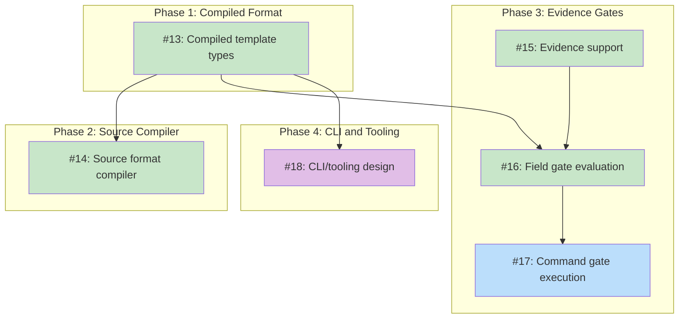

# DESIGN: koto Template Format Specification

## Status

**Planned**

## Implementation Issues

### Milestone: [koto Template Format Specification](https://github.com/tsukumogami/koto/milestone/2)

| Issue | Dependencies | Tier |
|-------|--------------|------|
| ~~[#13: feat(template): define compiled template format with JSON parsing](https://github.com/tsukumogami/koto/issues/13)~~ | ~~None~~ | ~~testable~~ |
| ~~_Defines `CompiledTemplate`, `VariableDecl`, `StateDecl`, and `GateDecl` Go types with JSON tags, implements `ParseJSON()` with all 13 validation rules, adds `Gates` to `MachineState`, and builds `engine.Machine` from compiled JSON. This is the foundation that both the compiler and gate evaluation build on._~~ | | |
| ~~[#14: feat(template): implement source format compiler](https://github.com/tsukumogami/koto/issues/14)~~ | ~~[#13](https://github.com/tsukumogami/koto/issues/13)~~ | ~~testable~~ |
| ~~_Creates `pkg/template/compile/` with go-yaml v3 to parse YAML frontmatter and extract markdown directives by matching `## headings` against declared states. Produces deterministic JSON with sorted keys and SHA-256 hash. Emits heading collision warnings._~~ | | |
| ~~[#15: feat(engine): add evidence support with transition options](https://github.com/tsukumogami/koto/issues/15)~~ | ~~None~~ | ~~testable~~ |
| ~~_Adds `Evidence map[string]string` to engine state, introduces the `TransitionOption` functional pattern with `WithEvidence()`, bumps `schema_version` to 2 with backward-compatible load, and updates the controller to merge evidence into the interpolation context. Evidence persists across rewind._~~ | | |
| ~~[#16: feat(engine): implement field-based gate evaluation](https://github.com/tsukumogami/koto/issues/16)~~ | ~~[#13](https://github.com/tsukumogami/koto/issues/13), [#15](https://github.com/tsukumogami/koto/issues/15)~~ | ~~testable~~ |
| ~~_Inserts gate evaluation between validation and commit in `Transition()`. Implements `field_not_empty` and `field_equals` gate types with AND logic, adds `gate_failed` error code, and rejects evidence keys that shadow declared variables. Establishes the evaluation framework that command gates extend._~~ | | |
| [#17: feat(engine): implement command gate execution](https://github.com/tsukumogami/koto/issues/17) | [#16](https://github.com/tsukumogami/koto/issues/16) | critical |
| _Adds the `command` gate type: `sh -c` execution from project root with configurable timeout (default 30s). No variable interpolation in command strings -- this security boundary is verified by explicit tests. Timed-out commands fail the gate._ | | |
| [#18: docs: design CLI and tooling for template compilation](https://github.com/tsukumogami/koto/issues/18) | [#13](https://github.com/tsukumogami/koto/issues/13) | simple |
| _Designs the CLI commands, template search paths, compile flow, and optional LLM-assisted validation that build on this format specification. This is Phase 4 of the implementation approach -- deferred to its own design because CLI/tooling concerns are separate from format specification._ | | |

### Dependency Graph



**Legend**: Green = done, Blue = ready, Yellow = blocked, Purple = needs-design, Orange = tracks-design

## Context and Problem Statement

koto templates define workflow state machines that guide AI agents through multi-step tasks. A template contains two types of content:

**Structure**: States, transitions, evidence gates, variables, and metadata. This is the state machine definition -- it must be parsed deterministically with zero ambiguity. The engine depends on this being correct.

**Content**: Directive text for each state -- the instructions an AI agent reads when it enters a state. This is rich markdown with tables, code blocks, headings, and examples. It needs to be authored by humans and rendered readably.

The v1 design tried to serve both needs with a single file format (TOML/YAML frontmatter + markdown body). This created a cascade of problems:

- **Heading collision**: `## headings` in directive content conflicted with `## headings` marking state boundaries, requiring "declared-state matching" rules
- **Dual transition sources**: Transitions declared in the header AND `**Transitions**:` lines in the body, with precedence rules for conflicts
- **Format debates**: TOML vs YAML vs extended markdown -- each had trade-offs because no single format serves both deterministic parsing and human authoring well
- **Parsing fragility**: Code blocks containing state-name headings, whitespace sensitivity, case sensitivity rules -- all artifacts of using a content format for structure

These problems share a root cause: **conflating the source format with the execution format**. They don't need to be the same.

### The Insight

The relationship between templates and the engine is the same as the relationship between source code and a runtime. Programmers write source code in a language designed for humans. Compilers produce machine code designed for CPUs. We store source code, not machine code. Compilation is one-way and deterministic.

koto templates work the same way:

- The **source format** is the primary artifact -- what humans write, store, version, and share. It's the "programming language" for koto state machines.
- The **compiled format** is what the engine reads at runtime -- deterministic, schema-validatable, unambiguous. It's ephemeral, like a compiled binary.
- The **compiler** converts source to compiled format deterministically: same input always produces same output.
- **Validation tooling** (including optional LLM assistance) helps humans write correct source, like a linter for a programming language.

There is no decompiler. If you want to edit a template, you edit the source. The compiled form is derived, not authored.

### Scope

**In scope:**
- Source format specification (the "programming language" for templates)
- Compiled format specification (what the engine reads)
- Compilation rules (how source deterministically produces compiled output)
- Evidence gate declaration syntax
- Variable declaration syntax
- Validation contract (what constitutes valid source and valid compiled output)

**Out of scope:**
- CLI commands and user-facing tooling (how compilation is invoked, template subcommands)
- Template search path and resolution (how koto finds templates at runtime)
- LLM-assisted validation architecture (how/whether LLMs help with authoring)
- Evidence gate evaluation logic (how the engine checks gates at transition time)
- LLM integration implementation details (model selection, prompting strategy)
- Template registry or community distribution
- Built-in template content (that's the quick-task template design, #13)

The CLI/tooling layer (compile commands, search paths, linter) needs its own design that builds on this format specification.

## Decision Drivers

- **Source format as primary artifact**: The template source is what gets stored, versioned, and shared. It needs to be well-designed as a language for defining state machines.
- **Deterministic compilation**: Converting source to compiled format must produce identical output for identical input. No LLMs in the compile path.
- **Human-friendly authoring**: The source format should be natural to write and render well on GitHub. Rich directive content (markdown) is a first-class need.
- **Zero dependencies for core engine**: The engine reads the compiled format using only Go's standard library. Dependencies (if any) are confined to the compiler/tooling layer.
- **LLM assistance at the validation layer only**: LLMs can help fix source errors, but the compiler is deterministic. Like a linter for a programming language.
- **Progressive complexity**: Simple templates should be simple to author. Evidence gates, search paths, and LLM validation are opt-in features.
- **Schema-based tooling**: The compiled format supports JSON Schema for validation. The source format supports YAML schema for editor autocomplete.

## Implementation Context

### Current Template Format

The parser in `pkg/template/template.go` uses a YAML-like frontmatter (`---` delimiters) with markdown body sections. It handles flat `key: value` pairs and one level of nesting (`variables:` block). States are identified by `## heading` markers. The parser produces a `Template` struct containing a `Machine`, section content, variables, and a SHA-256 hash.

Key limitation: the parser treats ALL `## headings` as state boundaries, creating the heading collision problem. The hand-rolled YAML parser can't handle nested structures (evidence gates).

### Industry Patterns

The source/compiled separation pattern is well-established:

- **Programming languages (C, Go, Rust)**: Source code stored and versioned; compiled binary is derived and ephemeral. Compilation is one-way. No decompiler in the standard workflow.
- **Terraform**: HCL (source) and JSON (machine). Either can be authored, but HCL is the standard source format.
- **Protocol Buffers**: `.proto` (source) compiles to binary wire format. Source is stored. Binary is derived.
- **Markdoc (Stripe)**: Markdown (source) compiles to serializable AST. The AST is cacheable and validatable.
- **OpenAPI / Kubernetes**: YAML source validated against JSON Schema. Schema drives editor tooling.
- **CUE**: Validation rules embedded in the data definition. Gradual validation (partial specs are valid).

No tool in the AI agent workflow space uses a compiled template approach. koto would be the first to separate source format from execution format for workflow state machines.

## Considered Options

### Decision 1: Architecture

Should koto use a single format or separate source from compiled output?

#### Chosen: Source format with deterministic compilation

The template source (`.md` files) is the primary artifact -- stored, versioned, and shared. The engine reads compiled JSON, produced by a deterministic compiler. Compilation is one-way.

- **Source format** (Markdown): What humans write and store. YAML frontmatter for structure, markdown body for directives. Renders on GitHub. This is the "programming language" for koto state machines.
- **Compiled format** (JSON): What the engine reads at runtime. Deterministic, schema-validatable, zero-ambiguity. Derived from source, not authored directly.
- **Compiler**: Deterministic function from source to JSON. Same input always produces same output. No LLMs involved.
- **Linter** (future): Validates source and suggests fixes. May optionally use LLMs for ambiguity resolution. Never in the compile path.

There is no decompiler. The source format is the artifact of record. To edit a template, edit the source.

#### Alternatives Considered

**Single YAML format (go-yaml v3)**: YAML frontmatter with block scalars for directives. Simpler (no compilation step), but the heading collision problem returns if directives contain markdown with headings. YAML block scalars are awkward for long markdown content. Editor support is good (JSON Schema works for YAML too) but the format still conflates structure and content.

**Single JSON format**: JSON for everything, including directives as string fields. Maximally deterministic, but JSON with embedded markdown (`\n` escapes, no syntax highlighting inside strings) is painful to write. No GitHub rendering. Humans would need tooling assistance for everything.

**Markdown-only with conventions**: Pure markdown with structural conventions (specific heading levels, blockquotes for metadata). Renders beautifully on GitHub but has no schema validation ecosystem, no editor support, and the parser depends on exact formatting conventions. No equivalent of JSON Schema for markdown means no deterministic validation.

**Directory-based format**: JSON manifest + separate `.md` files per state (`states/assess.md`). Clean separation but one template becomes a directory, complicating distribution, search paths, and template management.

### Decision 2: Compiled Format

What format should the compiler produce and the engine read?

#### Chosen: JSON

The compiler produces JSON. The engine reads JSON using Go's `encoding/json` (standard library, zero dependencies). JSON is:

- Deterministic to parse (no implicit typing, no multiple representations)
- Schema-validatable (JSON Schema for CI validation and debugging)
- Already used by koto for state files (consistent ecosystem)
- Well-supported by every language and tool

The compiled format is ephemeral -- like a compiled binary, it's derived from source and doesn't need to be persisted. How and when compilation happens (at init, on demand, cached) is a CLI/tooling concern.

#### Alternatives Considered

**YAML**: More readable than JSON for humans, but humans don't read the compiled output -- they read the source. YAML adds a dependency (go-yaml) to the engine's parse path, violating the zero-dependency goal.

**TOML**: Good for configuration but awkward for the list-of-states pattern. Adds a dependency to the engine. Not widely used for data interchange.

**Custom binary format**: Maximum parsing speed, but templates are read once at init time. The performance benefit doesn't justify the tooling cost.

### Decision 3: Source Format

What does the "programming language" for koto state machines look like?

#### Chosen: YAML frontmatter + Markdown body

The source format uses standard YAML frontmatter (`---` delimiters) for state machine structure and markdown body for directive content:

```markdown
---
name: quick-task
version: "1.0"
description: A focused task workflow
initial_state: assess

variables:
  TASK:
    description: What to build
    required: true
  REPO:
    description: Repository path
    default: "."

states:
  assess:
    transitions: [plan, escalate]
    gates:
      task_defined:
        type: field_not_empty
        field: TASK
  plan:
    transitions: [implement]
  implement:
    transitions: [done]
    gates:
      tests_pass:
        type: command
        command: go test ./...
        timeout: 120
  escalate:
    terminal: true
  done:
    terminal: true
---

## assess

Analyze the task: {{TASK}}

Review the codebase in {{REPO}} and determine:
- What files need to change
- How complex the change is
- Whether tests exist for the affected code

## plan

Create an implementation plan for {{TASK}}.

Break the work into steps. Identify tests to write.

## implement

Execute the plan. Write code and tests.

## done

Work is complete.

## escalate

Task could not be completed in this workflow.
```

The YAML frontmatter contains the complete state machine structure. The markdown body provides directive content for each state, matched by `## heading` text. GitHub renders this as a readable document with the frontmatter collapsed.

**Why YAML for structure**: YAML is the industry standard for frontmatter. GitHub renders it. Editors support it with autocompletion. go-yaml is a dependency of the compiler (not the engine). The implicit typing concern (bare `yes` becoming boolean) is real but narrow -- template authors already quote version strings (`"1.0"`), and the compiler validates types.

**Heading collision is contained**: In the source format, `## headings` matching declared state names are state boundaries. Other headings within a state's section are directive content. The compiler resolves this deterministically using the declared state list from the YAML frontmatter. If the source is ambiguous, the linter catches it before compilation.

#### Alternatives Considered

**Pure YAML**: All content in YAML, directives as block scalars. No heading collision, but long markdown in YAML block scalars is awkward (indentation-sensitive, no syntax highlighting, hard to edit). A poor "programming language" for content-heavy definitions.

**Pure markdown with conventions**: No frontmatter, everything encoded in markdown structure. Renders perfectly but has no schema validation, no editor support, and fragile parsing. No equivalent to JSON Schema for markdown means no deterministic validation of structure.

**TOML frontmatter**: Works well for nested config but `+++` delimiters aren't standard. GitHub doesn't render TOML frontmatter. Less familiar than YAML to most developers.

### Decision 4: Evidence Gate Declarations

How do template authors declare evidence requirements?

#### Chosen: Per-state gate declarations

Gates are declared under each state in the source format (and carried through to the compiled format). Three gate types for Phase 1:

**field_not_empty**: A named field exists and is non-empty in the evidence map.

**field_equals**: A named field equals a specific value.

**command**: A shell command exits 0. Commands are literal strings -- no `{{VARIABLE}}` interpolation (prevents injection). Commands run via `sh -c` from the project root directory.

Gates on a state are exit conditions: all must pass (AND logic) before leaving that state. OR composition is not supported in Phase 1.

#### Alternatives Considered

**Transition-level gates**: Attach gates to specific transitions rather than states. Deferred for Phase 1 -- the common case is "satisfy these conditions before leaving this state." Transition-level gates can be added later.

**Inline gate syntax in markdown**: Declare gates in the body using special syntax. Rejected because it mixes machine configuration with content -- exactly the problem the dual-format approach solves.

### Design Boundary: CLI and Tooling

The following topics are intentionally deferred to a separate CLI/tooling design:

- **Template search path**: How koto finds templates at runtime (project-local, user-global, explicit path)
- **CLI commands**: `koto template compile/validate/lint/new` and their flags
- **LLM-assisted validation**: Whether and how LLMs help authors write valid source
- **Compile flow**: Whether compilation is explicit, implicit (at init time), or both

This design specifies what valid source and compiled output look like. How users produce, find, and validate templates is a CLI concern.

**One architectural constraint carries forward:** LLMs must never be in the compilation path. Compilation is deterministic. LLMs, if used, belong in optional validation/linting tooling.

## Decision Outcome

### Summary

koto templates use a source-and-compiled architecture. Template source files (`.md`) are the primary artifact -- what humans write, store, and share. A deterministic compiler produces JSON for the engine to read at runtime. Compilation is one-way.

The source format uses YAML frontmatter for state machine structure and markdown body for directive content. It's the "programming language" for koto workflows -- designed for humans to read, write, and version.

The compiled JSON format uses Go's standard library (`encoding/json`) with zero external dependencies. How compilation is invoked at runtime is a separate CLI/tooling design.

### Rationale

The source/compiled separation eliminates the heading collision problem (JSON has no headings), removes format debates (each format does what it's designed for), and lets the engine parse with zero ambiguity. The compilation step is deterministic -- same source always produces the same compiled output.

This maps to a well-understood model: source code and compilation. Template authors interact with the source format, just as programmers interact with source code. How compilation is invoked at runtime is a CLI/tooling concern built on top of this format specification.

### Trade-offs Accepted

- **Compilation step**: Source must be compiled before the engine can use it. How compilation is invoked (explicit command, implicit at init, etc.) is a CLI design concern.
- **go-yaml dependency in compiler**: The compiler (not the engine) depends on go-yaml for parsing YAML frontmatter. The engine remains dependency-free. Acceptable because the dependency is confined to the compiler package.
- **JSON directives are unreadable**: The compiled format embeds markdown as JSON strings with escape sequences. Acceptable because humans don't read the compiled format -- they read the source.
- **No LLM gates**: Only deterministic gate types (field checks, commands) in Phase 1. LLM-based evaluation (prompt gates) deferred to a separate design.

## Solution Architecture

### Compiled Format (JSON)

The compiler produces a JSON representation of the template. This is what the engine reads at runtime:

```json
{
  "format_version": 1,
  "name": "quick-task",
  "version": "1.0",
  "description": "A focused task workflow",
  "initial_state": "assess",
  "variables": {
    "TASK": {
      "description": "What to build",
      "required": true,
      "default": ""
    },
    "REPO": {
      "description": "Repository path",
      "required": false,
      "default": "."
    }
  },
  "states": {
    "assess": {
      "directive": "Analyze the task: {{TASK}}\n\nReview the codebase in {{REPO}} and determine:\n- What files need to change\n- How complex the change is\n- Whether tests exist for the affected code",
      "transitions": ["plan", "escalate"],
      "gates": {
        "task_defined": {
          "type": "field_not_empty",
          "field": "TASK"
        }
      }
    },
    "plan": {
      "directive": "Create an implementation plan for {{TASK}}.\n\nBreak the work into steps. Identify tests to write.",
      "transitions": ["implement"]
    },
    "implement": {
      "directive": "Execute the plan. Write code and tests.",
      "transitions": ["done"],
      "gates": {
        "tests_pass": {
          "type": "command",
          "command": "go test ./...",
          "timeout": 120
        }
      }
    },
    "escalate": {
      "directive": "Task could not be completed in this workflow.",
      "terminal": true
    },
    "done": {
      "directive": "Work is complete.",
      "terminal": true
    }
  }
}
```

**Format version**: The compiled template uses `format_version` (not `schema_version`) to avoid confusion with the state file's `schema_version`. These are independent versioning tracks. The engine rejects unknown format versions.

**Go types:**

```go
// CompiledTemplate is the JSON-serializable compiled template format.
type CompiledTemplate struct {
    FormatVersion int                        `json:"format_version"`
    Name          string                     `json:"name"`
    Version       string                     `json:"version"`
    Description   string                     `json:"description,omitempty"`
    InitialState  string                     `json:"initial_state"`
    Variables     map[string]VariableDecl     `json:"variables,omitempty"`
    States        map[string]StateDecl        `json:"states"`
}

type VariableDecl struct {
    Description string `json:"description,omitempty"`
    Required    bool   `json:"required,omitempty"`
    Default     string `json:"default,omitempty"`
}

type StateDecl struct {
    Directive   string               `json:"directive"`
    Transitions []string             `json:"transitions,omitempty"`
    Terminal    bool                 `json:"terminal,omitempty"`
    Gates       map[string]GateDecl  `json:"gates,omitempty"`
}

type GateDecl struct {
    Type    string `json:"type"`
    Field   string `json:"field,omitempty"`
    Value   string `json:"value,omitempty"`
    Command string `json:"command,omitempty"`
    Timeout int    `json:"timeout,omitempty"` // seconds, 0 = default (30s)
}
```

**Validation rules (parse-time):**

| Check | Error |
|-------|-------|
| Invalid JSON | JSON parse error |
| Unknown `format_version` | `"unsupported format version: %d"` |
| Missing `name` | `"missing required field: name"` |
| Missing `version` | `"missing required field: version"` |
| Missing `initial_state` | `"missing required field: initial_state"` |
| `initial_state` not in states | `"initial_state %q is not a declared state"` |
| No states declared | `"template has no states"` |
| Transition target not in states | `"state %q references undefined transition target %q"` |
| Gate has unknown type | `"state %q gate %q: unknown type %q"` |
| Gate missing required field | `"state %q gate %q: missing required field %q"` |
| Command gate has empty command | `"state %q gate %q: command must not be empty"` |
| State has empty directive | `"state %q has empty directive"` |

### Source Format (Markdown)

The source format is the "programming language" for koto state machines. A `.md` file with YAML frontmatter:

```markdown
---
name: quick-task
version: "1.0"
description: A focused task workflow
initial_state: assess

variables:
  TASK:
    description: What to build
    required: true
  REPO:
    description: Repository path
    default: "."

states:
  assess:
    transitions: [plan, escalate]
    gates:
      task_defined:
        type: field_not_empty
        field: TASK
  plan:
    transitions: [implement]
  implement:
    transitions: [done]
    gates:
      tests_pass:
        type: command
        command: go test ./...
        timeout: 120
  escalate:
    terminal: true
  done:
    terminal: true
---

## assess

Analyze the task: {{TASK}}

Review the codebase in {{REPO}} and determine:
- What files need to change
- How complex the change is
- Whether tests exist for the affected code

## plan

Create an implementation plan for {{TASK}}.

Break the work into steps. Identify tests to write.

## implement

Execute the plan. Write code and tests.

## done

Work is complete.

## escalate

Task could not be completed in this workflow.
```

The YAML frontmatter declares the state machine structure: states, transitions, gates, and variables. The markdown body provides directive content for each state, matched by `## heading` to state names declared in the frontmatter. This is the file that gets stored in version control and shared.

**Compilation rules:**

1. Parse YAML frontmatter using go-yaml v3.
2. Build the set of declared state names from `states:`.
3. Scan markdown body for `## headings` matching declared state names (case-sensitive). Content between state headings becomes the directive.
4. For each declared state, the directive comes from the markdown body. If a state has no matching heading, compilation fails.
5. Headings that don't match a declared state name are treated as directive content, not state boundaries. The declared state list from the frontmatter is the authority.
6. Serialize to JSON with sorted keys (deterministic output). Compute SHA-256 hash of the compiled JSON. This hash is what the engine stores at init time and verifies on every operation. Hashing the compiled output (not the source) means source-only changes that don't affect behavior (YAML reformatting, comment-like content outside state sections) don't invalidate running workflows.

**Compiler warnings:** The compiler emits a warning (not an error) when a `## heading` inside a state's directive section matches the name of another declared state. This catches accidental content reassignment -- for example, adding `## plan` inside the `assess` directive when `plan` is also a state. The warning is: `"state %q directive contains ## heading matching state %q; is this intentional?"`. The compiler still produces valid output (the heading is treated as directive content, not a state boundary, because content is assigned by the first `## heading` match for each declared state).

**What the compiler does NOT do:**
- Parse `**Transitions**:` lines from the body. Transitions come exclusively from the YAML frontmatter. No dual sources.
- Treat non-matching headings as errors. `### Decision Criteria` within a state directive is content, not a state boundary.
- Invoke LLMs. Compilation is deterministic. Same source always produces the same compiled output.

### Evidence Gates

**Gate types (Phase 1):**

| Type | Required Fields | Description |
|------|----------------|-------------|
| `field_not_empty` | `field` | Evidence field exists and is non-empty |
| `field_equals` | `field`, `value` | Evidence field equals expected value |
| `command` | `command` (optional: `timeout`) | Shell command exits 0 (default 30s timeout) |

**Gate semantics:**
- Gates are exit conditions: all gates on a state must pass before leaving (AND logic).
- Gates are evaluated when `koto transition` is called, between validation and commit.
- Command gates run via `sh -c "<command>"` from the project root (git repository root, or CWD if not in a git repo). No `{{VARIABLE}}` interpolation in command strings (prevents injection). Default timeout: 30 seconds. Configurable per gate via optional `timeout` field (integer seconds).
- Evidence is supplied via `koto transition <target> --evidence key=value` and accumulates in the state file across transitions.

**Gate evaluation scope:** Gates check the **evidence map only**, not the merged variables+evidence context. Variables are for directive interpolation. Evidence is for gate evaluation. These are separate concerns with separate namespaces.

**Type mapping to engine:** The compiled template's `StateDecl.Gates` maps to a new `Gates` field on `engine.MachineState`. The template parser builds the `Machine` with gates populated. The engine evaluates gates during `Transition()` between validation (step 4) and commit (step 5), as specified in the engine design's extension point.

**Engine extension:**
- Add `Evidence map[string]string` to `engine.State` (separate from `Variables`).
- Extend `Engine.Transition` signature: `Transition(target string, opts ...TransitionOption) error` with `WithEvidence(map[string]string)` option for backward compatibility.
- Bump the state file's `schema_version` to 2. `Load` accepts v1 (empty Evidence map) and v2. (Note: this is the state file schema version, not the compiled template's `format_version` -- they are independent versioning tracks.)

**Evidence and rewind:** Evidence persists across rewind. Rewind changes the current state but doesn't modify the evidence map. If an agent rewinds from `verify` to `implement`, evidence values from prior transitions remain. The agent can overwrite values by supplying new evidence on subsequent transitions. This is the simplest correct model -- evidence is append/overwrite, never deleted. History entries record which evidence was supplied per transition for auditability.

**CLI surface:** `koto transition <target> --evidence key=value [--evidence key2=value2]`. The `--evidence` flag is repeatable. Key-value pairs are parsed as `key=value` (first `=` splits key from value). Evidence is passed through to `WithEvidence()`. The `koto next` command displays accumulated evidence alongside the directive.

### Interpolation

The controller builds the interpolation context:

```
context = merge(variable defaults, init-time --var values, evidence values)
```

**Namespace collision rule:** Evidence keys must not shadow declared variable names. If `--evidence TASK=value` is supplied and `TASK` is a declared variable, the transition is rejected with error `"evidence key %q shadows declared variable"`. This prevents evidence from rewriting agent instructions via variable interpolation. Undeclared variable names are available for evidence use.

Single-pass `{{KEY}}` replacement. Unresolved placeholders remain as-is.

Command gate strings are NOT interpolated. This is a security boundary -- verified by explicit tests.

*Template search path, CLI commands, and LLM-assisted validation are deferred to a separate CLI/tooling design.*

## Implementation Approach

### Phase 1: Compiled Format

Define the JSON schema and implement parsing in `pkg/template/`:
- `CompiledTemplate` struct with JSON tags
- `ParseJSON([]byte) (*Template, error)` -- validates compiled JSON
- Build `engine.Machine` from parsed compiled template (including gates on `MachineState`)
- JSON Schema file for validation
- Unit tests for every validation rule

No external dependencies. Uses `encoding/json` from stdlib.

### Phase 2: Source Format Compiler

Implement the compiler as a separate package (`pkg/template/compile/`):
- Parse YAML frontmatter (go-yaml v3 dependency here, not in engine)
- Extract directive content from markdown body using declared state list
- Produce `CompiledTemplate` struct
- Compiler warnings for heading collision (state name matches subheading in another state)
- Unit tests for compilation edge cases (heading collision, missing sections, empty commands)

### Phase 3: Evidence Gates

Extend the engine for evidence:
- `Evidence map[string]string` in `engine.State`
- `Transition(target string, opts ...TransitionOption) error`
- Gate evaluation between validation and commit
- `gate_failed` error code
- Command gate execution (`sh -c`, project root CWD, no interpolation, timeout)
- Namespace collision rejection (evidence key shadows declared variable)

### Phase 4: CLI and Tooling (separate design)

How compilation is invoked, template search paths, validation commands, and LLM-assisted linting. Builds on this format specification but is a distinct design.

## Security Considerations

### Download Verification

Not applicable. Templates are local files. No downloads at runtime.

### Execution Isolation

**Command gates execute shell commands**: `sh -c "<command>"` with user permissions from the project root (git root, or CWD if not in a git repo). Commands inherit the user's full shell environment. This is deliberate (template authors define what to run, same trust model as Makefiles). Commands are literal strings -- no variable interpolation prevents injection.

**Command gate timeout**: Default 30-second timeout prevents indefinite blocking. Configurable per gate. A timed-out command fails the gate (transition is rejected).

Mitigation: command gates execute only during transitions, not during parse or validation. Validation tools should NOT execute commands. Review templates before use (same trust model as Makefiles).

### Supply Chain Risks

**Template files with command gates are executable**: A malicious template could run arbitrary commands. Mitigation: SHA-256 hash stored at init time, verified on every operation. Template modification after init is detected.

**go-yaml dependency**: Confined to the compiler, not the engine. The engine reads compiled JSON using stdlib only. A go-yaml vulnerability affects the compilation tooling, not workflow execution.

**Compiled JSON format**: Go's `encoding/json` is part of the standard library. No supply chain risk from the engine's parser.

### User Data Exposure

**Evidence in state files**: Evidence accumulated during execution is stored in the state file (JSON on disk). Same risk as the existing variables. State files in `wip/` are cleaned before merge.

**Command gate output**: Exit codes only. stdout/stderr not captured or stored.

### Mitigations

| Risk | Mitigation | Residual Risk |
|------|------------|---------------|
| Malicious command gates | SHA-256 hash verification; review before use | Untrusted template used without review |
| go-yaml vulnerability | Confined to compiler, not engine | Zero-day in compiler path |
| Evidence contains sensitive data | Cleaned before merge; same as variables | Exposure on feature branches |
| Template modification after init | Hash check on every operation | Hash collision (negligible) |
| Command injection via variables | No interpolation in command strings; explicit test | Future contributor bypasses this |
| Evidence overwrites agent instructions | Evidence keys cannot shadow declared variable names | Undeclared variable names remain open |

## Consequences

### Positive

- Heading collision eliminated: the compiled format has no headings. The engine never sees markdown ambiguity.
- Format debates resolved: the source format is designed for humans, the compiled format for the engine. Each does what it's designed for.
- Zero engine dependencies: `encoding/json` is stdlib. go-yaml is confined to the compiler package.
- Source format renders on GitHub: YAML frontmatter + markdown body is a standard GitHub renders well.
- Clean extension point: new gate types, new fields, and format evolution all work through version bumps.
- Clear mental model: source code and compilation is a pattern every developer already knows.

### Negative

- Compilation step: source must be compiled before the engine can use it. Adds internal complexity.
- JSON directives are unreadable: the compiled format embeds markdown as JSON strings with escape sequences.
- go-yaml dependency in compiler: adds a dependency to the compiler package.

### Mitigations

- The compiler is a small, focused component (~200 lines) that's easy to understand and maintain
- The compiled format is an internal representation, not a user-facing artifact
- go-yaml is well-maintained and widely used; the dependency is confined to one package
