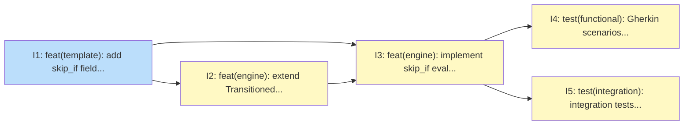

# PLAN: Auto-Advance Transitions via skip_if

## Status

Draft

## Scope Summary

Add a `skip_if` predicate to koto template states that auto-advances deterministic
transitions within a single `advance_until_stop()` invocation. The feature writes
synthetic Transitioned events for resume-awareness and chains consecutive auto-advancing
states naturally, eliminating mechanical evidence submission for deterministic states.

## Decomposition Strategy

**Horizontal decomposition.** The design specifies Rust type signatures and exact
insertion points for each layer before implementation begins, so there's no
interface-discovery risk that a walking skeleton would surface early. Each issue
delivers one complete layer (schema, event type, advance loop, Gherkin tests,
integration tests) and passes `cargo test` before the next issue starts.

## Issue Outlines

### Issue 1: feat(template): add skip_if field and compile-time validation

**Complexity**: testable

**Goal**: Add the `skip_if` field to `TemplateState` and `SourceState`, implement the four compile-time validation rules (E-SKIP-TERMINAL, E-SKIP-NO-TRANSITIONS, E-SKIP-AMBIGUOUS, W-SKIP-GATE-ABSENT), and cover each rule with a unit test in `src/template/compile.rs`.

**Acceptance Criteria**:

- [ ] `src/template/types.rs`: `TemplateState` has `pub skip_if: Option<BTreeMap<String, serde_json::Value>>` with `#[serde(default, skip_serializing_if = "Option::is_none")]`
- [ ] `src/template/compile.rs`: `SourceState` has `skip_if: Option<HashMap<String, serde_json::Value>>` with `#[serde(default)]`
- [ ] E-SKIP-TERMINAL: `koto template compile` returns an error when `skip_if` is declared on a `terminal: true` state
- [ ] E-SKIP-NO-TRANSITIONS: `koto template compile` returns an error when `skip_if` is declared and `transitions` is empty or absent
- [ ] E-SKIP-AMBIGUOUS: `koto template compile` returns an error when skip_if values as synthetic evidence match zero or more than one conditional transition
- [ ] W-SKIP-GATE-ABSENT: `koto template compile` returns a warning when a `skip_if` key of the form `gates.NAME.*` references a gate name not declared on the state
- [ ] `src/template/compile.rs` (mod tests): `skip_if_on_terminal_state_is_error` passes
- [ ] `src/template/compile.rs` (mod tests): `skip_if_with_no_transitions_is_error` passes
- [ ] `src/template/compile.rs` (mod tests): `skip_if_ambiguous_routing_is_error` passes
- [ ] `cargo test --lib` passes with no regressions

**Dependencies**: None

---

### Issue 2: feat(engine): extend Transitioned event with skip_if_matched field

**Complexity**: simple

**Goal**: Add `skip_if_matched: Option<BTreeMap<String, serde_json::Value>>` to `EventPayload::Transitioned` so the advance loop can record which conditions caused an auto-transition.

**Acceptance Criteria**:

- [ ] `src/engine/types.rs`: `EventPayload::Transitioned` variant includes `skip_if_matched: Option<BTreeMap<String, serde_json::Value>>` with `#[serde(default, skip_serializing_if = "Option::is_none")]`
- [ ] All existing tests pass (no serialization regressions)
- [ ] `cargo test` passes with no regressions

**Dependencies**: Blocked by Issue 1

---

### Issue 3: feat(engine): implement skip_if evaluation in advance_until_stop

**Complexity**: testable

**Goal**: Add the `conditions_satisfied()` helper, the skip_if evaluation block after gate synthesis in `advance_until_stop()`, and extend `has_gates_routing` to include skip_if gate key references so the context-exists gate workaround works correctly.

**Acceptance Criteria**:

- [ ] `src/engine/advance.rs`: `conditions_satisfied(conditions, merged_evidence, variables) -> bool` exists and returns `true` only when every key in `conditions` matches, with `vars.NAME: {is_set: bool}` resolved via the `variables` map
- [ ] `src/engine/advance.rs`: `has_gates_routing` includes skip_if keys (`template_state.skip_if.as_ref().map_or(false, |s| s.keys().any(|k| k.starts_with("gates.")))`)
- [ ] `src/engine/advance.rs`: skip_if evaluation block exists after gate synthesis and before the existing `resolve_transition()` call (insertion point: after line 431, before line 464)
- [ ] When skip_if fires: `EventPayload::Transitioned` appended with `condition_type: "skip_if"` and `skip_if_matched: Some(skip_conditions.clone())`
- [ ] When skip_if fires: the loop calls `continue` so consecutive skip_if states chain in one `advance_until_stop()` invocation
- [ ] When skip_if fires and the resolved target is in the visited set: `StopReason::CycleDetected` returned before event is written
- [ ] When skip_if conditions are not all satisfied: block falls through to existing `resolve_transition()` call
- [ ] `cargo test` passes with no regressions

**Dependencies**: Blocked by Issues 1, 2

---

### Issue 4: test(functional): add Gherkin scenarios and fixture templates for skip_if

**Complexity**: testable

**Goal**: Add three fixture templates and a `skip-if.feature` Gherkin file covering seven user-facing scenarios -- happy-path single fire, consecutive chaining, unmet condition fallthrough, gate-backed skip_if, multi-branch conditional routing, accepts interaction, and vars condition.

**Acceptance Criteria**:

- [ ] `test/functional/fixtures/templates/skip-if-chain.md`: 3-state chain (A→B→C) where A and B have firing `skip_if` conditions and C is evidence-required; under 40 lines
- [ ] `test/functional/fixtures/templates/skip-if-gate.md`: state with `context-exists` gate and `skip_if: {gates.context_file.exists: true}`; under 40 lines
- [ ] `test/functional/fixtures/templates/skip-if-vars.md`: state with `skip_if: {vars.SHARED_BRANCH: {is_set: true}}`; under 40 lines
- [ ] `test/functional/features/skip-if.feature`: scenario 1 -- single skip_if fires, `koto next` returns post-skip state without blocking
- [ ] `test/functional/features/skip-if.feature`: scenario 3 -- unmet condition causes the state to block for evidence normally
- [ ] `test/functional/features/skip-if.feature`: scenario 5 -- gate-backed skip_if fires when gate output matches
- [ ] `test/functional/features/skip-if.feature`: scenario 7 -- correct conditional branch selected when skip_if fires with multi-branch transitions
- [ ] `test/functional/features/skip-if.feature`: scenario 8 -- skip_if fires when met (bypassing accepts); falls through to evidence request when unmet
- [ ] `test/functional/features/skip-if.feature`: scenario 9 with var -- skip_if fires when `--var SHARED_BRANCH=main` passed at init
- [ ] `test/functional/features/skip-if.feature`: scenario 9 without var -- skip_if does not fire when var is absent
- [ ] `cargo test --test integration_test` passes with all Gherkin scenarios included

**Dependencies**: Blocked by Issue 3

---

### Issue 5: test(integration): add integration tests for skip_if log format and edge cases

**Complexity**: testable

**Goal**: Add four integration test functions covering JSONL log format verification, consecutive chain event count, cycle detection (filling a pre-existing gap), and chain limit (filling a pre-existing gap).

**Acceptance Criteria**:

- [ ] `tests/integration_test.rs`: `skip_if_log_records_condition_type_and_matched_values` -- after skip_if fires, `.state.jsonl` contains a `Transitioned` event with `"condition_type":"skip_if"` and a non-null `"skip_if_matched"` map matching the declared conditions
- [ ] `tests/integration_test.rs`: `skip_if_consecutive_chain_emits_correct_events` -- after `koto next` on a 3-state chain, JSONL log contains exactly two `Transitioned` events with `condition_type: "skip_if"` and response includes `"advanced":true`
- [ ] `tests/integration_test.rs`: `skip_if_cycle_detection` -- a template where skip_if on state B targets state A returns a stop reason indicating cycle detection without corrupting the state file
- [ ] `tests/integration_test.rs`: `skip_if_chain_triggers_limit` -- a programmatically generated 101-state linear template with firing skip_if causes `advance_until_stop()` to stop at state 100 with `ChainLimitReached`; workflow is not corrupted
- [ ] `cargo test --test integration_test` passes with all four new tests

**Dependencies**: Blocked by Issue 3

---

## Dependency Graph

**Legend**: Green = done, Blue = ready, Yellow = blocked, Purple = needs-design, Orange = tracks-design/tracks-plan

## Implementation Sequence

**Critical path**: Issue 1 → Issue 2 → Issue 3 → Issue 4 (or Issue 5) -- 4 issues deep.

**Recommended order**:

1. **Issue 1** (no blockers) -- start here; establishes the types and compile validation that everything else depends on
2. **Issue 2** (after Issue 1) -- simple schema extension; completes the type surface before the advance loop is written
3. **Issue 3** (after Issues 1 and 2) -- the core engine change; both upstream issues should be merged before starting
4. **Issues 4 and 5** (after Issue 3, in parallel) -- independent test layers; Gherkin and integration tests can be written simultaneously

Issues 4 and 5 are the only parallelization opportunity in this plan. The implementation sequence is otherwise strictly linear.
