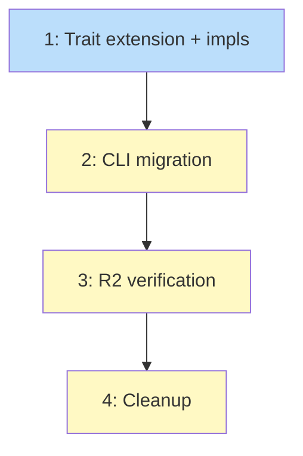

# PLAN: Backend-owned state persistence

## Status

Draft

## Scope Summary

Add state I/O methods to SessionBackend, migrate 16 CLI call sites, update
CloudBackend to sync on state mutations, verify against R2.

## Decomposition Strategy

**Horizontal.** Trait extension first, then CLI migration, then cloud sync, then
verification. Each layer depends on the previous.

## Issue Outlines

### 1. feat(session): add state I/O methods to SessionBackend trait

**Complexity:** testable

**Goal:** Extend SessionBackend with append_header, append_event, read_events,
read_header. Implement in LocalBackend (delegate to persistence module), Backend
enum, and CloudBackend (delegate to local + sync).

**Acceptance Criteria:**
- [ ] SessionBackend trait gains 4 new methods
- [ ] LocalBackend implements by resolving path and calling persistence module
- [ ] Backend enum delegates to inner variant
- [ ] CloudBackend delegates to self.local then syncs (push after write, pull before read)
- [ ] CloudBackend removes sync_push_state() from create()
- [ ] Unit tests for LocalBackend state I/O methods
- [ ] Existing tests still pass

**Dependencies:** None

---

### 2. refactor(cli): migrate all state I/O to backend methods

**Complexity:** testable

**Goal:** Replace all 16 direct persistence calls in src/cli/mod.rs with backend
method calls. Remove session_state_path() helper. Remove persistence imports from CLI.

**Acceptance Criteria:**
- [ ] All 16 call sites migrated (8 append_event, 1 append_header, 5 read_events, 2 read_header)
- [ ] session_state_path() removed
- [ ] persistence module not imported in src/cli/mod.rs
- [ ] handle_next closure captures backend ref + session ID, not path
- [ ] All existing tests pass
- [ ] Compiler catches missed sites (no persistence imports in CLI)

**Dependencies:** Issue 1

---

### 3. test(cloud): verify state sync against R2

**Complexity:** testable

**Goal:** Add cloud integration tests that verify state files appear in R2 after
koto init and koto next. Verify cross-machine resume works for state (not just context).

**Acceptance Criteria:**
- [ ] Cloud integration test: koto init creates state file in R2 bucket
- [ ] Cloud integration test: koto next with --with-data syncs updated state to R2
- [ ] Cloud integration test: second machine can read state written by first
- [ ] Tests pass against real R2 endpoint
- [ ] Manual verification: state files visible in R2 dashboard after koto init

**Dependencies:** Issues 1, 2

---

### 4. chore: cleanup and finalize

**Complexity:** simple

**Goal:** Remove wip/ artifacts, update Cargo.toml version to 0.4.1, update design
doc status.

**Acceptance Criteria:**
- [ ] wip/ cleaned
- [ ] Cargo.toml version bumped to 0.4.1
- [ ] Design doc status updated
- [ ] All tests pass

**Dependencies:** Issue 3

## Implementation Issues

_Not populated in single-pr mode._

## Dependency Graph

## Implementation Sequence

**Critical path:** 1 -> 2 -> 3 -> 4

| Order | Issue | Blocked By |
|-------|-------|------------|
| 1 | 1: Trait extension + impls | -- |
| 2 | 2: CLI migration | 1 |
| 3 | 3: R2 verification | 2 |
| 4 | 4: Cleanup | 3 |
