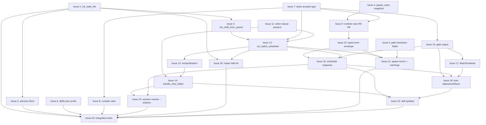

# PLAN: batch-child-spawning

## Status

Draft

## Scope Summary

Add declarative batch child spawning to koto: a parent template declares a
`materialize_children` hook, the agent submits a structured task list as
evidence, and koto owns DAG materialization, dependency-ordered scheduling,
completion detection, failure routing, retry, and observability end-to-end.

## Decomposition Strategy

Horizontal. The design partitions work into three sequential phases — atomic
init, schema layer, scheduler + observability — each with clear layer
boundaries. Phase 1 tightens persistence semantics independently of the
feature; Phase 2 unlocks template vocabulary without runtime behavior; Phase 3
wires up the scheduler, retry, and observability. Within each phase, adjacent
work that shares a test fixture or a type hierarchy is grouped into a single
issue. A walking-skeleton decomposition doesn't fit here because Phase 1 is a
correctness refactor rather than a minimal E2E slice.

## Issue Outlines

### Issue 1: refactor(session): add init_state_file atomic bundle

- **Type**: standard
- **Complexity**: testable
- **Goal**: Add `SessionBackend::init_state_file` as a single atomic method
  that writes header + initial events via tempfile + rename. Use
  `renameat2(RENAME_NOREPLACE)` on Linux with `link()` + `unlink()` fallback
  on other Unixes.
- **Section**: Phase 1 — Atomic init bundle
- **Dependencies**: None
- **Acceptance criteria**:
  - `SessionBackend::init_state_file` trait method exists with the signature
    from the design doc's Key Interfaces section.
  - Tempfile is created inside the target session directory so the rename is
    same-filesystem.
  - Linux path calls `renameat2(RENAME_NOREPLACE)` via `libc`; non-Linux Unix
    path uses `link()` + `unlink()` and falls back to the existing rename on
    EXDEV.
  - A crash between tempfile write and rename leaves no partial state file
    visible to a resuming process.
  - Concurrent first-writer-wins: two processes racing on the same path
    produce exactly one committed state file, the loser receives a distinct
    "already exists" error.
  - `koto init` and the existing `handle_init` path use the new method.
  - Unit tests cover the success path, the pre-existing-target path, and the
    tempfile-remnant path.

### Issue 2: feat(session): advisory flock on parent state file for batch parents

- **Type**: standard
- **Complexity**: testable
- **Goal**: Acquire a non-blocking advisory `flock` in `handle_next` for
  parents whose current state has `materialize_children` or whose log contains
  `SchedulerRan` / `BatchFinalized` events. Emit a typed `ConcurrentTick`
  error on contention.
- **Section**: Phase 1 — Concurrency hardening
- **Dependencies**: Issue 1
- **Acceptance criteria**:
  - `handle_next` acquires `flock(LOCK_EX | LOCK_NB)` on the parent state
    file before running the advance loop when the parent is batch-scoped.
  - Non-batch parents skip the lock so the happy path is unaffected.
  - Contention surfaces as `BatchError::ConcurrentTick { holder_pid:
    Option<u32> }` through the typed error envelope.
  - The lock releases on normal exit and on process death (kernel-level
    `flock` semantics).
  - Integration test covers two concurrent `handle_next` calls: one wins, one
    receives `ConcurrentTick`.

### Issue 3: refactor(cli): extract init_child_from_parent helper

- **Type**: standard
- **Complexity**: testable
- **Goal**: Extract `init_child_from_parent` from `handle_init` with a typed
  `Result` so the scheduler can surface per-task errors. Re-runs
  `resolve_variables` against the child template and compile-caches the
  result.
- **Section**: Phase 1
- **Dependencies**: Issue 1
- **Acceptance criteria**:
  - `init_child_from_parent` function exists with the signature from the
    design's Key Interfaces section.
  - Child state file is produced via `SessionBackend::init_state_file` (not
    a direct `write` + `rename`).
  - Template compile results are cached per-tick so repeated spawns within
    one scheduler run don't re-parse the same template.
  - Errors return `TaskSpawnError` with `kind: SpawnErrorKind` rather than
    stringly-typed `anyhow::Error`.
  - Existing `handle_init` retains its public signature; the helper is
    called internally.

### Issue 4: feat(engine): add spawn_entry snapshot to WorkflowInitialized event

- **Type**: standard
- **Complexity**: simple
- **Goal**: Optional `spawn_entry: Option<SpawnEntrySnapshot>` field on
  `WorkflowInitialized` captures the canonical-form task entry (template,
  vars, waits_on) at child creation. Additive with `#[serde(default,
  skip_serializing_if = "Option::is_none")]`.
- **Section**: Phase 1 — D2 amendment
- **Dependencies**: None
- **Acceptance criteria**:
  - `SpawnEntrySnapshot` struct lives next to `WorkflowInitialized`.
  - Field is serde-optional so existing state files parse unchanged.
  - `init_child_from_parent` populates the snapshot; top-level `koto init`
    leaves it `None`.
  - Round-trip unit test: deserialize a pre-feature `WorkflowInitialized`
    event, re-serialize, and verify no `spawn_entry` key appears.

### Issue 5: feat(engine): add template_source_dir and submitter_cwd path-resolution fields

- **Type**: standard
- **Complexity**: testable
- **Goal**: `StateFileHeader` gains `template_source_dir`.
  `EvidenceSubmitted` gains `submitter_cwd`. Resolution order: absolute →
  base → submitter_cwd. Emit `SchedulerWarning::MissingTemplateSourceDir` and
  `StaleTemplateSourceDir` on fallback.
- **Section**: Phase 2a — Path resolution infrastructure
- **Dependencies**: None
- **Acceptance criteria**:
  - `StateFileHeader.template_source_dir: Option<PathBuf>` captured at
    `handle_init` from the template file's parent directory.
  - `EvidenceSubmitted.submitter_cwd: Option<PathBuf>` captured at
    submission time from `std::env::current_dir()`.
  - Both fields are serde-optional and absent from older state files parse
    cleanly.
  - Path resolution helper iterates absolute → base → submitter_cwd and
    returns the first `Path::exists` hit.
  - `MissingTemplateSourceDir` emitted when the header value is `None`.
  - `StaleTemplateSourceDir { path, machine_id, falling_back_to }` emitted
    when the path is set but doesn't exist on the current machine.

### Issue 6: feat(cli): add @file.json prefix to --with-data

- **Type**: standard
- **Complexity**: simple
- **Goal**: `--with-data @file.json` reads the file as the evidence payload
  with a 1 MB cap. Missing file produces a clear error.
- **Section**: Phase 2a — Submission ergonomics
- **Dependencies**: None
- **Acceptance criteria**:
  - `@` prefix on `--with-data` triggers file read; non-prefixed value is
    parsed as inline JSON (unchanged).
  - File size is capped at 1 MB; over-limit produces a typed error naming
    the cap and actual size.
  - Missing file path surfaces a clear error naming the path.
  - Integration test covers both the happy-path read and the over-cap
    rejection.

### Issue 7: feat(template): tasks accepts type and materialize_children hook

- **Type**: standard
- **Complexity**: testable
- **Goal**: `VALID_FIELD_TYPES` gains `tasks`. `TemplateState` gains
  `materialize_children: Option<MaterializeChildrenSpec>`, `failure: bool`,
  `skipped_marker: bool`. Narrow `#[serde(deny_unknown_fields)]` on
  `SourceState`. Auto-generate `item_schema` on tasks-typed accepts fields.
- **Section**: Phase 2b — Template vocabulary
- **Dependencies**: None
- **Acceptance criteria**:
  - `tasks` appears in `VALID_FIELD_TYPES` and parses alongside existing
    accepts types.
  - `MaterializeChildrenSpec` and `FailurePolicy` structs match the design's
    Key Interfaces section field-for-field.
  - `TemplateState` new fields default to sensible zero values (`None`,
    `false`, `false`).
  - `deny_unknown_fields` narrowed to `SourceState` so adding new
    `CompiledTemplate` fields remains non-breaking.
  - Templates using tasks-typed accepts get an auto-generated `item_schema`
    matching the task-entry shape from the design.
  - Unit tests parse a minimal batch parent template with and without
    `materialize_children`.

### Issue 8: feat(template): compile rules E1-E10, W1-W5, F5

- **Type**: standard
- **Complexity**: testable
- **Goal**: Extend `CompiledTemplate::validate` with the full error / warning
  / check vocabulary from the design. Emit W4 on batch states routing only on
  `all_complete: true`. Emit W5 on `failure: true` states without a
  `failure_reason` writer. Emit F5 on batch-eligible child templates lacking
  a scheduler-reachable `skipped_marker: true` state.
- **Section**: Phase 2b — Compiler validation
- **Dependencies**: Issue 7
- **Acceptance criteria**:
  - All ten compile errors (E1-E10) from the design are emitted on malformed
    templates with correct `CompileError.kind` variants.
  - All five compile warnings (W1-W5) fire on the documented patterns
    without failing compilation.
  - F5 fires on child templates eligible for batch spawning that lack a
    reachable `skipped_marker: true` state.
  - Error messages include the offending state name and a one-line remedy.
  - Fixture-based tests cover one positive and one negative case per rule.

### Issue 9: feat(engine): runtime validation rules R0-R9 pre-append

- **Type**: standard
- **Complexity**: testable
- **Goal**: Pre-append pure-function validation for every batch submission.
  R0 (non-empty), R1-R7 (DAG properties), R8 (spawn-time immutability
  against `spawn_entry` snapshot), R9 (name regex, reserved names).
- **Section**: Phase 2b — Runtime validation
- **Dependencies**: Issue 4, Issue 7
- **Acceptance criteria**:
  - Pure `validate_batch_submission` function runs before any
    `EvidenceSubmitted` event is appended.
  - R0-R7 cover the DAG properties listed in the design (non-empty,
    unique names, known waits_on, no cycles, depth computed along longest
    root-to-leaf path).
  - R8 compares the submitted entry against the child's `spawn_entry`
    snapshot on retry-respawn and rejects mismatches unless the window is
    `Respawning` (vacuous).
  - R9 enforces name regex `^[A-Za-z0-9_-]+$`, length 1-64, and rejects
    reserved names `retry_failed` and `cancel_tasks`.
  - Hard limits enforced: 1000 tasks, 10 `waits_on` per task, depth 50.
    Each limit violation maps to `BatchError::LimitExceeded { which:
    LimitKind, limit, actual, task: Option<String> }`.
  - Unit tests cover each rule's positive and negative case.

### Issue 10: feat(cli): typed error envelope with action:"error" variant

- **Type**: standard
- **Complexity**: testable
- **Goal**: New `NextResponse::Error` variant emits `action: "error"`.
  `NextError` gains an optional sibling `batch: Option<BatchErrorContext>`.
  Typed enums replace stringly-typed fields throughout: `BatchError`,
  `InvalidBatchReason`, `LimitKind`, `SpawnErrorKind`, `InvalidRetryReason`,
  and a `CompileError` struct carrying `{kind, message, location}`.
- **Section**: Phase 2b / Phase 3 interface
- **Dependencies**: Issue 9
- **Acceptance criteria**:
  - `action: "error"` response variant exists and round-trips through serde.
  - All seven `InvalidBatchReason` variants deserialize to the canonical
    snake_case wire format.
  - `BatchError::TemplateCompileFailed.path` and `TaskSpawnError.path` both
    exist (parity fix).
  - Missing file lists omit `paths_tried` via `skip_serializing_if` rather
    than emitting `"paths_tried": null`.
  - JSON schema snapshot test pins the full error envelope shape.
  - **Round-3 polish**:
    - Rename `InvalidBatchReason::InvalidName.kind` inner field to
      `name_rule` to avoid collision with the outer envelope `kind`.
    - `CompileError.kind` and `ChildEligibility.current_outcome` use typed
      enums, not `String`.
    - `InvalidRetryReason` gains `UnknownChildren { children }`,
      `ChildIsBatchParent { children }`, and a `MultipleReasons` aggregate
      for cross-variant rejections with pinned precedence:
      UnknownChildren → ChildIsBatchParent → ChildNotEligible → Mixed →
      AlreadyInProgress.
    - Remove duplicate `InvalidBatchReason::LimitExceeded{Tasks,WaitsOn,
      Depth}` variants in favor of the single
      `BatchError::LimitExceeded { which, limit, actual, task }`.
    - `BatchError::ConcurrentTick { holder_pid: Option<u32> }` is typed.

### Issue 11: feat(engine): when-clause evidence.<field>: present matcher

- **Type**: standard
- **Complexity**: simple
- **Goal**: Extend the when-clause matcher vocabulary with
  `evidence.<field>: present` so templates can route on the presence of a
  reserved evidence key. Hard prerequisite for Phase 3's retry routing.
- **Section**: Phase 3 prerequisite
- **Dependencies**: None
- **Acceptance criteria**:
  - Parser accepts `present` as a matcher value alongside the existing
    value-equality vocabulary.
  - Evaluator returns true when the named evidence field appears in any
    event since the last state transition.
  - Compile warning fires on `present` used against a non-evidence path.
  - Unit test: a template routing on `evidence.retry_failed: present`
    transitions only when the field is submitted.

### Issue 12: feat(cli): add batch.rs with run_batch_scheduler and DAG classification

- **Type**: standard
- **Complexity**: critical
- **Goal**: New `src/cli/batch.rs` module. `run_batch_scheduler` is called
  from `handle_next` after `advance_until_stop`. Happy-path loop: parse
  evidence → build DAG → classify tasks → spawn ready tasks via
  `init_child_from_parent`. Classification is derived from disk state, no
  persistent cursor.
- **Section**: Phase 3 — Scheduler core
- **Dependencies**: Issue 3, Issue 7, Issue 11
- **Acceptance criteria**:
  - `src/cli/batch.rs` exists with `run_batch_scheduler`, `classify_task`,
    and `build_dag` public-to-crate functions.
  - Entry point is gated on the parent's current state having
    `materialize_children`.
  - Classification reads child state files directly; no auxiliary cursor
    file is written.
  - Happy-path loop produces `SchedulerOutcome` with `spawned_this_tick`
    populated.
  - Re-running the scheduler on a fully-spawned batch is a no-op.
  - Integration test covers a linear three-task batch from submission to
    all-spawned.

### Issue 13: feat(cli): runtime reclassification + ready_to_drive dispatch gate

- **Type**: standard
- **Complexity**: critical
- **Goal**: On every scheduler tick, re-classify children whose dependency
  outcomes changed. Stale skip markers (blocker no longer failed) are
  delete-and-respawned. Real-template running children whose upstream flipped
  to failure are delete-and-respawned as skip markers.
  `MaterializedChild.ready_to_drive: bool` gates worker dispatch.
  `EntryOutcome::Respawning` marks R8-vacuous windows.
- **Section**: Phase 3 — Scheduler safety
- **Dependencies**: Issue 12
- **Acceptance criteria**:
  - Each tick re-evaluates classification for every child; changed
    classifications trigger delete-and-respawn.
  - `ready_to_drive` is false while any `waits_on` entry is non-terminal and
    true only once all upstream entries are terminal.
  - Workers filter `materialized_children` by `ready_to_drive: true` AND
    `outcome != spawn_failed`.
  - Stale-skip respawn and upstream-flipped respawn each round-trip under
    integration tests.
  - R8 is vacuous during `EntryOutcome::Respawning` windows so the respawn
    can carry a new entry without tripping immutability.
  - **Round-3 polish**:
    - Per-child accumulation on partial failure inside the retry-loop step;
      the tick never halts mid-sweep.
    - `AlreadyTerminal` docstring covers failure states explicitly (or
      splits into `AlreadyTerminalSuccess` / `AlreadyTerminalFailure`).
    - `AlreadyRunning` is documented as "exists on disk, non-terminal",
      distinct from "actively being driven."
    - Emit a `scheduler.reclassified_this_tick` boolean signal when any
      child's classification changed this tick.

### Issue 14: feat(cli): handle_retry_failed with typed retry paths and reserved_actions

- **Type**: standard
- **Complexity**: critical
- **Goal**: CLI-layer interception of `retry_failed` before the advance loop.
  Validate the retry set atomically (all-or-nothing per R10). Append
  `EvidenceSubmitted{retry_failed}` and a clearing event to the parent, push
  parent first under cloud sync, then write child `Rewound` /
  delete-and-respawn (skip markers) / retry-respawn (spawn_failed) as needed.
  The next tick's advance loop fires the template-declared transition on
  `when: evidence.retry_failed: present`. Synthesize `reserved_actions`
  sibling field on responses whose gate reports `any_failed` or
  `any_skipped`, with ready-to-run invocation strings.
- **Section**: Phase 3 — Retry
- **Dependencies**: Issue 11, Issue 12, Issue 13
- **Acceptance criteria**:
  - `handle_retry_failed` intercepts before `advance_until_stop` and
    validates the full retry set atomically; any rejected child aborts the
    whole call without modifying disk state.
  - `Rewound` is written for failed real-template children;
    delete-and-respawn handles stale skip markers; retry-respawn handles
    `spawn_failed` children and re-invokes `init_state_file` with the
    CURRENT submission's entry.
  - Under `CloudBackend`, the parent state file is pushed before any child
    mutation.
  - `reserved_actions` sibling field appears on responses whose gate reports
    `any_failed` or `any_skipped`, populated with ready-to-run invocation
    strings.
  - Integration test covers the full retry cycle end to end.
  - **Round-3 polish**:
    - Response carries per-child `retry_action: rewind | respawn_skipped |
      respawn_failed` so agents know which path fired.
    - R10 accepts `spawn_failed` children for retry-respawn.
    - `reserved_actions[*].invocation` strings use shell-safe quoting for
      non-POSIX shells.
    - `InvalidRetryReason` rejection precedence matches Issue 10's pinned
      order: UnknownChildren → ChildIsBatchParent → ChildNotEligible →
      Mixed → AlreadyInProgress.

### Issue 15: feat(engine): extend children-complete gate output

- **Type**: standard
- **Complexity**: testable
- **Goal**: Extend `evaluate_children_complete` output with aggregates
  (`success`, `failed`, `skipped`, `blocked`, `spawn_failed`) and derived
  booleans (`all_success`, `any_failed`, `any_skipped`, `any_spawn_failed`,
  `needs_attention`). Tighten `all_complete` to require `spawn_failed == 0`.
  Per-child `outcome` enum gains a `spawn_failed` variant. New per-child
  fields: `failure_mode`, `skipped_because`, `blocked_by`,
  `skipped_because_chain`.
- **Section**: Phase 3 — Gate vocabulary
- **Dependencies**: Issue 7
- **Acceptance criteria**:
  - Aggregate counts and derived booleans match the design's gate-output
    schema field-for-field.
  - `all_complete` requires `spawn_failed == 0` in addition to prior
    conditions.
  - Per-child `outcome` enum round-trips the new `spawn_failed` variant
    through serde.
  - `skipped_because` is the direct blocker; `skipped_because_chain` lists
    all unique failed ancestors in topological order, closest-ancestor-first.
  - Snapshot test pins the extended output shape.
  - **Round-3 polish**:
    - `reason_source` vocabulary is documented exhaustively:
      `failure_reason`, `state_name`, `skipped`, `not_spawned`.

### Issue 16: feat(cli): scheduler response fields and SchedulerRan event

- **Type**: standard
- **Complexity**: testable
- **Goal**: `SchedulerOutcome` carries `spawned_this_tick` (renamed from
  `spawned`), a `materialized_children` ledger, `errored:
  Vec<TaskSpawnError>`, `warnings: Vec<SchedulerWarning>`, and
  `feedback: { entries: BTreeMap<String, EntryOutcome>, orphan_candidates:
  Vec<OrphanCandidate> }`. `SchedulerRan` event appends on non-trivial ticks
  (spawned / skipped / errored non-empty).
- **Section**: Phase 3 — Response shape
- **Dependencies**: Issue 10, Issue 12
- **Acceptance criteria**:
  - Field rename from `spawned` to `spawned_this_tick` is applied everywhere
    it appears in the CLI output.
  - `materialized_children` ledger carries one row per task, including
    skip-marker children.
  - `SchedulerRan` event appends only when the tick is non-trivial; pure
    no-op ticks leave the log unchanged.
  - Snapshot test pins `SchedulerOutcome` JSON layout.
  - **Round-3 polish**:
    - Design doc / release notes include a "canonical source per question"
      table distinguishing `materialized_children` vs gate `children` vs
      `feedback.entries`.
    - Terminal `done` responses use one consistent scheduler-key treatment
      (either drop `scheduler` entirely or emit `scheduler: null`) matching
      non-terminal responses.
    - `MaterializedChild` gains `role: Option<ChildRole>` (sticky
      `coordinator` once the first `SchedulerRan` appends) and
      `subbatch_status: Option<BatchSummary>` for nested batches.

### Issue 17: feat(cli): BatchFinalized event and batch_final_view preservation

- **Type**: standard
- **Complexity**: simple
- **Goal**: Append a `BatchFinalized` event when the `children-complete`
  gate first evaluates `all_complete: true` on a state with
  `materialize_children`. Terminal `done` responses populate
  `batch_final_view` from the most recent `BatchFinalized`. Retry that
  re-enters batch execution invalidates the view; the next finalization
  appends a new event; `koto status` always reads the most recent.
- **Section**: Phase 3 — Observability
- **Dependencies**: Issue 15
- **Acceptance criteria**:
  - `BatchFinalized` event type exists and round-trips through serde.
  - Event appends exactly once per finalization; retrying the batch appends
    a fresh event rather than mutating the old one.
  - `batch_final_view` populates on terminal `done` responses from the most
    recent `BatchFinalized`.
  - `koto status` consumers always read the most recent `BatchFinalized`.
  - Integration test: run a batch to completion, retry, finalize again, and
    confirm two `BatchFinalized` events in the log.
  - **Round-3 polish**:
    - `batch.phase: "active" | "final"` is sticky to `"final"` once
      `BatchFinalized` appends.
    - Stale `BatchFinalized` events carry an optional `superseded_by`
      marker to aid replay tools.

### Issue 18: feat(cli): koto status + koto workflows --children batch extensions

- **Type**: standard
- **Complexity**: testable
- **Goal**: `koto status <parent>` gains an optional `batch` section
  (summary, tasks, ready, blocked, skipped, failed) with `batch.phase`,
  `synthetic: true` on skip-marker children, `skipped_because_chain`, and
  `reason_source`. `koto workflows --children <parent>` gains per-row
  `task_name`, `waits_on`, `reason_code`, `reason`, and `skip_reason`. A
  shared `derive_batch_view` helper backs both commands.
- **Section**: Phase 3 — Observer tools
- **Dependencies**: Issue 15, Issue 17
- **Acceptance criteria**:
  - `koto status <parent>` JSON output includes the `batch` section when
    the parent is batch-scoped and omits it otherwise.
  - `synthetic: true` appears on children backed by skip markers.
  - `koto workflows --children <parent>` rows include the new columns for
    batch parents.
  - `derive_batch_view` is shared between the two commands so their outputs
    can't diverge.
  - Snapshot tests pin the output for an active batch and a completed
    batch.
  - **Round-3 polish**:
    - Post-terminal `koto status` drops the `ready / blocked / skipped /
      failed` name vectors, matching the documented terminal shape.

### Issue 19: feat(cli): koto session resolve --children reconciliation

- **Type**: standard
- **Complexity**: testable
- **Goal**: Extend `koto session resolve <parent>` with
  `--children={auto|skip|accept-remote|accept-local}`. Default `auto`
  reconciles children alongside the parent log using the strict-prefix rule
  for trivial diffs. `sync_status` and `machine_id` response fields emit
  under `CloudBackend` only. Push-parent-first ordering in
  `handle_retry_failed` under `CloudBackend`.
- **Section**: Phase 3 — Cloud sync
- **Dependencies**: Issue 14, Issue 16
- **Acceptance criteria**:
  - `--children` flag accepts the four documented values; default is
    `auto`.
  - `auto` uses the strict-prefix rule: accept-remote if remote is a
    prefix of local, accept-local if local is a prefix of remote, otherwise
    surface a conflict.
  - `sync_status` and `machine_id` fields appear only under `CloudBackend`.
  - Push-parent-first ordering is enforced in `handle_retry_failed` under
    `CloudBackend`.
  - Integration test covers the three non-conflict auto paths and the
    conflict path.

### Issue 20: feat(cli): repair_half_initialized_children with tempfile sweep

- **Type**: standard
- **Complexity**: simple
- **Goal**: Pre-pass in `run_batch_scheduler`. Detect half-initialized
  child state files (header but no events); delete or re-initialize. Sweep
  stale `.koto-*.tmp` files scoped to the current parent, 60-second
  threshold.
- **Section**: Phase 3 — Crash recovery
- **Dependencies**: Issue 1, Issue 12
- **Acceptance criteria**:
  - `repair_half_initialized_children` runs before classification in each
    scheduler tick.
  - Child state files with a header but no events are either deleted
    (reclassified as `spawn_failed`) or re-initialized, matching the
    design's specified policy.
  - Tempfile sweep scopes to the current parent's directory and only
    removes `.koto-*.tmp` files older than 60 seconds.
  - Unit tests cover the half-init detection and the tempfile sweep with
    both under-threshold and over-threshold files.

### Issue 21: feat(cli): per-task spawn errors and SchedulerWarning variants

- **Type**: standard
- **Complexity**: testable
- **Goal**: Per-task spawn errors accumulate in `SchedulerOutcome.errored`
  without halting the tick. Split `BatchError::TemplateResolveFailed` into
  `TemplateNotFound { paths_tried }` and `TemplateCompileFailed { path,
  compile_error: CompileError }`. Add `SchedulerWarning::MissingTemplateSourceDir`
  and `StaleTemplateSourceDir { path, machine_id, falling_back_to }`.
  `paths_tried` is canonicalized (no `..` segments echoed). `Path::exists`
  probes once per tick on `template_source_dir`.
- **Section**: Phase 3 — Path-resolution error surface
- **Dependencies**: Issue 5, Issue 10, Issue 12
- **Acceptance criteria**:
  - A single task's spawn failure does not halt the tick; other ready
    tasks still spawn.
  - `TemplateNotFound` and `TemplateCompileFailed` are distinct variants
    with the documented field sets.
  - `paths_tried` contains canonicalized absolute paths only.
  - `template_source_dir` existence is probed once per tick, not per task.
  - Integration test with three ready tasks where one template is missing
    confirms the other two spawn successfully and the third appears in
    `errored`.
  - **Round-3 polish**:
    - `TaskSpawnError.template_source: Option<TemplateSource>`
      distinguishes per-task override from inherited default_template.
    - Pre-D4 stale-dir warnings are documented as a known v1 limitation;
      `koto session rehome` deferred to v1.1.

### Issue 22: docs(skills): update koto-author and koto-user skills for batch

- **Type**: standard
- **Complexity**: simple
- **Goal**: Update `plugins/koto-skills/skills/koto-author` to cover
  `materialize_children` authoring, the `failure_reason` convention paired
  with W5, the F5 compile rule, `coord.md` + `impl-issue.md` reference
  patterns, and two-hat coordinator prose. Update
  `plugins/koto-skills/skills/koto-user` to cover `materialized_children`
  as the dispatch ledger (filter `ready_to_drive: true AND outcome !=
  spawn_failed`), `reserved_actions` as the retry discovery surface,
  `retry_failed` mechanics, the coordinator-drives-parent /
  workers-drive-children partition, `sync_status` interpretation,
  `synthetic: true` marker, and the caveat that delete-and-respawn of
  in-flight children silently drops uncommitted work. Rewrite
  `walkthrough.md` against the revised design. Run evals.
- **Section**: Phase 3 — Skill documentation
- **Dependencies**: Issue 14, Issue 16, Issue 18
- **Acceptance criteria**:
  - `koto-author` SKILL.md covers `materialize_children` authoring and
    references `coord.md` + `impl-issue.md` templates.
  - `koto-user` SKILL.md documents the dispatch-ledger filter
    (`ready_to_drive: true AND outcome != spawn_failed`) and
    `reserved_actions` as the retry-discovery surface.
  - `koto-user` SKILL.md notes that delete-and-respawn of an in-flight
    child silently drops uncommitted work.
  - `walkthrough.md` replays the current design's scheduler output shape
    without references to superseded field names.
  - Eval results (with-skill / without-skill deltas) are attached to the
    PR description.
  - **Round-3 polish**:
    - Document the v1 limitation: `spawn_failed` children can't be
      repaired through task-list correction; agents must `decision:
      give_up` or restart. `update_tasks` primitive is deferred to v1.1.

### Issue 23: test: integration tests for batch scenarios

- **Type**: standard
- **Complexity**: testable
- **Goal**: Integration tests in `test/` covering the documented end-to-end
  scenarios: linear batch, diamond DAG, mid-flight append, failure with
  skip-dependents, `retry_failed` recovery (including `reserved_actions`
  discovery), crash-resume (half-initialized children, tempfile remnants),
  limit-exceeded rejection, concurrent-tick flock contention, cloud-sync
  push-parent-first retry ordering, runtime reclassification sweep,
  `spawn_failed` per-task accumulation, and nested-batch parent with retry
  rejection via `ChildIsBatchParent`.
- **Section**: Phase 3 — Verification
- **Dependencies**: All prior issues
- **Acceptance criteria**:
  - Gherkin scenarios land in `test/` covering each bullet above.
  - Each scenario asserts both the response-shape snapshot and the
    on-disk state-file tail.
  - Concurrent-tick scenario spawns two processes and confirms exactly
    one wins, the other receives `ConcurrentTick`.
  - Cloud-sync scenario verifies parent push completes before any child
    mutation is visible to a remote reader.
  - Nested-batch scenario rejects a `retry_failed` that names a
    batch-parent child with `InvalidRetryReason::ChildIsBatchParent`.
  - All scenarios pass in CI without flakes across three consecutive
    runs.

## Dependency Graph

## Implementation Sequence

**Critical path** (12 hops): Issue 1 → 3 → 12 → 13 → 14 → 19 → 22 → 23,
with Issue 7 → 9 → 10 → 16 → 18 running alongside and joining the path at
Issue 22. The longest single chain through the graph is Issue 7 → 9 → 10 →
16 → 18 → 22 → 23 (seven hops); the Issue 1 → 3 → 12 → 13 → 14 chain adds
a parallel six-hop path. Overall critical-path length is seven issues
before the final test issue.

**Wave 1 — foundations (parallel)**:

- Issue 1: `init_state_file` (unlocks 2, 3, 20, 23).
- Issue 4: `spawn_entry` snapshot.
- Issue 5: path-resolution fields.
- Issue 6: `@file.json` prefix.
- Issue 7: `tasks` accepts type + `materialize_children` hook.
- Issue 11: when-clause `present` matcher.

These six issues have no cross-dependencies and can land in any order.

**Wave 2 — build on Wave 1**:

- Issue 2: advisory flock (needs Issue 1).
- Issue 3: `init_child_from_parent` helper (needs Issue 1).
- Issue 8: compile rules (needs Issue 7).
- Issue 9: runtime rules R0-R9 (needs Issues 4 + 7).
- Issue 15: children-complete gate output (needs Issue 7).

Wave 2 is fully parallelizable within itself.

**Wave 3 — interface consolidation**:

- Issue 10: typed error envelope (needs Issue 9).

Issue 10 is a single-issue wave because every downstream response-shape
consumer imports its typed enums.

**Wave 4 — scheduler core**:

- Issue 12: `run_batch_scheduler` (needs Issues 3, 7, 11).

Another single-issue wave — Issue 12 is the scheduler bottleneck that
gates all subsequent runtime behavior.

**Wave 5 — scheduler runtime (parallel after Issue 12)**:

- Issue 13: reclassification + `ready_to_drive` (needs Issue 12).
- Issue 16: scheduler response fields + `SchedulerRan` (needs Issues 10,
  12).
- Issue 17: `BatchFinalized` (needs Issue 15).
- Issue 20: repair half-init (needs Issues 1, 12).
- Issue 21: per-task spawn errors + warnings (needs Issues 5, 10, 12).

**Wave 6 — retry + observer surfaces**:

- Issue 14: `handle_retry_failed` (needs Issues 11, 12, 13).
- Issue 18: `koto status` + `koto workflows --children` (needs Issues 15,
  17).

**Wave 7 — integration polish**:

- Issue 19: `koto session resolve --children` (needs Issues 14, 16).
- Issue 22: skill updates (needs Issues 14, 16, 18).

**Wave 8 — verification**:

- Issue 23: integration tests (needs all prior).

The single-pr execution mode merges all 23 issues as one reviewable unit
against `main`; the waves above represent the internal ordering an
implementer (or paired implementers) should follow while building the
branch, not separate PRs.
