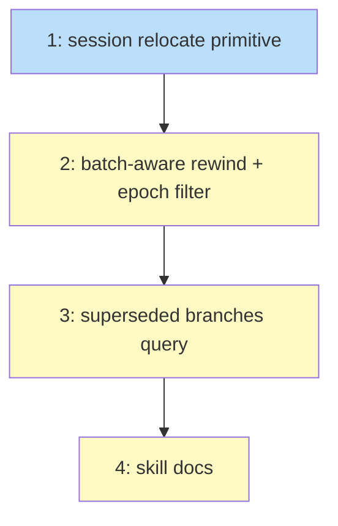

# PLAN: Batch-Aware Rewind

## Status

Draft

## Scope Summary

Implement the branching model for batch rewind: `SessionBackend::relocate` primitive, batch-aware `handle_rewind` that relocates children to `parent~N.*`, epoch filter for stale `ChildCompleted` events, and a query surface (`superseded_branches` on status) so agents can inspect prior attempts.

## Decomposition Strategy

**Horizontal.** The design identifies three layers with clear stable interfaces: a session-backend primitive (`relocate`), a CLI handler extension (`handle_rewind`), and a query surface (`handle_status`). The relocate primitive is a prerequisite for the rewind handler, and the epoch filter must ship with the rewind handler (the design explicitly calls out that shipping one without the other creates a correctness gap). The query surface depends on the rewind handler producing `parent~N` branches.

## Issue Outlines

### 1. feat(session): add relocate primitive to SessionBackend

**Goal:** Add `relocate(from, to)` to the `SessionBackend` trait with implementations for `LocalBackend` and `CloudBackend`. This is the low-level building block that renames a session directory and updates the state file header's `parent_workflow` field.

**Acceptance criteria:**
- [ ] `SessionBackend` trait gains `fn relocate(&self, from: &str, to: &str) -> anyhow::Result<()>`
- [ ] `LocalBackend::relocate` renames the session directory via `fs::rename` and rewrites the state file header with the updated `parent_workflow`
- [ ] `CloudBackend::relocate` does local rename, then S3 copy-then-delete (list objects under old prefix, copy each to new prefix, delete old objects). Best-effort on S3 errors (local rename is authoritative).
- [ ] Relocate rejects if `from` doesn't exist (returns error)
- [ ] Relocate rejects if `to` already exists (returns error, prevents collision)
- [ ] State file header's `parent_workflow` field updated to reflect new parent
- [ ] Unit tests: successful relocate, collision rejection, missing source, header update verified

**Dependencies:** None

**Complexity:** testable

**Design sections:** Solution Architecture > Components > `SessionBackend::relocate`, Key Interfaces

### 2. feat(engine): batch-aware rewind with epoch filter

**Goal:** Extend `handle_rewind` to detect `materialize_children` on the rewound-from state and relocate all children to `parent~N.*`. Simultaneously add the `last_rewind_seq` epoch filter to both `ChildCompleted` consumers, closing the race where a child completes between the Rewound event and the relocate loop. These must ship together per the design's correctness requirement.

**Acceptance criteria:**
- [ ] `handle_rewind` loads compiled template via `derive_machine_state`, checks if `from` state has `materialize_children` hook
- [ ] If hook present: computes epoch N from count of `Rewound` events, lists children by `parent_workflow`, calls `backend.relocate(child, parent~N.task)` for each
- [ ] `~` character reserved in session name validation (reject user-created names containing `~`)
- [ ] Rewind response includes `superseded_branch: Option<String>` and `children_relocated: usize`
- [ ] `last_rewind_seq(events) -> Option<u64>` helper added to `src/cli/batch.rs`
- [ ] `augment_snapshots_with_child_completed` skips `ChildCompleted` events with seq <= boundary
- [ ] Parallel epoch filter in `build_children_complete_output` applies the same rule
- [ ] Non-batch rewind is unchanged (no hook detected, no children relocated)
- [ ] Integration test: rewind past batch state, verify children relocated to `parent~N.*`, verify `koto init parent.task` succeeds (name freed), verify `koto status parent~N.task` still works
- [ ] Integration test: epoch filter — child completes after rewind, stale `ChildCompleted` ignored by gate on next tick
- [ ] Integration test: non-batch rewind unchanged

**Dependencies:** Issue 1

**Complexity:** critical

**Design sections:** Solution Architecture > Components > `handle_rewind` extension + Epoch filter, Decision Outcome steps 1-6, Data Flow

### 3. feat(cli): superseded branches query surface

**Goal:** Add `superseded_branches` to `koto status` for batch parents so agents can discover prior attempts. `koto workflows --children parent~N` already works because relocated children have `parent_workflow == parent~N` — this issue adds the discovery mechanism.

**Acceptance criteria:**
- [ ] `handle_status` for a batch parent includes `superseded_branches: Vec<String>` derived from the parent's `Rewound` events (each Rewound event that crossed a `materialize_children` state produces a branch name `parent~N`)
- [ ] Field is omitted (or empty array) when no batch rewinds have occurred
- [ ] `koto workflows --children parent~N` correctly lists relocated children (verify existing filtering by `parent_workflow` handles this without code changes)
- [ ] Integration test: rewind, then `koto status parent` shows the superseded branch, `koto workflows --children parent~N` lists the relocated children

**Dependencies:** Issue 2

**Complexity:** testable

**Design sections:** Solution Architecture > Components > Query surface, Key Interfaces > Response additions

### 4. docs(skill): document batch rewind and branch model

**Goal:** Update koto-user skill docs so agents discover the rewind recovery path and the branch model for batch workflows. Update the command reference for the new response fields.

**Acceptance criteria:**
- [ ] `plugins/koto-skills/skills/koto-user/references/command-reference.md`: document `koto rewind` response additions (`superseded_branch`, `children_relocated`) and `koto status` additions (`superseded_branches`)
- [ ] `plugins/koto-skills/skills/koto-user/references/batch-workflows.md`: add section on rewind as a recovery path for bad task submissions, explain the `parent~N` branch convention, show query examples
- [ ] No references to private repos or internal tooling

**Dependencies:** Issue 3

**Complexity:** simple

**Design sections:** Implementation Approach > Phase 3

## Implementation Issues

_(omitted in single-pr mode — see Issue Outlines above)_

## Dependency Graph

**Legend**: Green = done, Blue = ready, Yellow = blocked

## Implementation Sequence

**Critical path:** 1 → 2 → 3 → 4 (fully sequential, 4 steps)

**Recommended order:**

1. **Issue 1** — `SessionBackend::relocate` primitive. Foundation; everything else depends on it.
2. **Issue 2** — batch-aware rewind + epoch filter. The core fix. Ships as a single commit per design requirement.
3. **Issue 3** — `superseded_branches` query surface. Small addition to `handle_status`.
4. **Issue 4** — skill docs. Last because it documents the final behavior.

**Parallelization:** None. Each issue depends on the previous. The chain is short (4 issues) and each is focused enough for a single session.
