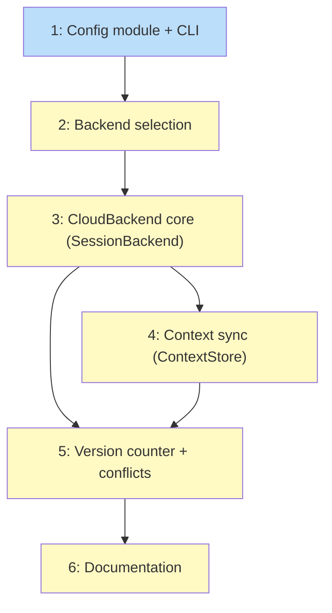

# PLAN: Config system and cloud sync

## Status

Draft

## Scope Summary

Implement koto's config system (`koto config get/set/unset/list` with TOML at user
and project levels) and CloudBackend for S3-compatible cloud sync. After this ships,
users can `koto config set session.backend cloud` to enable invisible sync of sessions
and context across machines.

## Decomposition Strategy

**Horizontal.** The design defines four sequential layers: config module, backend
selection, CloudBackend implementation, and documentation. Each layer has clear
interfaces and is a prerequisite for the next. Config must exist before backend
selection can read it. Backend selection must work before CloudBackend can be
constructed. CloudBackend core must exist before context sync and conflict detection
can be layered on.

## Issue Outlines

### 1. feat(config): add config module with TOML loading and CLI

**Complexity:** testable

**Goal:** Create the config infrastructure: `KotoConfig` struct, TOML loading from
user and project files, precedence merge, credential allowlist enforcement, and
`koto config get/set/unset/list` CLI commands.

**Acceptance Criteria:**
- [ ] `src/config/mod.rs` defines `KotoConfig`, `SessionConfig`, `CloudConfig` structs with serde derive
- [ ] `src/config/resolve.rs` implements `load_config()`: load defaults, overlay user (`~/.koto/config.toml`), overlay project (`.koto/config.toml`), override credentials from env vars
- [ ] `src/config/validate.rs` implements project config allowlist: only `endpoint`, `bucket`, `region`, `backend` allowed; credential keys rejected with error message
- [ ] `koto config get <key>` prints raw value to stdout, exits 1 if unset
- [ ] `koto config set <key> <value>` writes to user config; `--project` writes to project config
- [ ] `koto config unset <key>` removes key; `--project` targets project config
- [ ] `koto config list` dumps resolved config as TOML; `--json` for JSON output
- [ ] `koto config list` redacts credential values (`<set>` instead of raw value)
- [ ] Config module ensures `~/.koto/` has 0700 permissions independently of LocalBackend
- [ ] `toml` crate added to Cargo.toml
- [ ] Unit tests: loading, merge precedence, allowlist enforcement, env var override, redaction
- [ ] Integration tests: get/set/unset/list round-trips

**Dependencies:** None

---

### 2. feat(cli): wire config into backend selection

**Complexity:** testable

**Goal:** Update `build_backend()` in `src/cli/mod.rs` to read `session.backend`
from resolved config and construct the appropriate backend. When backend is "cloud"
without the feature flag, return a helpful error.

**Acceptance Criteria:**
- [ ] `build_backend()` calls `load_config()` and reads `session.backend`
- [ ] `session.backend = "local"` constructs `LocalBackend` (same as today)
- [ ] `session.backend = "cloud"` with `cloud` feature constructs `CloudBackend`
- [ ] `session.backend = "cloud"` without `cloud` feature returns error: "cloud backend requires the 'cloud' feature"
- [ ] Unknown backend values produce a clear error
- [ ] Default value is "local" when no config exists
- [ ] Integration tests: backend selection with local, cloud (feature-gated), unknown

**Dependencies:** Issue 1

---

### 3. feat(session): add CloudBackend wrapping LocalBackend with rust-s3

**Complexity:** testable

**Goal:** Implement `CloudBackend` that wraps `LocalBackend` and syncs session
lifecycle operations (create, exists, cleanup, list) to S3. Implement basic push/pull
for the `SessionBackend` trait. Add `rust-s3` behind `cloud` cargo feature flag.

**Acceptance Criteria:**
- [ ] `src/session/cloud.rs` defines `CloudBackend` with `local: LocalBackend`, `bucket: s3::Bucket`, `prefix: String`
- [ ] `CloudBackend::new(working_dir, cloud_config)` constructs from config
- [ ] `CloudBackend` implements `SessionBackend`: delegates to `self.local`, then syncs
- [ ] `create()` creates locally then uploads state file to S3
- [ ] `cleanup()` cleans locally then deletes S3 prefix
- [ ] `list()` merges local and S3 session lists
- [ ] `exists()` checks local first, falls back to S3
- [ ] S3 failures are non-fatal: log warning to stderr, local operation succeeds
- [ ] `Cargo.toml` adds `rust-s3` as optional dependency behind `cloud` feature flag
- [ ] `src/session/cloud.rs` gated with `#[cfg(feature = "cloud")]`
- [ ] Unit tests with mocked S3 or test helper

**Dependencies:** Issues 1, 2

---

### 4. feat(session): add per-key context sync to CloudBackend

**Complexity:** testable

**Goal:** Implement `ContextStore` for `CloudBackend` with per-key incremental sync.
`context add` uploads the changed key + manifest. `context get` downloads if remote
is newer. Uses manifest hash diffing for incremental transfers.

**Acceptance Criteria:**
- [ ] `CloudBackend` implements `ContextStore`: delegates to `self.local`, then syncs the changed key
- [ ] `add()` writes locally then PUTs content file + manifest to S3
- [ ] `get()` checks remote manifest hash, downloads key if remote hash differs, then reads locally
- [ ] `ctx_exists()` checks local, falls back to remote manifest
- [ ] `list_keys()` merges local and remote manifests
- [ ] `remove()` removes locally then DELETEs from S3
- [ ] Per-key sync: only the changed key + manifest are transferred (not full session)
- [ ] Manifest TTL cache (~5 seconds) reduces redundant remote manifest GETs during rapid calls
- [ ] `src/session/sync.rs` with push/pull helper functions
- [ ] S3 failures non-fatal for all operations
- [ ] Tests: add/get with sync, incremental transfer verification, failure resilience

**Dependencies:** Issue 3

---

### 5. feat(session): add version counter and conflict detection

**Complexity:** critical

**Goal:** Implement `version.json` for session versioning, three-way conflict
detection, and `koto session resolve --keep local|remote`.

**Acceptance Criteria:**
- [ ] `src/session/version.rs` defines `SessionVersion` struct: version, last_sync_base, machine_id
- [ ] `version.json` created in session directory on first sync, uploaded to S3
- [ ] Every sync increments the local version counter
- [ ] Sync checks remote version before proceeding: remote == last_sync_base (safe), remote > last_sync_base with local == last_sync_base (download first), both advanced (conflict error)
- [ ] Conflict error message includes local version, remote version, machine IDs
- [ ] `koto session resolve --keep local` force-uploads local session, sets version to max + 1
- [ ] `koto session resolve --keep remote` downloads remote session, sets version to max + 1
- [ ] `last_sync_base` updated only after successful sync
- [ ] Machine ID generated once per machine (UUID or hostname hash), stored in user config
- [ ] Tests: version increment, conflict detection, resolution (keep local, keep remote), normal sync flow

**Dependencies:** Issues 3, 4

---

### 6. docs: document config system and cloud sync

**Complexity:** simple

**Goal:** Update CLI usage docs with `koto config` commands, add cloud setup guide,
update README with cloud sync capability.

**Acceptance Criteria:**
- [ ] `docs/guides/cli-usage.md` has `config` subcommand section (get/set/unset/list)
- [ ] `docs/guides/cli-usage.md` documents cloud setup: endpoint, bucket, credentials
- [ ] `docs/guides/cli-usage.md` documents `koto session resolve`
- [ ] `README.md` mentions cloud sync in Key concepts
- [ ] Example config snippets for local and cloud backends

**Dependencies:** Issue 5

## Implementation Issues

_Not populated in single-pr mode._

## Dependency Graph

**Legend**: Blue = ready, Yellow = blocked

## Implementation Sequence

**Critical path:** 1 -> 2 -> 3 -> 4 -> 5 -> 6

| Order | Issue | Blocked By | Parallelizable With |
|-------|-------|------------|---------------------|
| 1 | 1: Config module + CLI | -- | -- |
| 2 | 2: Backend selection | 1 | -- |
| 3 | 3: CloudBackend core | 2 | -- |
| 4 | 4: Context sync | 3 | -- |
| 5 | 5: Version counter + conflicts | 3, 4 | -- |
| 6 | 6: Documentation | 5 | -- |
