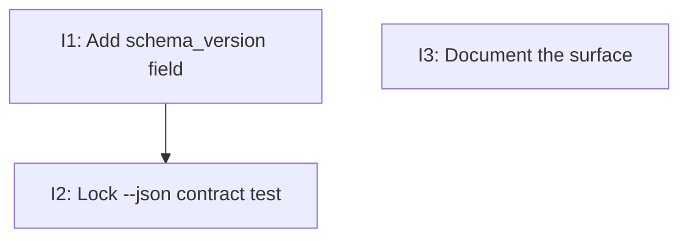

# PLAN: A version-compatibility surface for koto

## Status

Draft

Single-PR plan implementing DESIGN-config-version-compat. Three small,
ordered steps on one branch, shipped as one pull request.

## Scope Summary

Surface koto's existing contract-compatibility version at the boundary:
add `schema_version` (= `CURRENT_SCHEMA_VERSION`) to the `BuildInfo`
struct so `koto version --json` emits it, and document in `STABILITY.md`
that this field is koto's compatibility surface. No new version scheme,
command, file, or config key; the text `koto version` output and the
existing json fields are untouched.

## Decomposition Strategy

One PR, three steps: add the field (with a unit test), lock the
`koto version --json` contract with a test, and document the surface.
The first two are code; the third is docs and is independent. The PR is
green only when `cargo test`, `cargo clippy -- -D warnings`, and
`cargo fmt --check` all pass.

## Implementation Issues

Single-PR mode: no GitHub milestone or issues are created; the items
below are the in-PR steps (internal IDs I1-I3) on one branch.

### I1 -- Add the schema_version field to BuildInfo

**Files:** `src/buildinfo.rs`.
**Goal:** Add `schema_version: u32` to `BuildInfo` (last field, so the
serialized json object gains a key without reordering the others), and
populate it from `engine::types::CURRENT_SCHEMA_VERSION` in
`build_info()`. `BuildInfo` already derives `Serialize`, so no
serialization change is needed.
**Acceptance:**
- [ ] `build_info().schema_version == CURRENT_SCHEMA_VERSION` (unit test).
- [ ] `cargo test` passes.

### I2 -- Lock the `koto version --json` contract

**Files:** a CLI/integration test (alongside the existing version-command
tests).
**Goal:** Assert that `koto version --json` output parses as JSON, still
carries `version` / `commit` / `built_at`, and now carries
`schema_version` equal to `CURRENT_SCHEMA_VERSION`; and that the plain
`koto version` text output is unchanged (same `koto <version> (<commit>
<built_at>)` shape, no new field).
**Acceptance:**
- [ ] Test confirms the four json fields (existing three plus
      `schema_version`) and the unchanged text output.
- [ ] `cargo test` passes.
**Depends on:** I1.

### I3 -- Document the compatibility surface

**Files:** `docs/STABILITY.md`, and a one-line pointer where
`CURRENT_SCHEMA_VERSION` is defined (`src/engine/types.rs`).
**Goal:** Add a short "Compatibility version surface" section to
`STABILITY.md`: name `koto version --json`'s `schema_version` as the
value a consumer pins against, state what holds while it is unchanged
and what a bump signals, and cross-reference the existing
`CURRENT_SCHEMA_VERSION` bump protocol so the value and its publication
are never maintained separately. Add a comment near the constant noting
that it is published through `koto version --json`.
**Acceptance:**
- [ ] `STABILITY.md` documents the surface and what pinning to it
      promises; the constant carries a pointer to its publication.

## Dependency Graph

I3 is independent and may land at any point.

## Implementation Sequence

1. **I1** (add the field) -- foundation.
2. **I2** (lock the json contract) -- builds on I1.
3. **I3** (docs) -- independent; land alongside.

Definition of done: all acceptance boxes checked; `cargo test`,
`cargo clippy -- -D warnings`, and `cargo fmt --check` clean; and
`koto version --json` shows `schema_version` while `koto version` text
output is unchanged.
