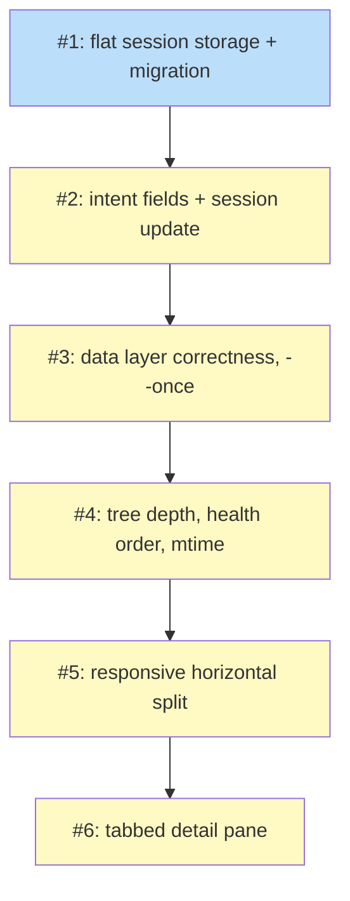

## Status

Draft

## Scope Summary

Fix five broken dashboard behaviors and add three new capabilities — global session scope, tabbed detail pane, and session identity fields — through four coordinated phases touching session storage, event schema, data layer, tree rendering, layout, and the detail pane renderer.

## Decomposition Strategy

**Horizontal decomposition.** The design defines four phases with clear interface boundaries: storage primitives, data layer correctness, state and tree machinery, and renderer. This is repair-and-enhancement work on existing code; each lower layer must be correct before the layer above it can function. No thin vertical slice exists because the broken behaviors span the full stack in a strict bottom-up dependency order.

## Issue Outlines

### Issue 1: feat(session): flat local session storage with startup migration

**Goal**

Remove repo-id hashing from `LocalBackend` so session files are stored directly under `~/.koto/sessions/`, and run a one-time migration on startup to move sessions from the old hashed layout.

**Acceptance Criteria**

- `LocalBackend::new()` no longer computes a `repo_id`; `base_dir` is set to `~/.koto/sessions/` unconditionally
- `build_local_backend()` in `src/cli/mod.rs` no longer passes `cwd` (or any working-directory argument) for the purpose of local backend path derivation
- `migrate_if_needed(base: &Path)` is called during `LocalBackend` construction and detects subdirectories whose names are exactly 16 lowercase hex characters
- For each detected old-layout subdirectory, all session directories it contains are moved up one level to `base_dir`
- When a session name from the old layout already exists at `base_dir`, the conflicting session is left in place and a warning is printed to stderr naming the specific collision
- `KOTO_SESSIONS_BASE` environment variable still overrides the base directory and provides test isolation without any repo-id involvement
- All existing integration tests pass (`koto init`, `koto next`, `koto session list`, etc.)
- Unit test: `migrate_if_needed` with no old-layout subdirectories present is a no-op and does not produce stderr output
- Unit test: `migrate_if_needed` with a valid old-layout directory moves all session subdirectories up one level and prints a summary to stderr
- Unit test: `migrate_if_needed` with a collision leaves the conflicting session in place and prints a warning to stderr identifying it

**Dependencies**

None

---

### Issue 2: feat(session): intent and template_name fields with koto session update --intent

**Goal**

Add `intent` and `template_name` identity fields to `StateFileHeader`, introduce the `IntentUpdated` event type for concurrent-safe mid-workflow intent updates, and expose a `koto session update <name> --intent "<text>"` subcommand that appends the event to the session log.

**Acceptance Criteria**

- `StateFileHeader` gains `intent: Option<String>` and `template_name: Option<String>`, both annotated with `#[serde(default, skip_serializing_if = "Option::is_none")]`
- Existing state files that lack `intent` and `template_name` deserialize without error; both fields default to `None`
- `koto init --intent "<text>"` sets the `intent` field in the written `StateFileHeader`; `template_name` is populated from the resolved template name at init time
- `EventPayload` gains `IntentUpdated { intent: String }` with `#[serde(rename = "intent_updated")]`
- `derive_intent(events: &[Event]) -> Option<String>` is added (in `src/event/mod.rs` or `src/persistence.rs`); it returns the `intent` value from the last `IntentUpdated` event in the slice, or `None` if no such event exists
- The engine advance loop recognizes `IntentUpdated` as a known no-op and does not emit an `Unknown` log warning when it encounters the variant
- `koto session update <name> --intent "<text>"` is available as a CLI subcommand; it appends an `IntentUpdated` event to the named session's JSONL log via `backend.append_event` using the `O_APPEND` path
- Intent strings longer than 1024 characters are rejected before the append with a clear error message; the session log is not modified
- `koto session update` on a session name that does not exist returns a clear error message and exits with a non-zero status
- Unit test: `derive_intent` called with a slice containing no `IntentUpdated` events returns `None`
- Unit test: `derive_intent` called with multiple `IntentUpdated` events returns the `intent` value from the last one
- Unit test: `derive_intent` fallback — when no `IntentUpdated` event exists, callers fall back to `StateFileHeader.intent` (test documents the expected caller pattern, not `derive_intent` itself)
- Unit test: intent round-trip — `koto init --intent "some text"` followed by `koto query` returns the same intent string in the header
- Unit test: `koto session update --intent` followed by `derive_intent` on the resulting event log returns the updated intent string

**Dependencies**

Depends on Issue 1 (flat session storage). `handle_update` accesses `~/.koto/sessions/<session-name>/` directly; the repo-id subdirectory layer must be absent.

---

### Issue 3: fix(dashboard): data layer correctness and six-column --once output

**Goal**

Fix four data-layer correctness bugs — hardcoded elapsed, gate guard blocking evidence-only sessions, missing `TaskCounts` fields, and absent `CachedSession.intent` — and extend `--once` output from 4 to 6 tab-separated columns.

**Acceptance Criteria**

- `read_detail()` in `src/cli/dashboard_data.rs` removes the early-return gate guard and always returns a populated `SessionDetail` regardless of whether the session has any `GateEvaluated` events
- Elapsed time in `visible_rows()` is computed from the `StateInitialized` event timestamp using `compute_elapsed_since()`, not hardcoded to `Duration::from_secs(0)`
- Elapsed time in `--once` mode is computed from the `StateInitialized` event timestamp using `compute_elapsed_since()`, not from `session.mtime.elapsed()`
- `TaskCounts` in `src/cli/dashboard_state.rs` has two new fields: `blocked: u32` and `done_blocked: u32`
- `CachedSession` in `src/cli/dashboard_data.rs` has a new field `intent: Option<String>`
- `refresh()` calls `derive_intent(events)` for each session whose mtime changed and writes the result to `CachedSession.intent`
- `--once` output has exactly 6 tab-separated columns per line: `<session_id>\t<status>\t<state>\t<elapsed>\t<intent>\t<template_name>`
- Columns 5 and 6 of `--once` output are empty strings when `intent` or `template_name` are absent
- Existing 4-column parsing of `--once` output is unaffected: column order and format of columns 1–4 are unchanged
- Unit test: `read_detail()` on a session with only `EvidenceSubmitted` events (no `GateEvaluated`) returns a populated `SessionDetail`, not `None`
- Unit test: elapsed computed from a `StateInitialized` event timestamp matches the expected duration (against a fixed timestamp and a known wall-clock delta)
- Unit test: `--once` output for a session with intent and template_name set has exactly 6 tab-separated fields; columns 5 and 6 contain the expected values
- Unit test: `--once` output for a session with no intent and no template_name has exactly 6 tab-separated fields; columns 5 and 6 are empty strings
- Unit test: `CachedSession.intent` is populated after `refresh()` runs on a session whose event log contains an `IntentUpdated` event appended by Issue 2's `derive_intent()` path

**Dependencies**

Depends on Issue 2 (intent event and `derive_intent()`).

---

### Issue 4: feat(dashboard): arbitrary-depth tree, health ordering, and mtime-guarded detail load

**Goal**

Extend `visible_rows()` to traverse the session tree to arbitrary depth with `├─`/`└─` connectors, replace alphabetical session ordering with health-severity ordering, and wire an mtime-guarded conditional detail load in the tick handler.

**Acceptance Criteria**

- `visible_rows()` traverses the session tree to arbitrary depth; rendering is not capped at depth 1
- `VisibleRow` gains a `connector: String` field populated by `visible_rows()`
- The connector for a non-last child at any depth is `├─ `; the connector for the last child is `└─ `; connectors for deeper levels are prefixed with the correct amount of indentation so the tree renders correctly in a terminal
- `session_sort_key(session: &CachedSession) -> (u8, Reverse<SystemTime>)` is added and maps health status to severity buckets: failed=0, blocked=1, running=2, unknown=3, done=4; within each bucket sessions are ordered by most-recent mtime descending
- `all_ids.sort()` and `roots.sort()` in `visible_rows()` are replaced with health-severity ordering using `session_sort_key()`
- `DashboardAppState` gains `detail_cache_mtime: Option<SystemTime>` and `detail_cache_session: Option<String>`
- `focused_id` is maintained during List mode cursor movement (j/k or up/down keys), not only when entering Detail mode
- The tick handler in `dashboard.rs` calls `read_detail()` only when `focused_id` changed since the last load (tracked via `detail_cache_session`) or the focused session's file mtime is newer than `detail_cache_mtime`; otherwise the cached detail is reused without I/O
- Expand/collapse key bindings (`→`/`←` or `l`/`h`) are active in List mode (currently bound to Detail mode only)
- Unit test: `visible_rows()` on a 3-level deep tree produces the correct connector string at each level for both non-last and last children
- Unit test: `visible_rows()` with 5 sessions of mixed health status produces rows in the correct severity order (failed before blocked before running before unknown before done)
- Unit test: mtime guard — a second tick with unchanged file mtime and unchanged `focused_id` does not call `read_detail()`
- Unit test: mtime guard — a `focused_id` change triggers `read_detail()` regardless of whether the file mtime has changed

**Dependencies**

Depends on Issue 3 (`TaskCounts.blocked/done_blocked` for health-severity ordering; `read_detail()` always returning `SessionDetail`).

---

### Issue 5: feat(dashboard): responsive horizontal split layout with terminal width gating

**Goal**

Replace the `Constraint::Length(8)` vertical detail strip in `dashboard_render.rs` with a responsive horizontal split: 40% session list / 60% detail pane at width ≥ 80 columns, list-only at width < 80 columns, and a "terminal too narrow" message at width < 40 columns.

**Acceptance Criteria**

- `Constraint::Length(8)` is removed from `dashboard_render.rs`; no vertical fixed-height detail strip remains
- When terminal width ≥ 80 columns, the content area is split horizontally: left chunk uses `Constraint::Percentage(40)`, right chunk uses `Constraint::Percentage(60)`
- The session list is rendered in the left chunk and the detail pane in the right chunk when width ≥ 80 columns
- When terminal width is in [40, 80), the session list occupies the full content area and the detail pane is not rendered
- When terminal width < 40, the content area displays a "terminal too narrow" message and neither the session list nor the detail pane is rendered
- Layout selection is computed from the current frame width on every draw call; no dimensions are cached between frames
- `VisibleRow.connector` is rendered as-is in the session list tree without any transformation
- Terminal resize does not cause panics, widget overflow errors, or layout artifacts
- Render test: buffer width 100 → horizontal split is applied; both session list and detail pane regions are present
- Render test: buffer width 60 → list-only layout; detail pane region is absent
- Render test: buffer width 30 → "terminal too narrow" message is rendered; session list region is absent
- All existing TUI integration tests continue to pass

**Dependencies**

Depends on Issue 4 (`VisibleRow.connector`, `detail_cache_mtime`, `detail_cache_session`).

---

### Issue 6: feat(dashboard): tabbed detail pane — Summary, History, and Remaining

**Goal**

Add a tabbed detail pane to the dashboard with three tabs — Summary, History, and Remaining — rendered inside the 60% detail chunk established in Issue 5. The active tab is tracked in `DashboardAppState` and cycles with the Tab key.

**Acceptance Criteria**

- `DashboardAppState` has an `active_tab` field that tracks which of the three tabs is focused (Summary, History, or Remaining)
- Pressing Tab in any mode cycles `active_tab` Summary → History → Remaining → Summary; no other keys change `active_tab`
- The detail pane renders a ratatui `Tabs` widget with tabs labeled "Summary", "History", and "Remaining"; the active tab is highlighted
- Summary tab displays: current state name, directive text from `CompiledState`, latest evidence fields (with `EvidenceSubmitted.summary` surfaced above raw fields if present), gate result from the most recent `GateEvaluated` event (omitted when absent), intent (last `IntentUpdated` value or `StateFileHeader.intent` fallback), and `template_name`
- History tab displays a scrollable chronological list of all events from the current epoch, covering all 10 event types: `StateAdvanced`, `GateEvaluated`, `EvidenceSubmitted`, `DecisionRecorded`, `DirectedTransition`, `Rewound`, `GateOverrideRecorded`, `ContextAdded`, `DefaultActionExecuted`, `IntentUpdated`
- Each `GateEvaluated` entry in the History tab renders two lines: the gate name and pass/fail result on the first line, and the gate condition text on the second line using the format `cmd: <command>` / `key: <key>` / `key: <key>  pattern: <pattern>` / `children: <completed>/<total> complete` sourced from the compiled template; the condition line is silently omitted if the compiled template is unavailable
- Remaining tab displays unvisited states from the compiled template in topological order; states already visited (present in the event log as `StateAdvanced` targets) are excluded
- The compiled template is loaded once per `read_detail()` call and shared between the Remaining tab and the History tab gate condition lookup; no extra disk reads are performed for gate condition text
- `SessionDetail` carries all fields required by all three tabs: current state, directive, latest evidence, gate result, intent, template_name, history event list, remaining state list
- Render test: Summary tab for a session with an `IntentUpdated` event displays the intent string from that event (not the header fallback)
- Render test: History tab for an evidence-only session (no `GateEvaluated` events) renders `EvidenceSubmitted` entries and is not empty
- Render test: pressing Tab three times returns `active_tab` to its initial value (Summary), confirming the cycle wraps correctly
- Render test: Remaining tab is empty when all states in the compiled template appear as `StateAdvanced` targets in the event log
- All existing TUI integration tests continue to pass

**Dependencies**

Depends on Issue 5 (40%/60% horizontal split; detail pane chunk).

---

## Dependency Graph

**Legend**: Green = done, Blue = ready, Yellow = blocked, Purple = needs-design, Orange = tracks-design/tracks-plan

## Implementation Sequence

**Critical path**: Issue 1 → Issue 2 → Issue 3 → Issue 4 → Issue 5 → Issue 6 (length: 6, all issues)

**Parallelization**: None. The linear chain is intentional — storage must be correct before schema changes, schema before data layer, data before tree/state, tree before layout, layout before tabs. This is bottom-up repair work; each layer validates the one below it.

**Recommended order**: Start with Issue 1 and work sequentially through the chain. Each issue is independently completable in one session and its tests verify the layer before the next issue depends on it.
