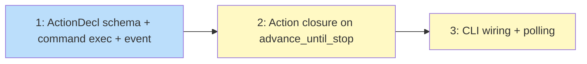

# PLAN: Default action execution

## Status

Draft

## Scope summary

Add default action execution to koto's engine so deterministic states auto-execute
shell commands, capture output, and evaluate gates without agent involvement. Covers
schema, engine integration, CLI wiring, and polling for ci_monitor.

## Decomposition strategy

**Horizontal.** Three issues matching the design's implementation phases. The schema
and shared command execution must exist before the engine can call actions, and the
engine changes must exist before the CLI can wire closures. Clear, stable interfaces
between layers.

## Issue outlines

### Issue 1: feat(engine): add ActionDecl schema, shared command execution, and DefaultActionExecuted event

**Complexity:** testable

**Goal:** Create the schema types, shared shell command executor with output capture,
YAML parsing for default_action, compile-time validation, and the new event type —
the foundation that engine and CLI integration depend on.

**Acceptance criteria:**
- [ ] `ActionDecl` struct in `src/template/types.rs` with `command`, `working_dir`,
      `requires_confirmation`, and `polling: Option<PollingConfig>`
- [ ] `PollingConfig` struct with `interval_secs` and `timeout_secs`
- [ ] `default_action: Option<ActionDecl>` field added to `TemplateState`
- [ ] `SourceState` in `src/template/compile.rs` parses `default_action` from YAML
- [ ] Compile-time validation rejects states with both `integration` and `default_action`
- [ ] Compile-time validation checks `{{VAR}}` refs in action commands against declared variables
- [ ] Compile-time validation rejects empty action commands
- [ ] Compile-time validation requires `polling.timeout_secs` when polling is declared
- [ ] `DefaultActionExecuted` event variant in `src/engine/types.rs` with state, command,
      exit_code, stdout, stderr fields
- [ ] `src/action.rs` new module with `run_shell_command` that captures stdout/stderr
      (factored from gate.rs process isolation + output capture)
- [ ] `src/gate.rs` refactored to use the shared `run_shell_command` utility
- [ ] Existing gate tests still pass after refactoring
- [ ] Unit tests for ActionDecl serialization, compile-time validation, event
      serialization/deserialization, run_shell_command output capture

**Dependencies:** None

**Downstream:** Issues 2 and 3 depend on ActionDecl, run_shell_command, and the event type.

---

### Issue 2: feat(engine): add action closure to advance_until_stop

**Complexity:** testable

**Goal:** Add the fourth closure parameter to the advance loop, the ActionResult enum,
the override evidence check, and the ActionRequiresConfirmation stop reason — enabling
the engine to call action execution at the right point in the state evaluation sequence.

**Acceptance criteria:**
- [ ] `advance_until_stop` accepts a fourth closure: `execute_action: &A` where
      `A: Fn(&str, &ActionDecl) -> ActionResult`
- [ ] `ActionResult` enum with `Executed`, `Skipped`, and `RequiresConfirmation` variants
- [ ] New `StopReason::ActionRequiresConfirmation` variant with state and output fields
- [ ] Execution order: after integration check, before gate evaluation
- [ ] Override check: if current epoch evidence is non-empty, action closure receives
      a signal to skip (or engine skips the call entirely)
- [ ] When `requires_confirmation` is true and action executes, loop stops with
      `ActionRequiresConfirmation`
- [ ] When `requires_confirmation` is false and action executes, loop continues to
      gate evaluation
- [ ] All existing advance_until_stop tests updated with a no-op action closure
- [ ] New tests: action executes when no evidence, action skipped when evidence exists,
      requires_confirmation stops loop, action runs before gate evaluation

**Dependencies:** Issue 1

**Downstream:** Issue 3 depends on the closure interface and ActionResult/StopReason types.

---

### Issue 3: feat(cli): wire action execution into handle_next with polling

**Complexity:** testable

**Goal:** Implement the action closure in handle_next with one-shot and polling
execution, variable substitution in action commands, DefaultActionExecuted event
appending, and NextResponse mapping for ActionRequiresConfirmation.

**Acceptance criteria:**
- [ ] Action closure in `handle_next` captures `&variables`, `&current_dir`,
      and uses `run_shell_command` from `src/action.rs`
- [ ] Action commands have `{{VAR}}` patterns substituted via `variables.substitute()`
- [ ] One-shot execution: run command once, capture output, append
      DefaultActionExecuted event
- [ ] Polling execution: loop with interval_secs sleep, re-run command + re-evaluate
      gates each iteration, respect timeout_secs and shutdown signal
- [ ] `ActionRequiresConfirmation` mapped to a new `NextResponse` variant that
      includes action output (stdout, stderr, exit_code)
- [ ] Output truncated at 64KB with a note if exceeded
- [ ] Non-UTF-8 output bytes replaced with the replacement character
- [ ] End-to-end test: template with default_action, action creates a file, gate
      checks file exists, workflow auto-advances
- [ ] End-to-end test: override evidence submitted before koto next, action is skipped
- [ ] End-to-end test: requires_confirmation stops advancement, returns output
- [ ] End-to-end test: polling action with short interval/timeout

**Dependencies:** Issues 1 and 2

**Downstream:** None (leaf node).

## Dependency graph

**Legend**: Blue = ready, Yellow = blocked

## Implementation sequence

**Critical path:** 1 → 2 → 3 (fully serial)

**Parallelization:** None. Each issue depends on the previous. Same horizontal
pattern as the --var implementation.

**Estimated scope:** 3 issues, all testable complexity. Touches 6+ files across
3 packages (template, engine, cli) plus a new action module.
