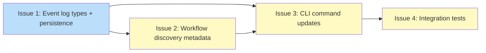

# PLAN: Event Log Format

## Status

Done

## Scope Summary

Replace koto's simple JSONL state schema (from #45) with a full event log format:
a header line followed by typed events with monotonic sequence numbers and
type-specific payloads. Six event types are defined; two are implemented in this
plan (`workflow_initialized`, `rewound`). Current state is derived by log replay.

## Decomposition Strategy

**Horizontal decomposition.** The design refactors existing code layer-by-layer.
The type system and persistence layer form the foundation; CLI commands consume
them; integration tests validate the whole stack. Walking skeleton doesn't apply
because there's already a working CLI from #45 -- this is a schema upgrade, not a
new end-to-end feature.

## Issue Outlines

### Issue 1: feat(engine): add event log types and persistence with header, seq, and typed payloads

**Complexity**: critical

**Goal**: Replace koto's simple JSONL state schema with the full event log format:
new type definitions (`StateFileHeader`, `EventPayload` enum, updated `Event` with
`seq` and typed payloads), persistence layer changes (`append_event` with mode 0600
and `sync_data()`, `read_events` with header parsing and gap detection), state
derivation functions (`derive_state_from_log`, `derive_evidence`), and format
detection), state derivation functions, and format validation.

**Acceptance Criteria**:

- [ ] `StateFileHeader` struct: `schema_version`, `workflow`, `template_hash`, `created_at`
- [ ] `EventPayload` enum with six variants matching the design taxonomy
- [ ] Updated `Event` struct: `seq: u64`, `timestamp`, `type`, `payload: EventPayload`
- [ ] `WorkflowMetadata` struct: `name`, `created_at`, `template_hash`
- [ ] `append_event`: mode 0600 via `OpenOptionsExt`, `sync_data()` after every write, writer-managed seq
- [ ] `read_events`: header parsing, seq monotonicity validation, halt-and-error on gaps, truncated final line recovery
- [ ] Header parsing with corruption detection
- [ ] `derive_state_from_log`: `to` field of last `transitioned`/`directed_transition`/`rewound` event
- [ ] `derive_evidence`: evidence after most recent state-changing event for current state
- [ ] Unit tests: header parsing, gap detection, epoch boundary, rewind scenarios, seq assignment, file permissions

**Dependencies**: None

---

### Issue 2: feat(discover): return workflow metadata from header line

**Complexity**: simple

**Goal**: Replace `find_workflows` (returns `Vec<String>`) with
`find_workflows_with_metadata` that reads the header line from each state file and
returns `WorkflowMetadata` objects.

**Acceptance Criteria**:

- [ ] `find_workflows_with_metadata` added to `src/discover.rs`, using `WorkflowMetadata` from Issue 1
- [ ] Reads first line of each `koto-*.state.jsonl`, parses as `StateFileHeader`
- [ ] Files with unreadable or missing headers skipped with stderr warning
- [ ] Results sorted by name
- [ ] Unit tests: valid headers, invalid headers (skipped), empty directory, mixed files

**Dependencies**: Issue 1

---

### Issue 3: feat(cli): update commands for event log format

**Complexity**: testable

**Goal**: Update all CLI commands to use the new event log format: `Init` writes
header + `workflow_initialized` + initial `transitioned`; `Rewind` writes `rewound`
with `from`/`to`; `Next` derives state via log replay; `Workflows` returns metadata
objects.

**Acceptance Criteria**:

- [ ] `koto init` writes 3 lines: header, `workflow_initialized` (seq 1), `transitioned` (seq 2, from: null, to: initial_state)
- [ ] `koto rewind` appends `rewound` event with `from`/`to` payload
- [ ] `koto rewind` derives previous state via `derive_state_from_log`
- [ ] `koto next` derives current state via log replay
- [ ] `koto next` extracts template info from header and `workflow_initialized` event
- [ ] `koto next` verifies cached template hash matches header's `template_hash`
- [ ] `koto workflows` calls `find_workflows_with_metadata`, outputs array of objects
- [ ] No direct `Event` construction in `cli/mod.rs` -- use persistence-layer helpers

**Dependencies**: Issue 1, Issue 2

---

### Issue 4: test(koto): update integration tests for event log format

**Complexity**: testable

**Goal**: Update all integration tests for the new state file format and add new
end-to-end test scenarios for corruption handling and rewind event shape.

**Acceptance Criteria**:

- [ ] `init_creates_state_file`: verify header line and 3-line state file
- [ ] `workflows_returns_array_with_workflow`: check for object with `name`, `created_at`, `template_hash`
- [ ] `rewind_appends_rewind_event`: verify `rewound` event with `from`/`to` payload
- [ ] `rewind_fails_at_initial_state`: update for 3-line init format
- [ ] `init_next_rewind_sequence`: remove old-format raw writes, verify `rewound` type
- [ ] New: Go-format state file rejected with exit code 3
- [ ] New: #45-format state file rejected with exit code 3
- [ ] New: corrupted file (invalid JSON) rejected with exit code 3
- [ ] New: after rewind, last event has `type: "rewound"` with `payload.from`/`payload.to`

**Dependencies**: Issue 3

## Dependency Graph

**Legend**: Green = done, Blue = ready, Yellow = blocked

## Implementation Sequence

**Critical path**: Issue 1 -> Issue 2 -> Issue 3 -> Issue 4

The chain is fully serial. Issue 1 (types + persistence) is the foundation and must
land first. Issue 2 is a small addition to discovery. Issue 3 wires everything into
the CLI. Issue 4 validates the whole stack end-to-end.

In single-pr mode on the same branch, implement in order: 1, 2, 3, 4. Run
`cargo test` after each issue to catch regressions early.
