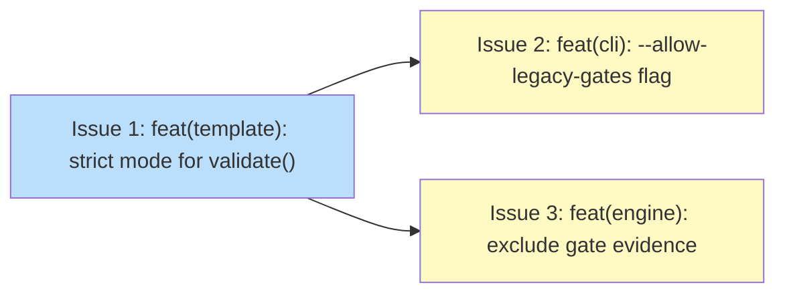

# PLAN: Gate backward compatibility

## Status

Draft

## Scope Summary

Implement Feature 4 (R10) of the gate-transition contract: context-sensitive gate
validation (`koto template compile` errors; `koto init` warns and proceeds) and
evidence exclusion for legacy states in the advance loop.

## Decomposition Strategy

**Horizontal.** Three issues, one per change boundary. Issue 1 adds the `strict`
parameter to the template layer. Issue 2 wires it into the CLI. Issue 3 modifies
the engine. All issues land in the same PR — the design requires Phases 1 and 2
ship together to avoid a window where the engine stops injecting gate evidence
before init is updated to permissive mode.

Issues 2 and 3 are independent of each other and can be implemented in either
order after Issue 1.

## Issue Outlines

### Issue 1: feat(template): add strict mode to validate() for legacy gate detection

**Complexity:** testable

**Goal:** Add `strict: bool` to `validate()` and `compile()` so the D5 legacy-gate
check emits an error in strict mode and a warning in permissive mode, and suppress
D4 warnings in permissive mode via an early return.

**Acceptance Criteria:**
- [ ] `validate()` in `src/template/types.rs` accepts a `strict: bool` parameter
- [ ] `compile()` in `src/template/compile.rs` accepts a `strict: bool` parameter
  and passes it through to `validate()`
- [ ] D5 check: when any state has gates but no `gates.*` when-clause references,
  `validate(strict=true)` returns an error naming the state and gate with a hint to
  add a `when` clause or use `--allow-legacy-gates`
- [ ] D5 check: `validate(strict=false)` emits a warning to stderr for the same
  condition and continues without error
- [ ] D4 suppression: `validate_gate_reachability()` returns `Ok(())` early when
  `!strict`, suppressing the per-field warning loop
- [ ] Templates with no gates compile successfully in both strict and permissive mode
- [ ] Unit tests: strict mode errors on a legacy-gate template; permissive mode warns
  and returns `Ok`; no-gate template passes in both modes

**Dependencies:** None

**Downstream:** Delivers `compile(strict: bool)` required by Issues 2 and 3.

---

### Issue 2: feat(cli): --allow-legacy-gates flag and permissive init

**Complexity:** testable

**Goal:** Add `--allow-legacy-gates` to `handle_template_compile()` and make
`handle_init()` compile in permissive mode, so legacy-gate templates pass `koto init`
without source changes while `koto template compile` errors by default.

**Acceptance Criteria:**
- [ ] `handle_template_compile()` passes `strict = !allow_legacy_gates` to `compile()`
- [ ] `--allow-legacy-gates` flag present on `koto template compile` with a TODO
  removal comment referencing the shirabe migration
- [ ] `handle_init()` calls `compile()` with `strict = false` unconditionally
- [ ] Integration test: `koto init` with a legacy-gate template exits 0 and emits
  the warning to stderr
- [ ] Integration test: `koto template compile` on a legacy-gate template without
  `--allow-legacy-gates` exits nonzero with an actionable error message
- [ ] Integration test: `koto template compile --allow-legacy-gates` on a legacy-gate
  template exits 0 with no error output

**Dependencies:** Blocked by Issue 1

**Downstream:** None

---

### Issue 3: feat(engine): exclude gate evidence from resolver map for legacy states

**Complexity:** testable

**Goal:** Hoist `has_gates_routing` above the `if any_failed` block in `advance.rs`
and guard the `gate_evidence_map` merge so legacy states never expose `gates.*` keys
in the resolver's evidence map.

**Acceptance Criteria:**
- [ ] `has_gates_routing` is initialized to `false` before the gate evaluation loop
  in `advance.rs`, not inside the `if any_failed` block
- [ ] The `gate_evidence_map` merge is guarded:
  `if !gate_evidence_map.is_empty() && has_gates_routing`
- [ ] For a legacy state (no `gates.*` when-clause references), the merged evidence
  map passed to `resolve_transition` contains no `gates.*` keys
- [ ] For a structured-mode state (with `gates.*` when-clause references), gate output
  is still inserted into the merged evidence map as before
- [ ] `GateEvaluated` events and `GateBlocked.failed_gates` are unaffected — they
  continue to use `gate_results` directly
- [ ] Unit tests: legacy state evidence map has no `gates.*` key; structured-mode
  state evidence map has the `gates.*` key

**Dependencies:** Blocked by Issue 1

**Downstream:** None

---

## Dependency Graph

**Legend**: Blue = ready, Yellow = blocked

## Implementation Sequence

**Critical path:** Issue 1 → Issue 2 (depth 2)

**Immediate start:** Issue 1 — no dependencies

**After Issue 1:** Issues 2 and 3 can be worked in parallel or sequentially. Both
must land in the same PR as Issue 1.

**Single-PR constraint:** All three issues must be in one PR. The design requires
the engine change (Issue 3) and the permissive init path (Issue 2) land together —
shipping Issue 3 alone would leave agents hitting D5 errors with no workaround.
