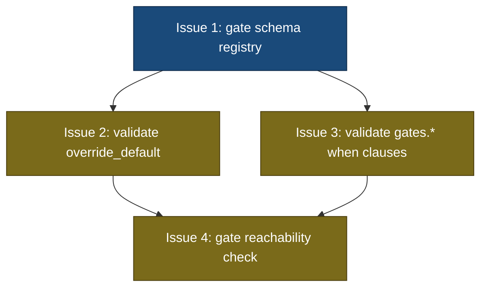

## Status

Draft

## Scope Summary

Adds compile-time validation to `src/template/types.rs` for three previously unchecked contracts: `override_default` schema conformance, `gates.*` when clause reference validity, and override-default reachability. All changes land in one file.

## Decomposition Strategy

**Horizontal decomposition.** All changes land in `src/template/types.rs`. Issue 1 builds the schema registry (`GateSchemaFieldType`, `gate_type_schema()`, `gate_type_builtin_default()`) that Issues 2–4 all depend on. Issues 2 and 3 are independent validation passes that both consume the registry and can be implemented in parallel. Issue 4 (reachability) depends on all three — it runs after D2 and D3 pass and relies on `gate_type_builtin_default()` from Issue 1.

Walking skeleton is not appropriate here: there's no end-to-end data path to stub, no new API surface, and no integration risk between layers. Each issue adds one validation pass to an existing method in a single file.

## Issue Outlines

### Issue 1: feat(template): add gate schema registry to types.rs

**Goal**

Add `GateSchemaFieldType` enum, `gate_type_schema()`, and `gate_type_builtin_default()` to `src/template/types.rs` as the compile-time source of truth for gate output field names, types, and default values. These are the foundation that Issues 2, 3, and 4 all build on.

**Acceptance Criteria**

- [ ] `GateSchemaFieldType` enum is defined in `src/template/types.rs` with variants `Number`, `String`, and `Boolean`
- [ ] `gate_type_schema(gate_type: &str) -> Option<&'static [(&'static str, GateSchemaFieldType)]>` is implemented and returns field definitions for `command`, `context-exists`, and `context-matches`
- [ ] `command` schema returns `[("exit_code", Number), ("error", String)]`
- [ ] `context-exists` schema returns `[("exists", Boolean), ("error", String)]`
- [ ] `context-matches` schema returns `[("matches", Boolean), ("error", String)]`
- [ ] `gate_type_builtin_default(gate_type: &str) -> Option<serde_json::Value>` is implemented and returns a valid JSON default value for each of the three gate types
- [ ] `gate_type_schema()` returns `None` for unknown gate type strings
- [ ] `gate_type_builtin_default()` returns `None` for unknown gate type strings
- [ ] All new code passes `cargo fmt` and `cargo clippy` without warnings
- [ ] Unit tests cover: correct field names and types for each gate type, `None` return for unknown types
- [ ] Must deliver: `GateSchemaFieldType` enum with `Number`, `String`, `Boolean` variants (required by Issue 2)
- [ ] Must deliver: `gate_type_schema()` function accessible from `src/template/types.rs` (required by Issues 2 and 3)
- [ ] Must deliver: `gate_type_builtin_default()` function accessible from `src/template/types.rs` (required by Issue 4)

**Dependencies**

None.

---

### Issue 2: feat(template): validate override_default against gate type schema

**Goal**

Add exact-match validation of `override_default` values in `validate()` in `src/template/types.rs`. When a gate declares `override_default`, the compiler must verify the value is a JSON object with exactly the fields required by the gate type schema — no missing fields, no extra fields, and correct JSON value types. Non-conforming templates are rejected with actionable error messages that name the state, gate, field, and expected type.

**Acceptance Criteria**

- [ ] A non-object `override_default` value (null, array, scalar) is rejected with a compile error naming the state and gate
- [ ] A `override_default` missing a required schema field is rejected with the message format: `state "<s>" gate "<g>": override_default missing required field "<f>"` followed by a hint line listing all required schema fields and their types
- [ ] A `override_default` with a field not in the gate type schema is rejected with the message format: `state "<s>" gate "<g>": override_default has unknown field "<f>"` followed by a hint line listing the known schema field names
- [ ] A `override_default` with a field whose JSON value type does not match the schema type is rejected with: `state "<s>" gate "<g>": override_default field "<f>" has wrong type` / `  expected: <type>, found: <type>`
- [ ] A valid `override_default` for each gate type (`command`, `context-exists`, `context-matches`) compiles without error
- [ ] Templates with no `override_default` on any gate are unaffected — existing templates continue to compile
- [ ] Must deliver: validated `override_default` well-formedness guarantee (required by Issue 4, which assumes override defaults are complete and well-typed before running the reachability check)

**Dependencies**

Blocked by Issue 1 (requires `gate_type_schema()` and `GateSchemaFieldType`).

---

### Issue 3: feat(template): validate gates.* when clause field references

**Goal**

Extend `validate_evidence_routing()` in `src/template/types.rs` to validate `gates.*` when clause references at compile time. Each `gates.*` path must have exactly 3 dot-separated segments, the gate name must exist in the state's `gates:` block, and the field name must be valid for that gate type's schema.

**Acceptance Criteria**

- [ ] A 2-segment `gates.*` path (e.g., `gates.ci_check`) in a `when` clause produces a compile error: `state "verify": when clause key "gates.ci_check" has invalid format; expected "gates.<gate>.<field>"`
- [ ] A 4+-segment path produces a compile error with the same format mismatch message
- [ ] A path referencing a gate name not in the state's `gates:` block produces: `state "verify": when clause references gate "nonexistent_gate" which is not declared in this state`
- [ ] A path with valid gate name but unknown field produces: `state "verify" gate "ci_check": when clause references unknown field "exitt_code"; command gate fields: exit_code, error`
- [ ] Valid `gates.<gate>.<field>` references for all three gate types compile without error (`command`: exit_code, error; `context-exists`: exists, error; `context-matches`: matches, error)
- [ ] States with no `gates.*` when clause keys are unaffected
- [ ] Must deliver: working `gate_type_schema()` lookup integration (required by Issue 4)

**Dependencies**

Blocked by Issue 1 (requires `gate_type_schema()`).

---

### Issue 4: feat(template): add gate reachability check for override defaults

**Goal**

Add gate reachability validation to `CompiledTemplate`. After override defaults and when-clause references are validated (Issues 2 and 3), verify that every state with pure-gate transitions can actually advance when all gates use their declared (or builtin) defaults. Emit a non-fatal warning for gate output fields that are never referenced in any when clause.

**Acceptance Criteria**

- [ ] **AC1**: `resolve_gates_path()` is a private function in `src/template/types.rs` with the exact signature `fn resolve_gates_path<'a>(evidence: &'a serde_json::Value, path: &str) -> Option<&'a serde_json::Value>`. It splits `path` on `"."`, walks the JSON map one segment at a time, and returns `None` if any segment is missing or the current node is not an object.
- [ ] **AC2**: The implementation of `resolve_gates_path()` includes a comment that references `resolve_value()` in `src/engine/advance.rs`, noting that the two functions serve the same lookup purpose in different contexts (compile-time vs. runtime).
- [ ] **AC3**: `validate_gate_reachability()` emits a compile error in the following format when no pure-gate transition fires against the evidence map:
  ```
  state "verify": no transition fires when all gates use override defaults
    gate "ci_check" override: {"exit_code": 0, "error": ""}
    pure-gate transitions checked: 2
  ```
  The error must include the state name, each gate's override value (as compact JSON), and the count of pure-gate transitions evaluated.
- [ ] **AC4**: A state whose pure-gate transitions include at least one that fires against the full-default evidence map compiles without error.
- [ ] **AC5**: A state where some transitions reference non-gate fields (mixed evidence) is exempt from the reachability check entirely. The presence of any non-`gates.*` field in a transition's when clause removes that transition from the pure-gate set; if the resulting pure-gate set is empty, the state is skipped.
- [ ] **AC6**: A template with no `gates.*` references in any when clause compiles without error and the reachability check produces no output.
- [ ] **AC7**: `gate_type_builtin_default()` in `src/template/types.rs` returns values identical to `built_in_default()` in `src/template/gate.rs` for every `GATE_TYPE_*` constant. A unit test enumerates all constants, calls both functions, and asserts the returned JSON values are equal.
- [ ] **AC8**: `validate_gate_reachability()` checks the accumulated compiler error count before running. If the count is greater than zero (indicating D2 or D3 produced errors), the method returns immediately without performing any reachability checks.
- [ ] **AC9**: An integration test calls `compile()` on a template that has both an invalid override_default (triggering a D2 error) and a dead-end state (which would trigger a reachability error if evaluated). The test asserts that exactly one error is returned and that it originates from D2 validation, not reachability validation.
- [ ] **AC10**: For every gate output field that is declared in the gate's schema but never referenced in any when clause across the entire template, `validate_gate_reachability()` emits a warning to stderr in the format:
  ```
  warning: state "<state_name>" gate "<gate_name>" field "<field_name>" is never referenced in any when clause
  ```
  This warning is non-fatal: compilation succeeds and the warning does not increment the error count.
- [ ] **AC11**: A unit test captures stderr output from a template that has an unreferenced gate field, and asserts the warning string contains the correct state name, gate name, and field name as substrings.
- [ ] **AC12**: A unit test constructs a template with a dead-end state and asserts that `compile()` returns an error whose message matches the format in AC3, including state name, gate name, and transition count. At least one gate in this template must have no `override_default` declared, so the evidence map entry for that gate is populated by `gate_type_builtin_default()`. The test verifies the error still fires (or does not fire) according to whether the builtin default causes a dead end, directly exercising the fallback path.
- [ ] **AC13**: A unit test constructs a template with a reachable state and asserts that `compile()` returns no errors. This test must include at least one gate with no `override_default` declared and a when clause that checks a field on that gate (for example, a command gate with no `override_default` and a when clause `gates.ci_check.exit_code == 0`). The test asserts compilation succeeds, confirming that `validate_gate_reachability()` used the builtin default `{"exit_code": 0, ...}` when building the evidence map.
- [ ] **AC14**: A unit test constructs a template where a state has only mixed-evidence transitions (at least one non-`gates.*` field per transition) and asserts that `compile()` returns no errors and the reachability check emits no warnings related to that state.
- [ ] **AC15**: A unit test constructs a template with no `gates.*` when-clause references at all and asserts that `compile()` returns no errors.
- [ ] **AC16**: A unit test constructs a template with a gate that declares a field in its schema which is never referenced in any when clause, and asserts that the warning produced by `validate_gate_reachability()` contains the expected state name, gate name, and field name.

**Dependencies**

Blocked by Issues 1, 2, and 3.

---

## Dependency Graph



Legend: Blue = ready to start, Yellow = blocked on dependencies

## Implementation Sequence

**Critical path**: Issue 1 → Issue 2 → Issue 4 (depth 3)

**Parallelization opportunities:**
- Start with Issue 1 (no dependencies)
- After Issue 1 completes, implement Issues 2 and 3 in parallel
- After both Issues 2 and 3 complete, implement Issue 4

**Recommended order:**
1. Issue 1 — schema registry (unblocks everything)
2. Issues 2 and 3 — parallel validation passes (both depend on Issue 1 only)
3. Issue 4 — reachability check (depends on all three)

All four issues modify `src/template/types.rs`. When implementing Issues 2 and 3 in parallel, coordinate to avoid merge conflicts in that file — the two passes extend different methods (`validate()` for Issue 2, `validate_evidence_routing()` for Issue 3) so conflicts are unlikely but should be checked before merging.
