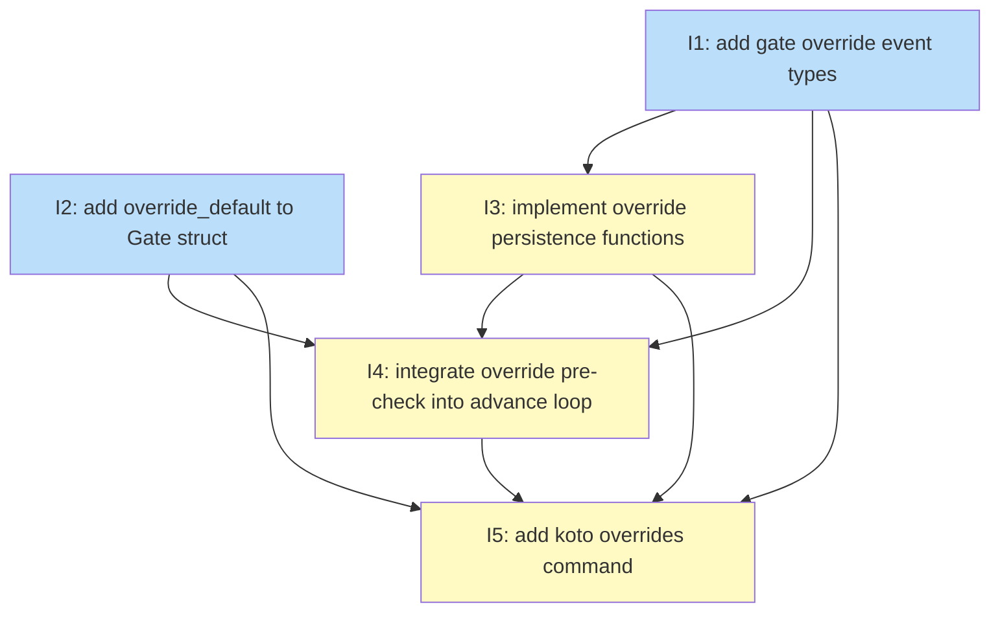

# PLAN: Gate override mechanism

## Status

Draft

## Scope Summary

Implement a first-class gate override mechanism for koto: a new `koto overrides record` command that substitutes gate output with a default or explicit value, attaches mandatory rationale, and persists an auditable event. The advance loop reads these events to skip gate execution for overridden gates, injecting the override value into the `gates.*` evidence map. A new `GateEvaluated` event enables `actual_output` capture at override-record time.

## Decomposition Strategy

**Horizontal decomposition.** The design's three implementation phases are sequential prerequisites: event types must exist before persistence functions can pattern-match them; persistence functions must exist before the advance loop can call them; the advance loop must be updated before end-to-end functional tests can run. Each issue is fully testable before the next begins. In single-pr mode all issues land in one branch; the ordering guides the implementer's sequence.

## Issue Outlines

### Issue 1: feat(engine): add gate override event types

**Complexity**: testable

**Goal**: Add `GateEvaluated` and `GateOverrideRecorded` variants to the `EventPayload` enum in `src/engine/types.rs` with full serde support.

**Acceptance Criteria**:
- `GateEvaluated` struct is defined with fields: `state: String`, `gate: String`, `output: serde_json::Value`, `outcome: String`, `timestamp: String`
- `GateOverrideRecorded` struct is defined with fields: `state: String`, `gate: String`, `rationale: String`, `override_applied: serde_json::Value`, `actual_output: serde_json::Value`, `timestamp: String`
- Both structs are added as variants to the `EventPayload` enum
- Both variants derive or implement `Serialize` and `Deserialize` consistent with the existing enum tagging strategy
- Unit tests cover round-trip serialization (struct → JSON → struct) for both `GateEvaluated` and `GateOverrideRecorded`
- Unit tests include at least one negative deserialization case — for example, a JSON object missing the required `state` field, or an unrecognized `outcome` string — and assert that an error is returned rather than silently defaulting
- `cargo check` passes with no new warnings

**Dependencies**: None

---

### Issue 2: feat(template): add override_default field to Gate struct

**Complexity**: simple

**Goal**: Add `override_default: Option<serde_json::Value>` to the `Gate` struct in `src/template/types.rs` and implement `built_in_default(gate_type: &str) -> Option<serde_json::Value>` for the three known gate types.

**Acceptance Criteria**:
- `src/template/types.rs`: the `Gate` struct has a new field `override_default: Option<serde_json::Value>` annotated with `#[serde(default, skip_serializing_if = "Option::is_none")]`, matching the pattern used by other optional gate fields such as `timeout`.
- A new function `built_in_default(gate_type: &str) -> Option<serde_json::Value>` is defined in `src/engine/gate.rs` (or a dedicated `src/engine/override_defaults.rs`). It returns:
  - `"command"` → `Some(json!({"exit_code": 0, "error": ""}))`,
  - `"context-exists"` → `Some(json!({"exists": true, "error": ""}))`,
  - `"context-matches"` → `Some(json!({"matches": true, "error": ""}))`,
  - any other type → `None` (the whole `Option` is absent; no default exists for that gate type).
- A template YAML that sets `override_default: {exit_code: 1, error: ""}` on a `command` gate round-trips through `serde_yaml` deserialization and serialization with the value preserved exactly.
- A template YAML that omits `override_default` deserializes with the field as `None` and serializes without the key in the output.
- Unit tests cover all three `built_in_default` matches and the unknown-type case returning `None`.
- `cargo check` and `cargo test` pass with no new warnings.

**Dependencies**: None

---

### Issue 3: feat(engine): implement override persistence functions

**Complexity**: testable

**Goal**: Implement `derive_overrides`, `derive_overrides_all`, and `derive_last_gate_evaluated` in `src/engine/persistence.rs`, mirroring the `derive_decisions` pattern, with unit tests covering epoch-scoping, cross-epoch queries, and the last-evaluated lookup.

**Acceptance Criteria**:
- `derive_overrides(events: &[Event]) -> Vec<&Event>` is implemented and returns only `GateOverrideRecorded` events that fall after the epoch boundary for the current state. The epoch boundary is determined by finding the most recent `Transitioned`, `DirectedTransition`, or `Rewound` event whose `to` field matches the current state.
- `derive_overrides_all(events: &[Event]) -> Vec<&Event>` is implemented and returns all `GateOverrideRecorded` events in the log regardless of epoch or state.
- `derive_last_gate_evaluated(events: &[Event], gate: &str) -> Option<serde_json::Value>` is implemented and returns the `output` field from the most recent `GateEvaluated` event for the named gate within the current epoch (same epoch-boundary logic as `derive_overrides`). Returns `None` if no such event exists.
- Unit test: event log contains only `GateOverrideRecorded` events with no preceding state-changing event; `derive_overrides` returns all of them.
- Unit test: event log contains a `Transitioned` event to the current state followed by `GateOverrideRecorded` events; `derive_overrides` returns only the events after the transition.
- Unit test: event log contains a `Rewound` event to the current state followed by `GateOverrideRecorded` events; `derive_overrides` returns only the events after the rewind, verifying that rewinds also reset the epoch boundary.
- Unit test: event log contains a `Transitioned` event to `other_state` followed by some `GateOverrideRecorded` events, then a `Transitioned` event to the current state, followed by more `GateOverrideRecorded` events; `derive_overrides` returns only the overrides after the second (current-state) transition. This verifies the `to`-field match requirement.
- Unit test: `derive_overrides_all` returns all `GateOverrideRecorded` events across multiple epoch boundaries.
- Unit test: `derive_last_gate_evaluated` returns the output from the most recent `GateEvaluated` event for the specified gate within the current epoch, and returns `None` when no such event exists.
- All new code passes `rustfmt` and `cargo clippy`.

**Dependencies**: Issue 1

---

### Issue 4: feat(engine): integrate gate override pre-check into advance loop

**Complexity**: critical

**Goal**: Modify `src/engine/advance.rs` to emit `GateEvaluated` events, call `derive_overrides` before gate iteration, inject override values and a synthetic `StructuredGateResult { outcome: Passed }` for overridden gates, compute `any_failed` from combined results, and update `blocking_conditions_from_gates` to set `agent_actionable` based on available defaults.

**Acceptance Criteria**:
- `src/engine/advance.rs` calls `derive_overrides(all_events)` once before the gate iteration loop, producing `epoch_overrides: BTreeMap<String, serde_json::Value>` mapping gate name to `override_applied`
- For each gate in `template_state.gates`, if the gate name appears in `epoch_overrides`: `override_applied` is inserted into `gate_evidence_map`; a `StructuredGateResult { outcome: Passed, output: override_applied }` is inserted into `gate_results` directly, without calling `evaluate_gates`; no `GateEvaluated` event is emitted for this gate
- Gates not in `epoch_overrides` are passed to `evaluate_gates` unchanged; `GateEvaluated` is emitted for each result
- `any_failed` is computed from the combined `gate_results` (overridden gates have `GateOutcome::Passed` and do not contribute to `any_failed`)
- `blocking_conditions` is built from non-passing entries in `gate_results`
- `agent_actionable` in each blocking condition entry is set to `true` when `gate_defs.get(name).map(|g| g.override_default.is_some() || built_in_default(&g.gate_type).is_some()).unwrap_or(false)` — replaces the hardcoded `false` from Feature 1
- Unit test (1): one gate with active `GateOverrideRecorded` in current epoch; assert gate in `gate_evidence_map` with `override_applied`, gate in `gate_results` with `outcome: Passed`, and event log contains zero `GateEvaluated` events for the overridden gate name
- Unit test (2): two gates, one overridden one not; overridden gate injected as Passed (no `GateEvaluated`), non-overridden gate produces `GateEvaluated`, `any_failed` reflects only the non-overridden gate's result
- Unit test (3): one `command` gate, no active override, evaluation returns non-passing; `blocking_conditions` has `agent_actionable: true`
- Unit test (4): one gate with active override; assert `blocking_conditions` is empty and `status` is not `gate_blocked`
- Unit test (5): one gate with unknown type (not `"command"`, `"context-exists"`, or `"context-matches"`) and no `override_default`, evaluation returns non-passing; assert `blocking_conditions` entry has `agent_actionable: false`
- All existing advance loop tests pass without modification
- `cargo check` and `cargo test` pass with no new warnings

**Dependencies**: Issues 1, 2, 3

---

### Issue 5: feat(cli): add koto overrides command and gates namespace reservation

**Complexity**: critical

**Goal**: Add the `OverridesSubcommand` Clap enum with `Record` and `List` variants in `src/cli/overrides.rs`; implement `handle_overrides_record` and `handle_overrides_list`; add the `"gates"` key reservation check in `handle_next`; add the `debug_assert` in `advance_until_stop`.

**Acceptance Criteria**:
- `src/cli/overrides.rs` contains `OverridesSubcommand` as a Clap enum with `Record { name, --gate, --rationale, --with-data }` and `List { name }` variants, matching the design's CLI structure exactly.
- `handle_overrides_record` rejects a `--gate` value that does not exist in the current state's `template_state.gates` with a clear error (phantom gate check).
- `handle_overrides_record` rejects a `--with-data` payload that exceeds 1MB with an error.
- `handle_overrides_record` rejects a `--rationale` value that exceeds 1MB with an error.
- `handle_overrides_record` resolves the override value in order: `--with-data` argument → instance `override_default` on the gate → `built_in_default` for the gate's type. If none of these produce a value, the command returns an error.
- `handle_overrides_record` reads `actual_output` from `derive_last_gate_evaluated` for the named gate in the current epoch; uses `null` when no `GateEvaluated` event exists for that gate.
- `handle_overrides_record` appends a `GateOverrideRecorded` event containing `state`, `gate`, `rationale`, `override_applied`, `actual_output`, and `timestamp`.
- `handle_overrides_list` calls `derive_overrides_all` and returns the full-session override history as a JSON object with `state` (current workflow state) and `overrides.items` array. Each item includes `state`, `gate`, `rationale`, `override_applied`, `actual_output`, and `timestamp`.
- In `handle_next`, a `--with-data` payload containing a top-level `"gates"` key returns `KotoError::InvalidSubmission` with the message `"gates" is a reserved field; agent submissions must not include this key`. This check runs after JSON parse and before `validate_evidence`.
- In `advance_until_stop`, the existing silent overwrite of any `"gates"` key is replaced by a `debug_assert!` confirming `current_evidence` does not contain `"gates"`, with a message explaining the invariant.
- Unit test: call `handle_next` (or the evidence validation layer it delegates to) with a JSON payload containing a top-level `"gates"` key and assert `KotoError::InvalidSubmission` is returned.
- Unit test: `handle_overrides_record` returns an error for a gate name not present in the current state's template.
- Unit test: `handle_overrides_record` resolves `override_applied` from `--with-data` when provided, falling through to `override_default`, then `built_in_default`, in the correct order.
- Unit test: `handle_overrides_record` records `actual_output` as `null` when no `GateEvaluated` event exists for the gate in the current epoch.
- Functional test: full override flow — `koto next` blocks on a gate, `koto overrides record` records the override, `koto next` advances. The `GateOverrideRecorded` event in the state file contains the expected fields.
- Functional test: `koto overrides list` output matches the structure in Decision 4 of the design, including overrides recorded before a rewind.
- Functional test: `koto next --with-data '{"gates": {...}}'` returns a non-zero exit code and prints the reserved-field error message.
- All new code passes `cargo fmt` and `cargo clippy` with no new warnings.

**Dependencies**: Issues 1, 2, 3, 4

---

## Dependency Graph

**Legend**: Green = done, Blue = ready, Yellow = blocked, Purple = needs-design, Orange = tracks-design/tracks-plan

## Implementation Sequence

**Critical path**: I1 → I3 → I4 → I5 (4 issues, no shortcuts)

**Parallelization**: I1 and I2 have no dependencies and can be worked in either order or interleaved — they touch separate files (`src/engine/types.rs` and `src/template/types.rs` respectively). I2 is off the critical path: by the time I3 is complete (which requires I1), I2 can already be done.

**Recommended order**:
1. I1 and I2 (start together; complete I1 first if sequential)
2. I3 (after I1)
3. I4 (after I1, I2, I3 — the convergence point)
4. I5 (after all; the leaf node with functional tests)

The functional tests in I5 exercise the complete stack end-to-end, so all upstream issues must be solid before I5 begins.
