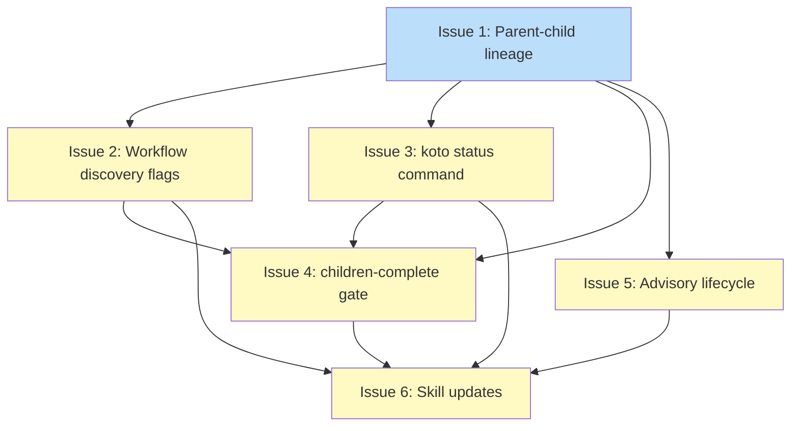

# PLAN: Hierarchical multi-level workflows

## Status

Draft

## Scope Summary

Add parent-child workflow hierarchy to koto: lineage registration via header field, `children-complete` gate type for fan-out convergence, `koto status` for read-only inspection, advisory-only lifecycle coupling, and skill updates for koto-user and koto-author.

## Decomposition Strategy

**Horizontal decomposition.** Components have clear, stable interfaces: lineage registration is a prerequisite for all other work, discovery flags and status are independent of each other, the gate type builds on all three, advisory lifecycle only needs lineage, and skill updates come last. Each phase maps to one issue.

## Issue Outlines

### Issue 1: feat(engine): add parent-child lineage to workflow init

**Goal:** Add `parent_workflow: Option<String>` to `StateFileHeader` and a `--parent <name>` flag to `koto init` that validates the parent exists before writing the child's state file.

**Acceptance Criteria:**
- [ ] `StateFileHeader` has `parent_workflow: Option<String>` that deserializes to `None` when absent (no schema_version bump)
- [ ] `koto init <name> --parent <parent>` succeeds when parent exists, writes `parent_workflow` to header
- [ ] `koto init <name> --parent <nonexistent>` exits with code 1, error names the missing parent
- [ ] `koto init <name>` without `--parent` works unchanged; `parent_workflow` is `None`
- [ ] `SessionInfo` and `WorkflowMetadata` carry `parent_workflow`
- [ ] `koto workflows` JSON output includes `parent_workflow` (string or null) per entry
- [ ] Existing state files without `parent_workflow` load without error
- [ ] Unit tests cover: valid parent, missing parent, no `--parent`, header round-trip

**Dependencies:** None

---

### Issue 2: feat(cli): add hierarchy filter flags to koto workflows

**Goal:** Add `--roots`, `--children <name>`, and `--orphaned` filter flags to `koto workflows` for hierarchy discovery.

**Acceptance Criteria:**
- [ ] `--roots` returns only workflows where `parent_workflow` is null
- [ ] `--children <name>` returns only workflows where `parent_workflow` equals `<name>`
- [ ] `--orphaned` returns only workflows whose `parent_workflow` references a non-existent session
- [ ] Flags are mutually exclusive; combining produces an error
- [ ] No flags returns all workflows unfiltered (existing behavior)
- [ ] `--children <name>` with no matching children returns empty array, exit code 0
- [ ] Unit tests for each filter mode

**Dependencies:** Blocked by Issue 1

---

### Issue 3: feat(cli): add read-only koto status command

**Goal:** Add `koto status <name>` returning workflow state metadata without evaluating gates or advancing state.

**Acceptance Criteria:**
- [ ] Returns JSON: `name`, `current_state`, `template_path`, `template_hash`, `is_terminal`
- [ ] Calls `derive_machine_state()`, does not evaluate gates or modify state
- [ ] `is_terminal` reflects the compiled template's terminal flag for current state
- [ ] Non-zero exit code with error for missing workflow
- [ ] Unit tests: active workflow, terminal state, missing name

**Dependencies:** Blocked by Issue 1

---

### Issue 4: feat(gate): add children-complete gate type

**Goal:** Implement the `children-complete` gate type so parent workflows can block on child completion through the existing gate evaluation system.

**Acceptance Criteria:**
- [ ] `Gate` struct gains `completion: Option<String>` and `name_filter: Option<String>`
- [ ] Compiler validates `children-complete`: rejects unknown completion prefixes
- [ ] `gate_type_schema()` returns the fixed-shape schema for `children-complete`
- [ ] Gate evaluator has `children-complete` match arm: calls `backend.list()`, filters by `parent_workflow`, optionally by `name_filter` prefix
- [ ] Zero matching children returns `Failed` (no vacuous pass)
- [ ] Output JSON: `total`, `completed`, `pending`, `all_complete`, `children` array (`{name, state, complete}`), `error`
- [ ] Override default: `{"total":0,"completed":0,"pending":0,"all_complete":true,"children":[],"error":""}`
- [ ] `BlockingCondition` gains `category: String`; `gate_blocking_category()` returns `"temporal"` for `children-complete`, `"corrective"` for others
- [ ] `category` serialized in all `gate_blocked` and `evidence_required` responses
- [ ] Gate evaluator closure captures session backend; `advance_until_stop` signature unchanged
- [ ] Integration tests: all children terminal (pass), pending children (fail), zero children (fail), `name_filter` filtering, `category: "temporal"` in output
- [ ] Existing gates emit `category: "corrective"` unchanged

**Dependencies:** Blocked by Issues 1, 2, 3

---

### Issue 5: feat(cli): add advisory child info to lifecycle commands

**Goal:** Surface affected children in cancel/cleanup/rewind JSON responses without cascading operations.

**Acceptance Criteria:**
- [ ] `koto cancel <name>` response includes `children` array (each: `name`, `state`)
- [ ] `koto session cleanup <name>` response includes `children` array; children become orphans (no cascade)
- [ ] `koto rewind <name>` response includes advisory `children` field
- [ ] Empty `children` array when no children exist (not missing field)
- [ ] No automatic child cancellation or deletion
- [ ] Unit tests: parent with children, parent with no children, orphan state after cleanup

**Dependencies:** Blocked by Issue 1

---

### Issue 6: docs(skills): update koto-user and koto-author for hierarchy

**Goal:** Document hierarchical workflow features in both agent skills with examples and evals.

**Acceptance Criteria:**
- [ ] koto-user: `children-complete` in action dispatch table, temporal vs corrective handling
- [ ] koto-user: `children` array reading, retry vs action guidance
- [ ] koto-user: `--parent` on init, `--roots`/`--children`/`--orphaned` on workflows, `koto status` in command reference
- [ ] koto-user: override flow covers `children-complete`
- [ ] koto-author: `children-complete` gate type with `completion` and `name_filter`
- [ ] koto-author: single-state fan-out pattern (directive + gate)
- [ ] koto-author: `gates.<name>.*` routing for child outcomes
- [ ] koto-author: compiler validation for `children-complete` fields
- [ ] koto-author: parent + child template pair example
- [ ] Updated evals for both skills covering hierarchy scenarios
- [ ] All existing evals pass

**Dependencies:** Blocked by Issues 1, 2, 3, 4, 5

## Dependency Graph

**Legend**: Green = done, Blue = ready, Yellow = blocked

## Implementation Sequence

**Critical path:** Issue 1 -> Issue 4 -> Issue 6

**Parallelization:** After Issue 1 completes, Issues 2, 3, and 5 can run in parallel. Issue 4 waits for all three. Issue 6 waits for everything.

**Recommended order:**
1. Issue 1 (lineage) -- foundation, unblocks everything
2. Issues 2 + 3 + 5 in parallel (discovery, status, lifecycle)
3. Issue 4 (gate) -- depends on 1, 2, 3
4. Issue 6 (skills) -- depends on all prior
