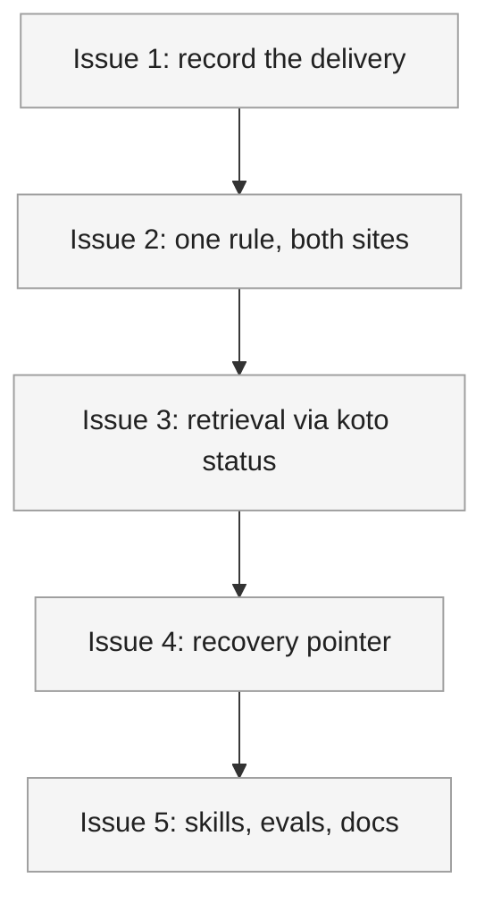

# PLAN: phase instructions an agent can rely on

## Status

Draft

Authored from `DESIGN-inline-phase-details` under `/scope`'s tactical chain.
Tracking level is `none`, so no GitHub issues or milestone are created and the
plan auto-transitions to Active when authoring finishes.

## Scope Summary

Replace koto's entry-counting suppression of a phase's long-form instructions
with a rule keyed on delivery, apply that one rule at both response-construction
sites, and give an agent a read-only way back to the current phase's instructions
through `koto status` — with a pointer that reaches an agent which has lost
everything else.

## Decomposition Strategy

**Horizontal.**

The design describes components with stable interfaces and a real prerequisite
ordering: the delivery predicate has to exist before either call site can consume
it, and the discoverability pointer has to know what command to name before it can
be written. Nothing here carries the integration risk a walking skeleton is for.
There is no new component, no new data flow across a process boundary, and no new
infrastructure — the change is vertical by construction, so a thin vertical slice
would be a throwaway pass over work the real sequence already does end to end.

The design's own four-phase implementation sequence is horizontal. This
decomposition follows it, splitting its final phase in two so the pointer and the
documentation are separable, and merging nothing.

## Issue Outlines

### Issue 1: record that instructions were delivered

**Goal**: Add the event that records a delivery and the predicate that reads it
back, without wiring either into a response path.

**Acceptance Criteria**:
- [ ] `EventPayload` gains an `InstructionsDelivered` variant carrying the phase
      it applies to, with its `type_name` arm, its deserialize arm, its payload
      struct, and a doc comment explaining additive safety in the style the
      existing variants use.
- [ ] `CURRENT_SCHEMA_VERSION` is unchanged, and the existing test that pins it
      covers the new variant.
- [ ] An older binary reading a log containing the new record routes it through
      the deserializer's existing unknown-variant path rather than failing.
- [ ] `instructions_delivered_this_occupancy(events, state) -> bool` exists beside
      `latest_epoch_gate_failed` and shares its slicing idiom, taking a plain
      event slice with no backend coupling.
- [ ] Unit tests cover: no prior delivery; a delivery within the current
      occupancy; a delivery recorded before the most recent entry event; arrival
      by rewind; arrival by self-transition; and a multi-hop advance where a
      delivery belongs to an intermediate phase.
- [ ] No observable behavior changes. The full suite passes and no response
      differs from before this issue.

**Dependencies**: None

### Issue 2: apply one delivery rule at both construction sites

**Goal**: Make the delivery rule govern every response, on both the
natural-advancement path and the directed-transition path, and record each
delivery as it happens.

**Acceptance Criteria**:
- [ ] `with_details_suppressed_unless_full` exists on the response type beside
      `with_substituted_directive` and `with_directive_prefix`, and takes the
      already-delivered verdict and the override flag.
- [ ] Both response-construction call sites call it — the directed path and the
      natural-advancement path — and both append the delivery record when the
      response carries the instructions.
- [ ] The directed path builds its event list in memory from the payload it has
      already appended rather than re-reading the log, so the call performs no
      file read the pre-change binary did not perform.
- [ ] The record is appended after the response is printed, so a crash between
      the two re-delivers rather than suppressing.
- [ ] A gate-blocked first tick carries the instructions; a second tick that
      evaluates the same failing gate and does not transition omits them.
- [ ] A loop-back arrival at a previously-occupied phase carries them again.
- [ ] A self-transition arrival carries them.
- [ ] An unconditional-transition arrival carries them, verified separately from
      the conditional case.
- [ ] A rewind arrival carries them.
- [ ] `koto init` followed by a first `koto next` carries them for the initial
      phase, and a batch-spawned child's first `koto next` carries them for its
      own initial phase.
- [ ] A directed transition into a phase, followed by a non-advancing `koto next`:
      the first carries them, the second does not.
- [ ] Two consecutive directed transitions into the same phase, which requires a
      template declaring a self-transition, both carry them.
- [ ] The existing override flag returns them on a response the rule would
      otherwise have suppressed, and recording that delivery changes nothing
      observable for existing override callers.
- [ ] For a template whose phases declare no instructions, responses are
      byte-identical to the pre-change binary's for the same template and call
      sequence. The baseline is captured before this issue lands.
- [ ] `derive_visit_counts` still exists and its consumer in the workflows
      surface is untouched.
- [ ] `koto-stability-tests` passes unmodified.

**Dependencies**: Blocked by <<ISSUE:1>>

### Issue 3: return the current phase's instructions from `koto status`

**Goal**: Give an agent a read-only way to retrieve the current phase's
directive, instructions, and evidence schema without moving the workflow.

**Acceptance Criteria**:
- [ ] `koto status <name>` returns `directive`, `details`, and `expects` as
      conditionally-present keys, following the same present-only-when-relevant
      convention the handler already uses.
- [ ] `directive` and `details` are substituted through the same pipeline `koto
      next` uses, so a variable comes back resolved and the text matches what
      `next` would have returned for the same phase.
- [ ] The instructions are returned whether or not the delivery rule is currently
      suppressing them, and retrieving them does not record a delivery.
- [ ] A retrieval between two `koto next` calls leaves the second call's response
      identical to what it would have been without the retrieval.
- [ ] The session state file is byte-identical before and after a retrieval.
- [ ] A retrieval against a phase whose gate is a shell command does not execute
      it, verified with a gate command that has an observable side effect; the
      same holds for a phase carrying a default action.
- [ ] A retrieval against a workflow at a terminal phase does not clean up the
      session, and returns a normal success envelope with the three keys absent.
- [ ] A retrieval against a phase declaring no instructions succeeds with
      `details` absent rather than erroring.
- [ ] A retrieval against a batch-scoped parent succeeds while another process
      holds that session's advisory lock for a tick, returning without waiting.
- [ ] A retrieval against an ordinary non-batch session returns immediately while
      a first process is mid-tick, constructed with a deliberately slow gate or
      default action.
- [ ] A retrieval against an unknown workflow returns a structured error and a
      non-zero exit code consistent with the handler's existing conventions.
- [ ] The handler verifies the compiled template's hash against the session
      header and, on mismatch, adds a conditionally-present key naming the
      divergence rather than failing. The pre-existing unverified read that
      `is_terminal` depended on is closed by the same check.

**Dependencies**: Blocked by <<ISSUE:2>>

### Issue 4: splice the recovery pointer into the directive

**Goal**: Make sure an agent that has lost its context still learns the retrieval
exists.

**Acceptance Criteria**:
- [ ] Every response shape that can carry instructions — evidence-required,
      gate-blocked, integration, integration-unavailable, and
      action-requires-confirmation — carries a pointer naming the retrieval when
      the current phase declares instructions.
- [ ] The pointer's presence keys on whether the phase declares instructions, not
      on whether this response carries them, so it appears on exactly the
      responses where they were suppressed.
- [ ] A response for a phase declaring no instructions carries no pointer, and
      such responses stay byte-identical to the pre-change binary's.
- [ ] The phase's own directive text is present and unaltered in a response that
      also carries the pointer.
- [ ] The pointer is spliced after variable substitution, so it is never itself
      substituted.
- [ ] When an abandonment notice and the pointer both apply, the pointer is
      spliced first so the notice ends up closest to the front of the directive.
      A test covers the both-apply case.
- [ ] The pointer text is under 150 characters.

**Dependencies**: Blocked by <<ISSUE:3>>

### Issue 5: update the skills, evals and documentation

**Goal**: Bring every surface that documents the delivery contract in line with
what ships, which koto's contributor guide makes mandatory for changes under
`src/cli/` and `src/engine/`.

**Acceptance Criteria**:
- [ ] `koto-user`'s response-shapes and command-reference documents describe the
      delivery rule as shipped and the retrieval, replacing the visit-count
      description.
- [ ] `koto-author`'s SKILL.md and template-format reference describe what an
      author can now rely on over a loop.
- [ ] `docs/guides/cli-usage.md` and the Cursor rules file under the plugin match
      the shipped behavior.
- [ ] Every skill under the plugin tree still has at least one eval, and any eval
      asserting the old delivery behavior is updated to assert the new one.
- [ ] `koto template compile` succeeds against every template shipped under the
      plugin tree, which the plugin-validation workflow runs on any pull request
      touching it.
- [ ] `CHANGELOG.md` records the fix and the added surface under the repository's
      existing convention.
- [ ] `cargo fmt --check`, `cargo clippy -D warnings` and the full test suite
      pass.
- [ ] `wip/` is empty and no committed file references a `wip/` path.

**Dependencies**: Blocked by <<ISSUE:4>>

## Implementation Issues

Not applicable. Execution mode is `single-pr` and the tracking level is `none`,
so no GitHub issues are created and this section stays empty by design. The Issue
Outlines above are the decomposition `/work-on` consumes.

## Dependency Graph

Legend: grey is pending, orange is in progress, green is done.

## Implementation Sequence

The critical path is the whole chain, and it is a chain rather than a graph:
issue 1 supplies the predicate issue 2 consumes, issue 2 introduces the
suppression that makes issue 3's retrieval necessary, issue 3 supplies the
command issue 4 names, and issue 5 documents all of it.

There is no parallelization worth naming. The five land in one pull request, so
the ordering is a sequence of commits rather than a schedule, and the only
constraint that binds hard is inside issue 2: its two halves — the
natural-advancement path and the directed-transition path — must land in the same
commit set, because shipping one without the other leaves the two paths
disagreeing, which is the defect this work exists to close.

One preparatory step belongs before issue 2 rather than inside it. The
byte-identity baseline that issue 2's acceptance criteria compare against does
not exist today: no current test compares whole response bodies to a fixed
reference. Capture it from the pre-change binary — a frozen fixture of responses
for an instruction-free template — before the first behavior-changing commit, or
the criterion cannot be evaluated afterwards.
