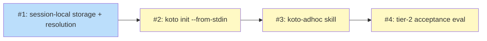

# PLAN: koto ad-hoc workflows

## Status

Active

## Scope Summary

Implements `koto init --from-stdin`: an agent pipes an inline workflow
definition, koto strict-compiles it into the session directory and runs it on
the existing state machine, plus a `koto-adhoc` koto-skills teaching skill and a
tier-2 acceptance eval.

## Decomposition Strategy

**Horizontal.** Four issues, each delivering one layer fully, in a linear
dependency chain. Issue 1 (session-local storage + path resolution) is the
correctness core and is independently testable against the existing `--template`
path before any stdin surface exists; the CLI surface, the teaching skill, and
the eval build on top of it in order. This matches the design's own
Implementation Approach and avoids a thin-slice skeleton that would otherwise
stub the very storage behavior that carries the risk.

## Issue Outlines

### Issue 1: feat(engine): store inline-compiled artifacts in the session dir with session-relative path resolution

**Goal**: Make a session's compiled template resolvable and hash-verifiable from
within the session directory, so an inline workflow survives `~/.cache` eviction
and every reader resolves a session-relative `template_path`.

**Acceptance Criteria**:
- [ ] An inline-compiled template can be written under the session directory
      (via `compile_cached_into(source, session_dir, strict)`) and recorded as a
      session-relative `template_path`.
- [ ] `derive_machine_state` resolves a session-relative `template_path` against
      the session directory, and all readers that load the template succeed
      against a session-local template: `next`, `rewind`, `decisions record`,
      `status`, `cancel`, batch view, `overrides`, `workspace`,
      `dashboard_data`, `retry`.
- [ ] A workflow whose compiled template lives in the session dir passes
      template-hash verification across at least three successive `koto next`
      ticks with `~/.cache/koto` emptied between ticks.
- [ ] Existing file-template (`--template <path>`) workflows are byte-for-byte
      unaffected: the existing test suite passes and the absolute cache path is
      still used for that path.
- [ ] After a session `relocate`, `template_path` still resolves (the
      header-vs-event-log relocation gap in `src/session/local.rs` is closed).

**Dependencies**: None

**Type**: code
**Files**: `src/cache.rs`, `src/cli/init_child.rs`, `src/engine/persistence.rs`, `src/session/local.rs`

### Issue 2: feat(cli): add `koto init --from-stdin` for inline workflow definitions

**Goal**: Let an agent pipe a workflow definition to `koto init` and get a
strict-compiled, running session in one invocation, with element-named errors on
failure.

**Acceptance Criteria**:
- [ ] `koto init <name> --from-stdin` reads a definition from stdin,
      strict-compiles it into the session dir, and starts a session; the first
      `koto next` returns the initial directive, with no template file
      pre-existing on disk.
- [ ] `--from-stdin` and `--template` are mutually exclusive (clear error if
      both are passed); `--from-stdin` rejects `--allow-legacy-gates`.
- [ ] A definition that fails strict validation produces no session, exits
      non-zero, and names the failing element (state, transition, or gate).
- [ ] A definition containing a legacy gate pattern is rejected on this path.
- [ ] The readable source is persisted in the session dir under a fixed
      filename; any recorded source extension is metadata only and never a path
      component (no `source/../../x` traversal).
- [ ] The persisted source recovered from the session is byte-for-byte identical
      to the stdin input.

**Dependencies**: Blocked by <<ISSUE:1>>

**Type**: code
**Files**: `src/cli/mod.rs`, `src/cli/init_child.rs`

### Issue 3: feat(koto-skills): add koto-adhoc skill teaching ephemeral decompose-and-run

**Goal**: Ship a third koto-skills sibling that teaches an agent to decompose a
task into a workflow (with a quality bar) and run it via `--from-stdin`, steering
repeated authoring toward `koto-author`.

**Acceptance Criteria**:
- [ ] A `koto-adhoc` skill exists under `plugins/koto-skills/skills/`, registered
      in `plugin.json`, activating via a trigger description that covers a
      human-directed invocation (baseline) and agent self-activation.
- [ ] `SKILL.md` contains an inline decomposition-quality checklist (state
      granularity, when to add gates) and at least two worked examples — one
      branching, one linear-with-gates.
- [ ] The skill references (does not duplicate) the shared template-format
      guidance and the `koto-user` run loop.
- [ ] The skill contains explicit guidance to switch to `koto-author` when the
      same workflow is authored repeatedly.
- [ ] An `evals/evals.json` exists for the skill (satisfies
      `check-evals-exist.sh`).

**Dependencies**: Blocked by <<ISSUE:2>>

**Type**: docs
**Files**: `plugins/koto-skills/skills/koto-adhoc/SKILL.md`, `plugins/koto-skills/plugin.json`, `plugins/koto-skills/skills/koto-adhoc/evals/evals.json`

### Issue 4: test(koto-skills): add tier-2 acceptance eval for ad-hoc authoring

**Goal**: Verify end-to-end that an agent given a complex task with no matching
template authors a valid workflow, runs it to terminal, and `rewind` works.

**Acceptance Criteria**:
- [ ] A tier-2 (execution-based) eval runs a fixed complex-task fixture for which
      no matching template is available, entered via a human-directed invocation
      of the `koto-adhoc` skill.
- [ ] Mechanical oracles assert, via real koto exit codes and JSON: the authored
      definition compiles (valid), the workflow reaches a terminal state via
      `koto next`, and `koto rewind` returns the session to a prior state.
- [ ] One LLM-judged assertion checks that a gate sits at the real verification
      boundary (a quality check distinct from validity).
- [ ] Threshold: across N=3 runs, all mechanical assertions pass every run and
      the quality assertion passes in at least 2 of 3.
- [ ] The eval reuses the existing `run-evals.sh` tier-2 execute mode (no new
      harness code); `scripts/run-evals.sh koto-adhoc` runs it.

**Dependencies**: Blocked by <<ISSUE:3>>

**Type**: code
**Files**: `plugins/koto-skills/skills/koto-adhoc/evals/evals.json`, `plugins/koto-skills/skills/koto-adhoc/evals/fixtures/`

## Implementation Issues

_Not applicable in single-pr mode — no GitHub issues are created. The Issue
Outlines above drive implementation on a single branch/PR._

## Dependency Graph

**Legend**: Blue = ready, Yellow = blocked.

## Implementation Sequence

Strictly linear critical path: **Issue 1 → Issue 2 → Issue 3 → Issue 4**. No
parallelization opportunities — each layer depends on the one below it.

- **Issue 1** is the correctness core and the only issue with no dependency; it
  is independently testable against the existing `--template` path before the
  stdin surface exists, so it should land and be verified first.
- **Issue 2** adds the entry point once storage/resolution is in place.
- **Issue 3** teaches the entry point; it needs `--from-stdin` to exist to drive.
- **Issue 4** verifies the whole chain through the skill; it needs the skill and
  the CLI present.

In single-pr execution these land as four sequential commits on one branch.
