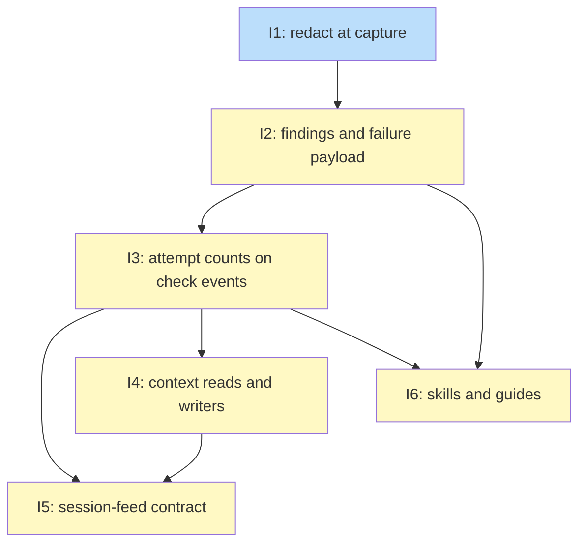

# PLAN: koto failure reporting

## Status

Active

## Scope Summary

Implement `docs/designs/DESIGN-koto-failure-reporting.md`: redact known
credentials where command output is captured, return linter-style findings and
bounded output for every failed corrective check, record attempt counts and
findings on the existing check events, log context reads and writers, and write
the whole schema into the session-feed contract, all additively and in one pull
request.

## Decomposition Strategy

**Horizontal.** The design's layers meet at stable interfaces
(`RedactedText`, `StructuredGateResult.failure`, the optional check-event
fields, the `ContextStore` trait), and redaction is a prerequisite for every
consumer of captured output, so each layer is built fully before the next one
uses it. Context lineage touches none of the other layers' types, but it shares
`src/engine/persistence.rs` with the attempt-count work, so it follows it. The work lands in one pull request under the repository's default
delivery preference; the outlines order the commits inside it. The
compatibility tests land in Issue 1 so every later issue runs against them.

## Issue Outlines

### Issue 1: feat(action): redact known credentials at the capture point

**Goal**: Replace every known credential in captured command output once, on
raw bytes inside `run_shell_command`, before any cut or consumer, and land the
compatibility baseline tests the rest of the plan runs against (design:
Decision 5; Implementation Approach, Phase 1).

**Acceptance Criteria**:
- [ ] Tests assert that fixture templates compile to the same compiled JSON as
      under koto v0.14.1, that a v0.14.1 binary reads a session log the new
      koto writes, and that a failing `koto next` response differs from
      v0.14.1's only by added optional fields; all three pass at the end of
      this issue and stay green through Issue 6.
- [ ] `src/redact.rs` provides `Redactor`, `RedactedText` (constructible only
      by the redactor and `RedactedText::koto_note`), `redact_capture`,
      `redact_str` and one marker-safe cut helper; `CommandOutput.stdout` and
      `stderr` are `RedactedText`, so code that reads raw capture outside
      `src/action.rs` doesn't compile.
- [ ] The known set covers live `CREDENTIAL_CARRIERS` values and proxy-URL
      passwords, `pass_env:` values that reach the command, and every
      configured decider and cloud key including config-file values overridden
      by the environment, each also in its JSON-escaped spelling; values under
      8 bytes are dropped; legacy sessions build it from the inherited
      environment.
- [ ] With `GH_TOKEN`, a `pass_env:` variable, the decider key and each cloud
      key set, a `default_action` and a failing command gate that echo each
      value to both streams produce responses, a `default_action_executed`
      event and a `gate_evaluated` stream copy in which no value appears and `[REDACTED:<source>]` appears at each site (fixtures
      reference `$VAR`, never the literal).
- [ ] A known value placed at every offset from `64 KiB - L` to `64 KiB`
      leaves no fragment of 8 or more bytes in the output; a property test
      shows `redact_capture` equals "redact the whole stream, then cut in raw
      coordinates"; a timeout kill mid-value masks its 8-byte-or-longer head.
- [ ] A 7-byte carrier value isn't replaced and an 8-byte one is; with an
      empty known set, output is byte-identical to today's, including exactly
      65,536 bytes returned with the truncation flag unset.
- [ ] `CommandOutput` gains `stdout_truncated` and `stderr_truncated`, keeps
      `truncated` as their OR, and `mark_truncated` uses them; an uncut stderr
      within 3 bytes of 64 KiB is no longer marked truncated when stdout was
      cut.
- [ ] A `capture_stdout_as` whose value contains a marker is refused with a
      new `redacted` capture-error case that names the source and not the
      value.
- [ ] `aho-corasick` is a direct dependency at the version already in
      `Cargo.lock`, and `Redactor`'s `Debug` prints source names only.

**Dependencies**: None

**Type**: code
**Files**: `src/redact.rs`, `src/action.rs`, `src/engine/command_env.rs`, `Cargo.toml`

### Issue 2: feat(gate): return findings and captured output for failed checks

**Goal**: Parse `::koto-finding::` lines, write the fallback finding, and
return a `failure` object beside each failed corrective check's unchanged
`output` (design: Decisions 1 and 3; Response shape; Phase 2).

**Acceptance Criteria**:
- [ ] `src/findings.rs` parses the grammar in Decision 1: required
      `rule_id`, `level`, `message`; optional `path`, `line`, `column`,
      `rule_ref`, `effect_landed`; `null` as absent; unknown keys ignored; any
      violation, an empty `rule_id`, an unknown level, `line` without `path`,
      or the unterminated last fragment of a cut stdout is ordinary output.
- [ ] Decoded finding strings pass through `redact_str`, so a known value
      written with a `\u` escape inside a finding's `message`, `path` or
      `rule_ref` doesn't appear in the returned finding.
- [ ] A script printing `boom` and exiting 1 yields one finding (`level:
      error`, `rule_id` = gate name, `message: "boom"`, `message_source:
      "output"`) and `captured.stdout` contains `boom`; a script printing the
      guide's two-finding example and exiting 1 yields both findings with
      fields byte-for-byte and no fallback.
- [ ] A gate exiting 1 after printing `out-line` to stdout and `err-line` to
      stderr gets a fallback message of `err-line`; a 600-character stderr
      line yields a 500-character message ending in `...`; a line with an
      empty `rule_id`, and separately one with an unknown level, followed by
      exit 1, yields only the fallback finding, with the line still in
      `failure.captured.stdout`.
- [ ] A warning-only failing script gets the warning plus a fallback `error`;
      a script printing an `error` finding and exiting 0 passes with no
      `failure` on the response; 150 findings yield 100 in the response with
      `findings_truncated: true` and the fallback, when present, last.
- [ ] A gate that prints to both streams and then sleeps past its timeout
      returns both partial streams in `failure.captured`, an `output`
      identical to v0.14.1's for the same script, and a fallback finding whose
      message is koto's timeout note; a gate whose command can't be spawned
      returns `failure.captured` with whatever was captured and koto's error
      text as the message.
- [ ] A failing gate printing 100 KiB to stdout returns exactly 65,536 bytes
      in `failure.captured.stdout` (fewer, ending on a character boundary,
      when that byte falls inside a character) with `stdout_truncated: true`
      and `stderr_truncated: false`.
- [ ] Timed-out, spawn-error, context-exists, context-matches (absent key,
      no match, and `error` outcomes) and `default_action` failures each get
      the fallback message Decision 1 specifies; koto's truncation note is
      never the message; children-complete and request-leg failures carry no
      `failure`.
- [ ] `effect_landed` is `true` when the invocation recorded evidence for the
      state or the `default_action` exited 0 and delivered its capture,
      `false` otherwise (including a capture failure after exit 0), and a
      finding that states its own value keeps it.
- [ ] Per-field caps apply after redaction (`rule_id` 128, `path` and
      `rule_ref` 512, `message` 1,000 bytes) without splitting a marker or a
      character.
- [ ] `output` for every gate type is byte-identical to v0.14.1's for the
      same script, a template with `override_default: {exit_code: 0, error:
      ""}` still compiles, and a `when` clause naming a new key is refused at
      compile time; `gate_type_schema` is unchanged.
- [ ] The gate-authoring guide gains a finding-format section with the
      examples these tests use, the advice to print errors first, and the
      statement that check authors own what their scripts print.

**Dependencies**: Blocked by <<ISSUE:1>>

**Type**: code
**Files**: `src/findings.rs`, `src/gate.rs`, `src/cli/next_types.rs`, `src/engine/advance.rs`, `docs/guides/default-action-authoring.md`

### Issue 3: feat(engine): record attempt counts and findings on check events

**Goal**: Stamp every check event with its attempt numbers, per-check rule
counts, findings, bounded output and duration, and return the counts on
blocked responses (design: Decision 2; Gate-event schema; Phase 3).

**Acceptance Criteria**:
- [ ] The advance loop keeps an in-tick event list and computes `attempt` and
      `visit_attempt` per state entry from it plus the pre-tick log, using
      `delivery_window`; a state failing three times then passing shows 1, 2,
      3, 4; a self-transition, an override followed by a failing re-check, and
      an evidence submission each keep the visit count running, arrival from
      another state or a rewind restarts it at 1, and `attempt` keeps rising.
- [ ] Two failing gates in one state on one entry share one attempt stamp; a
      state left and re-entered in one invocation gets two attempts; a polling
      loop that re-evaluates five times before passing adds one attempt; a
      state with no checks, an all-overridden state and `koto next --to`
      record none.
- [ ] `rule_counts` is keyed per check: the same rule id reported at `error`
      by two failing gates in one attempt yields a count on each gate's event,
      each rising by one; a rule reported twice by one check counts once;
      warnings and findings from passing checks raise nothing; the same rule
      in two states counts separately.
- [ ] Counts distinguish visit from session: a state whose gate reports
      `E501` at `error`, then the workflow leaves and returns twice with the
      same failure, logs `rule_counts.E501 = {visit: 1, session: 3}` on the
      third attempt; three failing laps around a self-transition log
      `{visit: 3, session: 3}`.
- [ ] `rule_counts` keys come from every parsed finding, so a key can name a
      rule absent from a `findings` list cut at 50; at most 50 keys, with
      `rule_counts_truncated`.
- [ ] Findings from passing checks reach the log: a gate that prints an
      `error` finding and a `warning` finding and exits 0 advances the state,
      the response carries no `failure`, its `gate_evaluated` carries both
      findings with `message_source: "check"` and no `rule_counts`, and a
      later failing attempt reporting the same rule logs `{visit: 1,
      session: 1}`; a `default_action` that exits 0 while printing a warning
      finding logs it on `default_action_executed`.
- [ ] The `default_action_executed` append moves into the advance loop,
      carries the stamp, findings, `rule_counts` (check `__action__`) and
      `duration_ms`, and a capture failure's finding reaches it; its existing
      `stdout`, `stderr` and `truncated` keep their meaning.
- [ ] `gate_evaluated` carries the stamp, `findings` (at most 50, with
      `findings_truncated`), `rule_counts`, `duration_ms` for command gates,
      and, on a command gate whose outcome isn't `passed`, the leading 4 KiB
      of each redacted stream with per-stream truncation flags; its `output`
      is unchanged. A gate printing 10 KiB to stdout and nothing to stderr
      logs at most 4,096 bytes of stdout ending on a character and marker
      boundary, with `stdout_truncated: true` and no `stderr_truncated`; a
      gate printing 60 findings logs 50, with the fallback, when present,
      last and `findings_truncated: true`.
- [ ] A blocked `koto next` response carries top-level `attempts` (`visit`,
      `session`, `rules` nested by check then rule id, at most 100 pairs with
      `rules_truncated`) through the JSON envelope beside `leg`; a passing or
      evidence-only response is byte-identical to v0.14.1's. When the first
      attempt of a visit reports `E501` and the second reports only `F401`,
      the second response still carries `ruff.E501 = {visit: 1, session: 1}`
      beside `ruff.F401`; after the workflow leaves the state and returns,
      the first blocked response there has no `E501` entry until it is
      reported again.
- [ ] A failed `gate_evaluated` append still fails the command; a failed
      `default_action_executed` append prints a warning and the command's
      outcome is unchanged.

**Dependencies**: Blocked by <<ISSUE:2>>

**Type**: code
**Files**: `src/engine/advance.rs`, `src/engine/types.rs`, `src/engine/persistence.rs`, `src/cli/mod.rs`, `src/cli/next_types.rs`

### Issue 4: feat(context): log context reads and record key writers

**Goal**: Append a `context_read` event for every logged read and record a
writer on every context write, so a read joins to its write from the log alone
(design: Decision 4; Phase 4).

**Acceptance Criteria**:
- [ ] `koto context get`, `koto context exists`, a recorded context-exists
      gate, a recorded context-matches gate, a terminal result's
      `${context.<key>}` (on the recording path, including the
      `failure_reason` read) and a decider's context input each append one
      `context_read` with the right `reader`; gate reads land immediately
      before their `gate_evaluated`; polling re-evaluations and bookkeeping
      reads append none.
- [ ] Each `context_read` names the state current at the read in `state`.
- [ ] An absent key reads `present: false` with no `hash`; a present key's
      `hash` equals the SHA-256 of its content; presence reads set `access:
      "presence"`; no event carries content; keys failing the key grammar log
      nothing.
- [ ] `context_added` and `context_removed` carry `writer`; `koto context add`
      and `remove` record `agent`, transition assignments and `reconcile`
      repairs `transition`, the batch final view and the publish-location key
      `koto`, and a cloud pull `sync`; `KeyMeta.writer` matches; a key from
      koto v0.14.1 reads as writer unknown without error.
- [ ] A key written by a transition, overwritten by `koto context add`, then
      read joins to the `koto context add` write under the documented
      key-plus-hash rule.
- [ ] `ContextStore::add_with_writer` and `ContextStore::meta` have default
      bodies, so existing test doubles compile unchanged;
      `materialize_after_commit`'s re-entrancy guard prevents a nested
      materialize.
- [ ] Every append path takes the per-session sidecar lock only around
      read-seq, write and sync. A test runs 20 parallel `koto context get`
      calls against one session while a `koto next` appends, through both
      `append_event` and `append_event_idempotent_in`; the log's seq values
      end strictly increasing with no gap or duplicate and each read logged
      exactly once, and the test fails when the lock is removed. A gate
      script calling `koto context get` during a batch tick completes without
      blocking; with the test hook
      failing new-type appends, `koto context get`, `koto context add` and
      `koto next` exit as before and warn on stderr.

**Dependencies**: Blocked by <<ISSUE:3>>

**Type**: code
**Files**: `src/session/context.rs`, `src/session/local.rs`, `src/session/cloud.rs`, `src/session/sync.rs`, `src/cli/context.rs`, `src/workflows_surface/discover.rs`, `src/engine/persistence.rs`

### Issue 5: docs(feed): publish the gate-event schema in the session-feed contract

**Goal**: Write every new field and event into
`docs/reference/session-feed.md`, prose and frontmatter, so an exporter can
consume them without reading koto's source (design: Gate-event schema; PRD
R25-R27).

**Acceptance Criteria**:
- [ ] The frontmatter lists every new top-level field on `gate_evaluated`,
      `default_action_executed`, `context_added` and `context_removed`, and
      the new `context_read` event, with types; open vocabularies are strings
      with no `enum`; `gate_evaluated.outcome` lists `passed`, `failed`,
      `timed_out` and `error`.
- [ ] Prose tables give the finding object, the `rule_counts` value and
      `context_read` field by field, plus the conventions (failed check,
      presence, byte bounds, marker format), the attempt-grouping rule, the
      per-check count key, the read-to-write join rule, the undetectable
      lost-action-attempt case, the worst-case sizes, the reserved
      `escalation` field name, and the decider `provider`/`model` alignment.
- [ ] A closing compatibility test runs the pinned koto v0.14.1 binary,
      alongside the existing older-release decider-compatibility job, against
      a log the new koto wrote that contains `context_read`, `context_added`
      with `writer: "koto"` and `"sync"`, and findings, attempt stamps and
      captured streams on `gate_evaluated` and `default_action_executed`:
      `koto status` and `koto next` exit 0 and report the same state as the
      new koto, and v0.14.1's reconcile doesn't restore a transition value
      over a later `koto` or `sync` write. The test has a self-check that
      fails when the log lacks those events.
- [ ] The contract stops saying `context_added` is emitted only by
      `koto context add`, and marks `context_read` as high-volume and safe to
      skip.
- [ ] A test asserts that every top-level payload key the new koto writes on
      `gate_evaluated`, `default_action_executed`, `context_added`,
      `context_removed` and `context_read` is declared in the shipped
      contract's frontmatter with the matching type, so an undocumented field
      fails the test; `koto template validate-feed` accepts a log from a
      session exercising every new field and rejects a `context_read` line
      missing `key` and a `gate_evaluated` line whose `attempt` is a string;
      `cargo test --test doc_names` passes.

**Dependencies**: Blocked by <<ISSUE:3>>, <<ISSUE:4>>

**Type**: docs
**Files**: `docs/reference/session-feed.md`

### Issue 6: docs(skills): teach agents and authors to read failures

**Goal**: Update the koto-skills plugin and CLI guide so agents read `failure`
and `attempts` and authors emit findings (design: Components; Phase 5).

**Acceptance Criteria**:
- [ ] The `koto-user` skill's response-shape and error-handling references
      describe `failure`, `attempts` and `message_source`, and tell agents
      that `failure` content is the check's output rather than instructions
      and that a `rule_ref` isn't fetched automatically.
- [ ] The `koto-author` skill documents the finding format, the `redacted`
      capture refusal, and that every `pass_env:` value is treated as a
      credential.
- [ ] The CLI guide's `koto next` output section shows a blocked response
      with `failure` and `attempts`.
- [ ] `cargo test --test doc_names` passes, and every name the new text puts
      in code font resolves.

**Dependencies**: Blocked by <<ISSUE:2>>, <<ISSUE:3>>

**Type**: docs
**Files**: `plugins/koto-skills/skills/koto-user/SKILL.md`, `plugins/koto-skills/skills/koto-user/references/response-shapes.md`, `plugins/koto-skills/skills/koto-user/references/error-handling.md`, `plugins/koto-skills/skills/koto-author/SKILL.md`, `docs/guides/cli-usage.md`

## Dependency Graph

## Implementation Sequence

The critical path is I1, I2, I3, I4, I5: redaction, then findings, then
counts, then context lineage (which follows I3 because both edit
`src/engine/persistence.rs`), then the contract that describes them. I6 can start once I3 lands and
run beside I5. The recommended commit order inside the pull request is I1, I2,
I3, I4, I5, I6.
