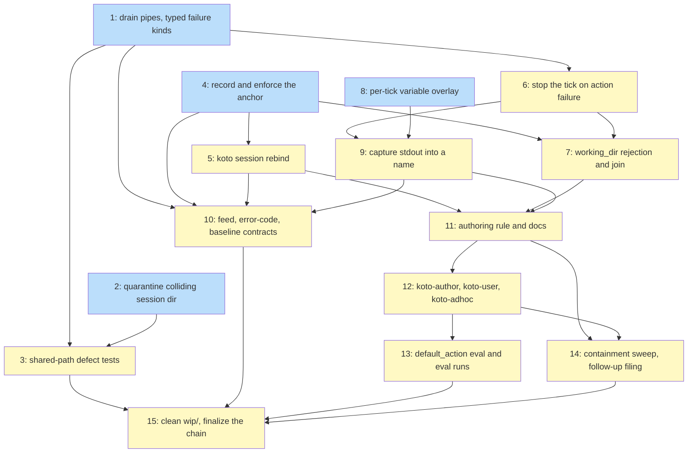

# PLAN: koto runs the mechanical commands

## Status

Active

## Scope Summary

Make `default_action` a capability an author can trust: a command's stdout reaches later
states through a declared name, a failing command stops the tick and hands the agent the
command's own output plus the author's fallback prose, every tick executes at a directory
the session is bound to, and the two defects underneath the shared command runner — the
pipe-buffer deadlock and the repeating migration warning — are fixed for gates and
actions alike. Fifteen issues land in one pull request.

## Decomposition Strategy

**Horizontal.**

Walking skeleton was considered and rejected. Its case is a new feature whose end-to-end
flow does not exist yet and whose layers carry integration risk. Neither holds here.
`default_action` shipped in March 2026 and works in the current binary:
`run_shell_command` runs, the advance loop calls it, a response comes back. What is
missing is everything *around* the command, and each missing piece attaches to a
different, already-stable seam. A skeleton issue would have nothing left to stub.

The cut follows the design's decisions rather than the code's layers, and three of those
decisions are what shape it.

**Decision 3 — a failed action short-circuits the state's own gates — is why the failure
path is one issue and not two.** The exploration recommended synthesizing a failed gate
result only for the gate-less case, leaving gated states untouched. R6 does not permit
that: a state whose action fails and whose gates then pass would advance, which is the
silent advance R6 exists to forbid. The design chose one code path and one documented
rule — a state's gates judge the work the action did, so when the action did not happen
there is nothing for them to judge. Splitting the gate-less and gated cases across issues
would have reproduced the two-path shape the decision deliberately collapsed.

**The capture-failure model is why output routing depends on the failure path rather
than sitting beside it.** The exploration recommended validate-then-skip. The design
rejected it on three grounds — a skip is the silent drop R3 forbids; a skipped capture
defers the error to the reading state, where it names a variable instead of the command
that failed to produce it; and two failure models would mean an author's `fallback:`
prose is delivered for some failures and not others. Because a failed capture *is* an
action failure, Issue 9 cannot precede Issue 6. That is a real edge, not a convenience.

**The variable overlay is why one issue in this plan changes no behavior at all.** The
design names three staleness sites — the pre-loop `Variables` binding used for the final
directive substitution, the once-built `workflow_variables` map used for `vars.*`
when-clauses, and the gate and action closures substituting into command strings — and
warns that a future consumer inside the advance loop that forgets the overlay
reintroduces the bug in a narrow form. Wiring the overlay piecemeal inside the issues
that happen to need it would guarantee exactly that. So Issue 8 wires all three sites
against an empty map as a behavior-neutral refactor, and Issue 9 only writes to a path
that is already live everywhere. The cost is one issue that ships no user-visible change;
the design's Mitigations section asks for precisely this shape.

The remaining order is dependency, not preference: the runner has to report typed failure
kinds before the failure model can name one (Decision 10), and `working_dir` resolution
needs both the anchor to join against (Decision 7) and the failure model to reject a
substituted absolute value through (Decision 8).

### Execution mode: one pull request

koto declares no `## Delivery Preference:` header, so the preference resolves to
`consolidated` and the default is one PR. No split branch fires, and none is recorded.

The Incremental Value branch was genuinely available and was declined on balance, which
is worth stating rather than leaving as a silence. Three candidate units would each have
passed the value test: the shared-path defects (Issues 1-3) reach gate authors in the
current release, where no template declares an action at all; anchoring (Issues 4-5)
closes Story 3 on its own; the failure path and output routing (Issues 6-9) close
Stories 1 and 2. The design's own Implementation Approach is written to permit exactly
that split.

Three things decided against it. There is no Hard Constraint — one design, one milestone,
one repository, no cross-repo landing order, no merge gate, no workflow that must reach
the default branch first — so the split would have been elective. The cost is real rather
than notional: three PRs touching skill content mean three manual eval runs and three
skill-assessment passes, and the documentation R21 and R22 demand is written against the
settled whole, so a per-slice version gets rewritten at the end anyway. And the chain's
four artifacts finalize once, in a single commit that also empties `wip/` — under a split
that finalization rides the last PR, making the last PR partly bookkeeping, which is the
mis-decomposition the value check exists to refuse.

**If the deadlock fix is wanted sooner, Issues 1 through 3 are cleanly extractable.**
They depend on nothing else in the plan, they touch `src/action.rs`, `src/gate.rs`,
`src/session/local.rs`, and new test files only, and they carry their own acceptance
criteria. Pulling them into a preceding PR needs no re-planning — only the decision.

### What the plan carries beyond the code

Five of the fifteen issues are not implementation. That is deliberate and it is what
"ready to land on main" costs here:

- **Tests** (Issues 3, 13). koto has no test exercising command output above the pipe
  buffer or the truncation path today, so R18 and R19 arrive with new files rather than
  modified ones. The `default_action` authoring eval does not exist either.
- **Contract** (Issue 10). `docs/reference/session-feed.md` is machine-consumed —
  `src/cli/validate_feed.rs:43` resolves that exact path — so three unregistered events
  make a conforming log fail validation. `docs/reference/error-codes.md` and
  `NextErrorCode` carry the machine-readable codes R12, R15, and R4 all demand.
- **Documentation** (Issues 11, 12). The engine-runnable rule of R21 has no home in the
  tree today, and the repository's standing rule requires both packaged skills to be
  assessed after any `src/` change.
- **Landing** (Issues 14, 15). R17's containment-language sweep spans everything the
  other issues wrote; CI refuses to merge while `wip/` holds a file, and this branch
  carries the exploration and chain artifacts.

## Issue Outlines

### Issue 1: fix(action): drain command pipes on reader threads and report typed failure kinds

**Goal**: Make `run_shell_command` return the command's real output and a typed failure
kind for every outcome, so gate and action callers stop losing large output and stop
telling failures apart by searching stderr.

**Acceptance Criteria**:
- [ ] `run_shell_command` spawns one reader thread per pipe, each reading to end, and
      joins them after `wait_timeout`; reading no longer happens only inside the
      `Ok(Some(status))` arm.
- [ ] The readers keep draining after the retention bound is reached and retain only the
      first N bytes, so a command emitting more than the bound never blocks.
- [ ] The bound is `MAX_ACTION_OUTPUT_BYTES` (64KB, `src/cli/mod.rs:61`), named
      explicitly, and it now applies to gate commands as well as action commands — today
      it applies to action output after the fact and never to gates (R19).
- [ ] `CommandOutput` carries a `truncated` flag set when retention dropped bytes.
- [ ] The `default_action_executed` event gains `truncated` alongside its existing
      `stdout` and `stderr`, so an over-bound action output is marked as truncated in the
      event log and not only in the response (R19, R25).
- [ ] `CommandOutput` carries a `failure_kind` discriminator covering every path that
      returns `-1` today: `spawn_failed` (`src/action.rs:53`), `timed_out` (`:96`), and
      `wait_failed` (`:102`), plus `nonzero_exit`. All four are needed — deleting the
      stderr match without a kind for the wait-error arm would lose its routing.
- [ ] `exit_code` keeps its current values so success-path gate evidence stays
      byte-identical (R24).
- [ ] On timeout the process group is still killed, and the result carries whatever the
      command produced before the kill instead of two empty strings (R18, R8).
- [ ] `src/gate.rs` reads `failure_kind`, and the stderr substring match at
      `src/gate.rs:209-221` is deleted.
- [ ] `timed_out` maps to `GateOutcome::TimedOut` and `wait_failed` and `spawn_failed`
      map to `GateOutcome::Error`, preserving today's routing exactly.
- [ ] Gate evidence gains a `failure_kind` key additively; the existing
      `{"exit_code": -1, "error": "timed_out"}` shape is preserved so nothing reading
      `error` moves.
- [ ] Unit tests in `src/action.rs` cover each of the four failure kinds and the
      truncation flag.
- [ ] `cargo test`, `cargo clippy`, and `cargo fmt --check` pass.

**Dependencies**: None

**Type**: code
**Files**: `src/action.rs`, `src/gate.rs`, `src/engine/types.rs`

### Issue 2: fix(session): quarantine a colliding session directory so migration completes

**Goal**: Stop `migrate_if_needed` reprinting the same warning on every invocation by
moving the colliding directory aside so the old-layout directory drains and is removed.

**Acceptance Criteria**:
- [ ] On a name collision the colliding session directory is moved to
      `<base>/.migration-conflicts/<repo-id>/<name>/` — moved, never deleted — and the
      warning names the destination.
- [ ] `list()` does not surface the quarantine container, because listing requires a
      state file at `<dir>/<state_file_name(dir_name)>` (`src/session/local.rs:111-114`)
      and a dot-prefixed container has none.
- [ ] After the move the old-layout directory drains and the trailing `fs::remove_dir`
      at `src/session/local.rs:718` succeeds, so the condition is gone rather than
      suppressed.
- [ ] One colliding session produces at most one message across many invocations (R20).
- [ ] Two colliding sessions each produce their own single message; one session's notice
      does not suppress the other's (R20).
- [ ] A test asserts the quarantined session's contents are intact at the new location.
- [ ] R20's general half is recorded as a stated convention in koto's contributor
      documentation: a new diagnostic describing a durable condition is fixed at its
      source or recorded on the session, never printed once per invocation.
- [ ] `cargo test`, `cargo clippy`, and `cargo fmt --check` pass.

**Dependencies**: None

**Type**: code
**Files**: `src/session/local.rs`

### Issue 3: test(action): cover the shared-path defects end to end

**Goal**: Prove R18, R19, and the R18/R20 interaction against the real pipe buffer, in
new test files — koto has no test exercising output above the pipe buffer or the
truncation path today, so this is coverage that does not exist rather than coverage being
extended.

**Acceptance Criteria**:
- [ ] The platform pipe buffer is measured at test time rather than assumed.
- [ ] A gate command emitting slightly above the measured buffer completes, is evaluated
      on its real exit status, and is not reported as a timeout (R18).
- [ ] The same gate case at several megabytes behaves identically (R18).
- [ ] A `default_action` at both output sizes completes and its output reaches the two
      channels that carry it at this point in the sequence: the `default_action_executed`
      event's `stdout` and `stderr` fields, and `ActionRequiresConfirmation`'s
      `action_output` (R18). Delivery through a declared capture name is Issue 9's
      coverage, because the advance loop still discards the action's fields here
      (`src/engine/advance.rs:291-293`).
- [ ] Output above the bound arrives truncated and explicitly marked as truncated, for a
      gate and for an action (R19).
- [ ] An action output above the bound is marked truncated in the event log as well as in
      the response (R19, R25).
- [ ] A gate or action that invokes `koto` as a subprocess under the condition that
      previously produced repeated warnings completes without a pipe-buffer deadlock or a
      false timeout (R18, R20).
- [ ] The tests live in a new file under `tests/` rather than being appended to
      `tests/integration_test.rs`.

**Dependencies**: Blocked by Issue 1, Issue 2

**Type**: code

### Issue 4: feat(engine): record a session execution anchor and enforce it on every tick

**Goal**: Bind a session to the directory it was created in, refuse a tick from anywhere
that does not satisfy the anchor, and run every gate and action of the tick at the anchor
itself.

**Acceptance Criteria**:
- [ ] `StateFileHeader` gains `execution_dir: Option<PathBuf>` with
      `#[serde(default, skip_serializing_if = "Option::is_none")]`, canonical, recorded at
      `koto init` — the additive pattern `template_source_dir` and `intent` already use
      (R11, R24).
- [ ] `koto init --execution-dir <dir>` overrides the default; every existing invocation
      keeps working unchanged.
- [ ] The check runs at the top of `handle_next`, before the template is compiled and
      before any gate or action closure is built, so "no action executed, no gate
      evaluated, no transition" holds structurally rather than by discipline (R12).
- [ ] A tick from a directory that is neither the anchor nor beneath it is refused, and
      the refusal names the bound directory (R12).
- [ ] A recorded anchor that does not resolve is refused with a *distinct* condition
      pointing at the rebind verb (R15), by extending
      `src/engine/template_source_status.rs` rather than duplicating it.
- [ ] Both refusals are machine-readable rather than distinguishable only by wording:
      each gets its own `NextErrorCode` variant with an exit-code class, an entry in
      `docs/reference/error-codes.md`, and coverage in
      `tests/error_envelope_schema_test.rs`. The enum's own doc comment
      (`src/cli/next_types.rs:692`, "The nine error codes") is updated to match.
- [ ] Comparison is byte-exact over `fs::canonicalize` output. Tests cover all three cases
      the PRD names — a symlinked path, a trailing-slash variant, and a path differing
      only in case — and each matches what the documentation will say for it.
- [ ] Every gate and every action of an accepted tick runs at the anchor rather than at
      the process cwd, so a command means the same thing from any subdirectory
      (Decision 7 option A).
- [ ] Moving to a non-satisfying directory between two ticks of the same session is caught
      on the second tick, confirming the check is per-tick rather than per-session (R12).
- [ ] A session with no recorded anchor adopts the current canonical cwd on its first
      tick, appends `ExecutionAnchorAdopted`, and prefixes exactly one notice onto the
      directive; the next tick finds the anchor recorded and takes the ordinary path
      (R14, R24).
- [ ] A child session's header copies the parent's `execution_dir` explicitly at creation
      (`src/cli/init_child.rs`), with a test asserting the child's recorded header value —
      not merely that the child happens to run in the same place (R16).
- [ ] `cargo test`, `cargo clippy`, and `cargo fmt --check` pass.

**Dependencies**: None

**Type**: code
**Files**: `src/engine/types.rs`, `src/cli/mod.rs`, `src/cli/next_types.rs`, `src/engine/template_source_status.rs`, `src/cli/init_child.rs`, `docs/reference/error-codes.md`

### Issue 5: feat(cli): add `koto session rebind`

**Goal**: Give a developer whose checkout genuinely moved one deliberate command that
repoints a session's anchor and records the change.

**Acceptance Criteria**:
- [ ] `koto session rebind <name> [--to <dir>]` canonicalizes the target, defaulting to
      the current directory, writes it to the header, and appends
      `ExecutionAnchorRebound { from, to }` (R13).
- [ ] A test asserts no other code path writes `execution_dir` except `koto init`'s
      initial record, the R14 adoption, and this verb — so "the only verb that changes an
      anchor" is checkable rather than asserted.
- [ ] After a rebind, a tick succeeds in the new directory and is refused in the old one.
- [ ] It works on a session created by another session (R16).
- [ ] It succeeds on a session whose recorded anchor does not resolve — that is the case
      R15's refusal points it at.
- [ ] `cargo test`, `cargo clippy`, and `cargo fmt --check` pass.

**Dependencies**: Blocked by Issue 4

**Type**: code
**Files**: `src/cli/session.rs`, `src/engine/types.rs`

### Issue 6: feat(engine): stop the tick when a `default_action` fails

**Goal**: Make a failing action stop the workflow at the state that ran it and hand the
agent the command's own facts alongside the author's fallback prose, in the same tick.

**Acceptance Criteria**:
- [ ] `ActionDecl` gains `fallback: Option<String>`; a template that declares none still
      compiles and still stops on failure, with no prefix on the response (R9, R24).
- [ ] `__action__` is reserved, and the compiler rejects a gate declared with that name.
- [ ] A failing action synthesizes a reserved `__action__` gate result routed through the
      existing `StopReason::GateBlocked` path, so no eighth `NextResponse` variant, no
      `Serialize` arm, and no combinator sweep appears.
- [ ] The state's own gates do not evaluate when its action failed (R6, R7). Because the
      short-circuit runs first, an action failure can never be detected *by* a gate — the
      second clause of R8 is unreachable by construction, and this is recorded in the code
      and in Issue 11's documentation rather than left for a reader to wonder about.
- [ ] The failure check runs before the `requires_confirmation` branch
      (`src/cli/mod.rs:4038-4051`), so a failing action produces a failure stop whether or
      not the flag is set, and the confirm stop is reached only on success.
- [ ] `ActionRequiresConfirmation` keeps its existing `action_output` field unchanged.
- [ ] The `__action__` `BlockingCondition` carries `condition_type: "action"`,
      `agent_actionable: false`, `category: "corrective"`, and an `output` object with
      `command`, `failure_kind`, `stdout`, `stderr`, `truncated`, and `state`. `exit_code`
      is present only for `nonzero_exit`; the other kinds omit it rather than reporting a
      synthetic `-1` (R8, R10).
- [ ] `wait_failed` is carried through as an action failure like the other kinds. The
      design names four; the runner has a fifth arm, and leaving it undiscriminated would
      keep the stderr match load-bearing.
- [ ] The `fallback` prose is spliced onto the directive with `with_directive_prefix`
      (`src/cli/next_types.rs:245`), not placed in `details`, so
      `with_details_suppressed_unless_full` cannot withhold it (R9).
- [ ] A state with an action that exits non-zero and no gates does not transition (R6, R7).
- [ ] A state whose action names a command that does not exist does not transition, and
      the response says the command could not be started (R6, R8).
- [ ] A state whose action exceeds its timeout does not transition, and the response says
      it timed out (R6, R8).
- [ ] A state with an action that exits non-zero and one or more gates does not transition
      (R6).
- [ ] A `default_action` that exits zero produces the same transition behavior as the
      current release (R24).
- [ ] The stop is reported in the tick that ran the command; no second `koto next` is
      needed to learn why the workflow stopped or what to do instead (R26).
- [ ] `cargo test`, `cargo clippy`, and `cargo fmt --check` pass.

**Dependencies**: Blocked by Issue 1

**Type**: code
**Files**: `src/template/types.rs`, `src/engine/advance.rs`, `src/cli/mod.rs`, `src/cli/next_types.rs`

### Issue 7: feat(template): reject an absolute `working_dir` and resolve it against the anchor

**Goal**: Close the `Path::join` escape, where an absolute argument silently discards the
base and lets a `working_dir` leave the anchor while appearing contained.

**Acceptance Criteria**:
- [ ] A literal absolute `working_dir` in a template is a compile error.
- [ ] An absolute result *after* substitution — reachable when the value came from a
      variable — is an action failure under Issue 6's model, with a message naming the
      field.
- [ ] Only after both rejections is the value joined to the anchor, canonicalized, and
      refused if the result escapes the anchor via `..`.
- [ ] The three steps appear in that order in the code.
- [ ] A test covers the variable-derived absolute case, which is the one a join-first
      implementation would silently pass.
- [ ] A separate test covers a relative value that escapes via `..` after
      canonicalization.
- [ ] `cargo test`, `cargo clippy`, and `cargo fmt --check` pass.

**Dependencies**: Blocked by Issue 4, Issue 6

**Type**: code
**Files**: `src/template/types.rs`, `src/cli/mod.rs`

### Issue 8: refactor(engine): thread a per-tick variable overlay through the advance loop

**Goal**: Introduce the overlay and wire all three staleness sites to it with no behavior
change, so the capture work that follows lands on a substitution path that is already
live everywhere it needs to be.

**Acceptance Criteria**:
- [ ] `handle_next` creates a `RefCell<HashMap<String, String>>` for the tick and passes
      it as an explicit parameter — never read from a global — to the gate closure, the
      action closure, `advance_until_stop`, and the final `with_substituted_directive`
      call.
- [ ] `advance_until_stop` reads the overlay at each iteration for `vars.*` when-clause
      evaluation in place of the once-built `workflow_variables` map
      (`src/engine/advance.rs:202-210`).
- [ ] Lookup order is fixed and documented in code: runtime names (`SESSION_DIR`,
      `SESSION_NAME`) first, then the overlay, then the `WorkflowInitialized` bindings.
- [ ] A unit test seeds a **non-empty** overlay and asserts each of the three sites
      resolves from it: a directive substitution, a `vars.*` when-clause, and a command
      string in a gate or action closure. Without this the issue is satisfiable by
      threading the value and never reading it, and behavior-neutrality guarantees no
      existing test would catch that.
- [ ] The overlay is per-tick and lives only as long as the call; the event log stays the
      durable record.
- [ ] With an empty overlay every existing test passes unchanged.
- [ ] `cargo test`, `cargo clippy`, and `cargo fmt --check` pass.

**Dependencies**: None

**Type**: code
**Files**: `src/engine/substitute.rs`, `src/engine/advance.rs`, `src/cli/mod.rs`

### Issue 9: feat(engine): capture a command's stdout into a declared name

**Goal**: Let a state declare a name for its command's output and make that value readable
from a later state's prose, including when the engine auto-advances to the reading state
within the same tick.

**Acceptance Criteria**:
- [ ] `ActionDecl` gains `capture_stdout_as: Option<String>`; a state that declares no
      name behaves byte-identically to the current release (R1, R24).
- [ ] The compiler validates `{{KEY}}` references against the union of the `variables:`
      block, the template's capture names, and `RUNTIME_VARIABLE_NAMES`, keeping the
      existing check at `src/template/types.rs:782-841` and its message shape (R4, typo
      case).
- [ ] A capture name colliding with a declared variable, a reserved runtime name, or
      another state's capture name is a compile error (R5, duplicate case).
- [ ] `koto init --var <capture-name>=...` is rejected for the same reason an unknown
      variable is.
- [ ] `EventPayload::VariableCaptured { key, value }` is added additively across its four
      fixed touchpoints, and `CURRENT_SCHEMA_VERSION` does not move.
- [ ] `Variables::from_events` folds `VariableCaptured` in event order, so re-entering the
      producing state means later wins (R5).
- [ ] Capture delivery runs in this order: trim leading and trailing whitespace, reject
      empty, reject over `MAX_CAPTURE_BYTES` (4096), reject on `validate_value`, then
      append the event and write the overlay.
- [ ] `validate_value` is reused, not reimplemented, so a future widening of the allowlist
      is a single reviewed change both paths inherit.
- [ ] Each of the three delivery failures is an action failure under Issue 6's model —
      same stop, same response shape, same fallback prose — with a `capture_error` object
      in the `__action__` payload naming the key and the case, and the allowlist case
      naming the first rejected character position (R3).
- [ ] An unset capture name reaching substitution is a typed run-time stop naming the
      variable and the state that would have delivered it — not an empty string and not a
      raw token (R4, unset case) — carrying its own machine-readable code registered in
      `NextErrorCode` and `docs/reference/error-codes.md`. Declared `variables:` keep their
      current pass-through behavior (`src/engine/substitute.rs:136-141`).
- [ ] The same-tick case R2 exists for is covered by three separate assertions, one per
      overlay site: a later state's directive renders the captured value, a later state's
      `vars.*` when-clause evaluates against it, and a later state's gate or action command
      string substitutes it. A single directive test would leave two sites free to regress.
- [ ] The same value renders across ticks of the same session (R2).
- [ ] A captured value containing a `{{...}}` token is emitted literally, never
      re-expanded, because captures resolve in the final substitution layer.
- [ ] A rewind past the producing state leaves the captured value in place, matching what
      the documentation says (R5).
- [ ] `cargo test`, `cargo clippy`, and `cargo fmt --check` pass.

**Dependencies**: Blocked by Issue 6, Issue 8

**Type**: code
**Files**: `src/template/types.rs`, `src/engine/types.rs`, `src/engine/substitute.rs`, `src/engine/advance.rs`, `src/cli/mod.rs`, `src/cli/next_types.rs`, `docs/reference/error-codes.md`

### Issue 10: docs(reference): register the new events, header field, and codes in the machine-read contracts

**Goal**: Keep `koto validate-feed`, the error-code registry, and the byte-pinned response
baseline honest about everything the change added.

**Acceptance Criteria**:
- [ ] `docs/reference/session-feed.md` declares `variable_captured`,
      `execution_anchor_adopted`, and `execution_anchor_rebound` with their fields and tier
      assignments. This file is machine-consumed — `src/cli/validate_feed.rs:43` resolves
      that exact path — so an unregistered event makes a conforming log fail validation.
- [ ] The same file's `default_action_executed` entry gains the `truncated` field Issue 1
      added; its fields are pinned individually (`docs/reference/session-feed.md:194-211`),
      so an unlisted field is a contract break.
- [ ] The same file declares `execution_dir` on the header as an optional, nullable string
      alongside `template_source_dir`.
- [ ] `koto validate-feed` accepts a JSONL log containing all three new events, the new
      header field, and a `default_action_executed` carrying `truncated`; a test exercises
      that.
- [ ] `docs/reference/error-codes.md` documents every code Issues 4 and 9 added, with the
      exit-code class for each, and `tests/error_envelope_schema_test.rs` covers them.
- [ ] `tests/header_serde_round_trip.rs` covers the new header field, including a header
      written without it (R24).
- [ ] `tests/next_response_baseline.rs` is unchanged and still passes, verifying rather
      than assuming the design's claim that the seven-variant contract, its hand-rolled
      `Serialize`, and its three combinators were untouched.
- [ ] `docs/STABILITY.md`'s additive rule holds: `CURRENT_SCHEMA_VERSION` does not move.

**Dependencies**: Blocked by Issue 1, Issue 4, Issue 5, Issue 9

**Type**: code
**Files**: `docs/reference/session-feed.md`, `docs/reference/error-codes.md`, `tests/header_serde_round_trip.rs`

### Issue 11: docs(guides): publish the engine-runnable rule and complete `default_action` authoring documentation

**Goal**: Give an author one durable place that answers both "may the engine run this
command?" and "how do I write the action?", so neither question is re-derived.

**Acceptance Criteria**:
- [ ] Published guidance states the rule as the question an author asks — does the
      command's risk live in a bad success, or only in a bad failure? — with worked
      examples on both sides (R21).
- [ ] It classifies `gh pr create` as permanently agent-run and explains why no future
      koto capability changes that: no signal arriving afterward can un-fire an
      unrecallable, externally visible event (R21).
- [ ] It classifies at least one command as engine-runnable and explains that the failure
      path of R6 through R10 is what makes it so, with a worked example that actually runs
      (R21).
- [ ] It states that a command whose classification depends on an unverified claim about
      external visibility stays with the agent until the claim is checked (R21).
- [ ] The `default_action` documentation covers all six of R22's points — what the field
      accepts, how the command is invoked, what directory it runs in, what happens to its
      output, what happens when it fails, and how a failing action interacts with the
      state's gates — verifiable by reading for all six.
- [ ] The documented gates-after-failure rule and the `requires_confirmation` ordering
      match what the engine does (R7, R22).
- [ ] The capture allowlist, the 4096-byte capture bound, and the 64KB response bound are
      stated up front rather than discovered by hitting them, and the two bounds are stated
      separately with the reason they differ (R25).
- [ ] Anchoring's guarantee — every tick happens from the directory the session is bound
      to, checked per tick — is stated together with its explicit non-guarantee: a command
      can leave the anchored directory by absolute path or by changing directory (R17).
- [ ] The documentation states what anchor comparison does for a symlinked path, a
      trailing-slash variant, and a path differing only in case, matching the tests in
      Issue 4 — including that comparison does not case-fold on any platform.
- [ ] The documentation names which directory a child session is anchored to and how a
      developer rebinds one, naming `koto session rebind` (R16).
- [ ] What a rewind past the producing state does to a delivered value is documented and
      matches the behavior (R5).
- [ ] The live reference at
      `plugins/koto-skills/skills/koto-author/references/template-format.md` is the one
      updated; the PRD's `docs/template-format.md` citation is stale and no such file is
      created.

**Dependencies**: Blocked by Issue 5, Issue 7, Issue 9

**Type**: docs
**Files**: `docs/guides/default-action-authoring.md`, `plugins/koto-skills/skills/koto-author/references/template-format.md`

### Issue 12: docs(skills): bring koto-author, koto-user, and koto-adhoc up to the shipped surface

**Goal**: Discharge the standing rule that the packaged skills are assessed after any
`src/` change, and correct the dispatch-table drift the PRD names.

**Acceptance Criteria**:
- [ ] All three skills under `plugins/koto-skills/skills/` are assessed against the diff
      for broken contracts and new surface. `koto-adhoc` is included even though the
      repository's maintenance rule names only two, because R17's sweep reaches it in
      Issue 14 and no other issue would own the fix.
- [ ] The per-skill outcome — changed, or assessed and unaffected — is recorded in the PR
      description, so the assessment is a check rather than a claim.
- [ ] `koto-author` describes `capture_stdout_as`, `fallback`, the capture-name rules, the
      `__action__` reservation, and the absolute-`working_dir` rejection (R23).
- [ ] `koto-user` describes the action-failure response shape and its machine-readable
      discriminator, anchoring's two refusal codes, the one-time adoption notice, and
      `koto session rebind` (R23).
- [ ] `koto-author`'s dispatch table matches the shipped CLI surface (R23).
- [ ] No skill describes anchoring as containment, sandboxing, isolation, or a guard on
      what a command can touch (R17).

**Dependencies**: Blocked by Issue 11

**Type**: docs
**Files**: `plugins/koto-skills/skills/koto-author/SKILL.md`, `plugins/koto-skills/skills/koto-user/SKILL.md`, `plugins/koto-skills/skills/koto-user/references/response-shapes.md`, `plugins/koto-skills/skills/koto-user/references/command-reference.md`

### Issue 13: test(skills): add the `default_action` authoring eval and run evals for every changed skill

**Goal**: Make the skill changes measurable rather than asserted, which is what the
repository requires whenever skill content changes.

**Acceptance Criteria**:
- [ ] `plugins/koto-skills/skills/koto-author/evals/evals.json` gains a case whose
      authoring task requires writing a `default_action` with an output name and fallback
      prose, with assertions covering both.
- [ ] `scripts/run-evals.sh koto-author` passes its assertions and scores above the
      without-skill baseline (R22, R23).
- [ ] `scripts/run-evals.sh koto-user` passes after the change (R23).
- [ ] `koto-adhoc` evals are re-run if Issue 12 changed its content.
- [ ] `scripts/check-evals-exist.sh` still passes.
- [ ] Results are recorded in the PR description in the table format the repository
      specifies: skill, assertions, with_skill, without_skill, delta.

**Dependencies**: Blocked by Issue 12

**Type**: task
**Files**: `plugins/koto-skills/skills/koto-author/evals/evals.json`

### Issue 14: chore(docs): sweep containment language and file the event-log bounds follow-up

**Goal**: Discharge the two obligations that belong to the change as a whole rather than to
any one part of it.

**Acceptance Criteria**:
- [ ] `grep -ri` over koto's documentation, error strings, skills, and release notes for
      `sandbox`, `contain`, `isolat`, and `restrict` returns no line asserting that
      anchoring provides any of them. A line *denying* it is not a violation (R17).
- [ ] Every line the sweep surfaces is either corrected or recorded as a deliberate denial.
- [ ] A follow-up issue on the event log's content bounds is filed, which the PRD records
      this feature as owing and asks to be filed before the first template declares an
      action. The issue names the unbounded surfaces — the post-substitution command
      string, gate-override payloads, evidence fields, and init-time variables — and does
      not attempt the work, which is out of scope for this feature.

**Dependencies**: Blocked by Issue 11, Issue 12

**Type**: task

### Issue 15: chore(repo): clean wip/ and finalize the artifact chain

**Goal**: Get the branch into a state CI will merge, and leave the upstream artifacts at
their terminal statuses.

**Acceptance Criteria**:
- [ ] Every file under `wip/` is deleted, including the exploration artifacts and the
      research directory, which the finalization cascade does not own. CI fails the merge
      while any file remains there (`.github/workflows/validate.yml`).
- [ ] `git grep -n 'wip/'` over committed prose, frontmatter, and code returns no
      path-shaped reference; prose describing the hygiene rule itself is allowed.
- [ ] The BRIEF and the PRD transition to Done, the DESIGN transitions to Current, and this
      PLAN transitions Active then Done and is deleted — in one atomic finalization commit,
      before the pull request flips out of draft.
- [ ] `shirabe validate --lifecycle-chain` passes on the chain after the transitions.

**Dependencies**: Blocked by Issue 3, Issue 10, Issue 13, Issue 14

**Type**: task

## Dependency Graph

**Legend**: Green = done, Blue = ready, Yellow = blocked

## Implementation Sequence

### Critical path

`1 -> 6 -> 9 -> 11 -> 12 -> 13 -> 15` — seven issues deep. It runs from the runner's
typed failure kinds through the failure model, output routing, the authoring
documentation, the skills, the eval runs, and the landing commit. Every one of those
edges is a real dependency, not an ordering preference: the failure model cannot name a
failure kind the runner does not report, a failed capture has nowhere to go without the
failure model, the documentation states behavior that has to be settled, the skills
restate the documentation, and evals grade skill content.

Issue 8 is the one item that could lengthen the path if it slipped, since Issue 9 waits
on both 6 and 8. It has no dependencies of its own and changes no behavior, so it can be
done at any point before 9 — including first.

### Recommended order

`1, 2, 4, 8, 3, 6, 5, 7, 9, 10, 11, 12, 13, 14, 15`

This front-loads the four issues with no dependencies. Two notes on the ordering that the
graph deliberately does not encode as edges:

- **Do Issue 4 before Issue 8**, even though neither blocks the other. Both rewrite the
  top of `handle_next`; sequencing them avoids a conflict that has nothing to do with
  logic. Recording it as a blocker would falsely serialize independent work.
- **Issues 1 and 2 are independent of each other.** Only the combined nested-`koto`
  criterion needs both, and that lives in Issue 3, which depends on both.

### Deliberate non-edges

- **8 does not depend on 4.** The overlay needs no anchor and the anchor needs no
  overlay. File adjacency only — see the ordering note above.
- **2 does not depend on 1.** The migration quarantine is self-contained in
  `src/session/local.rs`.
- **6 does not depend on 4.** A failing action stops the tick whether or not the tick was
  anchored. Coupling them would make the failure path wait on anchoring for nothing.

### Parallelization

In a single-PR run on one branch these are sequential commits, so the absence of edges
among Issues 1, 2, 4, and 8 buys scheduling freedom rather than concurrency. It matters
in one case: if the deadlock fix is pulled into a preceding PR, Issues 1, 2, and 3 detach
cleanly, and the remaining twelve renumber with no edge changes.

### Landing

Issue 15 is last and must stay last: it empties `wip/` and transitions the upstream
artifacts, so anything that still has to write a file cannot come after it. Issue 14
likewise runs its sweep over the final text of the guides and the skills — running it
earlier certifies a state that Issues 11 and 12 then change.
