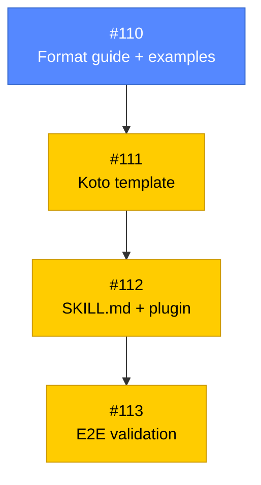

# PLAN: Koto template authoring skill

## Status

Active

## Scope summary

Build a self-hosted koto-backed skill (koto-author) within the existing koto-skills plugin that guides Claude Code agents through authoring new skills paired with koto workflow templates, supporting both new-from-scratch and conversion modes.

## Decomposition strategy

**Horizontal decomposition.** Components have clear interfaces and a natural build order: reference material -> template -> SKILL.md -> test. Each issue builds one layer fully before the next begins. No walking skeleton needed -- there's no complex integration risk between layers.

## Implementation issues

| Issue | Title | Dependencies | Complexity |
|-------|-------|-------------|------------|
| [#110](https://github.com/tsukumogami/koto/issues/110) | feat(koto-author): add condensed template format guide and graded examples | None | simple |
| [#111](https://github.com/tsukumogami/koto/issues/111) | feat(koto-author): create 8-state koto template for authoring workflow | [#110](https://github.com/tsukumogami/koto/issues/110) | testable |
| [#112](https://github.com/tsukumogami/koto/issues/112) | feat(koto-author): write SKILL.md and register in koto-skills plugin | [#111](https://github.com/tsukumogami/koto/issues/111) | testable |
| [#113](https://github.com/tsukumogami/koto/issues/113) | test(koto-author): end-to-end validation of new and convert modes | [#112](https://github.com/tsukumogami/koto/issues/112) | testable |

**#110** -- Create the reference material: condensed template format guide (~200-250 lines) organized by three conceptual layers, plus two graded example templates (evidence-routing and complex). References hello-koto as the simple example.

**#111** -- Write the skill's own 8-state koto template with MODE variable (new/convert), KOTO_REPO for dynamic guide discovery, compile validation self-loop, and context-exists gates. Must pass `koto template compile`.

**#112** -- Write the SKILL.md with koto execution loop and update plugin.json to register the skill. References the template and guide from prior issues.

**#113** -- End-to-end validation: invoke the skill in both new and convert modes, verify outputs compile and follow coupling conventions.

## Dependency graph

**Legend**: Blue = ready, Yellow = blocked, Green = done

## Implementation sequence

**Critical path**: #110 -> #111 -> #112 -> #113

All issues are on the critical path. No parallelization opportunities -- each issue depends on the previous one's output.

**Recommended order**: Start with #110 (reference material). Once that lands, proceed sequentially through #111, #112, #113.
