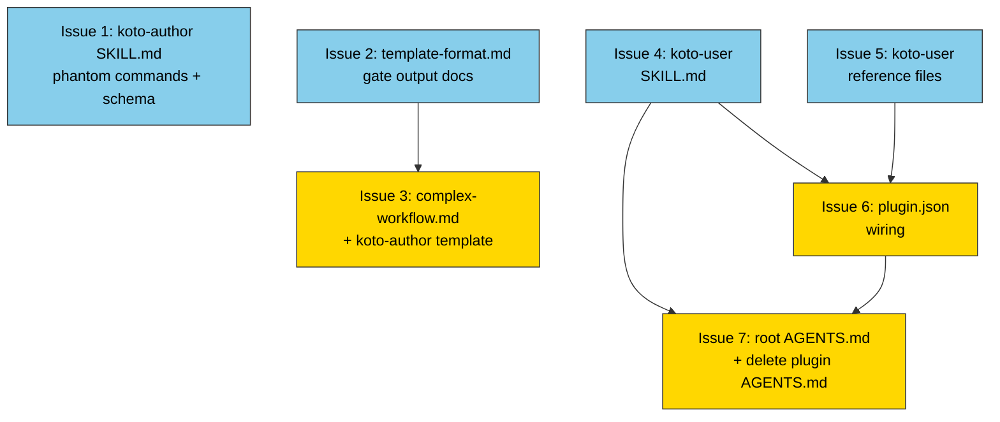

# PLAN: koto-user skill and koto-skills plugin update

## Status

Draft

## Scope Summary

Create the `koto-user` skill in the existing `koto-skills` plugin, fix four documentation gaps and two phantom commands in `koto-author`, and replace the plugin-buried `plugins/koto-skills/AGENTS.md` with a new root `AGENTS.md` scoped to the koto repo. All work lands in a single PR on the `docs/koto-user-skill` branch.

## Decomposition Strategy

**Horizontal decomposition.** All changes are documentation and configuration in one repo. The three design phases (koto-author corrections, koto-user creation, root AGENTS.md) decompose into independently workable issues. The koto-author and koto-user workstreams are fully independent and can proceed in parallel. Within each workstream, dependencies are sequential only where one issue's output (gate field names in Issue 2) is consumed by the next (Issue 3).

## Issue Outlines

### Issue 1: docs(koto-author): remove phantom commands and add blocking_conditions schema

**Complexity**: simple

**Goal**: Remove references to the non-existent `koto status` and `koto query` commands from `plugins/koto-skills/skills/koto-author/SKILL.md` and add the `blocking_conditions` item schema so authors know what fields each blocking condition carries.

**Research**: `wip/research/plan_koto-user-skill_catalog_cli.md` (confirms commands don't exist), `wip/research/plan_koto-user-skill_catalog_koto-author.md` (exact file + line gaps), `wip/research/plan_koto-user-skill_catalog_engine.md` (blocking_conditions schema)

**Acceptance Criteria**:
- [ ] `SKILL.md` contains no occurrences of `` `koto status` ``
- [ ] Each former `koto status` reference is replaced with `koto next <session-name>` (idempotent when called without `--with-data`); a note that `koto workflows` lists active sessions when the session name is unknown is added at least once in the same section
- [ ] `SKILL.md` contains no occurrences of `` `koto query` ``
- [ ] `SKILL.md` includes a `blocking_conditions` item schema table with all five fields: `name` (string, gate name), `type` (string, gate type), `status` (string: `failed` | `timed_out` | `error`), `agent_actionable` (boolean), and `output` (object, gate-type-specific structured result)
- [ ] The schema placement is adjacent to or immediately follows the existing `blocking_conditions` mention so the definition is co-located with its first use
- [ ] No other content in `SKILL.md` is changed beyond the phantom-command replacements and the schema addition

**Dependencies**: None

---

### Issue 2: docs(koto-author): extend template-format.md with gate output documentation

**Complexity**: testable

**Goal**: Extend `plugins/koto-skills/skills/koto-author/references/template-format.md` Layer 3 with per-gate output field tables, annotated `gates.*` routing examples, `override_default` documentation, `koto overrides record/list` CLI documentation, and the `--allow-legacy-gates` flag with the D5 diagnostic.

**Research**: `wip/research/plan_koto-user-skill_catalog_gates.md` (**critical: do not use `passed` — it is not a valid field in any gate type**), `wip/research/plan_koto-user-skill_catalog_koto-author.md` (exact gaps), `wip/research/plan_koto-user-skill_catalog_template.md` (Layer 3 current state), `wip/research/plan_koto-user-skill_catalog_prs.md` (PRs #120-#125 gap analysis)

**Acceptance Criteria**:
- [ ] Before writing any field names, read `src/gate/` source files (or `wip/research/plan_koto-user-skill_catalog_gates.md`) to verify exact field names and types. `passed` is not a valid field in any gate type and must not appear
- [ ] "Gate output fields" sub-table added covering all three gate types: `command` (`exit_code` number, `error` string), `context-exists` (`exists` boolean, `error` string), `context-matches` (`matches` boolean, `error` string)
- [ ] `gates.<gate_name>.<field>` path syntax documented with annotated YAML showing a `command` gate routing on `exit_code` and a `context-exists` gate routing on `exists`
- [ ] `override_default` documented inline with a YAML example; three-tier resolution order listed: (1) `--with-data`, (2) `override_default`, (3) built-in default
- [ ] Built-in defaults listed for all three gate types
- [ ] `koto overrides record` and `koto overrides list` documented with full signatures (`--rationale` required, `--with-data` optional)
- [ ] D5 diagnostic documented: trigger, error message, fix, and `--allow-legacy-gates` escape hatch (noted as transitional)
- [ ] The existing "Combining gates and evidence routing" example updated so every `when` clause on gate-bearing states references a `gates.<name>.<field>` path — no bare unconditional transitions remain on states that declare gates
- [ ] The updated example passes `koto template compile` without `--allow-legacy-gates` (exit code 0, no D5 error)
- [ ] No invalid field names (e.g., `passed`, `result`, `output`) appear anywhere in the added documentation

**Dependencies**: None

---

### Issue 3: docs(koto-author): update complex-workflow.md and koto-author template to gates.* routing

**Complexity**: testable

**Goal**: Update `complex-workflow.md` to replace legacy boolean gate patterns with `gates.*` field routing, and add the D5 error case to the `compile_validation` state in `koto-author.md` so authors know how to fix it.

**Research**: `wip/research/plan_koto-user-skill_catalog_template.md` (current template syntax), `wip/research/plan_koto-user-skill_catalog_tests.md` (functional test fixtures for ground-truth gate routing behavior), `wip/research/plan_koto-user-skill_catalog_gates.md`

**Acceptance Criteria**:
- [ ] `plugins/koto-skills/skills/koto-author/references/examples/complex-workflow.md` updated: `preflight` state routes on `gates.config_exists.exit_code` (0 to advance, non-zero to self-loop/halt)
- [ ] `complex-workflow.md` updated: `build` state routes on `gates.build_output.exists` (true to advance, false to self-loop/halt)
- [ ] Updated `complex-workflow.md` passes `koto template compile` without `--allow-legacy-gates` (exit code 0, no D5 error on stderr)
- [ ] `compile_validation` state in `plugins/koto-skills/skills/koto-author/koto-templates/koto-author.md` lists "No `gates.*` routing (D5)" as a named error case with fix instructions
- [ ] `template_exists` gate on `compile_validation` in `plugins/koto-skills/skills/koto-author/koto-templates/koto-author.md` is assessed: (a) if transitions already route via evidence `when` clauses and the gate is not load-bearing, document inline which specific `when` clause makes the gate redundant; (b) if the gate is load-bearing, add `gates.template_exists.exists: true` routing and verify the template passes `koto template compile` without `--allow-legacy-gates`
- [ ] No other states or files are changed beyond those listed above

**Dependencies**: Blocked by Issue 2 (gate field names must be established first)

---

### Issue 4: docs(koto-user): create SKILL.md

**Complexity**: testable

**Goal**: Create `plugins/koto-skills/skills/koto-user/SKILL.md` as the main entry point for the koto-user skill, covering the full runtime loop agents need to run a koto-backed workflow.

**Research**: `wip/research/plan_koto-user-skill_catalog_engine.md` (action values, sub-cases, field presence per action — all snake_case), `wip/research/plan_koto-user-skill_catalog_cli.md` (koto init, koto next flags), `wip/research/plan_koto-user-skill_catalog_agents-md.md` (content migration map from existing AGENTS.md)

**Acceptance Criteria**:
- [ ] File exists at `plugins/koto-skills/skills/koto-user/SKILL.md`
- [ ] Session lifecycle section shows three-step pattern: `koto init <name> --template <path>` → `koto next <name>` loop → `action: "done"` terminal signal
- [ ] Action dispatch table covers all 6 action values in snake_case: `evidence_required`, `gate_blocked`, `integration`, `integration_unavailable`, `done`, `confirm` — each with a one-liner describing expected agent behavior
- [ ] Three `evidence_required` sub-cases documented with distinguishing signals:
  - Sub-case (a): `blocking_conditions` empty, `expects.fields` non-empty — agent submits evidence directly
  - Sub-case (b): `blocking_conditions` non-empty AND `expects.fields` non-empty — gates failed but state accepts evidence; agent may submit evidence or record gate override first
  - Sub-case (c): both `expects.fields` and `blocking_conditions` empty — auto-advance candidate; agent calls `koto next <name>` without `--with-data`
- [ ] Evidence submission pattern inline: `koto next <name> --with-data '<json>'` with one-line example showing JSON keys matching `expects.fields`
- [ ] Override flow documented as two steps: (1) `koto overrides record <name> --gate <gate> --rationale <text>`, then (2) re-query with `koto next <name>`
- [ ] Links to all three reference files with one-line "when to follow" descriptions
- [ ] `directive` field documented as absent on `done` responses
- [ ] `agent_actionable` flag documented in context of `gate_blocked` or `blocking_conditions` item schema, with explicit contrast: `true` means `koto overrides record` can unblock; `false` means escalate to user rather than retrying

**Dependencies**: None

---

### Issue 5: docs(koto-user): create reference files

**Complexity**: testable

**Goal**: Create the three reference files under `plugins/koto-skills/skills/koto-user/references/` that document the full CLI surface, annotated response-shape scenarios, and error handling for workflow-runner agents.

**Research**: `wip/research/plan_koto-user-skill_catalog_cli.md` (all 23 subcommands, flags, exit codes), `wip/research/plan_koto-user-skill_catalog_engine.md` (JSON shapes per action value, details field gating), `wip/research/plan_koto-user-skill_catalog_session-context.md` (koto context subcommands), `wip/research/plan_koto-user-skill_catalog_guides.md` (safe pointer targets in docs/), `wip/research/plan_koto-user-skill_catalog_tests.md` (ground-truth behavior)

**Acceptance Criteria**:
- [ ] `command-reference.md` exists and covers all workflow-runner subcommands: `koto init`, `koto next` (all flags), `koto rewind`, `koto cancel`, `koto workflows`, `koto overrides record`, `koto overrides list`, `koto decisions record`, `koto decisions list`, `koto session dir`, `koto session list`, `koto session cleanup`
- [ ] `command-reference.md` includes all four `koto context` subcommands (`add`, `get`, `exists`, `list`) with their flags and the `context exists` exit-code-as-boolean contract (exit 0 = present, exit 1 = absent, no JSON error)
- [ ] Before writing `command-reference.md`, list all subcommands from `src/cli/mod.rs` and confirm each is represented or explicitly excluded with a rationale
- [ ] `command-reference.md` ends with last-resort pointer: *"For topics not covered here, see `docs/guides/cli-usage.md`."*
- [ ] `response-shapes.md` contains all 9 required annotated JSON scenarios with prose label and decision-point explanation: `evidence_required` sub-cases (a), (b), (c); `gate_blocked` with `agent_actionable: true`; `gate_blocked` with `agent_actionable: false`; `integration`; `integration_unavailable`; `done`; `confirm`
- [ ] Each scenario notes which fields are absent where relevant (especially `directive` absent on `done`; `details` conditionally absent; `blocking_conditions` absent on `integration`, `integration_unavailable`, `confirm`, and `done`)
- [ ] `response-shapes.md` ends with last-resort pointer to `docs/guides/cli-usage.md`
- [ ] `error-handling.md` documents exit codes 0-3 and full `NextErrorCode` table with exit code mappings
- [ ] `error-handling.md` covers `agent_actionable: false` scenario explicitly: agent cannot resolve, must report to user rather than retrying
- [ ] `error-handling.md` distinguishes the two error shapes: `koto next` domain errors (structured `{"error": {"code": "...", "message": "...", "details": [...]}}`) vs. all other subcommands (flat `{"error": "<string>", "command": "<name>"}`)
- [ ] `error-handling.md` ends with last-resort pointer to `docs/guides/cli-usage.md`
- [ ] All three files are plain Markdown with no YAML frontmatter

**Dependencies**: None

---

### Issue 6: feat(koto-skills): wire koto-user into plugin.json

**Complexity**: simple

**Goal**: Add `"./skills/koto-user"` to the `skills` array in `plugins/koto-skills/.claude-plugin/plugin.json` so the koto-user skill is installable alongside koto-author.

**Acceptance Criteria**:
- [ ] `plugins/koto-skills/.claude-plugin/plugin.json` contains `"./skills/koto-user"` in the `skills` array
- [ ] `plugins/koto-skills/skills/koto-user/SKILL.md` exists (required for plugin discovery)
- [ ] `plugin.json` remains valid JSON after the edit
- [ ] `koto-author` entry is unchanged

**Dependencies**: Blocked by Issue 4, Issue 5

---

### Issue 7: docs(koto): create root AGENTS.md and remove plugin AGENTS.md

**Complexity**: simple

**Goal**: Replace the 550-line `plugins/koto-skills/AGENTS.md` with a concise root `AGENTS.md` (≤80 lines) that orients agents and routes them to the appropriate skill.

**Research**: `wip/research/plan_koto-user-skill_catalog_agents-md.md` (migration map; all depth goes to koto-user reference files, NOT into root AGENTS.md), `wip/research/plan_koto-user-skill_catalog_cli.md` (correct command syntax)

**Acceptance Criteria**:
- [ ] `AGENTS.md` exists at the koto repo root
- [ ] `AGENTS.md` is ≤80 lines (including blank lines and command table)
- [ ] `AGENTS.md` contains a one-sentence orientation describing what koto is
- [ ] `AGENTS.md` contains a command quick-reference table with exactly these five commands and a one-line description: `koto init`, `koto next`, `koto overrides record`, `koto rewind`, `koto workflows`
- [ ] `AGENTS.md` contains a "which skill to use" routing section (2-4 lines) naming both `koto-author` (template authoring) and `koto-user` (running workflows)
- [ ] `AGENTS.md` includes a pointer to `docs/guides/cli-usage.md` for full CLI reference
- [ ] `plugins/koto-skills/AGENTS.md` is deleted
- [ ] No content from the deleted file is added to the root `AGENTS.md`; all migrated depth lives in the koto-user skill reference files

**Dependencies**: Blocked by Issue 4, Issue 6

## Dependency Graph

Legend: Blue = ready to start, Yellow = blocked by dependency

## Implementation Sequence

**Critical path**: Issue 4 → Issue 6 → Issue 7 (3 issues)

**Parallel path**: Issue 2 → Issue 3 (2 issues, fully independent from the koto-user workstream)

**Recommended order**:

1. **Start immediately in parallel**: Issues 1, 2, 4, 5 — all have no dependencies
   - Issues 1 and 2 are the koto-author corrections workstream
   - Issues 4 and 5 are the koto-user creation workstream

2. **After Issue 2 completes**: Issue 3 (consumes gate field names from Issue 2)

3. **After Issues 4 and 5 complete**: Issue 6 (wires the new skill into plugin.json)

4. **After Issues 4 and 6 complete**: Issue 7 (creates root AGENTS.md and deletes the old plugin AGENTS.md)

The koto-author workstream (Issues 1, 2, 3) and koto-user workstream (Issues 4, 5, 6, 7) are fully independent and can be implemented by different contributors or in any relative order.
