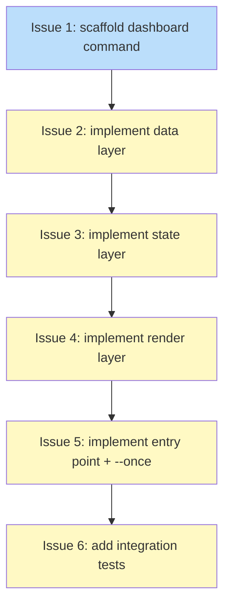

# PLAN: Local Dashboard

## Status

Draft

## Scope Summary

Implement the `koto dashboard` subcommand: a live ratatui TUI showing session hierarchy,
state, gate evaluations, and evidence for local koto sessions, plus a `--once` flag for
tab-separated scripting output.

## Decomposition Strategy

**Walking skeleton.** The three-layer architecture (data → state → render) has genuine
type dependencies flowing downward: the state layer holds `SessionTree` defined in the
data layer, and the render layer reads `DashboardAppState` defined in the state layer.
Issue 1 establishes the skeleton (stub signatures, new dependencies, binary compiles),
and Issues 2–6 fill in each layer in order. This surfaces any integration issues early
while keeping each issue independently reviewable.

## Issue Outlines

### Issue 1: feat(cli): scaffold dashboard command and module stubs

**Goal**: Scaffold the `koto dashboard` command by adding the `Dashboard` variant to
the `Command` enum, creating three stub module files with correct signatures, and adding
`ratatui` and `crossterm` to `Cargo.toml`.

**Acceptance Criteria**
- [ ] `Dashboard(DashboardArgs)` variant added to the `Command` enum in `src/cli/mod.rs`
- [ ] `src/cli/dashboard_data.rs` exists with stub: `pub fn refresh(tree: &mut SessionTree, backend: &dyn SessionBackend) -> anyhow::Result<()>`
- [ ] `src/cli/dashboard_state.rs` exists with `pub struct DashboardAppState` declaring all fields from the design (`tree`, `cursor_idx`, `view_mode`, `focused_id`, `expanded`, `should_quit`, `tick_count`, `poll_every_n_ticks`, `detail_cache`)
- [ ] `src/cli/dashboard_render.rs` exists with stub: `pub fn render_frame(f: &mut Frame, state: &DashboardAppState)`
- [ ] `ratatui = "0.29"` and `crossterm = "0.28"` present in `Cargo.toml`
- [ ] `cargo build` succeeds with no errors
- [ ] `koto dashboard --help` exits 0
- [ ] Working stubs delivered for downstream use (required by Issue 2)

**Dependencies**: None (skeleton issue)

---

### Issue 2: feat(cli): implement dashboard data layer

**Goal**: Implement the data layer for `koto dashboard` by writing all five functions in
`src/cli/dashboard_data.rs` along with `CachedSession`, `SessionTree`, and `DetailData`
structs.

**Acceptance Criteria**
- [ ] `CachedSession` struct defined with all fields: `header`, `current_state: Option<String>`, `is_terminal: bool`, `mtime: std::time::SystemTime`, `state_path: PathBuf`
- [ ] `SessionTree` struct defined with `sessions: HashMap<String, CachedSession>` and `roots: Vec<String>`
- [ ] `DetailData` struct defined with all fields: `session_id`, `gate_type`, `command: Option<String>`, `result`, `elapsed: Duration`, `evidence: Vec<EvidenceEntry>`
- [ ] `scan_sessions(backend)` implemented: calls `backend.list()`, returns `Vec<(String, PathBuf)>`, filters epoch-branched names (those containing `~`)
- [ ] `stat_and_diff(tree, session_paths)` implemented: computes adds, removes, and mtime-changed entries
- [ ] `read_session(path)` implemented: calls `read_header` + `read_events` + `derive_state_from_log` + `derive_machine_state`; treats any parse error as `current_state = None`, `is_terminal = false`
- [ ] `refresh(tree: &mut SessionTree, backend: &dyn SessionBackend) -> anyhow::Result<()>` implemented: orchestrates diff and selective re-reads, rebuilds `roots` Vec when session set changes
- [ ] `read_detail(path)` implemented: calls `read_events` + `derive_last_gate_evaluated`, returns `DetailData`, called on demand
- [ ] Unit tests in `#[cfg(test)]` cover: `scan_sessions` filtering of `~`-named sessions, `stat_and_diff` add/remove/mtime-change detection, `read_session` graceful handling of parse errors
- [ ] `cargo test` passes
- [ ] `CachedSession`, `SessionTree`, and `refresh()` publicly exported with correct signatures (required by Issue 3)
- [ ] E2E flow still works (`cargo build` succeeds and `koto dashboard --help` exits 0)

**Dependencies**: Issue 1

---

### Issue 3: feat(cli): implement dashboard application state layer

**Goal**: Implement `DashboardAppState` in `src/cli/dashboard_state.rs` with cursor
management, view mode transitions, keyboard dispatch, and depth-first tree flattening
via `visible_rows()`.

**Acceptance Criteria**
- [ ] `DashboardAppState::new(poll_interval_ms)` initializes all fields; `poll_every_n_ticks` equals `max(1, poll_interval_ms / 50)`
- [ ] `handle_key()` maps all required keys: `j`/Down increments cursor, `k`/Up decrements, Enter in `List` transitions to `Detail` and sets `focused_id`, Enter in `Detail` with children toggles expand/collapse, Escape returns to `List` and clears `focused_id`, `q`/Ctrl+C sets `should_quit = true`, `r` forces refresh
- [ ] `visible_rows()` returns a depth-first ordered `Vec<RowDescriptor>` with correct `indent_depth` values
- [ ] Children within each coordinator sorted: failed first, then running, then pending/blocked, then terminal
- [ ] Cursor bounded to `0..visible_rows().len().saturating_sub(1)`
- [ ] Expand/collapse toggles correctly update `expanded` and are reflected in subsequent `visible_rows()` calls
- [ ] `ViewMode` transitions work: `List` → `Detail` on Enter, `Detail` → `List` on Escape
- [ ] `RowDescriptor` carries `indent_depth`, `session_id`, `display_name`, `state`, `elapsed`, and `task_counts` (None for leaf sessions)
- [ ] Coordinator rows populate `task_counts` with aggregate counts
- [ ] Unit tests cover: cursor movement, expand/collapse, `visible_rows()` ordering, detail mode transitions
- [ ] `cargo test` passes
- [ ] E2E flow still works
- [ ] `DashboardAppState`, `RowDescriptor`, `ViewMode`, and `visible_rows()` delivered with correct signatures (required by Issue 4)

**Dependencies**: Issue 2

---

### Issue 4: feat(cli): implement dashboard render layer

**Goal**: Implement `src/cli/dashboard_render.rs` with `render_frame`, `render_list`,
and `render_detail` functions that draw the dashboard TUI using ratatui widgets.

**Acceptance Criteria**
- [ ] `render_frame(f: &mut Frame, state: &DashboardAppState)` switches layout correctly: full-height list for `ViewMode::List`, vertical split with `Constraint::Min(0)` + `Constraint::Length(8)` for `ViewMode::Detail`
- [ ] `render_list` builds a ratatui `Table` with 4-column layout: Name (fills remaining width), State (12 chars), Elapsed (9 chars), Tasks (10 chars)
- [ ] Tasks column blank for leaf sessions
- [ ] Cursor row highlighted using `TableState`
- [ ] `Scrollbar` attached when row count exceeds visible area height
- [ ] `render_detail` shows `"Loading…"` when `detail_cache` is `None`
- [ ] `render_detail` shows gate type, command (if `command_gate`), result (PASS/FAIL), elapsed, and evidence entries when data present
- [ ] Evidence shown newest-first, capped at 3, with `"↓ N more"` indicator when entries exceed cap
- [ ] Render layer never calls persistence functions directly
- [ ] At least one unit test uses `TestBackend::new(80, 24)` and asserts cell content at known positions
- [ ] `cargo test` passes
- [ ] `render_frame(f: &mut Frame, state: &DashboardAppState)` publicly exported (required by Issue 5)
- [ ] E2E flow still works

**Dependencies**: Issue 3

---

### Issue 5: feat(cli): implement dashboard entry point and --once mode

**Goal**: Implement the dashboard entry point (`run()`) and `--once` mode that wire
CLI dispatch, RAII terminal cleanup, signal handling, and the tick loop together.

**Acceptance Criteria**
- [ ] `DashboardArgs` has `name: Option<String>`, `once: bool`, and `interval: Option<u64>` fields
- [ ] `Command::Dashboard(args)` dispatches to `dashboard_data::run(args, &backend)` in `src/cli/mod.rs`
- [ ] RAII guard calls `disable_raw_mode()` and `execute!(stdout, LeaveAlternateScreen)` in its `Drop` implementation
- [ ] RAII guard restores terminal on normal return
- [ ] RAII guard restores terminal on `?`-propagated error
- [ ] SIGINT (Ctrl+C) sets the `AtomicBool` shutdown flag and causes a clean exit without leaving terminal in raw mode
- [ ] `--once` mode prints one tab-separated line per session: `<name>\t<current_state>\t<elapsed>\t<status_bucket>`
- [ ] `--once` `status_bucket` is one of `{running, done, failed, blocked, unknown}`
- [ ] `--once` exits 0 when the session directory is empty
- [ ] Tick loop polls `dashboard_data::refresh` every `poll_every_n_ticks` ticks
- [ ] Default poll interval is 500ms (`poll_every_n_ticks = 10` at 50ms tick rate)
- [ ] `--interval <ms>` overrides poll interval
- [ ] `cargo build` succeeds
- [ ] Working `koto dashboard` binary produced (required by Issue 6)
- [ ] E2E flow still works

**Dependencies**: Issue 4

---

### Issue 6: test(cli): add dashboard integration tests

**Goal**: Add integration tests and a render-layer unit test that verify `koto dashboard --help`
exits cleanly and `koto dashboard --once` produces correctly formatted tab-separated output.

**Acceptance Criteria**
- [ ] `koto dashboard --help` exits 0
- [ ] Integration test for `--once` output format in `test/` using `assert_cmd`/`assert_fs`/`predicates` pattern
- [ ] `--once` test creates fixture sessions and asserts tab-separated output with columns `name\tcurrent_state\telapsed\tstatus_bucket`
- [ ] `--once` test covers at least one running session and one terminal session
- [ ] `--once` test runs in CI without a PTY
- [ ] Render-layer unit test in `dashboard_render.rs` uses `TestBackend::new(80, 24)` and asserts at least one cell's content
- [ ] All existing tests still pass (`cargo test`)
- [ ] CI green (no `wip/` files left)
- [ ] E2E flow still works

**Dependencies**: Issue 5

## Dependency Graph

**Legend**: Blue = ready to start, Yellow = blocked on predecessor

## Implementation Sequence

**Critical path**: Issue 1 → Issue 2 → Issue 3 → Issue 4 → Issue 5 → Issue 6

**Length**: 6 issues. No parallelization within this single PR — each issue depends on
the previous due to type dependencies flowing through the stack.

**Recommended order**:
1. Issue 1 first: establishes compilation baseline and stub signatures
2. Issues 2–4 in order: each layer builds on the types the previous defines
3. Issue 5: wires everything into a working binary
4. Issue 6 last: validates the complete feature end-to-end

**Verification gate between issues**: After each issue, run `cargo build` and
`cargo test` before starting the next. This ensures the skeleton stays intact
throughout the refinement sequence.
