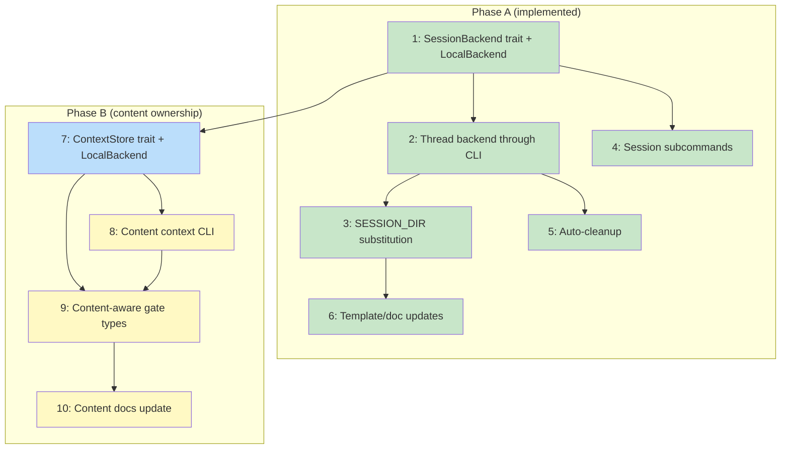

# PLAN: Local session storage

## Status

Draft

## Scope Summary

Two phases. Phase A (issues 1-6, implemented): SessionBackend trait, LocalBackend,
`{{SESSION_DIR}}` substitution, session CLI, auto-cleanup, doc updates. Phase B
(issues 7-10): ContextStore trait for content ownership, content CLI commands,
content-aware gate types, and documentation updates. After both phases ship, koto
owns both the location and content of workflow artifacts.

## Decomposition Strategy

**Horizontal.** Components have stable interfaces (SessionBackend trait, ContextStore
trait) and the design defines horizontal phases with clear deliverables. Phase A
issues follow session module layering. Phase B issues follow content ownership
layering: trait first, CLI second, gates third, docs fourth.

## Issue Outlines

### 1. feat(session): add SessionBackend trait and LocalBackend

**Complexity:** testable

**Goal:** Create the session storage abstraction with LocalBackend storing sessions
at `~/.koto/sessions/<repo-id>/<name>/`.

**Acceptance Criteria:**
- [ ] `src/session/mod.rs` defines `SessionBackend` trait with methods: create, session_dir, exists, cleanup, list
- [ ] `src/session/mod.rs` defines `SessionInfo` struct and `state_file_name()` free function
- [ ] `src/session/local.rs` implements `LocalBackend` with `new(working_dir)` and `with_base_dir(base_dir)` constructors
- [ ] `repo_id()` canonicalizes, hashes with SHA-256, truncates to 16 hex chars
- [ ] `src/session/validate.rs` enforces `^[a-zA-Z][a-zA-Z0-9._-]*$`
- [ ] `create()` validates ID, creates directory, returns path
- [ ] `exists()` checks for state file inside session directory
- [ ] `list()` scans for state files, extracts metadata from StateFileHeader
- [ ] `~/.koto/` created with mode 0700 on first use
- [ ] `dirs` crate added to Cargo.toml
- [ ] Unit tests cover all trait methods, validation, and repo-id derivation using temp directories

**Dependencies:** None

---

### 2. refactor(cli): thread SessionBackend through command dispatch

**Complexity:** testable

**Goal:** Replace hardcoded `workflow_state_path()` calls with backend-provided
paths, update `find_workflows_with_metadata()` to delegate to `backend.list()`.

**Acceptance Criteria:**
- [ ] `run()` constructs `LocalBackend` and passes `&dyn SessionBackend` to all handlers
- [ ] `handle_init` calls `backend.create(name)` and writes state file into returned path
- [ ] All command handlers use `backend.session_dir(name)` + `state_file_name(name)` for state file paths
- [ ] `find_workflows_with_metadata()` delegates to `backend.list()`
- [ ] `workflow_state_path()` removed from public API or made internal
- [ ] All existing tests pass with state files in session directories

**Dependencies:** Issue 1

---

### 3. feat(cli): add runtime variable substitution for {{SESSION_DIR}}

**Complexity:** testable

**Goal:** Substitute `{{SESSION_DIR}}` in gate commands and directives at runtime
in `handle_next`, with collision detection for reserved variable names.

**Acceptance Criteria:**
- [ ] `src/cli/vars.rs` with `substitute_vars(input, vars: HashMap<String, String>)` using sequential `str::replace`
- [ ] `handle_next` builds vars map: `SESSION_DIR` -> `backend.session_dir(name)`
- [ ] Gate commands: `{{SESSION_DIR}}` replaced per-invocation inside the `advance_until_stop` loop
- [ ] Directives: `{{SESSION_DIR}}` replaced before JSON serialization
- [ ] Template declaring `SESSION_DIR` in `variables:` block produces runtime error
- [ ] Unit tests for `substitute_vars` (no-op, single, multiple tokens, missing token)
- [ ] Integration test: template with `{{SESSION_DIR}}` in gate and directive resolves correctly
- [ ] Integration test: reserved name collision rejected

**Dependencies:** Issue 2

---

### 4. feat(cli): add session subcommands

**Complexity:** testable

**Goal:** Add `koto session dir|list|cleanup` subcommands for session path discovery
and lifecycle management.

**Acceptance Criteria:**
- [ ] `koto session dir <name>` prints absolute session directory path
- [ ] `koto session list` outputs JSON array of sessions
- [ ] `koto session cleanup <name>` removes session directory (idempotent)
- [ ] `koto session` without subcommand prints help
- [ ] Clap `Session` variant with nested subcommand enum in `src/cli/session.rs`
- [ ] Integration test: init, verify dir, cleanup, verify list empty

**Dependencies:** Issue 1

---

### 5. feat(cli): add auto-cleanup on workflow completion

**Complexity:** testable

**Goal:** Automatically clean up session directory when a workflow reaches a
terminal state.

**Acceptance Criteria:**
- [ ] `koto next`/`koto transition` to terminal state triggers `backend.cleanup()`
- [ ] Cleanup happens after response serialization (output first, cleanup second)
- [ ] Missing session directory handled gracefully
- [ ] `--no-cleanup` flag preserves session for debugging
- [ ] Tests verify cleanup triggers, flag behavior, and graceful missing-dir handling

**Dependencies:** Issue 2

---

### 6. docs: update templates and guides to use {{SESSION_DIR}}

**Complexity:** simple

**Goal:** Replace hardcoded `wip/` paths in hello-koto.md, custom-skill-authoring.md,
and test docs with `{{SESSION_DIR}}`.

**Acceptance Criteria:**
- [ ] `hello-koto.md` gate and directive use `{{SESSION_DIR}}/spirit-greeting.txt`
- [ ] `custom-skill-authoring.md` has zero hardcoded `wip/` path references
- [ ] `MANUAL-TEST-agent-flow.md` uses session directory paths and `koto session cleanup`
- [ ] All three files read coherently with updated prose
- [ ] No remaining `wip/` path references (grep clean)

**Dependencies:** Issue 3

---

### 7. feat(session): add ContextStore trait and LocalBackend implementation

**Complexity:** testable

**Goal:** Create the content ownership abstraction. `ContextStore` trait defines
add/get/exists/remove/list operations. `LocalBackend` implements it by storing
content as files in a `ctx/` subdirectory with a `manifest.json` index.

**Acceptance Criteria:**
- [ ] `src/session/context.rs` defines `ContextStore` trait with methods: add, get, ctx_exists, remove, list_keys
- [ ] `src/session/local.rs` extends `LocalBackend` to implement `ContextStore`
- [ ] Content stored as files in `<session-dir>/ctx/<key>` with hierarchical key → directory mapping
- [ ] `ctx/manifest.json` tracks key metadata (created_at, size, hash)
- [ ] Write order: content file first, manifest second (crash-safe)
- [ ] Manifest writes use atomic temp-file-then-rename
- [ ] Separate manifest flock serializes concurrent manifest updates
- [ ] Per-key advisory flock prevents concurrent writes to the same key
- [ ] `src/session/validate.rs` adds `validate_context_key()`: `[a-zA-Z0-9._-/]`, no `.`/`..` components, no leading/trailing slashes, max 255 chars
- [ ] `list_keys` supports optional prefix filtering
- [ ] Unit tests: add/get round-trip, exists check, remove, list with prefix, key validation, concurrent writes to different keys, manifest crash recovery

**Dependencies:** Issue 1 (SessionBackend trait exists)

---

### 8. feat(cli): add content context commands

**Complexity:** testable

**Goal:** Add `koto context add/get/exists/list` CLI subcommands. Content submission
is decoupled from state advancement — `koto context add` doesn't call `koto next`.

**Acceptance Criteria:**
- [ ] `koto context add <session> <key>` reads from stdin, stores via `context_store.add()`
- [ ] `koto context add <session> <key> --from-file <path>` reads from file
- [ ] `koto context get <session> <key>` writes to stdout
- [ ] `koto context get <session> <key> --to-file <path>` writes to file
- [ ] `koto context exists <session> <key>` returns exit code 0 if present, 1 if not
- [ ] `koto context list <session>` outputs JSON array of keys
- [ ] `koto context list <session> --prefix <prefix>` filters by prefix
- [ ] Clap `Context` variant with nested `ContextCommand` enum in `src/cli/context.rs`
- [ ] `run()` constructs `&dyn ContextStore` and passes to context handlers
- [ ] `koto context add` does NOT advance workflow state
- [ ] Integration tests: add/get round-trip, exists, list, prefix filter, from-file/to-file

**Dependencies:** Issue 7

---

### 9. feat(engine): add content-aware gate types

**Complexity:** testable

**Goal:** Add `context-exists` and `context-matches` gate types to the engine.
Templates can check koto's content store directly instead of shelling out.
Shell gates remain as fallback.

**Acceptance Criteria:**
- [ ] `Gate` struct in `src/template/types.rs` gains optional `key` and `pattern` fields
- [ ] `evaluate_gates` in `src/gate.rs` handles `context-exists` type: checks `context_store.ctx_exists(session, key)`
- [ ] `evaluate_gates` handles `context-matches` type: reads content, applies regex pattern
- [ ] `context-matches` uses Rust's `regex` crate (linear-time, no backtracking)
- [ ] `evaluate_gates` receives `&dyn ContextStore` (threaded from `handle_next`)
- [ ] Shell gates (`type: command`) continue to work unchanged
- [ ] Template validation (`CompiledTemplate::validate()`) recognizes new gate types
- [ ] Template compilation validates that `context-exists` gates have `key` field, `context-matches` gates have `key` and `pattern`
- [ ] Unit tests: context-exists gate pass/fail, context-matches gate pass/fail, shell gate still works, missing key field rejected at compile time
- [ ] Integration test: template with context-exists gate, add content, verify gate passes

**Dependencies:** Issue 7, Issue 8

---

### 10. docs: update templates and guides for content ownership

**Complexity:** simple

**Goal:** Update hello-koto template to use content-aware gates instead of
`{{SESSION_DIR}}` filesystem checks. Update skill authoring guide with content
CLI examples. Update CLI usage docs with `koto context` commands.

**Acceptance Criteria:**
- [ ] `hello-koto.md` gate uses `type: context-exists` instead of shell `test -f` command
- [ ] `docs/guides/custom-skill-authoring.md` documents `koto context add/get/exists/list`
- [ ] `docs/guides/cli-usage.md` has `context` subcommand section
- [ ] `README.md` mentions content ownership in Key concepts
- [ ] `docs/testing/MANUAL-TEST-agent-flow.md` updated with content CLI commands

**Dependencies:** Issue 9

---

## Implementation Issues

_Not populated in single-pr mode._

## Dependency Graph

**Legend**: Green = done, Blue = ready, Yellow = blocked

## Implementation Sequence

**Phase A critical path (done):** 1 -> 2 -> 3 -> 6
**Phase B critical path:** 7 -> 8 -> 9 -> 10

| Order | Issue | Blocked By | Parallelizable With |
|-------|-------|------------|---------------------|
| 1 | 1: SessionBackend trait + LocalBackend | -- | -- |
| 2 | 2: Thread backend through CLI | 1 | 4 |
| 2 | 4: Session subcommands | 1 | 2 |
| 3 | 3: {{SESSION_DIR}} substitution | 2 | 5 |
| 3 | 5: Auto-cleanup | 2 | 3 |
| 4 | 6: Template/doc updates | 3 | -- |
| 5 | 7: ContextStore trait + LocalBackend | 1 | -- |
| 6 | 8: Content context CLI | 7 | -- |
| 7 | 9: Content-aware gate types | 7, 8 | -- |
| 8 | 10: Content docs update | 9 | -- |
