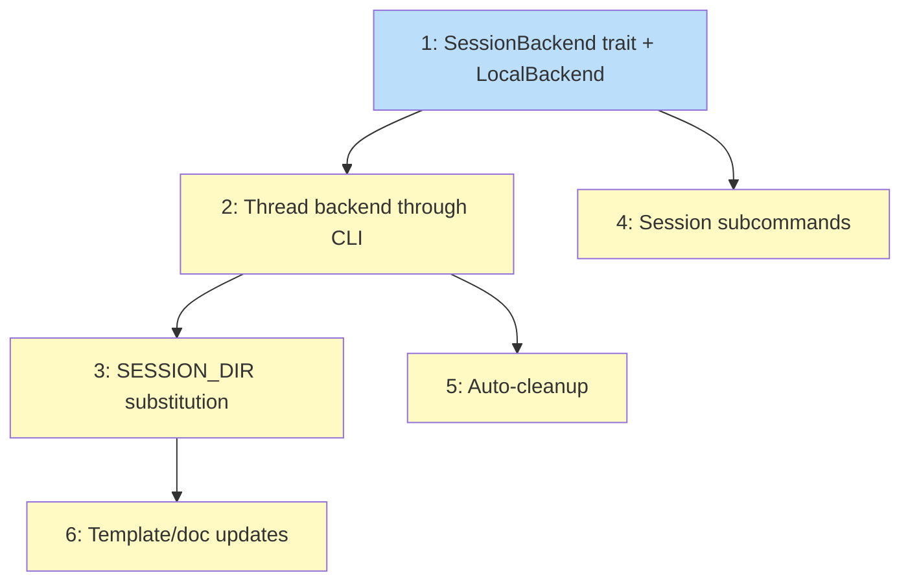

# PLAN: Local session storage

## Status

Draft

## Scope Summary

Implement the SessionBackend trait with LocalBackend, runtime `{{SESSION_DIR}}`
substitution in templates, session CLI subcommands, and template/doc updates.
After this ships, session state lives at `~/.koto/sessions/<repo-id>/<name>/`
instead of the working directory.

## Decomposition Strategy

**Horizontal.** Components have stable interfaces (SessionBackend trait) and the
design defines three horizontal phases with clear deliverables. Issues follow the
design's layering: session module first, CLI refactoring second, user-facing
features third.

## Issue Outlines

### 1. feat(session): add SessionBackend trait and LocalBackend

**Complexity:** testable

**Goal:** Create the session storage abstraction with LocalBackend storing sessions
at `~/.koto/sessions/<repo-id>/<name>/`.

**Acceptance Criteria:**
- [ ] `src/session/mod.rs` defines `SessionBackend` trait with methods: create, session_dir, exists, cleanup, list
- [ ] `src/session/mod.rs` defines `SessionInfo` struct and `state_file_name()` free function
- [ ] `src/session/local.rs` implements `LocalBackend` with `new(working_dir)` and `with_base_dir(base_dir)` constructors
- [ ] `repo_id()` canonicalizes, hashes with SHA-256, truncates to 16 hex chars
- [ ] `src/session/validate.rs` enforces `^[a-zA-Z][a-zA-Z0-9._-]*$`
- [ ] `create()` validates ID, creates directory, returns path
- [ ] `exists()` checks for state file inside session directory
- [ ] `list()` scans for state files, extracts metadata from StateFileHeader
- [ ] `~/.koto/` created with mode 0700 on first use
- [ ] `dirs` crate added to Cargo.toml
- [ ] Unit tests cover all trait methods, validation, and repo-id derivation using temp directories

**Dependencies:** None

---

### 2. refactor(cli): thread SessionBackend through command dispatch

**Complexity:** testable

**Goal:** Replace hardcoded `workflow_state_path()` calls with backend-provided
paths, update `find_workflows_with_metadata()` to delegate to `backend.list()`.

**Acceptance Criteria:**
- [ ] `run()` constructs `LocalBackend` and passes `&dyn SessionBackend` to all handlers
- [ ] `handle_init` calls `backend.create(name)` and writes state file into returned path
- [ ] All command handlers use `backend.session_dir(name)` + `state_file_name(name)` for state file paths
- [ ] `find_workflows_with_metadata()` delegates to `backend.list()`
- [ ] `workflow_state_path()` removed from public API or made internal
- [ ] All existing tests pass with state files in session directories

**Dependencies:** Issue 1

---

### 3. feat(cli): add runtime variable substitution for {{SESSION_DIR}}

**Complexity:** testable

**Goal:** Substitute `{{SESSION_DIR}}` in gate commands and directives at runtime
in `handle_next`, with collision detection for reserved variable names.

**Acceptance Criteria:**
- [ ] `src/cli/vars.rs` with `substitute_vars(input, vars: HashMap<String, String>)` using sequential `str::replace`
- [ ] `handle_next` builds vars map: `SESSION_DIR` -> `backend.session_dir(name)`
- [ ] Gate commands: `{{SESSION_DIR}}` replaced per-invocation inside the `advance_until_stop` loop
- [ ] Directives: `{{SESSION_DIR}}` replaced before JSON serialization
- [ ] Template declaring `SESSION_DIR` in `variables:` block produces runtime error
- [ ] Unit tests for `substitute_vars` (no-op, single, multiple tokens, missing token)
- [ ] Integration test: template with `{{SESSION_DIR}}` in gate and directive resolves correctly
- [ ] Integration test: reserved name collision rejected

**Dependencies:** Issue 2

---

### 4. feat(cli): add session subcommands

**Complexity:** testable

**Goal:** Add `koto session dir|list|cleanup` subcommands for session path discovery
and lifecycle management.

**Acceptance Criteria:**
- [ ] `koto session dir <name>` prints absolute session directory path
- [ ] `koto session list` outputs JSON array of sessions
- [ ] `koto session cleanup <name>` removes session directory (idempotent)
- [ ] `koto session` without subcommand prints help
- [ ] Clap `Session` variant with nested subcommand enum in `src/cli/session.rs`
- [ ] Integration test: init, verify dir, cleanup, verify list empty

**Dependencies:** Issue 1

---

### 5. feat(cli): add auto-cleanup on workflow completion

**Complexity:** testable

**Goal:** Automatically clean up session directory when a workflow reaches a
terminal state.

**Acceptance Criteria:**
- [ ] `koto next`/`koto transition` to terminal state triggers `backend.cleanup()`
- [ ] Cleanup happens after response serialization (output first, cleanup second)
- [ ] Missing session directory handled gracefully
- [ ] `--no-cleanup` flag preserves session for debugging
- [ ] Tests verify cleanup triggers, flag behavior, and graceful missing-dir handling

**Dependencies:** Issue 2

---

### 6. docs: update templates and guides to use {{SESSION_DIR}}

**Complexity:** simple

**Goal:** Replace hardcoded `wip/` paths in hello-koto.md, custom-skill-authoring.md,
and test docs with `{{SESSION_DIR}}`.

**Acceptance Criteria:**
- [ ] `hello-koto.md` gate and directive use `{{SESSION_DIR}}/spirit-greeting.txt`
- [ ] `custom-skill-authoring.md` has zero hardcoded `wip/` path references
- [ ] `MANUAL-TEST-agent-flow.md` uses session directory paths and `koto session cleanup`
- [ ] All three files read coherently with updated prose
- [ ] No remaining `wip/` path references (grep clean)

**Dependencies:** Issue 3

## Implementation Issues

_Not populated in single-pr mode._

## Dependency Graph

**Legend**: Blue = ready, Yellow = blocked

## Implementation Sequence

**Critical path:** 1 -> 2 -> 3 -> 6

| Order | Issue | Blocked By | Parallelizable With |
|-------|-------|------------|---------------------|
| 1 | 1: SessionBackend trait + LocalBackend | -- | -- |
| 2 | 2: Thread backend through CLI | 1 | 4 |
| 2 | 4: Session subcommands | 1 | 2 |
| 3 | 3: {{SESSION_DIR}} substitution | 2 | 5 |
| 3 | 5: Auto-cleanup | 2 | 3 |
| 4 | 6: Template/doc updates | 3 | -- |
