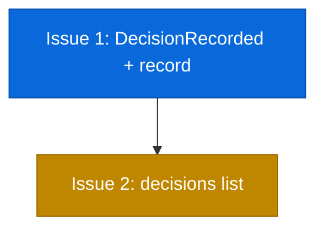

# PLAN: mid-state decision capture

## Status

Draft

## Scope Summary

Add a `koto decisions` subcommand with record and list sub-operations so agents can
capture structured decisions mid-state without triggering advancement, and retrieve
them for PR summaries and audit.

## Decomposition Strategy

Horizontal decomposition. The event type and recording path (Phase 1) must exist before
the list sub-operation (Phase 2) can retrieve anything. Two sequential issues in four
files.

## Issue Outlines

### Issue 1: feat(engine): add DecisionRecorded event type and koto decisions record

**Goal**: Add the DecisionRecorded event type, derive_decisions() function,
koto decisions record sub-operation, shared load_workflow helper, and unit tests.

**Acceptance Criteria**:
- [ ] `EventPayload::DecisionRecorded { state: String, decision: serde_json::Value }` added to types.rs with type_name "decision_recorded" and deserialization support
- [ ] `derive_decisions()` in persistence.rs collects DecisionRecorded events after the epoch boundary, parallel to derive_evidence()
- [ ] `Decisions` command variant with `DecisionsCommand::Record` sub-operation added to cli/mod.rs, following Template/TemplateCommand pattern
- [ ] `handle_decisions_record` validates fixed schema (choice required, rationale required, alternatives_considered optional string array), appends DecisionRecorded event, returns `{"state": "<current>", "decisions_recorded": <count>}`
- [ ] State-file loading factored into shared `load_workflow` helper used by both handle_next and handle_decisions_record
- [ ] Does NOT trigger the advancement loop
- [ ] Unit tests: DecisionRecorded round-trip serialization, derive_decisions() epoch scoping, derive_decisions() after rewind discards prior decisions, schema validation (missing choice rejects, missing rationale rejects, valid with/without alternatives_considered)
- [ ] Existing `go test ./...` and template tests pass unchanged

**Dependencies**: None

---

### Issue 2: feat(engine): add koto decisions list sub-operation

**Goal**: Add the koto decisions list sub-operation, DecisionSummary response struct,
and integration test.

**Acceptance Criteria**:
- [ ] `DecisionsCommand::List` sub-operation added to the existing Decisions command
- [ ] `DecisionSummary` struct in next_types.rs for response serialization
- [ ] `handle_decisions_list` loads workflow, calls derive_decisions(), returns `{"state": "<current>", "decisions": {"count": N, "items": [...]}}`
- [ ] Each item includes choice, rationale, and alternatives_considered (if provided)
- [ ] Integration test: init workflow, record two decisions via koto decisions record, call koto decisions list, verify response has count=2 and both items
- [ ] Integration test: record decisions, rewind, verify koto decisions list returns empty for the new epoch
- [ ] `koto next` response shape is unchanged — no decision-related fields

**Dependencies**: Issue 1

## Dependency Graph

**Legend**: Blue = ready, Yellow = blocked

## Implementation Sequence

**Critical path**: Issue 1 (core mechanism) -> Issue 2 (surfacing)

Linear — no parallelization opportunities. Issue 1 creates the event type and
derive_decisions() that Issue 2 depends on. Both fit in a single branch and PR.
