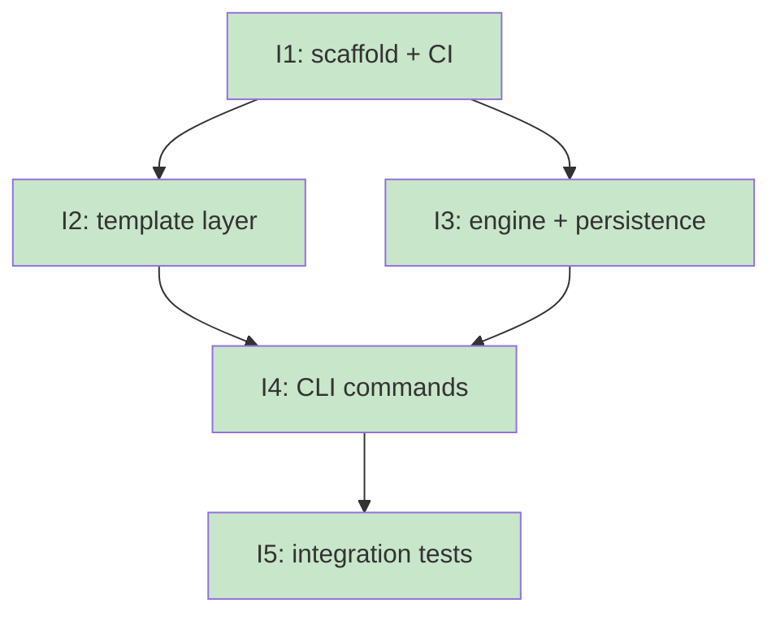

# PLAN: Migrate koto from Go to Rust

## Status

Draft

## Scope Summary

Replace the Go codebase with a single-crate Rust binary delivering five commands
(`version`, `init`, `next`, `rewind`, `workflows`) plus `template compile/validate`,
backed by simple JSONL state. All five issues are implemented in a single PR on the
same branch.

## Decomposition Strategy

**Horizontal decomposition.** The design defines five implementation phases that form
a clear serial dependency chain: scaffold → template → engine → CLI → tests. Each
phase builds on the previous with stable interfaces between layers. The template and
engine layers are independent of each other (both depend only on the scaffold),
enabling parallel implementation in phases 2 and 3.

## Issue Outlines

### Issue 1: feat(koto): scaffold Rust crate and replace CI

**Goal**: Create the Rust crate foundation — Cargo.toml with all dependencies,
module layout stubs, CI workflows replacing the Go toolchain, and `koto version`
working end-to-end. Delete all Go source from the repository.

**Acceptance Criteria**:
- `Cargo.toml` present with all dependencies from `docs/designs/DESIGN-migrate-koto-go-to-rust.md`:
  production (clap v4 derive, serde v1 derive, serde_json, serde_yml, thiserror,
  anyhow, tempfile), unix target (wait-timeout), dev (assert_cmd, assert_fs, tempfile)
- Module stubs exist at all paths from the design's crate layout: `src/main.rs`,
  `src/lib.rs`, `src/cli/mod.rs`, `src/engine/mod.rs`, `src/template/mod.rs`,
  `src/cache.rs`, `src/discover.rs`, `src/buildinfo.rs`
- `cargo build --release` succeeds
- `koto version` prints version JSON (from `buildinfo.rs` using `env!` macros for
  package version, git commit, and build date)
- `.github/workflows/validate.yml` replaced: `dtolnay/rust-toolchain@stable`,
  `Swatinem/rust-cache@v2`, jobs run `cargo test`, `cargo fmt --check`,
  `cargo clippy -- -D warnings`, `cargo audit`
- `.github/workflows/release.yml` replaced: cargo-dist for linux/darwin × amd64/arm64
- All Go source deleted: `cmd/`, `pkg/`, `internal/`, `go.mod`, `go.sum`, Go-specific CI steps
- `cargo fmt --check` and `cargo clippy -- -D warnings` pass

**Dependencies**: None

---

### Issue 2: feat(koto): implement template layer

**Goal**: Implement `src/template/` (compile.rs, types.rs, mod.rs) and `src/cache.rs`
so `koto template compile` and `koto template validate` work correctly, and the plugin
CI validation workflow passes.

**Acceptance Criteria**:
- `src/template/types.rs` defines `CompiledTemplate`, `TemplateState`, `Gate` matching
  FormatVersion=1 JSON schema (as used by current plugins)
- `src/template/compile.rs` compiles YAML source to FormatVersion=1 JSON; returns
  structured errors for invalid YAML, missing fields, unknown gate types
- `src/cache.rs` implements SHA256-based compile cache: cache key = SHA256 of
  compiled JSON; cache hit skips recompile; cache miss compiles and stores
- `koto template compile <source>`: outputs compiled JSON path on success; exits non-0
  with JSON error on failure
- `koto template validate <path>`: exits 0 on valid, non-0 with JSON error on invalid schema
- Unit tests cover: valid template compiles correctly, missing fields returns error,
  unknown gate type returns error, compiled JSON round-trips through deserialization
- Plugin CI (`.github/workflows/validate-plugins.yml`) passes

**Dependencies**: Blocked by Issue 1

---

### Issue 3: feat(koto): implement engine and persistence layer

**Goal**: Implement `src/engine/` (types.rs, persistence.rs, errors.rs, mod.rs) and
`src/discover.rs` so JSONL state files can be created and appended, current state is
derived from the last event's `state` field, and active workflows can be discovered.

**Acceptance Criteria**:
- `src/engine/types.rs`: `Event` struct with `type`, `state`, `timestamp` fields;
  `MachineState` struct with current state name, template path, template hash;
  both serialize/deserialize via serde_json
- `src/engine/persistence.rs`:
  - `append_event(path, event)`: creates file on first call, appends one JSON line per call
  - `read_events(path)`: reads all JSONL lines; skips malformed lines with a warning
  - `derive_state(events)`: returns `state` field of last event; `None` for empty log
- `src/engine/errors.rs`: typed errors via thiserror: `StateNotFound`, `EmptyLog`,
  `ParseError`
- `src/discover.rs`: `find_workflows(dir)` globs `koto-*.state.jsonl`, returns workflow
  names (without `koto-` prefix and `.state.jsonl` suffix)
- Unit tests cover: append creates then extends file, read_events returns correct
  sequence, derive_state returns last state / None for empty, find_workflows returns
  correct names from a temp directory

**Dependencies**: Blocked by Issue 1

---

### Issue 4: feat(koto): implement CLI commands

**Goal**: Wire all 7 CLI commands to the engine and template layers using clap v4
derive macros, producing correct JSON output with correct exit codes.

**Acceptance Criteria**:
- `src/cli/mod.rs` defines the top-level clap `App` and `Subcommand` enum for all 7 commands
- `koto init <name> --template <path>`: creates `koto-<name>.state.jsonl` with init event
  `{"type":"init","state":"<initial>","timestamp":"...","template":"<path>","template_hash":"<sha256>"}`;
  returns JSON `{"name":"<name>","state":"<initial>"}` on success; non-0 if file exists or
  template invalid
- `koto next <name>`: reads JSONL, derives state, loads template, returns
  `{"state":"<s>","directive":"<text>","transitions":["..."]}` on success;
  non-0 with JSON error if workflow not found
- `koto rewind <name>`: appends `{"type":"rewind","state":"<prev>","timestamp":"..."}`;
  exits non-0 with JSON error if only one event exists (already at initial state)
- `koto workflows`: returns JSON array of workflow names in current directory;
  empty array if none found
- `koto template compile` and `koto template validate`: wired from Issue 2 (no new logic)
- `koto version`: returns `{"version":"...","commit":"...","built_at":"..."}`
- All commands: exit 0 on success, non-0 on error; all output is valid JSON

**Dependencies**: Blocked by Issue 2 and Issue 3

---

### Issue 5: feat(koto): add integration tests

**Goal**: Add assert_cmd integration tests covering happy path and key error cases for
each command, ensuring the full CLI works end-to-end and all CI checks pass.

**Acceptance Criteria**:
- Integration tests using `assert_cmd::Command` and `assert_fs::TempDir`:
  - **version**: exits 0; output is valid JSON with `version` field
  - **init**: creates `koto-<name>.state.jsonl`; exits non-0 if file already exists
  - **next**: returns JSON with `state`, `directive`, `transitions`; non-0 for unknown name
  - **rewind**: state file contains a rewind event after call; non-0 if already at initial state
  - **workflows**: returns JSON array including the initialized workflow name; empty array
    when no workflows in temp dir
  - **template compile**: produces FormatVersion=1 JSON; non-0 for invalid YAML
  - **template validate**: exits 0 for valid compiled template; non-0 for missing fields
- `cargo test` passes (all unit + integration tests)
- `cargo audit` passes
- Plugin CI (`validate-plugins.yml`) passes end-to-end
- `cargo clippy -- -D warnings` passes with test code added

**Dependencies**: Blocked by Issue 4

---

## Dependency Graph

**Legend**: Green = done, Blue = ready, Yellow = blocked

## Implementation Sequence

**Critical path**: I1 → I2 → I4 → I5 (or I1 → I3 → I4 → I5 — equal length, 4 steps)

**Recommended order**:

1. **I1** — scaffold: must be first; establishes the crate and CI foundation
2. **I2 + I3 in parallel** — template and engine layers are independent; implement
   concurrently to reduce wall-clock time
3. **I4** — CLI commands: requires both I2 and I3 complete
4. **I5** — integration tests: requires I4 complete; validates the full system

**Parallelization**: After I1, the template (I2) and engine (I3) layers share no
dependencies on each other. Both can be worked in the same session on the same branch
— implement one, commit, implement the other, commit. The merge into PR #50 happens
at the end.
