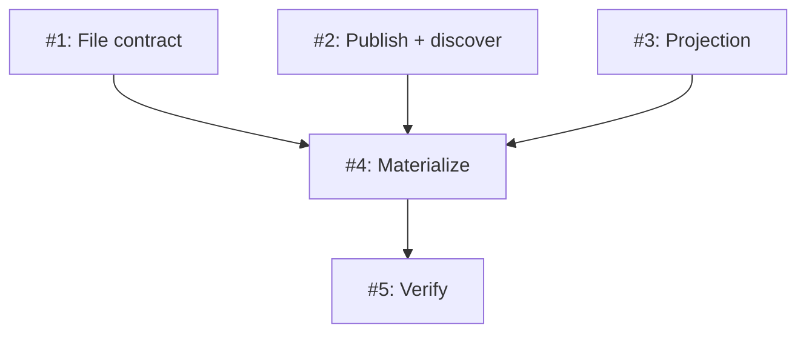

# PLAN: koto sessions render natively in Claude Code's `/workflows` (walking skeleton)

## Status

Active

Single-PR decomposition of `DESIGN-native-workflows-render` (Feature 1 of
`ROADMAP-koto-agent-surface-legibility`). All five issues ship in one pull
request on a shared branch; the outlines below are worked in dependency order.

## Scope Summary

Make one non-hierarchical koto session render as a native entry in Claude
Code's `/workflows` screen. On each state-commit koto re-derives a minimal
projection (name, current state, running/done) and writes its own
`koto-<uuid>.json` -- atomically, creating the directory if absent -- into the
`/workflows` directory a hosting Claude Code session publishes via the context
store. The slice also lands the shared foundation: the extensible file
contract, the single commit-funnel hook seam (`SessionBackend::append_event`),
and the context-store publish/discover key (`workflows/publish-location`) whose
schema already admits Feature 3's nearest-published-ancestor walk. Opt-in by
the presence of a published location; koto's default path is untouched when
none is published.

## Decomposition Strategy

**Walking-skeleton, layered within the slice.** The DESIGN's five
implementation steps map one-to-one onto five issues along the data-flow spine
(contract -> discover/publish -> project -> materialize/wire -> verify). The
first three (the file contract, the discovery/publish plumbing, and the
projection derivation) are independent leaf components with no runtime coupling
to koto's commit path, so they can land in any order. The fourth issue is the
integration point: it wires materialization into `LocalBackend::append_event`
and depends on all three leaves. The fifth proves the whole path end-to-end and
depends on the fourth. Cross-batch dependency edges: four (three into Issue 4,
one into Issue 5).

## Issue Outlines

### Issue 1: File contract -- the extensible `koto-<uuid>.json` shape

**Goal**: Establish the extensible on-disk shape koto writes into `/workflows`,
independent of any koto runtime coupling.

**Acceptance Criteria**:
- [ ] `src/workflows_surface/contract.rs` defines a serde `WorkflowFile` with
  top-level `id`, `name`, `status`, `startTime` and a nested `koto` block
  (`sessionId`, `workflow`, `currentState`, `contractVersion` = 1).
- [ ] A builder constructs a `WorkflowFile` from a projection value.
- [ ] A helper yields the filename `koto-<session-uuid>.json`.
- [ ] Unit tests assert the serialized JSON keys and the filename; `status`
  admits `running` / `completed` / `failed`.

**Dependencies**: None

**Type**: code
**Files**: `src/workflows_surface/contract.rs`, `src/workflows_surface/mod.rs`, `src/lib.rs`

### Issue 2: Context-store publish + discovery walk + `koto workflows publish`

**Goal**: Land the context-store publish/discover mechanism and the F3-ready
key, plus the operator-facing publish verb.

**Acceptance Criteria**:
- [ ] `resolve_publish_location(backend, session_id)` walks self-then-
  `parent_workflow` ancestors, probing `workflows/publish-location`, returns the
  nearest hit, and copies `measure_depth_from_parent`'s cycle guard / hop cap /
  missing-header-as-root behavior.
- [ ] `publish_location(store, session_id, dir)` writes the reserved key without
  appending an event.
- [ ] `koto workflows publish --dir <dir> [--session <id>]` writes the key; bare
  `koto workflows` (roots/children/orphaned) is unchanged.
- [ ] koto-user / koto-author skills document the new CLI surface.
- [ ] Unit test for the walk (self hit, ancestor hit, no hit) and a CLI test for
  `workflows publish`.

**Dependencies**: None

**Type**: code
**Files**: `src/workflows_surface/discover.rs`, `src/cli/mod.rs`

### Issue 3: Minimal projection from the read seam

**Goal**: Derive the minimal projection from koto's existing read seam, as the
single source of truth for the rendered state.

**Acceptance Criteria**:
- [ ] `derive_minimal_projection(backend, session_id)` returns display name,
  current state, and running/done/failed status.
- [ ] It reuses the dashboard's pure `derive_state_from_log` / `is_terminal_state`
  / failure-name derivation (lifting any private helper to a shared location so
  there is one implementation).
- [ ] Unit tests over fixture logs: running, terminal-success, terminal-failure,
  and cancelled all map to the right status.

**Dependencies**: None

**Type**: code
**Files**: `src/workflows_surface/project.rs`, `src/cli/dashboard_data.rs`

### Issue 4: Materialize on the commit funnel (atomic write + wiring)

**Goal**: Wire materialization into the single commit funnel: on every commit,
resolve the location, derive the projection, and atomically write the file.

**Acceptance Criteria**:
- [ ] `materialize_after_commit(backend, session_id)` gates on
  `KOTO_WORKFLOWS_DIR`-or-published-key presence (returns immediately
  otherwise), self-publishes `KOTO_WORKFLOWS_DIR` into the session's own store
  when unpublished, resolves the directory, derives the projection,
  `create_dir_all`s the directory, and writes `koto-<uuid>.json` via
  temp-then-rename.
- [ ] `LocalBackend::append_event` calls it after a successful
  `persistence::append_event`; no re-entrancy (self-publish uses
  `ContextStore::add`, which appends no event).
- [ ] Integration test (real session, `KOTO_SESSIONS_BASE` + `KOTO_WORKFLOWS_DIR`):
  AC1 file appears with current state; AC2 file updates the state on a second
  advance; AC3 terminal leaves a done/failed status; AC4 with no location, no
  `koto-*.json` is written and no existing file is touched.

**Dependencies**: Blocked by <<ISSUE:1>>, <<ISSUE:2>>, <<ISSUE:3>>

**Type**: code
**Files**: `src/workflows_surface/materialize.rs`, `src/session/local.rs`

### Issue 5: SessionStart hook + end-to-end verification harness

**Goal**: Ship the SessionStart publish path and prove the whole hook ->
publish -> write -> render path.

**Acceptance Criteria**:
- [ ] A `SessionStart` hook (`plugins/koto-skills/hooks.json` + a script) derives
  the `/workflows` directory from `session_id` / `transcript_path` and exposes
  `KOTO_WORKFLOWS_DIR`.
- [ ] A committed scripted verification exercises publish -> advance -> render
  without a live Claude Code and asserts the file's name/current-state/status.
- [ ] The manual live-TUI procedure is documented (per the PRD allowance where
  CI cannot drive the TUI).
- [ ] `cargo build`, `cargo test`, `cargo clippy -- -D warnings`, `cargo fmt --check`
  all pass.

**Dependencies**: Blocked by <<ISSUE:4>>

**Type**: task
**Files**: `plugins/koto-skills/hooks.json`, `scripts/verify-native-workflows.sh`

## Implementation Issues

_(single-pr mode -- the issues are the outlines above; no GitHub issues are
materialized.)_

## Dependency Graph

**Legend**:
- `done` -- merged
- `ready` -- no open dependencies
- `blocked` -- waiting on a dependency

## Implementation Sequence

**Critical path:** Issue 1 (or 2 or 3) -> Issue 4 -> Issue 5 (3 issues).

**Recommended order:**
1. Issues 1, 2, 3 -- independent leaves; land the file contract, the publish/
   discover plumbing, and the projection derivation in any order.
2. Issue 4 -- integration: wire materialization into the commit funnel; needs
   all three leaves.
3. Issue 5 -- the SessionStart hook and the end-to-end verification harness;
   needs Issue 4.

**Parallelization:** Issues 1, 2, and 3 can proceed in parallel; Issues 4 and 5
are strictly sequential after them.
