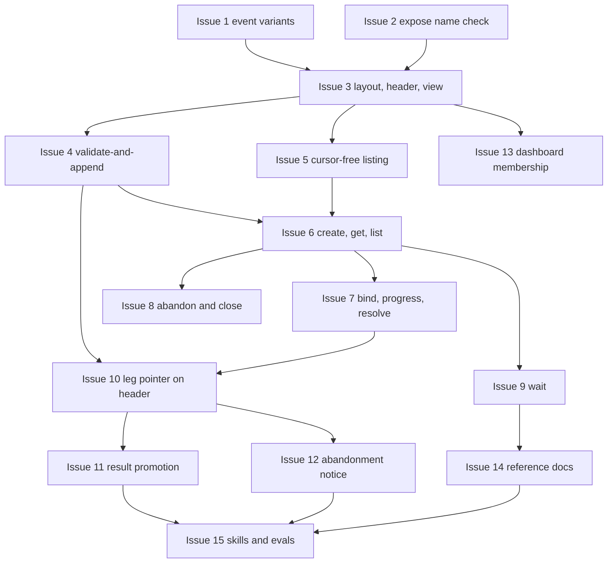

# PLAN: request leg-and-result lifecycle

## Status

Active

Decomposes `docs/designs/DESIGN-request-lifecycle.md` into fifteen atomic
issues driven on one branch and shipped as one pull request alongside the
scoping documents.

## Scope Summary

The design adds a request object living in its own workspace-scoped
append-only log under `~/.koto/requests/<id>/`, six typed event variants in a
new `request.` wire namespace, a lock-guarded validate-and-append primitive
that carries the concurrency and rejection semantics, a ten-subcommand
`koto request` CLI noun group with a separate polling `wait`, and four
integration points into existing machinery: a sidecar carrying a leg pointer to
a delegate, a result-promotion step at both child terminal-tick sites,
an abandonment notice spliced into the authoritative `directive` field, and a
membership attribute on dashboard rows.

Nothing in the existing dispatch protocol changes semantics. No event is
renamed and `CURRENT_SCHEMA_VERSION` does not move, so an older koto build
reading a new log degrades through the `Unknown` fallthrough. The two
agent-facing skills and the exit-code reference are part of the deliverable,
not follow-ups.

## Decomposition Strategy

Horizontal, bottom-up, with a deliberate exception.

The layers are types, then store, then CLI, then integration into existing
paths, then surfaces and documentation. That ordering is chosen because the
store's write primitive is the single mechanism carrying four separate
requirements — at-most-one-result, idempotent rebinding, exactly-one-winner
concurrency, and the monotonic revision — so it must exist and be tested
before anything calls it. Building the CLI first would mean stubbing that
primitive and rewriting its callers.

The exception is that the CLI layer is split by verb group rather than
delivered whole, because the read verbs exercise the projection while the
mutating verbs exercise the preconditions, and those fail differently. Three
CLI issues each land a coherent, independently testable slice.

Grouping rules: one issue per store entry point; one issue per CLI verb group
that shares a failure mode; one issue per integration point into an existing
code path, because each touches a different file and carries its own
regression risk.

## Implementation Issues

This plan runs in single-pr mode, so no GitHub issues are materialized. The
fifteen units of work are specified as outlines below and are driven in
dependency order on one branch.

## Issue Outlines

### Issue 1: feat(types): six request event variants

**Goal**: Add the six variants to the closed `EventPayload` enum with their
`request.`-prefixed wire strings, plus the supporting payload types, without
moving the schema version.

**Acceptance Criteria**:
- [x] Six variants exist with wire strings `request.created`, `request.leg_bound`, `request.leg_progress`, `request.leg_result`, `request.leg_abandoned`, `request.closed`.
- [x] Every variant carries `request_id`; the four leg variants also carry `leg_name`.
- [x] `RequestCreated` carries `legs: BTreeMap<String, LegDeclaration>` and optional shared `inputs`.
- [x] `RequestLegResult` carries a `WorkflowResult` and a `LegResultSource` recording whether it was promoted or explicit.
- [x] A round-trip test serializes and deserializes each variant unchanged.
- [x] A test asserts an unrecognized `request.*` type string deserializes to `Unknown` rather than erroring.
- [x] A test asserts `CURRENT_SCHEMA_VERSION` is still 1.
- [x] No existing variant's serialization changes; existing tests pass untouched.

**Dependencies**: None
**Complexity**: testable
**Type**: feat
**Files**: `src/engine/types.rs`

### Issue 2: refactor(engine): neutral module for the shared member-name grammar

**Goal**: Put the shared member-name grammar in a neutral engine module so batch
task names and request leg names cannot diverge, without the request store
inheriting batch semantics or CLI types.

**Acceptance Criteria**:
- [x] A new `src/engine/name_grammar.rs` owns the length band, the character class, and a leading-hyphen rejection.
- [x] It depends on nothing but `regex` — in particular not on the CLI error vocabulary the batch validator imports, so an engine-side consumer does not acquire a dependency on CLI types.
- [x] The batch validator delegates its grammar half to it and keeps its own reserved-name rule, so leg names do not inherit the batch scheduler's reserved action words.
- [x] A doc comment states the grammar is security-relevant because a member name can become a path component.
- [x] Tests reject every traversal shape (`..`, `.`, `a/b`, absolute, backslash, NUL, dot, space, colon, non-ASCII, a bidi override) and every leading-hyphen shape.
- [x] No behavior change for batch; existing batch validation tests pass.

**Dependencies**: None
**Complexity**: simple
**Type**: refactor
**Files**: `src/engine/name_grammar.rs`, `src/engine/batch_validation.rs`, `src/engine/mod.rs`

### Issue 3: feat(request-store): layout, header, and view projection

**Goal**: Establish the on-disk layout and the read path that projects a
request log into a view.

**Acceptance Criteria**:
- [ ] `src/engine/request_store/` exists with `mod.rs` and `view.rs`.
- [ ] `RequestHeader` carries its own `schema_version`, the request id, creation timestamp, requester, and coordinator of record.
- [ ] The layout is `<root>/requests/<request_id>/request.jsonl` plus `request.lock`.
- [ ] `read_view` replays the log into `RequestView`: legs in a `BTreeMap`, disposition derived rather than stored, bound child, result, progress entries, request state, close disposition, and revision.
- [ ] Revision equals the sequence number of the last event on the log.
- [ ] Both identifiers are validated against the shared name grammar before being used as path components; a traversal attempt is rejected.
- [ ] Reading a request that does not exist returns a distinguishable not-found error.
- [ ] `read_log` and the header write are generified over the header type, with the existing session-typed pair becoming thin wrappers, so the sequence-gap validation and truncated-final-line recovery live in one place rather than being copied.
- [ ] The request path uses a quiet read variant: a lock-free read racing a concurrent append does not print to stderr.
- [ ] Creation is a single atomic write — header and creation event buffered, fsynced in a tempfile, then renamed with no-replace semantics — so a crash cannot leave a header with an empty log, and a colliding request id is refused by the rename.
- [ ] `request_id` is a validated newtype, not a string, so the read and write entry points cannot be called with an unvalidated identifier.
- [ ] Identifiers are generated in a single case so two cannot collide to one directory on a case-insensitive filesystem.
- [ ] `requests/` and each request directory are created 0700 and the log 0600; neither the log nor the lock follows a symlink.
- [ ] The log path is module-private: no public accessor hands a caller a path it could append to outside the lock.
- [ ] The view exposes the request-level shared inputs recorded at creation, so shared context is not write-only.
- [ ] Tests cover an open request, a partially resolved request, an abandoned leg, a closed request, legs inserted out of order, and revision advance.

**Dependencies**: Issue 1, Issue 2
**Complexity**: testable
**Type**: feat
**Files**: `src/engine/request_store/mod.rs`, `src/engine/request_store/view.rs`, `src/engine/mod.rs`

### Issue 4: feat(request-store): lock-guarded validate-and-append

**Goal**: The single write path, carrying every precondition and the
concurrency guarantee.

**Acceptance Criteria**:
- [ ] `validate_and_append` acquires an exclusive lock, re-reads the view, runs a caller-supplied precondition, appends only on success, and releases.
- [ ] Lock acquisition has a bounded timeout surfacing as a transient-class error.
- [ ] A second result on a resolved leg is rejected with a distinct error.
- [ ] A result on an abandoned leg is rejected with a distinct error.
- [ ] Rebinding a leg to the same child succeeds; rebinding to a different child is rejected.
- [ ] Closing an already-closed request is rejected.
- [ ] All five bounds are enforced inside the lock: 256 progress appends per leg, 16 KiB per append, 256 legs per request, 1 MiB and depth 128 for any JSON flag payload (reusing the existing inputs guards), and 4 KiB for a rationale with control characters stripped.
- [ ] Duplicate leg names are rejected at create, since the grammar validates one name at a time and two legs sharing a name would collapse in the view.
- [ ] Lock acquisition is non-blocking plus deadline retry, not a blocking lock, and is an flock rather than an exclusive-create lease file so a killed writer cannot strand it.
- [ ] A torn tail is repaired under the lock before appending: the writer verifies the file ends in a newline and the last line parses, and truncates a partial line first, so a crash mid-write cannot permanently poison the log once a later append concatenates onto it.
- [ ] Progress and resolve appends carry an idempotency hash so a retry after an ambiguous failure is a no-op rather than a double-append or a spurious second-result rejection.
- [ ] A concurrency test spawns two simultaneous resolves of one leg and asserts exactly one succeeds and the log stays readable.
- [ ] A crash-safety test truncates a log mid-line and asserts the reader reports a clear error rather than silently losing events.

**Dependencies**: Issue 3
**Complexity**: critical
**Type**: feat
**Files**: `src/engine/request_store/mod.rs`, `src/engine/persistence.rs`, `src/config/mod.rs`

### Issue 5: feat(request-store): cursor-free listing

**Goal**: List requests by requester and by coordinator without touching the
dispatch cursor.

**Acceptance Criteria**:
- [ ] `list_requests` walks the requests directory and parses only header lines.
- [ ] Filters by requester, by coordinator of record, by open-or-closed, and by has-unresolved-legs.
- [ ] Per-entry field names reuse the `unassigned_children` vocabulary for the same concepts.
- [ ] A test asserts listing advances no coordinator cursor and writes nothing.
- [ ] A test asserts listing skips a malformed request directory with a warning rather than failing the call.

**Dependencies**: Issue 3
**Complexity**: testable
**Type**: feat
**Files**: `src/engine/request_store/mod.rs`

### Issue 6: feat(cli): koto request group with create, get, and list

**Goal**: The noun group, the response envelope, the exit mapping, and the
three verbs that do not mutate a leg.

**Acceptance Criteria**:
- [ ] `koto request` exists as a subcommand group with `create`, `get`, and `list`.
- [ ] `create` accepts either `--with-data` carrying legs and shared inputs, or the flat `--role` / `--template` / `--inputs` triple for the one-leg case, and requires `--requested-by` and `--coordinator-of-record`.
- [ ] `create` prints the generated request id in its envelope.
- [ ] The envelope carries `request_state`, `close_disposition`, `leg_counts`, `revision`, and `cli_contract` as two integers.
- [ ] `--cli-contract MAJOR.MINOR` is accepted on every subcommand and validated before any IO; a mismatch exits in the caller-error class.
- [ ] Output is JSON unconditionally with no format flag.
- [ ] `get` exits zero for an open, a fully resolved, and a closed request alike.
- [ ] Two consecutive `get` calls on an unchanged request produce byte-equal output.
- [ ] Failures use the structured nested error envelope with codes from a closed set.
- [ ] Exit statuses use only 0, 1, 2, 3 and collide with none of the sysexits values already returned elsewhere in the crate.
- [ ] A request that does not exist exits in the caller-error class.

**Dependencies**: Issue 4, Issue 5
**Complexity**: testable
**Type**: feat
**Files**: `src/cli/request.rs`, `src/cli/mod.rs`

### Issue 7: feat(cli): bind, progress, and resolve

**Goal**: The three verbs that mutate a leg.

**Acceptance Criteria**:
- [ ] `bind <request-id> <leg> --child <session-id>` binds and is idempotent for the same pair.
- [ ] `progress <request-id> <leg> --with-data` appends, and is rejected once the leg resolves or is abandoned.
- [ ] `resolve <request-id> <leg> --with-data` records a result on an unbound leg and is rejected on a bound leg with a distinct code.
- [ ] Ten appends to one leg read back in the order they were made.
- [ ] `--issued-by` is accepted on all three and recorded.
- [ ] Exceeding the append bound returns the documented rejection.

**Dependencies**: Issue 6
**Complexity**: testable
**Type**: feat
**Files**: `src/cli/request.rs`

### Issue 8: feat(cli): abandon, abandon-request, and close

**Goal**: The abandonment and close verbs, kept separate so a shell mistake
cannot escalate.

**Acceptance Criteria**:
- [ ] `abandon <request-id> <leg> --rationale` abandons one leg and leaves the others open.
- [ ] `abandon-request <request-id> --rationale` abandons every open leg and closes the request, as a separate subcommand so an empty leg argument cannot escalate a leg abandonment.
- [ ] `close <request-id>` records a disposition distinguishing all-resolved, closed-with-abandoned-legs, and request-abandoned.
- [ ] `--rationale` is required on both abandon forms.
- [ ] Closing an already-closed request is rejected.
- [ ] Every abandonment is readable from the log with its rationale and issuing principal.
- [ ] `koto cancel` behavior is unchanged, and no request operation is reachable from it.

**Dependencies**: Issue 6
**Complexity**: testable
**Type**: feat
**Files**: `src/cli/request.rs`

### Issue 9: feat(cli): the wait verb and its predicates

**Goal**: Readiness as its own verb, so the read stays exit-zero.

**Acceptance Criteria**:
- [ ] `wait <request-id>` takes exactly one of `--leg <name>`, `--all-legs`, `--closed`, `--resolved-count <N>`.
- [ ] `--timeout-secs` is required; `--interval-secs` defaults to 2.
- [ ] A satisfied predicate exits zero; an unsatisfied one at deadline exits in the transient class.
- [ ] A structurally impossible predicate — more resolved legs than the request has — is rejected in the caller-error class before polling begins, not left to time out in the retry class.
- [ ] A predicate that became impossible while waiting, through abandonment or close, exits with a caller-error code distinct from a timeout.
- [ ] `--interval-secs` is clamped to a floor so zero cannot spin.
- [ ] The deadline is absolute, computed once, and the wait sleeps in slices so a signal is noticed promptly.
- [ ] Interruption exits in the transient class with a distinct code.
- [ ] The wait reads through the same path `get` uses and writes nothing, asserted by comparing log length and cursor state before and after.
- [ ] A count predicate is satisfied by a partial fan-out without requiring all legs.

**Dependencies**: Issue 6
**Complexity**: testable
**Type**: feat
**Files**: `src/cli/request.rs`

### Issue 10: feat(dispatch): leg pointer on the child header

**Goal**: Let a delegate learn its own leg from its own session, and fence the
append paths against a displaced agent.

**Acceptance Criteria**:
- [ ] The leg pointer is a temp-and-rename sidecar in the child's session directory, following the claim sidecar's precedent — **not** an in-place header rewrite, which is unsafe against a running delegate because the existing atomic rewrite reads the whole file and rewrites it without a lock and would lose any event the child appended in between, including a state transition.
- [ ] The pointer is written after the bind event is durable and after the request lock is released, so there is no lock-ordering cycle against the terminal tick; a failed write warns and does not fail the bind.
- [ ] `bind` refuses a child that already carries a different request-and-leg pointer, which is the only place the one-leg-per-child half of the invariant can be enforced since the lock is per-request.
- [ ] `bind` refuses a child whose header does not satisfy the dispatch-fence predicate, so a leg cannot be bound to something that can never be fenced.
- [ ] The bound epoch is recorded in the bind event and the fence compares against that, not against the child's header, so the fence survives the child's session cleanup.
- [ ] `koto next` on a bound child carries a `leg` object with the request id and leg name, and deliberately without the dispatch epoch.
- [ ] `koto status` mirrors the `leg` object read-only.
- [ ] `progress`, `resolve`, and leg-scoped `abandon` all accept `--dispatch-epoch` and validate it against the epoch recorded in the bind event.
- [ ] A test asserts a stale epoch is rejected on the append path.
- [ ] A test asserts the `leg` object omits the epoch.
- [ ] A test asserts a leg bound after child creation is visible to the child's next tick with no restart.

**Dependencies**: Issue 4, Issue 7
**Complexity**: critical
**Type**: feat
**Files**: `src/engine/types.rs`, `src/cli/request.rs`, `src/cli/next_types.rs`, `src/cli/next.rs`, `src/cli/mod.rs`

### Issue 11: feat(dispatch): promote a bound leg's result

**Goal**: A bound leg resolves itself when its child completes, with no extra
action from either side.

**Acceptance Criteria**:
- [ ] The result envelope is synthesized once and shared by the child-log append and the promotion.
- [ ] The completion block is extracted into one function called from **both** terminal write sites — the advance-loop path and the directed-transition path — so a directed transition to a terminal state cannot delete a session while its leg stays open forever.
- [ ] The extracted function re-reads rather than using a caller's pre-transition event list, so the synthesized result is not computed from a stale log.
- [ ] `request.leg_result` with a promoted source is appended to the request log between the child-log result append and the terminal-index write.
- [ ] Only the promotion step is hoisted out of the cleanup guard, and it is gated on the leg having no result yet, so a repeatedly-ticked parked session is a silent no-op rather than an unbounded append per tick. Hoisting the other three writes is explicitly not done, because a parked terminal session would then emit a duplicate child-log result, index entry, and parent event on every tick, and existing tests depend on a parked child not emitting the parent event.
- [ ] A closed request, an abandoned leg, or an unreachable record warns on stderr and does not fail the terminal tick.
- [ ] A retryable IO failure defers cleanup using the existing append-failure lever.
- [ ] Promotion does not require the child's session directory to survive.
- [ ] A test walks a bound child to terminal and asserts its leg is resolved with the same status, summary, and payload the child produced.
- [ ] A test asserts a child bound to an abandoned leg still completes normally.

**Dependencies**: Issue 10
**Complexity**: critical
**Type**: feat
**Files**: `src/cli/mod.rs`, `src/engine/request_store/mod.rs`

### Issue 12: feat(dispatch): abandonment notice on the directive

**Goal**: Tell an abandoned leg's delegate through the one field it is taught
to obey.

**Acceptance Criteria**:
- [ ] A koto-authored stop notice is prepended to `directive` at both existing substitution funnels, after classification and before serialization.
- [ ] The caller's rationale is embedded as a quoted value so it cannot forge a second instruction.
- [ ] An informational abandoned-leg sibling is attached to the envelope for non-agent consumers.
- [ ] Discovery is one bounded read gated on the child's header carrying a leg pointer, and a read failure is non-fatal.
- [ ] The `action` enumeration gains no value, and gate-derived blocking conditions are unchanged, both asserted by test.
- [ ] The delegate's workflow state is unchanged by the notice; the advance loop is not gated on abandonment.
- [ ] A delivery-audit evidence kind under the reserved prefix is appended once to the delegate's own log on first delivery, written against a synthetic pseudo-state name rather than the delegate's real state — otherwise the result synthesizer, which lifts a summary from the latest evidence matching the final state with no kind filter, would promote the audit record as the child's result.
- [ ] The rationale is not spliced into `directive`: the directive carries koto-authored text plus a pointer, and the verbatim rationale lives in the envelope sibling and the log.
- [ ] The splice happens after variable substitution, so caller-influenced text is never exposed to template expansion.
- [ ] The per-tick check short-circuits on the log's modification time and skips once the delivery marker is present, so a tick does not read megabytes to learn one boolean.
- [ ] The two response variants that carry no directive are documented as not carrying the notice, with the envelope sibling covering them.
- [ ] The directed-transition path is documented as not carrying the notice.

**Dependencies**: Issue 10
**Complexity**: critical
**Type**: feat
**Files**: `src/cli/mod.rs`, `src/cli/next_types.rs`, `src/engine/audit.rs`

### Issue 13: feat(dashboard): membership attribute and column rename

**Goal**: One count per surface, with dual membership visible rather than
implied by a count.

**Acceptance Criteria**:
- [ ] A membership attribute with values none, batch, leg, and both on the row descriptor. Leg membership comes from the new pointer, but batch membership comes from the initialization event's spawn entry, so it needs a new cached-session field populated during the replay that already computes the current state — it is not readable off the header.
- [ ] Rendered as a badge on the member's row.
- [ ] The `Tasks` column is renamed `Children`; the count logic is unchanged.
- [ ] Request data does not appear in `koto status`'s batch section.
- [ ] A test asserts a session that is both a batch task and a request leg renders one count and a both badge.

**Dependencies**: Issue 3
**Complexity**: simple
**Type**: feat
**Files**: `src/cli/dashboard_state.rs`, `src/cli/dashboard_render.rs`

### Issue 14: docs: exit codes, workspace layout, and two stale statements

**Goal**: Bring the reference documentation in line with what shipped.

**Acceptance Criteria**:
- [ ] `docs/reference/error-codes.md` gains a section for the request commands with every code and its class.
- [ ] `docs/workspace-layout.md` documents `requests/` and states the cloud-backend replication gap.
- [ ] `STABILITY.md`'s claim that the schema constant rises on additive change is corrected to match practice and the forward-compatibility contract.
- [ ] `docs/designs/current/DESIGN-session-schema-hygiene.md`'s claim that the event enum has no catch-all is corrected.
- [ ] Doc validation passes for every changed file.

**Dependencies**: Issue 9
**Complexity**: simple
**Type**: docs
**Files**: `docs/reference/error-codes.md`, `docs/workspace-layout.md`, `STABILITY.md`, `docs/designs/current/DESIGN-session-schema-hygiene.md`

### Issue 15: docs(skills): update koto-user and koto-author

**Goal**: Make the surface teachable, which the repository's contribution rules
make a merge condition rather than a follow-up.

**Acceptance Criteria**:
- [ ] `koto-user` documents the request noun group and its verbs.
- [ ] `koto-user` states the result-read precedence rule: for a bound leg the coordinator reads the result from its own directive, and the request view is for progress, partial state, and restart recovery.
- [ ] `koto-user` carries the progress-versus-intent distinction in one sentence.
- [ ] `koto-user` documents the abandonment notice and what a delegate does on receiving it.
- [ ] `koto-user`'s exit-code table covers the request commands.
- [ ] Every statement either skill makes that this feature falsifies is corrected, including any passage describing the `needs_agent` flag as the request-store pattern.
- [ ] `koto-author` gains guidance that the `request.` prefix is koto-owned for event types.
- [ ] The eval suite runs and its results are recorded in the pull request body.

**Dependencies**: Issue 11, Issue 12, Issue 14
**Complexity**: testable
**Type**: docs
**Files**: `plugins/koto-skills/skills/koto-user/`, `plugins/koto-skills/skills/koto-author/`

## Dependency Graph

**Legend.**

- `ready` — no unmet dependency; can start immediately.
- `blocked` — has at least one unmet dependency.

## Implementation Sequence

**Batch 1 — foundations, parallel.** Issues 1 and 2 are independent and touch
different files. Land both first.

**Batch 2 — the store.** Issue 3, then issue 4. Issue 4 is the highest-risk
item in the plan and the one to slow down on: it carries four requirements at
once, and its concurrency and crash tests are what make the rest safe to build.
Issue 5 can run alongside issue 4 once 3 is in.

**Batch 3 — the CLI.** Issue 6 establishes the group, the envelope, and the
exit mapping; issues 7, 8, and 9 then land in parallel, each a separate verb
group with its own failure mode.

**Batch 4 — dispatch integration.** Issue 10 first, because both 11 and 12
depend on a delegate being able to find its own leg. Then 11 and 12 in
parallel. These three touch existing code paths and carry the regression risk
for the whole change, so run the full suite after each rather than at the end
of the batch.

**Batch 5 — surfaces and documentation.** Issue 13 can land any time after 3.
Issue 14 after the exit codes settle in 9. Issue 15 last, because it documents
behavior 11 and 12 establish, and its evals are the final gate.

Run `cargo fmt`, `cargo clippy -- -D warnings`, and the full test suite before
each commit. Clear `wip/` before the pull request is marked ready, since the
repository's continuous integration requires it empty.

## References

- `docs/prds/PRD-request-lifecycle.md` — the requirements this plan implements.
- `docs/designs/DESIGN-request-lifecycle.md` — the eight design decisions, the
  component table, and the phased approach this plan refines into issues.
- `docs/designs/current/DESIGN-request-store-converge.md` — the converge design
  whose terminal-tick ordering issue 11 extends.
- `docs/designs/current/DESIGN-batch-child-spawning.md` — the batch container
  the design keeps distinct and whose name grammar issue 2 exposes.
- `docs/prds/PRD-koto-next-output-contract.md` — the response contract issues 6
  and 12 must not break.
- `docs/reference/error-codes.md` — the exit-class vocabulary issue 6 binds to
  and issue 14 extends.
