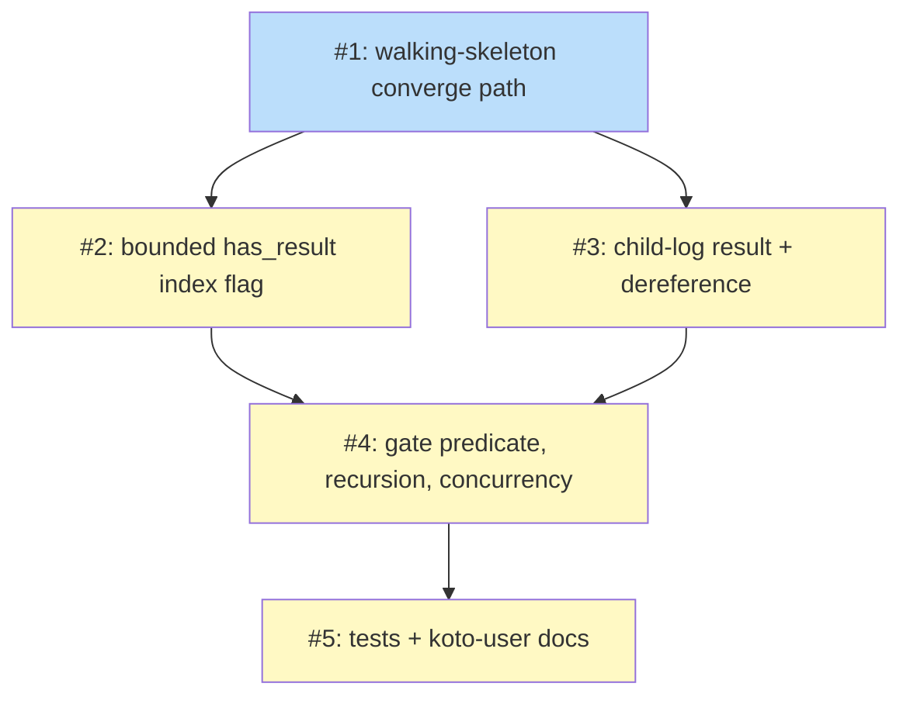

# PLAN: request-store-converge

## Status

Draft

## Scope Summary

Complete the converge half of koto's coordinator-and-delegates model: a child's
completion auto-promotes a typed `WorkflowResult` envelope that a parent reads at
its existing children-complete gate, so a coordinator converges a fan-out without
opening any child log. Entirely additive to koto's engine and CLI.

## Decomposition Strategy

**Walking skeleton.** The components interact across a single end-to-end converge
path — child terminal tick, three storage surfaces, parent gate read — and the
integration risk concentrates at one boundary: the cleanup race between a child's
auto-clean and the parent's converge. Issue 1 builds a thin end-to-end slice (the
envelope, the event variant, the additive `ChildCompleted.result` field, minimal
terminal-tick promotion, and a gate read off the parent-log copy) so that boundary
surfaces first. Issues 2-5 then thicken each surface: the bounded index flag, the
durable child-log record with live dereference and cleanup-race fallback, the gate
pass-predicate plus recursion and concurrency hardening, and the test and docs
coverage.

This plan lands as a single PR (single-pr mode). It is one cohesive engine feature
that delivers observable value as one increment; no hard constraint forces a split,
and the walking-skeleton issues are building blocks of that one feature rather than
independently shippable deliverables.

## Issue Outlines

### Issue 1: feat(engine): walking-skeleton converge path (envelope, event, parent-log result, minimal gate read)

**Goal**: Establish the thin end-to-end converge path so a parent can read one
completed child's result from its own log without opening the child.

**Acceptance Criteria**:
- [ ] `WorkflowResult { status: TerminalOutcome, summary: String, payload: Option<serde_json::Value> }` added to `src/engine/types.rs` with `Serialize`/`Deserialize`; `payload` uses `#[serde(default, skip_serializing_if = "Option::is_none")]`.
- [ ] `EventPayload::RequestStoreResult { result: WorkflowResult }` added (wire `type: "request_store.result"`), wired into the `payload_type` match arm and the `Event::deserialize` dispatch.
- [ ] `ChildCompleted` gains an additive `result: Option<WorkflowResult>` field (and `ChildCompletedPayload`), optional via serde so pre-feature parent logs round-trip.
- [ ] On a child's terminal tick, `append_child_completed_to_parent` synthesizes a `WorkflowResult` from the existing `TerminalOutcome` projection and attaches it as `ChildCompleted.result`.
- [ ] `build_children_complete_output` inlines each child's `result` read from the parent's `ChildCompleted.result`; a unit/functional test shows a parent reading a completed child's result without replaying the child log.

**Dependencies**: None

**Type**: code
**Files**: `src/engine/types.rs`, `src/cli/mod.rs`, `src/cli/batch.rs`

### Issue 2: feat(engine): add bounded has_result flag to TerminalIndexEntry

**Goal**: Give the hot discovery scan a cheap done-bit that signals a result
exists, without ever carrying result content in the index line.

**Acceptance Criteria**:
- [ ] `TerminalIndexEntry` gains `has_result: bool` with `#[serde(default, skip_serializing_if = "is_false")]`.
- [ ] The flag is threaded through `append_terminal_index*`, the reader dedup path, and the compaction body, all of which carry it through unchanged for older lines.
- [ ] A test confirms the index line stays within `MAX_INDEX_LINE_BYTES` (PIPE_BUF) even for a child with a large result.
- [ ] A test confirms `has_result` round-trips and defaults to `false` on older index lines.

**Dependencies**: Blocked by <<ISSUE:1>>

**Type**: code
**Files**: `src/engine/terminal_index.rs`

### Issue 3: feat(engine): durable child-log result and live-event dereference with cleanup-race fallback

**Goal**: Persist the result durably on the child's own log and dereference it
correctly whether the child session is live or already auto-cleaned, never by
replaying a transcript.

**Acceptance Criteria**:
- [ ] On the terminal tick, `RequestStoreResult` is appended to the CHILD's own session event log under the same atomic-append discipline as the terminal evidence.
- [ ] The converge read dereferences the result from the child's `request_store.result` event when the child session still exists, and from the parent's `ChildCompleted.result` when the child has been auto-cleaned.
- [ ] No code path replays a child's working/session transcript to obtain a result.
- [ ] A `request_store.result` event that fails to parse is skipped under the existing skip-and-continue discipline rather than aborting the converge.
- [ ] An older koto build reading newer logs degrades gracefully: the event falls through the `Unknown` arm and additive fields fall to serde defaults.

**Dependencies**: Blocked by <<ISSUE:1>>

**Type**: code
**Files**: `src/cli/mod.rs`, `src/engine/types.rs`

### Issue 4: feat(engine): converge gate predicate, GateBlocked outstanding set, recursion and concurrency

**Goal**: Make the children-complete gate a correct converge point that blocks
until results are in, names the outstanding children, inlines all results when
cleared, and holds under recursion and concurrent completion.

**Acceptance Criteria**:
- [ ] The gate is non-passing while any non-skipped child in the set has `has_result == false`; a `Skipped` child with no evidence carries a skipped-status default-summary result and does not block the set.
- [ ] While non-passing, `koto next` returns the existing `NextResponse::GateBlocked` variant with a converge `blocking_condition` that names the outstanding children by their fan-out identity; the parent is not advanced.
- [ ] When the last result lands, the gate passes, the state advances, and the cleared directive carries every child's result inline — no child log opened.
- [ ] The blocked set equals exactly the children the parent dispatched (`parent_workflow == parent`).
- [ ] A three-level-recursion test shows a mid-level coordinator converging its children and then auto-promoting its own result up identically, with no depth-specific code path.
- [ ] An N-concurrent-completions test shows each result appended atomically with no partial or interleaved result observed at the converge point.
- [ ] Result promotion handles a terminal state whose `accepts` block has no summary field by falling back to a final-state-derived default summary.

**Dependencies**: Blocked by <<ISSUE:2>>, <<ISSUE:3>>

**Type**: code
**Files**: `src/cli/batch.rs`, `src/cli/mod.rs`

### Issue 5: test(engine)+docs: converge coverage and koto-user command reference

**Goal**: Land the functional and unit coverage the design enumerates and update
the koto-user command reference so the converge surface is documented.

**Acceptance Criteria**:
- [ ] Unit coverage: `WorkflowResult` round-trip, snake_case status wire form, optional payload omitted when `None`, older-log graceful degrade to `Unknown`, index line within `MAX_INDEX_LINE_BYTES`, `has_result` defaults false on older lines.
- [ ] Functional coverage: blocked-set membership equals dispatched children, cleared directive carries results inline, no child log replayed, three-level recursion, N concurrent completions (consolidating any coverage seeded in earlier issues into a coherent suite).
- [ ] The koto-user command reference documents how a coordinator converges at the children-complete gate and reads inlined child results.
- [ ] `cargo test` passes; the documentation references only public koto paths and the existing command surface (no new command noun).

**Dependencies**: Blocked by <<ISSUE:4>>

**Type**: docs

## Implementation Issues

Not applicable in single-pr mode. No GitHub issues or milestone are created; the
work lands as one PR. The Issue Outlines section above carries the decomposition
that drives implementation, and the Dependency Graph below shows the sequencing.

## Dependency Graph

**Legend**: Green = done, Blue = ready, Yellow = blocked

## Implementation Sequence

**Critical path**: Issue 1 -> (Issue 2 + Issue 3) -> Issue 4 -> Issue 5.

1. **Issue 1** is the walking skeleton — the only initially-ready issue. It must
   land first because every other issue thickens a surface the skeleton
   establishes (the envelope type, the event variant, and the additive
   `ChildCompleted.result` the gate reads).
2. **Issues 2 and 3 parallelize** after the skeleton. Issue 2 adds the bounded
   index done-bit; Issue 3 adds the durable child-log record and the live /
   cleaned-up dereference. They touch different surfaces (`terminal_index.rs` vs
   the child-log append + dereference) and have no ordering dependency on each
   other.
3. **Issue 4** is the convergence point and depends on both: the gate predicate
   reads the index `has_result` done-bit (Issue 2) and dereferences via the live
   event or the parent-log fallback (Issue 3). It carries the load-bearing
   correctness (recursion and N-concurrent integrity), hence `critical`
   complexity.
4. **Issue 5** finalizes the consolidated test suite and the koto-user command
   reference once the behavior is complete.

Because this is single-pr, the issues are sequencing guidance for one shared
branch and PR, not separate GitHub issues.
