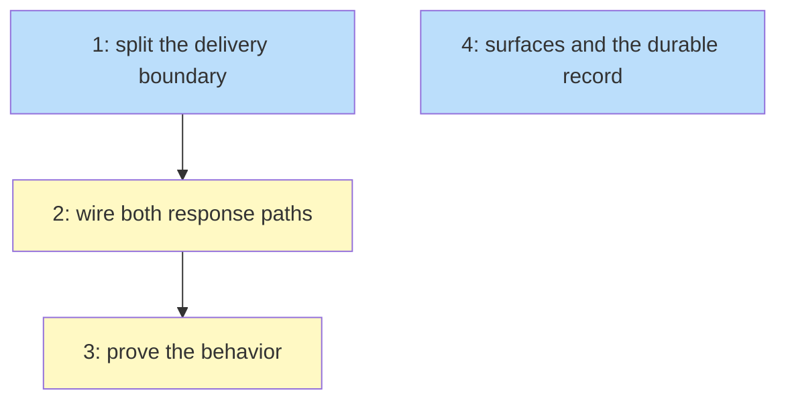

# PLAN: self-loop suppresses phase details

## Status

Active

Single-pr, tracking level `none`: no GitHub issues and no milestone are created,
so the Draft to Active transition auto-fires at the end of authoring. The four
outlines below are the decomposition `/work-on` consumes; they are not filed as
issues and their numbers are local to this document.

## Scope Summary

Make a self-transition stop re-delivering a phase's long-form instructions, per
koto#90's acceptance criterion 3, by splitting the delivery boundary from the
gate epoch — and bring every test, eval, agent-facing surface and durable
upstream document into line with the rule that ships. One item is record-keeping
rather than correction: `DESIGN-koto-next-output-contract.md` describes a
mechanism an earlier change already replaced, and gains a cross-reference so a
reader is not left believing it.

## Decomposition Strategy

**Horizontal.** The design's components have one clear prerequisite ordering: the
boundary functions exist before the call sites can name them, and the behavior
has to be real before an integration test can observe it. There is no integration
risk to flush out early — no new component, no new interface between processes,
no new data flow — so a walking skeleton would buy nothing and would split the
one closure this change turns on across two issues.

Outlines 1 through 3 are a strict chain. Outline 4 is documentation and record
work that depends on the DESIGN alone, and is deliberately given no dependency:
inside a single PR everything lands together, so the constraint that surfaces
must not describe unshipped behavior is a landing-order constraint, not an
authoring-order one.

Everything lands in one pull request. koto declares no delivery preference, so
the consolidated default applies, and none of the three escape branches fires:
there is no cross-repo landing order, no merge gate between steps, and none of
the four units is independently useful — a boundary with no call sites changes
nothing an agent can observe, and documentation describing behavior that has not
shipped is worse than none.

## Issue Outlines

### Issue 1: split the delivery boundary from the gate epoch

**Goal**: `src/engine/persistence.rs` computes two named boundaries over one
scan, so the delivery decision and the gate classification can disagree
deliberately.

**Complexity**: critical

**Acceptance Criteria**:
- [ ] A private `Boundary` enum distinguishes an entry that closes every window
      from one that closes only the delivery window, and a single private scan
      takes it. No call site outside the two wrappers names a boundary value.
- [ ] `epoch_slice` replaces `occupancy_slice` and is behaviorally identical:
      the same three entry variants, the same `to == state` test, the same
      `&events[idx + 1..]` and whole-log fallback arms.
- [ ] `delivery_window` skips a `Transitioned` or `DirectedTransition` whose
      source phase equals its target. The `Rewound` arm does not bind the source
      phase at all.
- [ ] `latest_epoch_gate_failed` reads `epoch_slice`. The delivery check reads
      `delivery_window` and is renamed to `instructions_delivered_this_window`.
- [ ] Exactly two assertions invert:
      `instructions_delivered_resets_on_a_self_transition`'s first assertion,
      which becomes true, and the second half of
      `instructions_delivered_resets_on_arrival_by_directed_transition` — the
      assertion following the directed self-transition, which becomes true. The
      second assertion of the first test and the first of the second are already
      true under the new rule and stay as they are. Both tests are renamed to say
      what they now assert.
- [ ] No assertion in any other case in the module changes the boolean it
      asserts. Call-site renames from `instructions_delivered_this_occupancy` to
      the new name are not modifications, and a reviewer running a diff-shaped
      check on `assert` lines will see all twelve of them touched by the rename;
      the check that matters is whether any asserted boolean flipped.
- [ ] New unit cases: a self-entry with no delivery record anywhere in the log
      still reports not-delivered; a rewind recording the same phase as both
      source and target reports not-delivered; and one synthetic log — a
      cross-phase entry, a delivery record, a failed gate evaluation, then a
      self-transition — makes the gate classification report not-blocked while
      the delivery decision reports already-delivered.
- [ ] `derive_evidence`, `derive_overrides`, `derive_last_gate_evaluated` and
      `derive_visit_counts` are unchanged, and `src/cli/dashboard_data.rs` and
      `src/workflows_surface/project.rs` have no diff. Those are the four
      independent walks and the two gate-classification consumers the DESIGN
      decides to leave alone, and folding them into `epoch_slice` is the tidy-up
      a maintainer in this file would reach for.
- [ ] The doc comments on all three functions state which boundary they read and
      why the two now differ. The sentence claiming they cannot disagree is gone.

**Dependencies**: None

**Type**: code
**Files**: `src/engine/persistence.rs`

### Issue 2: wire both response paths

**Goal**: both `koto next` construction sites use the renamed delivery check, and
the comment that proves the old behavior is replaced by the argument for the new
one.

**Complexity**: testable

**Acceptance Criteria**:
- [ ] The natural-advancement path and the directed-transition path both call
      `instructions_delivered_this_window`. Neither gains nor loses a file read:
      the directed path still builds its list in memory from the payload it just
      appended, and the natural path still performs the one post-advance read it
      performs today.
- [ ] The directed path's comment no longer claims the check provably evaluates
      to false on every call. It states what is now true: a directed transition
      into the occupied phase is not a window opener, so the scan reaches the
      real arrival and finds its record.
- [ ] The comment on the natural path and the combinator's doc comment in
      `src/cli/next_types.rs` describe the delivery window rather than the old
      boundary.
- [ ] The `InstructionsDelivered` doc comment in `src/engine/types.rs` no longer
      says nothing appends the event. That file's diff adds no `EventPayload`
      variant, adds no field to the delivery event, and does not change the
      schema version constant.
- [ ] The three unit tests in `src/cli/next_types.rs` that pin the terminal
      variant — pointer prefix, suppression, and carries-details — pass with their
      assertions unmodified. The terminal carve-out holds by construction, and
      those tests are what say so.
- [ ] The crate compiles and the unit tests pass:
      `cargo test --lib -- --test-threads=1`. The full suite is deliberately not
      a criterion here. Outline 1 renames a function two call sites still import,
      so the crate does not build until this outline lands; and once it does, three
      integration assertions still encode the old rule until outline 3 fixes them.
      `cargo test` is first runnable at the end of this outline and first green at
      the end of the next.

**Dependencies**: Blocked by <<ISSUE:1>>

**Type**: code
**Files**: `src/cli/mod.rs`, `src/cli/next_types.rs`, `src/engine/types.rs`

### Issue 3: prove the behavior against a running binary

**Goal**: every case the PRD's acceptance criteria name is covered by a test, and
the byte-identity baseline is shown not to have moved.

**Complexity**: testable

**Acceptance Criteria**:
- [ ] `tests/instructions_delivery_test.rs` covers, as new cases: two consecutive
      self-transitions, both responses asserted; a directed transition into the
      occupied phase; a tick that leaves a phase, passes through a phase with an
      unconditional transition and returns within the same tick; a `koto rewind`
      recording the same phase as source and target, followed by a tick that
      carries the instructions; `--full` on a suppressing tick followed by a
      non-advancing tick that omits; and the recovery pointer at the head of the
      directive on both the self-transition and directed-self-transition
      responses that omit the instructions.
- [ ] The non-state-entry case records a decision, not a gate override, and
      asserts that the next response still omits and still carries the pointer. A
      gate override is the wrong instrument: on the gated template in this file
      an override unblocks the phase and the next response is terminal, which has
      no instructions field to assert against.
- [ ] The same-tick round trip is expressed against a new template constant. No
      existing shared template constant is edited.
- [ ] The two tests asserting self-transition and repeated directed-transition
      re-delivery are inverted and renamed. No other existing test in this file
      has an assertion modified; comment rewrites are not assertion changes.
- [ ] The comments inside this file that narrate the old boundary are rewritten
      alongside the assertions they explain. Five sit inside tests whose
      assertions must not change: the loop-back arrival, the gate-blocked repeat,
      the directed-then-non-advancing tick, and both override tests.
- [ ] `tests/status_phase_retrieval_test.rs`'s no-writes test reaches `implement`
      through a genuine arrival rather than through a directed transition issued
      while already there, its assertion that the first response carries the
      instructions survives unchanged, and a case is added covering the
      retrieval after a suppressing tick: `koto status` returns the instructions,
      the session state file is byte-identical before and after the call, and the
      following plain tick still omits.
- [ ] `tests/next_response_baseline.rs` passes. The fixture's diff against main
      contains no changed line inside a `"stdout"` value, and nothing in the
      fixture changes except the `description` string stating the old boundary and
      any `notes` entry that does the same, each rewritten to state topology only
      and edited in lockstep with its source. The sequence label is untouched.
      `regenerate_baseline_fixture` is not run.
- [ ] The behavior is demonstrated by running a built binary against a real
      template, covering thirteen cases by name: first arrival; self-loop; second
      consecutive self-loop; loop-back to an earlier phase; re-entry after
      leaving; same-tick round trip; rewind from a later phase; rewind whose
      source and target are the same phase; directed transition to a different
      phase; directed transition to the occupied phase; first and second
      non-advancing tick; `--full`; and `koto status`. The measured output is
      recorded in the pull request body.
- [ ] `cargo test -- --test-threads=1` passes. This is the first point in the
      chain where the whole suite can be green.

**Dependencies**: Blocked by <<ISSUE:2>>

**Type**: code
**Files**: `tests/instructions_delivery_test.rs`, `tests/status_phase_retrieval_test.rs`, `tests/next_response_baseline.rs`, `tests/fixtures/next-response-baseline/instruction-free.json`

### Issue 4: bring every surface and the durable record into line

**Goal**: no committed file asserts the old rule, and the two upstream documents
that argued for it record that it was reversed, by what, and why.

**Complexity**: simple

**Acceptance Criteria**:
- [ ] Five plugin surfaces state the rule as an arrival test and none of them
      says that leaving and re-entering the same state re-delivers:
      `plugins/koto-skills/skills/koto-user/references/response-shapes.md` —
      four prose passages plus the embedded example response whose own `details`
      value states the rule;
      `plugins/koto-skills/skills/koto-user/references/command-reference.md`;
      `plugins/koto-skills/skills/koto-author/SKILL.md`;
      `plugins/koto-skills/skills/koto-author/references/template-format.md`;
      and `plugins/koto-skills/.cursor/rules/koto.mdc`.
- [ ] `docs/guides/cli-usage.md` and `docs/reference/session-feed.md` do the
      same, and the session-feed reference no longer claims the delivery event is
      not emitted yet.
- [ ] `plugins/koto-skills/skills/koto-user/evals/evals.json` keeps both existing
      delivery evals with their scenarios and their verdicts. Their
      `expected_output` text, their assertion strings and their names may all be
      reworded where they appeal to the boundary this change moves; no assertion
      is removed. One new eval asserts that a self-loop tick omits the
      instructions and that this is expected.
- [ ] `docs/prds/PRD-inline-phase-details.md` and
      `docs/designs/current/DESIGN-inline-phase-details.md` are amended in place,
      keeping their statuses and paths. The passage headed "A contradiction in
      the PRD was corrected" becomes a record of both rulings and says which
      governs.
- [ ] `docs/designs/current/DESIGN-koto-next-output-contract.md` gains one
      cross-reference naming the design that replaced its visit-count mechanism.
      Nothing else in it changes. This is record-keeping rather than correction:
      that document states no self-transition rule, so it is outside the
      no-stale-assertion requirement and inside the reversal-record one.
- [ ] `CHANGELOG.md` has an entry under `[Unreleased]` naming the behavior change
      and the renamed function.
- [ ] Every touched document passes `shirabe validate`.

The repo-wide grep that backstops this enumeration is not an acceptance criterion
here. It is cross-cutting by construction — the lines it catches in
`src/engine/persistence.rs`, `src/cli/mod.rs`, `src/cli/next_types.rs` and the
delivery test belong to the other three outlines — so it lives in the
Implementation Sequence's verification gate, where the other whole-plan checks
are, and it is what keeps this outline genuinely dependency-free.

**Dependencies**: None

**Type**: docs
**Files**: `plugins/koto-skills/skills/koto-user/references/response-shapes.md`, `plugins/koto-skills/skills/koto-user/references/command-reference.md`, `plugins/koto-skills/skills/koto-author/SKILL.md`, `plugins/koto-skills/skills/koto-author/references/template-format.md`, `plugins/koto-skills/.cursor/rules/koto.mdc`, `plugins/koto-skills/skills/koto-user/evals/evals.json`, `docs/guides/cli-usage.md`, `docs/reference/session-feed.md`, `docs/prds/PRD-inline-phase-details.md`, `docs/designs/current/DESIGN-inline-phase-details.md`, `docs/designs/current/DESIGN-koto-next-output-contract.md`, `CHANGELOG.md`

## Dependency Graph

## Implementation Sequence

The critical path is 1 to 2 to 3. The boundary functions must exist before the
call sites can name them, and the call sites must be wired before an integration
test can observe anything.

Outline 4 is a parallel branch off nothing. Every file it touches — five plugin
surfaces, the eval suite, two guides, two upstream documents and the changelog —
depends on the DESIGN rather than on any code this plan writes, and the DESIGN is
Accepted. The constraint that documentation must not describe unshipped behavior
is about what lands, not about what is written first, and in a single-pr plan
everything lands at once.

The one file where outlines 3 and 4 would have collided is
`tests/instructions_delivery_test.rs`: its narrating comments state the old rule
and so fall inside the documentation sweep, while its assertions belong to
outline 3. Both live in outline 3, which owns the file.

The verification gate for the whole plan is the set CI runs — format, clippy
without `--all-targets`, the test suite single-threaded, the stability crate, and
the audit — plus the documentation schema workflow that this plan's own `docs/`
changes trigger, and the plugin workflow's template compilation, which fires
because outline 4 touches the `plugins/` tree.

Two whole-plan checks belong here rather than to any outline. The first is the
repo-wide grep for the moved vocabulary, excluding the staging directory and this
chain's own PRD and BRIEF: no surviving line may assert that a self-transition
re-delivers instructions or opens a delivery window. It catches the surface nobody
enumerated, and it can only pass once every outline's comments have been rewritten,
so it is the last thing to run rather than any one outline's criterion.

The second is the staging directory for non-durable workflow artifacts: it must be
empty, and no file this change adds or modifies may name a path inside it. Those
are two conditions with different failure modes. The pull request leaving draft is
what makes CI's artifact check run at all; the directory being empty is what makes
it pass.

One validator notice is expected and deliberate: the format check flags a
populated dependency diagram on a single-pr plan. The diagram is kept because the
plan's own creation contract asks single-pr plans to carry one, and four nodes
with three edges is a diagram worth having. The notice is not an error and does
not gate CI.
