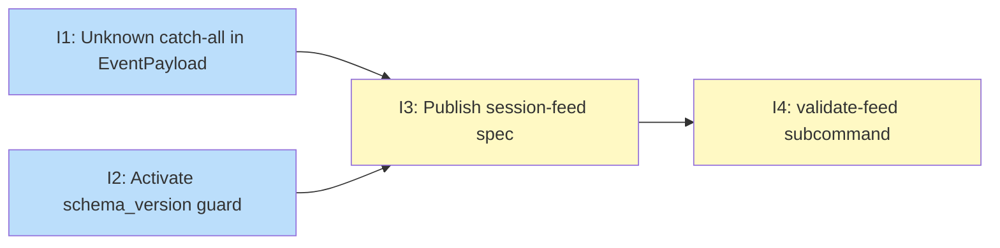

## Status

Draft

## Scope Summary

Formalises koto's JSONL session event log as a stable, versioned data contract by publishing a combined YAML-frontmatter + markdown spec, activating the dormant `schema_version` field as a real compatibility signal, replacing the hard-fail unknown-event-type error with a graceful catch-all, and adding a `koto template validate-feed` subcommand for consumers to validate real log files against the spec.

## Decomposition Strategy

**Horizontal decomposition.** The four issues deliver one complete layer each and have clear, stable interfaces between them. The two engine changes (Issues 1 and 2) are independent of each other and of the spec. The spec (Issue 3) documents the final implemented behaviour and is written after the code is in place. The validator (Issue 4) depends on the spec file existing and on `split_frontmatter` being `pub(crate)`. No runtime coupling exists between the engine layer, the documentation layer, and the CLI layer, making parallel execution of Issues 1 and 2 safe.

## Issue Outlines

### Issue 1: feat(engine): add Unknown catch-all to EventPayload deserializer

**Complexity**: testable

**Goal**

Add an `Unknown` catch-all variant to `EventPayload` so that koto tools degrade gracefully when reading logs produced by a newer koto version instead of hard-failing with `StateFileCorrupted`.

**Acceptance Criteria**

- [ ] `EventPayload` gains an `Unknown { type_name: String, raw_payload: serde_json::Value }` variant.
- [ ] The `other =>` hard-error arm in the `Event` custom deserializer is replaced with an arm that constructs `EventPayload::Unknown { type_name: other.to_string(), raw_payload: payload }`.
- [ ] `type_name()` returns `"unknown"` for the `Unknown` variant.
- [ ] `append_event` (or equivalent write path) includes a `debug_assert!(false, "Unknown events must not be passed to append_event")` guard so misuse surfaces during development.
- [ ] The advance loop and `koto status` match blocks include a `EventPayload::Unknown { .. }` arm (or wildcard equivalent) so unknown events are silently skipped in state machine logic.
- [ ] `koto query --events` serializes `Unknown` events using the original `type_name` from the variant (not the static `"unknown"` string), so the unrecognized type name is visible to the operator.
- [ ] No `Serialize` impl is added for `Unknown` — it must never be written to disk.
- [ ] Unit test: deserializing a JSONL event with an unrecognized `type` string produces `EventPayload::Unknown` without error.
- [ ] Unit test: reading a log containing an unknown event type in a non-final position does not return `StateFileCorrupted`.
- [ ] Existing unit tests in `src/engine/types.rs` continue to pass with no regressions.

**Dependencies**

None

---

### Issue 2: feat(engine): activate schema_version contract guard

**Complexity**: testable

**Goal**

Activate `schema_version` as a machine-readable compatibility signal by defining `CURRENT_SCHEMA_VERSION` and adding a guard in `parse_header` that returns `EngineError::IncompatibleSchemaVersion` when a session file's version exceeds the supported maximum.

**Acceptance Criteria**

- [ ] `pub const CURRENT_SCHEMA_VERSION: u32 = 1` is added to `src/engine/types.rs` with a doc comment explaining when the value is bumped (new event type added, required field removed from existing type, or event envelope keys changed; additive optional fields do not require a bump).
- [ ] `EngineError::IncompatibleSchemaVersion { found: u32, max_supported: u32 }` is added to `src/engine/errors.rs` with a user-facing error message of the form `"incompatible schema version: found {found}, max supported {max_supported}"`.
- [ ] `parse_header` in `src/engine/persistence.rs` checks `header.schema_version > CURRENT_SCHEMA_VERSION` after deserializing the header and returns `EngineError::IncompatibleSchemaVersion` when the condition holds.
- [ ] The guard is not duplicated in `read_header` or `read_events`; `parse_header` is the sole enforcement point.
- [ ] Existing `StateFileHeader` construction sites are unchanged (they already write `schema_version: 1`).
- [ ] Unit test: a state file with `schema_version: 2` passed to `read_events` returns `EngineError::IncompatibleSchemaVersion`.
- [ ] Unit test: a state file with `schema_version: 1` is accepted without error.
- [ ] All existing tests pass without modification.

**Dependencies**

None

---

### Issue 3: docs(reference): publish session-feed data contract spec

**Complexity**: simple

**Goal**

Publish `docs/reference/session-feed.md` as the authoritative session-feed data contract and add a spec-sync checklist item to the PR template.

**Acceptance Criteria**

- [ ] `docs/reference/session-feed.md` exists as a combined YAML-frontmatter + markdown-body file.
- [ ] Frontmatter includes a `schema_version: 1` key at the top level.
- [ ] Frontmatter includes a `header.fields` block covering all 7 header fields (`schema_version`, `workflow`, `template_hash`, `created_at`, `session_id`, `parent_workflow`, `template_source_dir`) with correct `type`, `required`, `nullable`, and `format` entries where applicable.
- [ ] Frontmatter includes an `events` block covering all 15 event types with correct `tier` (1, 2, or 3) and `fields` entries.
- [ ] Every field entry in the frontmatter uses only the vocabulary defined in the design doc: `type` (`string`, `integer`, `boolean`, `object`, `array`, `any`), `required` (`true`/`false`), `nullable` (`true`/`false`), `format` (`uuid`, `rfc3339`), `enum` (list of strings).
- [ ] The `tier` key appears at the event level, not the field level, for all 15 event types.
- [ ] Enum values are specified for `condition_type` (`"auto"`, `"gate"`, `"skip_if"`), `gate_evaluated.outcome` (`"passed"`, `"failed"`), and `child_completed.outcome` (`"success"`, `"failure"`, `"skipped"`).
- [ ] Markdown body covers: file structure (header line + event lines), header record with field table, event envelope with field table, all reader guarantees (ordering, durability, atomicity, partial-write recovery, single-writer, old format compatibility, unknown-version handling, terminal state detection).
- [ ] Markdown body covers: forward-compatibility rules table (new optional field, new required field, removed field, new event type, unknown type string, unknown field within known payload, schema_version > max).
- [ ] Markdown body covers: all 15 event types organized by tier, each with a JSON example and a field table.
- [ ] Markdown body explicitly documents known gaps: no `workflow_completed` event, gate output schema is gate-type-specific, `batch_finalized.superseded_by` is never present in raw JSONL.
- [ ] Markdown body covers lifecycle metadata surface: `StateFileHeader` as the natural addition point, additive optional header fields follow the same non-breaking rules as event fields.
- [ ] `.github/pull_request_template.md` exists (created if absent) with a `## Checklist` section containing exactly this item:
  ```
  - [ ] If `EventPayload` variants or `StateFileHeader` fields were added, removed, or
        renamed: `docs/reference/session-feed.md` frontmatter and body updated to match.
  ```

**Dependencies**

Blocked by Issue 1, Issue 2

---

### Issue 4: feat(template): add koto template validate-feed subcommand

**Complexity**: testable

**Goal**

Implement `koto template validate-feed <log-file>` as a CLI subcommand that validates a JSONL session log against the machine-readable schema in `docs/reference/session-feed.md`.

**Acceptance Criteria**

- [ ] `split_frontmatter` in `src/template/compile.rs` is changed from private to `pub(crate)` and re-exported from `src/template/mod.rs`.
- [ ] `koto template validate-feed <log-file>` subcommand is implemented; no new `[[bin]]` entry is added to `Cargo.toml`.
- [ ] The subcommand reads `docs/reference/session-feed.md` at a path resolved relative to the koto binary's location or a known config path (consistent with how other reference files are located).
- [ ] The subcommand extracts the YAML frontmatter from `docs/reference/session-feed.md` using `split_frontmatter()` and deserializes it with `serde_yaml_ng`.
- [ ] For each JSONL line in the log file (skipping line 1 as the header), the subcommand looks up `events.<type>.fields` by the event `type` string and validates field presence and types per the vocabulary table in the design.
- [ ] Fields with `required: true` must be present and non-null (unless `nullable: true`). Missing required fields produce a per-event error message.
- [ ] Field types are checked against the `type` key values: `string`, `integer`, `boolean`, `object`, `array`, `any` (`any` skips type checking).
- [ ] `enum` fields: field value must match one of the listed strings in `enum`; a mismatch produces a per-event error message.
- [ ] Unknown event types in the log (type string not present in the spec's `events` map) are skipped without error, consistent with the forward-compatibility rule in Issue 1.
- [ ] The subcommand exits non-zero when any validation error is found; exits zero when the log is fully valid.
- [ ] Error messages identify the line number and event type alongside the field-level detail.
- [ ] Unit tests cover: valid log passes without errors; required field absent triggers error; wrong field type triggers error; unknown event type is skipped; `enum` field with invalid value triggers error.
- [ ] `koto template --help` output lists `validate-feed` as an available subcommand.

**Dependencies**

Blocked by Issue 3

---

## Dependency Graph



**Legend**: Green = done, Blue = ready, Yellow = blocked, Purple = needs-design, Orange = tracks-design/tracks-plan

## Implementation Sequence

**Critical path**: Issue 1 → Issue 3 → Issue 4 (or equivalently: Issue 2 → Issue 3 → Issue 4). Three of the four issues lie on the critical path.

**Recommended order**:

1. **Parallel start**: Implement Issues 1 and 2 simultaneously. Both are independent engine changes in `src/engine/` with no shared files. Issue 1 touches `types.rs` and advance loop match blocks; Issue 2 touches `types.rs` (constant), `errors.rs` (new variant), and `persistence.rs` (guard in `parse_header`).
2. **After both engine issues merge**: Write `docs/reference/session-feed.md` (Issue 3). The spec documents the Unknown catch-all and schema_version behaviors introduced in Issues 1 and 2; publishing it before those land would make it inaccurate. Also create `.github/pull_request_template.md` with the spec-sync checklist item.
3. **After spec lands**: Implement `koto template validate-feed` (Issue 4). The subcommand reads `docs/reference/session-feed.md` at runtime, so the spec file must exist. Make `split_frontmatter` `pub(crate)`, re-export from `src/template/mod.rs`, then wire up the CLI subcommand.
