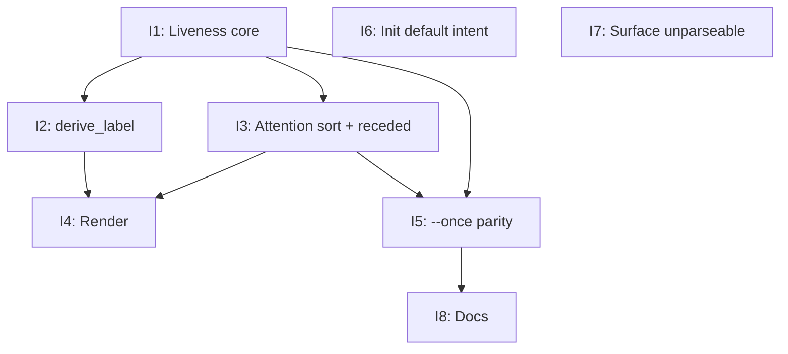

# PLAN: Session legibility in the local dashboard

## Status

Draft

Single-PR plan implementing DESIGN-session-legibility. All steps land on one
branch and ship as one pull request. Steps are ordered and individually
testable; the Implementation Sequence at the end gives the build order.

## Scope Summary

Make `koto dashboard` (and `--once`) an attention surface, per the accepted
PRD/design: classify each session's liveness from last-activity (with
blocked / terminal / never-started resolved before any idle test), order the
default view by attention band, recede the dead behind a count via a read-time
filter, label every row through a total fallback chain plus a default
`IntentUpdated` at init, surface unparseable sessions instead of dropping them,
and mirror it all in `--once` with appended columns and a `--status` filter.
Read-time derivation only -- no migration, no on-disk format change beyond the
additive init intent event.

## Decomposition Strategy

One PR, eight steps. The liveness core (I1) is the foundation the label
and sort steps build on; render and `--once` consume both; init-default and
parse-failure surfacing are independent and can land in any order; the doc
update closes it out. Each step carries its own unit tests; the PR is green
only when the full `cargo test` and `cargo clippy` pass.

## Implementation Issues

Single-PR mode: no GitHub milestone or issues are created; the items below are
the in-PR implementation steps (internal IDs I1-I8), driven on one branch.

### I1 -- Liveness core

**Files:** `src/cli/dashboard_data.rs` (+ thresholds module, e.g. a small
`liveness` submodule).
**Goal:** Add `last_event_at: Option<SystemTime>` and `salient_var:
Option<String>` to `CachedSession`, populated in `read_session` from the tail
event timestamp and from `WorkflowInitialized.variables` (key-priority:
`issue`, `target`, `name`, `task`, `query`). Add the `Liveness` enum
(`NeedsYouBlocked`, `NeedsYouFailed`, `NeedsYouStalled`, `Active`, `Idle`,
`Pending`, `Done`), `classify_liveness(&CachedSession, now)` implementing the
design precedence D1-D7 (terminal/failed/blocked/never-started before idle),
threshold constants (`active_window = 5m`, `stalled_threshold = 2h`,
`abandoned = 7d`), and `attention_key` for the band sort.
**Acceptance:**
- [ ] `classify_liveness` unit tests cover: blocked-beats-stalled (a
      gate-blocked session quiet > 2h is `NeedsYouBlocked`, not stalled);
      terminal-beats-idle; never-advanced (`current_state == None`) is
      `Pending`, not `NeedsYouStalled`; a `Some`-state session quiet > 2h is
      `NeedsYouStalled`; recent session is `Active`; rewound session reads
      fresh (idle from post-rewind tail); future timestamp clamps to zero idle.
- [ ] `cargo test` passes.

### I2 -- derive_label (never a bare id)

**Files:** `src/cli/dashboard_data.rs`.
**Goal:** Implement a total `derive_label(&CachedSession)` fallback chain:
`derive_intent(events)` -> `template_name · salient_var · current_state` ->
`template_name · current_state` -> `untitled (template_name)` -> `session_id`
(only when `template_name` is empty). Child rows prefix the parent label
(`parent ▸ leaf`) using the existing tree.
**Acceptance:**
- [ ] Unit tests for every rung, including: a session with `template_name` and
      `current_state` but no intent never renders as a bare id; a freshly
      `WorkflowInitialized` session yields `untitled (<template>)` or better;
      `salient_var` is folded in when a priority key is present.
- [ ] `cargo test` passes.
**Depends on:** I1 (`salient_var` field).

### I3 -- Attention sort + receded partition

**Files:** `src/cli/dashboard_state.rs` (`visible_rows`/`session_sort_key`).
**Goal:** Replace the current sort with the attention band order (NeedsYou ->
Active -> Idle + fresh Pending -> receded), idle-descending within a band.
Partition into a shown set and a receded set (`Done` + `Pending` older than
`active_window` + `Idle` older than `abandoned`); add a reveal toggle so the
receded set is hidden by default and expandable.
**Acceptance:**
- [ ] Tests: needs-you sessions sort ahead of active/idle/done; the receded set
      is excluded from the default shown rows; the reveal toggle includes them;
      ordering is deterministic.
- [ ] `cargo test` passes.
**Depends on:** I1.

### I4 -- Render

**Files:** `src/cli/dashboard_render.rs`.
**Goal:** Row name = `derive_label`; time column = idle (last-activity) with a
liveness glyph + dimming (active bright, idle normal, stalled dim + age, done
check); the receded set collapses to a trailing summary row; when the needs-you
band is empty, lead with an explicit all-clear row (`Nothing needs you -- N
active, M idle`).
**Acceptance:**
- [ ] Rendering tests (or snapshot) show: label as name, idle column, the
      collapsed receded summary, and the all-clear row when no session needs
      the user.
- [ ] `cargo test` passes.
**Depends on:** I2, I3.

### I5 -- `--once` parity

**Files:** `src/cli/dashboard.rs`, `src/cli/mod.rs` (DashboardArgs).
**Goal:** Emit rows in attention order; append `idle` and `liveness` as columns
7-8 (first six unchanged for compatibility); add `--status <liveness>`,
`--needs-you`, and `--all` flags (default excludes the receded set, matching the
TUI). Sanitize appended fields of tabs/newlines.
**Acceptance:**
- [ ] Golden/CLI tests: first six columns unchanged for an existing session;
      `idle`/`liveness` appended; rows in attention order; `--status blocked`
      restricts output; `--all` includes receded sessions.
- [ ] `cargo test` passes.
**Depends on:** I1, I3.

### I6 -- Default intent at init

**Files:** `src/cli/mod.rs` (`handle_init`).
**Goal:** When no `--intent` is supplied, append a default `IntentUpdated`
event derived from: template `description` -> initial-state `directive` first
line -> `template_name`. Additive; existing sessions untouched.
**Acceptance:**
- [ ] Test: a session created with no `--intent` has a non-empty derived intent
      read back by `derive_intent`; an explicit `--intent` still wins.
- [ ] `cargo test` passes.

### I7 -- Surface unparseable sessions

**Files:** `src/cli/dashboard_data.rs` (`refresh`).
**Goal:** Count session dirs whose header fails to parse into an `unreadable`
tally on the tree instead of silently skipping; expose it (a trailing note in
the TUI and a count in `--once`).
**Acceptance:**
- [ ] Test: a sessions dir containing an unparseable state file is counted, not
      silently dropped.
- [ ] `cargo test` passes.

### I8 -- Docs

**Files:** `docs/reference/session-feed.md`.
**Goal:** Document the two new `--once` columns (`idle`, `liveness`), the
liveness vocabulary, and the default exclusion of the receded set (with
`--all`). Update the "Lifecycle Metadata Surface" note to point at the derived
liveness rather than the deferred stored fields.
**Acceptance:**
- [ ] `session-feed.md` reflects the new columns and flags; `shirabe validate`
      (if applicable) and the docs build remain green.
**Depends on:** I5.

## Dependency Graph

Steps 6 and 7 are independent and may land at any point.

## Implementation Sequence

1. **I1** (liveness core) -- foundation.
2. **I2 and I3** (label, sort) -- build on I1.
3. **I4 and I5** (render, `--once`) -- consume label + sort.
4. **I6 and I7** (init default, unparseable) -- independent; land alongside.
5. **I8** (docs) -- closes out after `--once` settles.

Definition of done for the PR: all step acceptance boxes checked, `cargo test`
and `cargo clippy` clean, and a manual `koto dashboard` / `koto dashboard
--once` run against a populated `~/.koto` shows the needs-you set leading,
labels in place of bare ids, the dead receded, and unparseable sessions counted.
