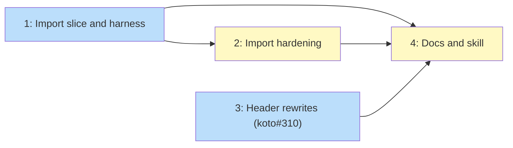

# PLAN: Session migration

## Status

Active

## Scope Summary

Add `koto session import` with a migrated marker and its refusal, the backend
changes it needs (path-style addressing, template resolution from the session
directory, header rewrites through the backend), a harness that measures a
session moved between two simulated hosts, and the guide, design notes and
skill updates, as `docs/designs/DESIGN-session-migration.md` lays out.

## Decomposition Strategy

Walking skeleton. Issue 1 lands the import path end to end together with the
measurement harness, so the carrier is measured from the first pull request.
Issue 2 thickens the import (refusals, retry, rename, trusted templates,
marker checks on every read). Issue 3, the koto#310 fix, is independent of the
skeleton. Issue 4 documents what issues 1 to 3 ship. Each issue lands as its
own pull request in tsukumogami/koto, one PR group per issue.

## Issue Outlines

### Issue 1: feat(session): import a session from another workspace's remote object

**Repo**: tsukumogami/koto

**Group**: import-slice

**Goal**: Land the thin slice of the design: `koto session import <name> --from <workspace-path>` in its simplest form, the migrated marker and its refusal on state reads, `session.cloud.path_style`, the template resolver fallback, and the measurement harness that moves a session between two simulated hosts through an in-process S3-compatible endpoint.

**Acceptance Criteria**:
- [ ] `session.cloud.path_style` is a recognized config key, accepted in project and user config, and when true `create_bucket` addresses the bucket path-style; an endpoint `http://127.0.0.1:<port>` completes init, context add, context get, session list and cleanup.
- [ ] `prefix_for_workspace` hashes the canonical path when it resolves and the literal absolute path otherwise, and equals `repo_id` for an existing directory; unit-tested both ways.
- [ ] `koto session import <name> --from <path>` on the cloud backend creates `<sessions>/<name>/` whose state log holds the source's events verbatim plus one `session_imported` event (from_workspace, from_session, from_session_id, machine_id), with a header naming the import directory as execution and origin anchor, this store, a new session id, and a command-environment record taken on this host.
- [ ] Every context key in the source manifest arrives with identical SHA-256, size and writer, and key names pass `validate_context_key`.
- [ ] The template is taken from this host's cache by `template_hash` (validated as 64 lowercase hex), checked against the hash, and stored as `<template_hash>.json` in the session directory; `resolve_template_path_in_session` falls back to that file when the recorded absolute path is missing and its file name is 64 hex plus `.json`.
- [ ] The target is pushed under this workspace's prefix (state file, every key, manifest, version record and `template.json`) before `migrated.json` is written under the source's prefix, naming target session, session id, workspace path, prefix, machine id and time; the harness asserts each of those objects exists under B's prefix.
- [ ] Against the recording endpoint, the import's only PUT or DELETE under the source's prefix is `migrated.json`.
- [ ] `koto session cleanup` and a terminal tick leave `migrated.json` in place (cloud cleanup skips it), so a source can't lose its marker once the slice ships.
- [ ] `read_header` and `read_events` on the cloud backend check `migrated.json` and return a typed `SessionMigrated` error whose message starts `session_migrated:` and names the target and its workspace; a 404 proceeds; any other failure warns and proceeds.
- [ ] `koto next` on a migrated source exits 2 with error code `session_migrated`; `koto status` exits 2 with the same message; neither changes the local state file.
- [ ] `koto session import --help` states the stopped-source rule: import only a session no process is advancing and whose last write reached the remote.
- [ ] The import refuses with `import_requires_cloud` on the local backend, `import_source_not_found` when the source has no state file, `import_source_migrated` when it carries a marker, `import_source_is_child` for a child, `import_name_taken` when the name exists locally or under this prefix, and `import_template_unavailable` naming the hash when the cache has no matching template.
- [ ] `tests/support/fake_s3.rs` serves path-style GET, PUT, HEAD, DELETE and ListObjectsV2 (prefix, delimiter) from memory on 127.0.0.1 and records requests.
- [ ] `tests/session_migration_test.rs` runs the carrier steps `init-a`, `keys-a`, `import-b` (after `koto template compile` in B), `keys-b`, `advance-b`, `refuse-a`, `reimport-c`, each failing with its step name, with A, B and C on separate HOME, XDG_CACHE_HOME and working directories, and runs in the CI unit-test job.
- [ ] Under `--features cloud-integration-tests` with the bucket secrets, the same carrier steps run against the real bucket with a unique session name and clean up every prefix they touched.
- [ ] The pull request body reports the harness run: each step and its result.

**Dependencies**: None

### Issue 2: feat(session): harden session import refusals, retry and marker checks

**Repo**: tsukumogami/koto

**Group**: import-hardening

**Goal**: Make every import failure leave nothing behind or be finished by a re-run, add `--as` and `--trust-template`, extend the marker check to every context read with a per-process cache, and keep markers through cleanup.

**Acceptance Criteria**:
- [ ] The import stages the target in an exclusively created 0700 directory under the session store, renames it into place only after the push, and on any failure before the rename deletes the staging directory and exactly the objects it pushed (`import_push_failed`); a test injecting a failed PUT asserts no local directory and no object under the target prefix remain.
- [ ] Each of `import_requires_cloud`, `import_source_not_found`, `import_source_migrated`, `import_source_is_child`, `import_name_taken` and `import_template_unavailable` has a test asserting its code and that afterward no local session directory, no staging directory and no object under the target's prefix exist.
- [ ] A source with zero context keys imports, and its target has an empty `ctx/` manifest.
- [ ] `import_source_unreadable` covers an unknown header schema version, a malformed `template_hash`, an unparsable event line, a key failing `validate_context_key`, and a key whose bytes or size don't match the manifest; each has a no-trace test.
- [ ] With the marker PUT made to fail, the import exits `import_unmarked` keeping the target; re-running the same command writes the marker and creates nothing new; a target present only remotely (crash between push and rename) is rebuilt locally by the re-run.
- [ ] The marker is re-read just before it is written; when another import marked the source meanwhile, the import exits `import_source_migrated` naming the other target and keeps its own.
- [ ] `--as <new-name>` imports under the new name: local and remote headers carry it, and the marker names it; a collision without `--as` names the option in its message.
- [ ] `CloudBackend::init_state_file` pushes the compiled template as `template.json`; `--trust-template` takes that copy after checking its hash and parsing it, and the output reports `template: bucket`; without the flag the bucket copy is never used.
- [ ] Every `ContextStore` method on the cloud backend (`add`, `add_with_writer`, `get`, `ctx_exists`, `remove`, `list_keys`, `meta`) refuses a migrated session; `koto context add/get/list/exists/remove` and `koto session rebind` on a migrated source exit non-zero with `session_migrated`.
- [ ] The marker check runs at most once per session per process: against the recording endpoint, `koto status` and `koto next` on a non-migrated session each make exactly one more request than on the parent commit, and the local backend makes none.
- [ ] Importing a source whose terminal tick removed its state file refuses `import_source_not_found`, and the imported target's own terminal tick removes only the target's prefix.
- [ ] With the endpoint stopped, `koto status` on a cloud session proceeds on its local copy and prints a warning.
- [ ] Against the recording endpoint, an import of 5 keys and one of 10 keys differ by exactly 5 times the per-key request count (one GET and one PUT per key), and the harness's import step finishes in under 30 seconds.
- [ ] With sentinel access and secret keys, no import output, error message or marker contains either value, and endpoint URLs in errors carry no userinfo.
- [ ] The carrier harness from issue 1 still passes.

**Dependencies**: Issue 1

### Issue 3: fix(session): push header rewrites through the session backend

**Repo**: tsukumogami/koto

**Group**: header-rewrites

**Goal**: Fix koto#310 by adding `SessionBackend::rewrite_header`, which the cloud backend follows with a state push, and routing every CLI header rewrite through it.

**Acceptance Criteria**:
- [ ] `SessionBackend` has `rewrite_header(id, f)`; `LocalBackend` runs `rewrite_header_atomically`, and `CloudBackend` runs the local rewrite and then pushes the state file.
- [ ] `handle_rebind`, the first-tick anchor adoption in `handle_next`, and the rewrite in `src/cli/init_child.rs` call `rewrite_header`; no file under `src/cli/` calls `rewrite_header_atomically`.
- [ ] The two rewrites in `src/engine/claim.rs` are moved behind the backend where their callers hold one; any that stays is listed in the pull request with the reason.
- [ ] A test runs rebind on a cloud-backed session against a local endpoint that records PUT bodies (extending the request-serving helper in `src/session/cloud.rs` tests, so the issue doesn't wait on issue 1's endpoint) and asserts the last state PUT's header names the new anchor; an integration test asserts `koto next` from the new directory proceeds.
- [ ] A test asserts the same for a first tick that adopts an anchor on a header with none.
- [ ] The local-backend rebind and adoption tests still pass unchanged.

**Dependencies**: None

### Issue 4: docs(cloud): document session import and correct the cloud sync guide

**Repo**: tsukumogami/koto

**Group**: docs

**Goal**: Make the guide, the two cloud designs and the koto-user skill describe moving a session as an import, and fix every gap koto#312 lists.

**Acceptance Criteria**:
- [ ] `docs/guides/cloud-sync-setup.md` has a section on moving a session to another host built on `koto session import`, with the stopped-source rule and how to force a final push (`koto session resolve <name> --keep local`), `--as`, `--trust-template`, and a note that the source's keys stay in the bucket.
- [ ] The guide contains no `--project` flag, no `allow_insecure` key, no claim that a second machine picks up by running `koto next`, and no instruction to `rebind` a session onto another machine.
- [ ] The guide documents `session.cloud.path_style` with a MinIO example on an IP endpoint, lists the commands that reach the remote (`init`, `next`, `status`, `context add`, `context get`, `context list`, `context exists`, `context remove`, `session list`, `session rebind`, `session cleanup`, `session resolve`, `session import`), and lists `session_migrated` and every import error code.
- [ ] `docs/designs/current/DESIGN-config-and-cloud-sync.md` and `docs/designs/current/DESIGN-backend-state-persistence.md` each carry a dated note naming `koto session import` and pointing at `docs/designs/DESIGN-session-migration.md` where it changes what they say (the prefix as identity and migration by import; header rewrites through the backend).
- [ ] The koto-user skill (`SKILL.md`, `references/command-reference.md`, `references/error-handling.md`) documents `koto session import`, its codes and `session_migrated`, and routes "the session moved machines" to the import instead of `rebind`.
- [ ] `cargo test --test doc_names` passes.
- [ ] The pull request states which koto-user evals were run, or that none were and why.

**Dependencies**: Issue 1, Issue 2, Issue 3

## Dependency Graph

**Legend**: Green = done, Blue = ready, Yellow = blocked

## Implementation Sequence

The critical path is 1, then 2, then 4. Issue 1 goes first because it carries
the harness that measures whether a session survives the move. Issue 3 depends
on nothing and can run at any point; in this lane's one-worker order it runs
after issue 1. Issue 4 waits for 1, 2 and 3 because it documents the verb's final
flags and error codes and `rebind` working under the cloud backend.
