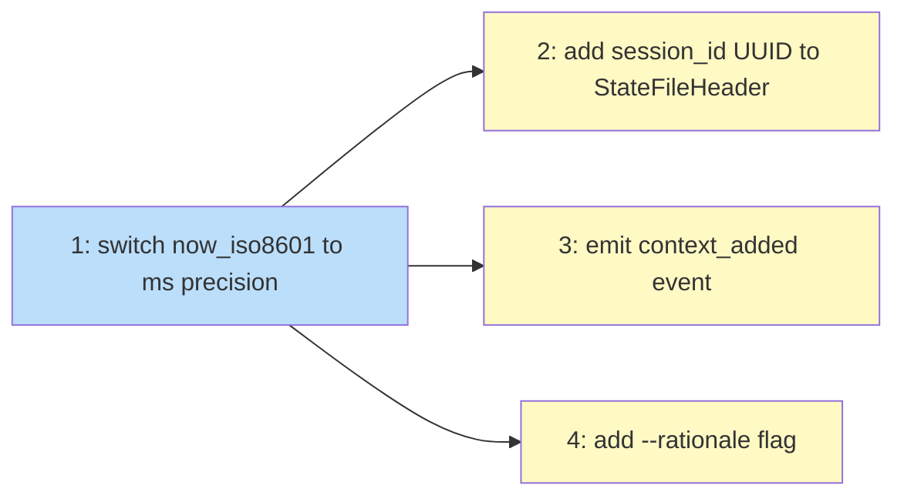

# PLAN: Session Schema Hygiene

## Status

Draft

## Scope Summary

Implements the four schema additions specified in the session schema hygiene design:
millisecond-precision timestamps, session UUID, a `context_added` event on `koto context
add`, and an optional `--rationale` flag on `koto next --to` and `koto rewind`. All
changes are additive and backward-compatible with existing JSONL logs.

## Decomposition Strategy

**Horizontal decomposition.** Each of the four schema additions maps to one issue.
The components have clear, stable interfaces and no integration risk between them —
each is an additive change to existing structs or functions. Issue 1 (timestamps) is
implemented first to clear test noise; Issues 2, 3, and 4 are independent of each
other and can follow in any order.

## Issue Outlines

### Issue 1: feat(types): switch now_iso8601 to millisecond precision

#### Goal

Change `now_iso8601()` in `src/engine/types.rs` to produce millisecond-precision RFC
3339 timestamps (`YYYY-MM-DDTHH:MM:SS.mmmZ`) instead of whole-second timestamps.

#### Acceptance Criteria

- [ ] `now_iso8601()` returns strings matching the pattern `YYYY-MM-DDTHH:MM:SS.mmmZ`
  (24 characters, three fractional-second digits)
- [ ] The implementation uses `subsec_millis()` from `std::time::Duration` with no
  new crate dependencies
- [ ] All existing tests that assert a specific timestamp string are updated to match
  the new format
- [ ] `cargo test` passes with no failures related to timestamp format
- [ ] `cargo clippy` and `cargo fmt --check` pass without warnings or errors

#### Dependencies

None

---

### Issue 2: feat(session): add session_id UUID to StateFileHeader

#### Goal

Add a `session_id` UUID v4 field to `StateFileHeader` that is generated at `koto
init` time and preserved unchanged through rename operations.

#### Acceptance Criteria

- [ ] `StateFileHeader` in `src/engine/types.rs` has a new `session_id: String` field
- [ ] `session_id` is serialized on write with no `#[serde(default)]` on the write
  path — new sessions always emit it
- [ ] `session_id` deserializes to an empty string (via `#[serde(default)]`) when the
  field is absent, so old state files continue to load without error
- [ ] `generate_session_id()` is added in `src/engine/types.rs` and reads 16 bytes
  from `/dev/urandom` using `std::fs::File::open` with no new crate dependencies
- [ ] Generated UUIDs conform to UUID v4 format: version nibble set
  (`buf[6] = (buf[6] & 0x0F) | 0x40`), variant bits set
  (`buf[8] = (buf[8] & 0x3F) | 0x80`), output formatted as lowercase hyphenated
  `8-4-4-4-12`
- [ ] `koto init` constructs `StateFileHeader` with `session_id` populated by
  `generate_session_id()`
- [ ] `relocate()` in `src/session/local.rs` reads the existing header and copies
  `session_id` unchanged rather than generating a new UUID
- [ ] A test asserts that `session_id` is identical before and after a rename via
  `relocate()`
- [ ] No new crate dependencies are introduced

#### Dependencies

Blocked by <<ISSUE:1>>

---

### Issue 3: feat(session): emit context_added event from koto context add

#### Goal

Emit a `context_added` event to the JSONL session log whenever a context artifact
is successfully added via `koto context add`.

#### Acceptance Criteria

- [ ] `EventPayload` gains a `ContextAdded { key: String, hash: String, size: u64 }`
  variant
- [ ] `handle_add` in `src/cli/context.rs` gains a `backend: &dyn SessionBackend`
  parameter
- [ ] The dispatch site in `src/cli/mod.rs` forwards `&backend` to `handle_add`
- [ ] After `store.add(session, key, &content)` succeeds, `backend.append_event(session,
  EventPayload::ContextAdded { key, hash, size })` is called before `handle_add` returns
- [ ] `hash` is the SHA-256 hex digest of the artifact content; `size` is
  `content.len() as u64`
- [ ] SHA-256 is computed using the existing `sha2` or `ring` crate — no new crate
  dependency is introduced
- [ ] If `store.add` fails, no event is emitted
- [ ] If `store.add` succeeds but `backend.append_event` fails, the error propagates
  to the caller (the add operation surfaces the error)
- [ ] Subsequent adds to the same key emit a new `context_added` event with the
  updated hash and size
- [ ] `context_added.seq` is less than the seq of any event emitted by a subsequent
  `koto next` call (ordering guarantee R3.4 holds via last-seq-plus-one strategy)
- [ ] Existing session logs that contain no `context_added` events parse without error
  (backward compatibility)
- [ ] Unit tests cover: correct key/hash/size fields, error propagation when
  `append_event` fails, and no event on `store.add` failure
- [ ] An integration test verifies the ordering guarantee: `context_added.seq` <
  seq of the following `koto next` event

#### Dependencies

Blocked by <<ISSUE:1>>

---

### Issue 4: feat(cli): add --rationale flag to koto next --to and koto rewind

#### Goal

Add an optional `--rationale` flag to `koto next --to` and `koto rewind`, threading
the value into the `DirectedTransition` and `Rewound` event payloads respectively.

#### Acceptance Criteria

- [ ] `DirectedTransition` event payload variant gains `rationale: Option<String>` with
  `#[serde(default, skip_serializing_if = "Option::is_none")]`
- [ ] `Rewound` event payload variant gains `rationale: Option<String>` with
  `#[serde(default, skip_serializing_if = "Option::is_none")]`
- [ ] `koto next --to` accepts an optional `--rationale <TEXT>` flag
- [ ] `koto rewind` accepts an optional `--rationale <TEXT>` flag
- [ ] When `--rationale` is provided to `koto next --to`, the value is included in
  the `directed_transition` event payload
- [ ] When `--rationale` is provided to `koto rewind`, the value is included in the
  `rewound` event payload
- [ ] When `--rationale` is not provided, the `rationale` field is absent from the
  serialized JSON (not serialized as `null`)
- [ ] Existing calls to `koto next --to` and `koto rewind` without `--rationale`
  continue to work (backward compatible)
- [ ] Existing `directed_transition` events in session logs that lack a `rationale`
  field deserialize correctly
- [ ] Existing `rewound` events in session logs that lack a `rationale` field
  deserialize correctly
- [ ] `directed_transition` events with a `rationale` field deserialize correctly

#### Dependencies

Blocked by <<ISSUE:1>>

---

## Dependency Graph

**Legend**: Green = done, Blue = ready, Yellow = blocked

## Implementation Sequence

**Critical path**: Issue 1 → any of Issues 2, 3, 4 (depth: 2)

**Recommended order:**

1. **Issue 1** — implement first; clears all timestamp-format test failures before
   the other issues add new code paths
2. **Issues 2, 3, 4** — independent of each other; implement in any order or pair
   them on separate commits within the same branch

**Parallelization:** Issues 2, 3, and 4 can be done in parallel after Issue 1
lands (within the single PR, as sequential commits). No shared state between them
except the `EventPayload` enum in `src/engine/types.rs`, where Issue 3 adds a new
variant and Issue 4 modifies two existing variants — non-conflicting edits.
