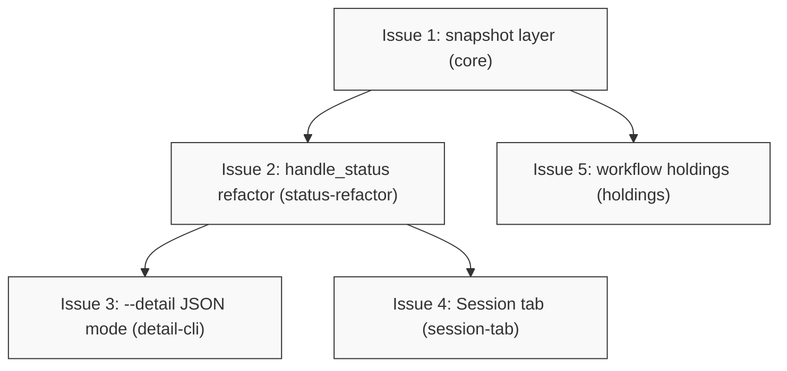

# PLAN: A human-readable view of a session

## Status

Active

## Scope Summary

Implements DESIGN-session-view: a session snapshot layer with bounded,
sanitized content reads; a `--detail` JSON mode and a Session tab on the
dashboard; and a holdings summary in the workflow-view file at contract v3 —
read-only everywhere, with the feed columns, workflow fields and verb set
unchanged.

## Decomposition Strategy

Walking skeleton, lightly adapted. The snapshot layer plus the
`handle_status` refactor are the skeleton every surface stands on; the three
surface units thicken it and are independent of one another. The design's
Implementation Approach already sequences this way, isolating the riskiest
step (the behavior-identical `handle_status` refactor) in its own pull
request so a regression there is unmistakable. The work lands as five pull
requests in this repository, one per group below: `core`, then
`status-refactor`, then `detail-cli` and `session-tab` in parallel, with
`holdings` parallel to everything after `core`.

## Issue Outlines

### Issue 1: feat(session-view): add the session snapshot layer

**Repo**: tsukumogami/koto

**Group**: core

**Goal**: Create `src/session_view.rs` — `SessionViewSnapshot`,
`SnapshotError`, `snapshot()`, `read_key_preview()`, the `Sanitized` newtype,
the directive-rendering helper the design extracts (implemented here;
`snapshot()` uses it, and Issue 2 switches `handle_status` onto it) and the
excerpt/binary/size helpers — plus the backend accessors
`read_context_prefix` (lstat-first, `O_NONBLOCK | O_NOFOLLOW`, fstat,
ctx-root-confined, `Read::take`-bounded) and `manifest_pair`, with nothing
outside the module calling it yet.

**Acceptance Criteria**:
- [ ] `snapshot()` returns facts with absent fields as `None` (capped,
  `created_at` parsed as a timestamp), every manifest key with
  size/writer/created_at/locality/stale, and `migrated:
  Some{target, workspace}` (facts only, keys empty) for a migrated session,
  checked via `check_not_migrated` before any key read; its `directive` comes
  from the module's own directive-rendering helper (PRD R1, R2, R5).
- [ ] `read_key_preview()` classifies text/binary on the bytes actually read
  (NUL or invalid UTF-8 in the sampled prefix), returns bounded excerpts cut
  at character boundaries with a truncation flag, `Binary`/`NotLocal` with
  the manifest's recorded size and 64-hex-validated hash (a non-hex hash
  renders as capped `invalid-hash`), `Unreadable` with a sanitized reason,
  and `InvalidName` for a manifest key failing `validate_context_key` — kept
  in the listing, capped at 256 characters with a cut marker, kept when
  `meta` returns `None`, never joined to a path (PRD R3, R4).
- [ ] Sanitizer tests assert exact output: ESC renders as the literal
  six-character `\u{1B}` form (same for CSI, OSC, U+009B, DEL, U+202E,
  U+200B and a tag-block character), and a literal input `\u{41}` is itself
  escaped so sanitized output is unambiguous; renderers only accept
  `Sanitized` values.
- [ ] A FIFO, device node or symlinked path at a key location is rejected
  without opening/hanging; a symlinked intermediate directory under `ctx/` is
  rejected by the canonicalized-parent check.
- [ ] After a render that produced non-empty output (assert the preview text
  arrived), the session store is byte-identical and the event log grew by
  zero entries; on the fake S3 cloud fixture the remote call count is equal
  across a 5-key and a 50-key session, with no `ctx/` GET and no PUT or
  DELETE at all (PRD R10, N2, AC11).
- [ ] The size formatter renders `0` as `0 B` and `u64::MAX` without panic or
  unit overflow; a snapshot over a fixture manifest exceeding
  `METADATA_CEILING` stops listing at the ceiling and reports the count of
  unlisted keys.
- [ ] `cargo fmt --check`, `cargo clippy --all-targets -- -D warnings` and
  `cargo test` pass.

**Dependencies**: None

**Type**: code
**Files**: `src/session_view.rs`, `src/session/mod.rs`, `src/session/local.rs`, `src/session/cloud.rs`, `src/lib.rs`

### Issue 2: refactor(status): move handle_status onto the directive helper

**Repo**: tsukumogami/koto

**Group**: status-refactor

**Goal**: Replace `handle_status`'s inline directive-rendering logic with
calls to the helper Issue 1 created, with `handle_status` keeping its own
template pass, its extra outputs (template path/hash, `is_terminal`,
hash-mismatch report, `details`, `expects`) and its exact JSON and exit codes,
including the migrated-session exit 2; and widen `dashboard::run`/`run_once`
to `&Backend` (a signature change with no behavior change), so the two surface
issues stay independent of each other.

**Acceptance Criteria**:
- [ ] A characterization test captures the full `koto status` JSON and exit
  code for four fixture shapes — a normal mid-run session, a terminal one, a
  template-hash-mismatch one, and a migrated one (exit 2) — before the
  refactor, and the refactored code reproduces all four byte-for-byte.
- [ ] Every existing `handle_status`/`koto status` test passes unchanged; no
  test expectation is edited.
- [ ] The directive interpolation exists exactly once, in the shared helper;
  `handle_status` and `session_view::snapshot` both call it, and a test
  asserts both produce the same directive text for one fixture session.
- [ ] `handle_status` maps its error cases to its current exit codes
  explicitly (migrated stays exit 2 here).
- [ ] `dashboard::run`/`run_once` take `&Backend`; the dashboard's behavior
  is unchanged (existing dashboard tests pass unedited).
- [ ] fmt, clippy, cargo test pass.

**Dependencies**: Blocked by <<ISSUE:1>>

**Type**: code
**Files**: `src/cli/mod.rs`, `src/cli/dashboard.rs`, `src/session_view.rs`

### Issue 3: feat(dashboard): one-shot --detail JSON mode

**Repo**: tsukumogami/koto

**Group**: detail-cli

**Goal**: Add the `--detail` flag (requires the positional name,
`conflicts_with` `--once`, `--status`, `--needs-you`, `--all`, `--interval`),
emit one JSON object per the design's schema with eager previews up to
`DETAIL_PREVIEW_CEILING`, and document the schema in
`docs/reference/session-feed.md` and the koto-user skill.

**Acceptance Criteria**:
- [ ] Against a fixture session with several keys including one over the
  excerpt bound and one binary: every key appears in lexicographic order with
  metadata; the long key's content carries a truncation marker; the binary
  key shows type, recorded size and hash, no bytes (PRD AC1, AC12).
- [ ] A missing session exits 2 with `{error, command: "dashboard"}` and
  nothing else on stdout; an infrastructure failure exits 3; a migrated
  session exits 0 with `migrated {target, workspace}` and the parsed JSON has
  no `keys` member at all (PRD AC6, AC13).
- [ ] The existing feed invocation produces byte-identical rows against a
  golden fixture; `koto --help`'s top-level verb list is unchanged (PRD AC4,
  AC9).
- [ ] Against a 1,001-key fixture: key 1,000 carries a preview, key 1,001
  carries `contentOmitted: "key-limit"`, and the top-level omission count is
  1; output — including `created_at` fields — is byte-identical across two
  runs with no session activity (PRD AC3).
- [ ] A key made unreadable in the fixture (permissions) renders an explicit
  unreadable marker with a sanitized reason while every other key still
  renders; on the cloud fixture, a remote-only key renders size, hash and the
  not-local state (PRD AC5, AC8).
- [ ] A value holding ESC and C1 characters reaches the JSON stream only in
  escaped form (PRD AC10).
- [ ] A test asserts no code in `src/cli/dashboard*.rs` composes a filesystem
  path from a manifest string (the design's grep-style guard).
- [ ] `docs/reference/session-feed.md` documents the `--detail` schema and
  that its values are untrusted data; the koto-user skill's command reference
  covers `--detail` and the migrated answer; `cargo test --test doc_names`
  passes; eval scenarios are assessed per the repository's skill-maintenance
  rule and the PR says which ran or why none.
- [ ] fmt, clippy, cargo test pass.

**Dependencies**: Blocked by <<ISSUE:2>>

**Type**: code
**Files**: `src/cli/dashboard.rs`, `src/cli/mod.rs`, `docs/reference/session-feed.md`, `plugins/koto-skills/skills/koto-user/references/command-reference.md`

### Issue 4: feat(dashboard): Session tab

**Repo**: tsukumogami/koto

**Group**: session-tab

**Goal**: Add the fourth `DashboardTab::Session` rendering the snapshot —
facts block with explicit absent markers, quoted sanitized migration banner,
virtualized key table, gutter-rendered focused-key preview — loaded lazily on
the existing tick, guarded by the state-file mtime, one bounded preview read
per focused key; the other tabs and `read_detail` untouched.

**Acceptance Criteria**:
- [ ] Focusing the fixture session shows state, directive, anchor, store
  origin, and every key with size; a buffer-level test against a fixture
  missing `intent` and missing `origin` asserts the exact `—` marker renders
  for each absent field by name (PRD AC2).
- [ ] The long key's excerpt is truncated with a visible marker and every
  content line carries the fixed gutter prefix; the binary key shows
  type/size/hash, no bytes; an unreadable key shows its marker while the
  other keys still render; on the cloud fixture a remote-only key shows the
  not-local state (PRD AC1, AC5, AC8).
- [ ] A migrated session shows the banner with quoted (`"` and `\` escaped),
  capped, sanitized target and workspace, and no key list masquerading as
  content (PRD AC6).
- [ ] A buffer-level test renders a hostile value (ESC/CSI/OSC/U+202E)
  through the actual wrapped excerpt widget and asserts no control characters
  in the cells (PRD AC10).
- [ ] The key table builds rows only for what is drawn (virtualization
  asserted by row-build count against a fixture larger than the viewport),
  and the tab's loads run at most one bounded preview read per tick, so the
  refresh loop stays live for a session with many keys (PRD R6).
- [ ] Existing tab-cycle tests updated for four tabs; Summary, History,
  Remaining render byte-identically for the fixture.
- [ ] fmt, clippy, cargo test pass.

**Dependencies**: Blocked by <<ISSUE:2>>

**Type**: code
**Files**: `src/cli/dashboard_state.rs`, `src/cli/dashboard_render.rs`, `src/cli/dashboard_data.rs`, `docs/guides/dashboard.md`

### Issue 5: feat(workflows): holdings summary at contract v3

**Repo**: tsukumogami/koto

**Group**: holdings

**Goal**: Add `holdings` (`keyCount`, `totalBytes`, capped `keys[{key,size}]`,
`keysTruncated`, `anchor`, `store`) to the `koto` block, bump
`CONTRACT_VERSION` to 3, fold it from the log pass `derive_enriched_projection`
already makes (last-writer-wins per key, `loggable_key`-filtered names,
sanitized and capped anchor/store, saturating sums), and update the three
version pins and the golden fixture.

**Acceptance Criteria**:
- [ ] Against a fixture whose manifest deliberately disagrees with the log (a
  key removed in the log but still in the manifest), the written file
  reflects the log; re-adding and removing keys across the log yields
  last-writer-wins results; a session with no keys writes `keyCount: 0` with
  an empty `keys` list (PRD AC7).
- [ ] The file contains no key content bytes; a materialize test on a
  cloud-backed fixture runs against a call-counting fake S3 that fails on any
  request, and the render path's remote call count is exactly 0 (PRD R8).
- [ ] Keys past 50 set `keysTruncated: true`; invalid event key names are
  counted but omitted; a `u64::MAX` size does not overflow `totalBytes`; an
  anchor or store string carrying DEL/C1/bidi characters or exceeding the cap
  is written sanitized and capped.
- [ ] Existing consumer-known fields are unchanged; the shape guard and
  `enriched-shape.json` move to v3 with a populated holdings block (PRD AC7).
- [ ] `docs/reference/session-feed.md` (native-workflows part) documents that
  key names are written to this file and content never is.
- [ ] fmt, clippy, cargo test pass.

**Dependencies**: Blocked by <<ISSUE:1>>

**Type**: code
**Files**: `src/workflows_surface/contract.rs`, `src/workflows_surface/project.rs`, `src/workflows_surface/materialize.rs`, `tests/native_workflows_shape.rs`, `tests/fixtures/native-workflows/enriched-shape.json`

## Dependency Graph

Contracted PR DAG: `core` → `status-refactor` → `detail-cli`,
`status-refactor` → `session-tab`, `core` → `holdings`. Acyclic; one PR per
group, all in this repository.

## Implementation Sequence

Critical path: Issue 1 (`core`) → Issue 2 (`status-refactor`) → either
surface group. `detail-cli` and `session-tab` are mutually independent and
run in parallel once `status-refactor` merges; `holdings` needs only `core`
and runs in parallel with everything after it. Issues 3 and 5 both edit
`docs/reference/session-feed.md` in different sections (the `--detail` schema
and the native-workflows part); the Files declaration makes Issue 3 the
file's owner, so Issue 5 sequences behind it rather than racing it. Each PR
runs the full verification set (fmt, clippy, cargo test, stability tests per
the repository's verification map).
