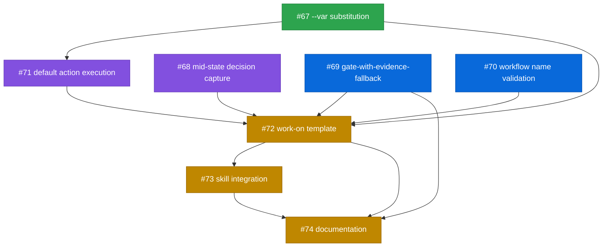

# PLAN: shirabe work-on koto template

## Status

Active

## Scope Summary

Identify and build the koto platform capabilities needed to express shirabe's /work-on
workflow as a koto template, then write the template and integrate it with the skill.
Primary output: four engine capabilities (three needs-design). Secondary output: 17-state
template and skill integration.

## Decomposition Strategy

Horizontal decomposition. Engine capabilities are prerequisites with clear interfaces —
they must ship before the template, which must ship before skill integration. No walking
skeleton because there's no end-to-end flow to demonstrate until the engine capabilities
exist. The three needs-design issues will spawn child design docs and milestones.

## Implementation Issues

| # | Issue | Dependencies | Complexity | Labels |
|---|-------|-------------|------------|--------|
| ~~1~~ | ~~[#67: feat(engine): implement template variable substitution (`--var`)](https://github.com/tsukumogami/koto/issues/67)~~ | ~~None~~ | ~~testable~~ | ~~needs-design~~ |
| | ~~^_Child: [DESIGN-template-variable-substitution.md](../designs/DESIGN-template-variable-substitution.md)_~~ | | | |
| 2 | [#71: feat(engine): implement default action execution](https://github.com/tsukumogami/koto/issues/71) | ~~[#67](https://github.com/tsukumogami/koto/issues/67)~~ | testable | needs-design |
| 3 | [#68: feat(engine): implement mid-state decision capture](https://github.com/tsukumogami/koto/issues/68) | None | testable | needs-design |
| 4 | [#69: feat(engine): implement gate-with-evidence-fallback](https://github.com/tsukumogami/koto/issues/69) | None | testable | |
| 5 | [#70: feat(engine): validate workflow names at init time](https://github.com/tsukumogami/koto/issues/70) | None | critical | |
| 6 | [#72: feat(template): write the work-on koto template](https://github.com/tsukumogami/koto/issues/72) | [#67](https://github.com/tsukumogami/koto/issues/67), [#71](https://github.com/tsukumogami/koto/issues/71), [#68](https://github.com/tsukumogami/koto/issues/68), [#69](https://github.com/tsukumogami/koto/issues/69), [#70](https://github.com/tsukumogami/koto/issues/70) | testable | |
| 7 | [#73: feat(shirabe): integrate /work-on skill with koto template](https://github.com/tsukumogami/koto/issues/73) | [#72](https://github.com/tsukumogami/koto/issues/72) | testable | |
| 8 | [#74: docs(koto): update AGENTS.md and hello-koto](https://github.com/tsukumogami/koto/issues/74) | [#69](https://github.com/tsukumogami/koto/issues/69), [#72](https://github.com/tsukumogami/koto/issues/72), [#73](https://github.com/tsukumogami/koto/issues/73) | simple | |

## Dependency Graph

**Legend**: Green = done, Purple = needs-design, Blue = ready, Yellow = blocked

## Implementation Sequence

**Critical path**: #67 (--var) → #71 (default execution) → #72 (template) → #73 (skill) → #74 (docs)

**Wave 1** (parallel, start now):
- [#67](https://github.com/tsukumogami/koto/issues/67): --var substitution (needs-design — spawn child design)
- [#68](https://github.com/tsukumogami/koto/issues/68): mid-state decision capture (needs-design — spawn child design)
- [#69](https://github.com/tsukumogami/koto/issues/69): gate-with-evidence-fallback (ready to implement)
- [#70](https://github.com/tsukumogami/koto/issues/70): workflow name validation (ready to implement)

**Wave 2** (after #67 completes):
- [#71](https://github.com/tsukumogami/koto/issues/71): default action execution (needs-design — depends on #67's substitution interface)

**Wave 3** (after all platform capabilities):
- [#72](https://github.com/tsukumogami/koto/issues/72): work-on template

**Wave 4** (after template):
- [#73](https://github.com/tsukumogami/koto/issues/73): skill integration

**Wave 5** (after skill integration):
- [#74](https://github.com/tsukumogami/koto/issues/74): documentation
