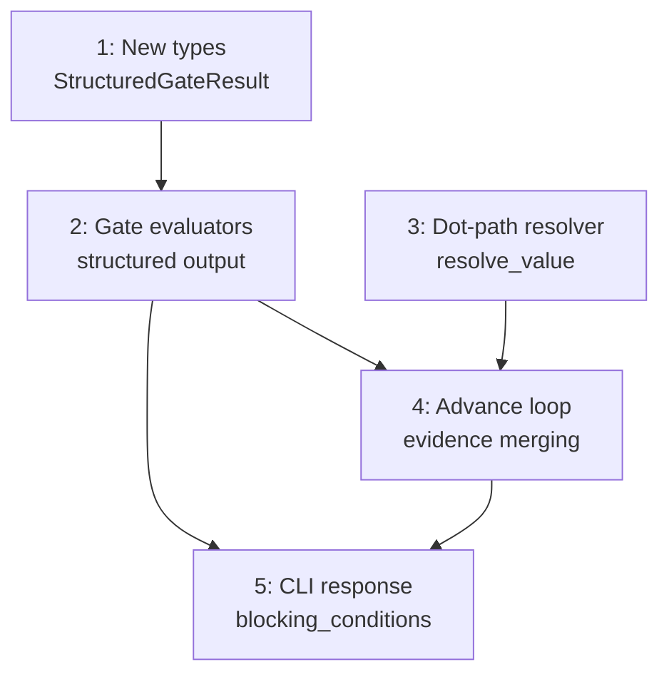

# PLAN: Structured gate output

## Status

Draft

## Scope summary

Replace the boolean `GateResult` enum with `StructuredGateResult` carrying a `GateOutcome` enum and structured JSON output. Gate output enters the evidence map under `gates.*`, the transition resolver gains dot-path traversal, and the CLI response includes structured gate data in `blocking_conditions`.

## Decomposition strategy

**Horizontal decomposition.** The design has clear layer boundaries: new types first (no callers changed), then evaluators (produce structured data), then resolver (consumes it), then advance loop (wires everything together), then CLI (presents it). Each layer has stable interfaces. No walking skeleton needed because the existing gate/transition pipeline works end-to-end -- we're changing data shapes, not building a new pipeline.

## Issue outlines

### 1. New types: StructuredGateResult and GateOutcome

**Goal:** Add `StructuredGateResult` struct and `GateOutcome` enum to `src/gate.rs`. These are the foundation types everything else depends on.

**Acceptance criteria:**
- [ ] `GateOutcome` enum has variants: Passed, Failed, TimedOut, Error
- [ ] `StructuredGateResult` has `outcome: GateOutcome` and `output: serde_json::Value`
- [ ] Both derive `Debug, Clone, Serialize, Deserialize`
- [ ] `GateOutcome` derives `PartialEq`
- [ ] Unit tests verify serialization round-trip

**Dependencies:** None (first issue).

**Complexity:** simple

### 2. Gate evaluators produce structured output

**Goal:** Update `evaluate_command_gate`, `evaluate_context_exists_gate`, and `evaluate_context_matches_gate` to return `StructuredGateResult` instead of `GateResult`. Update `evaluate_gates` return type to `BTreeMap<String, StructuredGateResult>`. Fix all compilation errors from the type change.

**Acceptance criteria:**
- [ ] `evaluate_command_gate` returns `{exit_code: N, error: ""}` on success/failure, `{exit_code: -1, error: "timed_out"}` on timeout, `{exit_code: -1, error: "<message>"}` on spawn error
- [ ] `evaluate_context_exists_gate` returns `{exists: bool, error: ""}`
- [ ] `evaluate_context_matches_gate` returns `{matches: bool, error: ""}`
- [ ] `outcome` is Passed when pass condition is met, Failed/TimedOut/Error otherwise
- [ ] `evaluate_gates` returns `BTreeMap<String, StructuredGateResult>`
- [ ] All callers of `evaluate_gates` and pattern matches on `GateResult` are updated
- [ ] Existing gate tests updated for new type

**Dependencies:** Issue 1 (needs StructuredGateResult type).

**Complexity:** testable

### 3. Dot-path traversal helper for resolve_transition

**Goal:** Add `resolve_value` helper function. Change `resolve_transition` to accept `&serde_json::Value` instead of `&BTreeMap<String, Value>`. Update condition matching to use `resolve_value` for dot-path traversal.

**Acceptance criteria:**
- [ ] `resolve_value(root, "a.b.c")` traverses nested maps and returns the value at the path
- [ ] `resolve_value(root, "flat_key")` works identically to `root.get("flat_key")` for single-segment paths
- [ ] `resolve_value` returns `None` for missing paths, empty strings, or non-object intermediates
- [ ] `resolve_transition` accepts `&serde_json::Value` and uses `resolve_value` for condition matching
- [ ] All existing resolve_transition tests updated for new parameter type (wrap BTreeMap in Value::Object)
- [ ] New tests: dot-path traversal on nested gate data, mixed gate + flat evidence

**Dependencies:** None (independent of issues 1-2; can be built in parallel).

**Complexity:** testable

### 4. Advance loop: evidence merging and pass/fail from outcome

**Goal:** Update the advance loop's gate evaluation block to use `StructuredGateResult`. Build gate evidence as nested JSON, merge with agent evidence, and pass to `resolve_transition`. Derive `any_failed` from `GateOutcome` instead of `GateResult::Passed`.

**Acceptance criteria:**
- [ ] Gate output injected into evidence as `{"gates": {name: output, ...}}`
- [ ] Gate evidence merged after agent evidence (engine data takes precedence)
- [ ] `any_failed` computed from `GateOutcome::Passed` matching
- [ ] `gate_failed` boolean passed to `resolve_transition` as before
- [ ] `advance_until_stop` signature keeps `&BTreeMap<String, Value>` for agent evidence; conversion to `Value::Object` happens internally
- [ ] States with `when` clauses referencing `gates.*` route correctly based on gate output
- [ ] States without `gates.*` in `when` clauses use legacy behavior (gate_failed boolean only)
- [ ] Unit tests: gate output merging, pass/fail from outcome, mixed routing

**Dependencies:** Issues 2, 3 (needs structured evaluators and dot-path resolver).

**Complexity:** testable

### 5. CLI response: blocking_conditions with structured output

**Goal:** Update `blocking_conditions_from_gates` to use `StructuredGateResult` and include the gate's structured `output` field. Add functional tests for gate-blocked responses with structured data.

**Acceptance criteria:**
- [ ] `blocking_conditions` in gate-blocked responses include gate name and structured output fields
- [ ] Functional test: command gate returns `{exit_code: N, error: ""}` in blocking_conditions
- [ ] Functional test: context-exists gate returns `{exists: false, error: ""}` in blocking_conditions
- [ ] Functional test: gate passes and auto-advances based on `gates.*` when clause
- [ ] New template fixture demonstrating structured gate output routing

**Dependencies:** Issues 2, 4 (needs structured evaluators and advance loop wiring).

**Complexity:** testable

## Dependency graph

## Implementation sequence

**Critical path:** 1 -> 2 -> 4 -> 5

**Parallelization opportunities:**
- Issue 3 (dot-path resolver) is independent of issues 1-2 and can be built in parallel
- Issue 5 (CLI response) depends on 2 and 4; can start after 4 is complete

**Recommended order for a single implementer:**
1. Issue 1 (types) + Issue 3 (resolver) in parallel
2. Issue 2 (evaluators, depends on 1)
3. Issue 4 (advance loop, depends on 2 + 3)
4. Issue 5 (CLI response, depends on 2 + 4)
