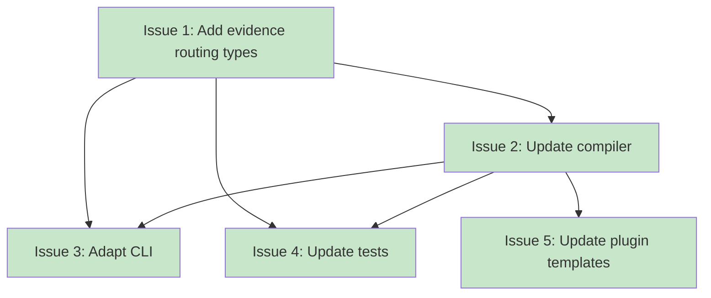

# PLAN: Template Evidence Routing

## Status

Done

## Scope Summary

Add evidence routing to koto's template format: `accepts` blocks for evidence schema,
`when` conditions on transitions for conditional routing, and `integration` field for
processing tool tags. Remove field gates. format_version stays at 1.

## Decomposition Strategy

**Horizontal decomposition.** Types must compile before the compiler can use them,
and the compiler must work before the CLI can load templates. This natural layer
ordering makes horizontal decomposition the right fit. Walking skeleton was not
appropriate because the type change breaks compilation until the compiler is updated,
so there's no meaningful vertical slice.

## Issue Outlines

### Issue 1: feat(koto): add evidence routing types

**Complexity**: testable

**Goal**: Add `Transition`, `FieldSchema` structs and update `TemplateState` and
`Gate` in `src/template/types.rs` to support evidence routing, including new
validation rules.

**Acceptance Criteria**:

- [x] Add `Transition` struct with `target: String` and `when: Option<BTreeMap<String, serde_json::Value>>`
- [x] Add `FieldSchema` struct with `field_type: String`, `required: bool`, optional `values: Vec<String>`, optional `description: String`
- [x] Add `accepts: Option<BTreeMap<String, FieldSchema>>` field to `TemplateState`
- [x] Add `integration: Option<String>` field to `TemplateState`
- [x] Change `TemplateState.transitions` from `Vec<String>` to `Vec<Transition>`
- [x] Remove `GATE_TYPE_FIELD_NOT_EMPTY` and `GATE_TYPE_FIELD_EQUALS` constants
- [x] Remove `field` and `value` fields from `Gate` struct
- [x] Update `validate()`: reject non-command gate types with error pointing to `accepts`/`when`
- [x] Update `validate()`: transition target extraction uses `t.target` instead of bare string
- [x] Validate `when` fields reference fields in the state's `accepts` block
- [x] Validate `when` values for enum fields appear in the field's `values` list
- [x] Reject empty `when` blocks
- [x] Validate `when` conditions require the state to have an `accepts` block
- [x] Validate `when` condition values are JSON scalars (reject arrays and objects)
- [x] Validate pairwise mutual exclusivity of `when` conditions across transitions on the same state
- [x] Validate `FieldSchema.field_type` is one of: enum, string, number, boolean
- [x] Validate enum-typed fields have a non-empty `values` list
- [x] Unit tests for all new validation rules

All six evidence routing validation rules live in `validate()` on compiled types.
The compiler (Issue 2) handles source-to-compiled transformation and gate type
restriction only.

**Dependencies**: None

---

### Issue 2: feat(koto): update compiler for evidence routing

**Complexity**: testable

**Goal**: Update the template compiler (`src/template/compile.rs`) to deserialize
the new evidence routing syntax (`accepts`, `when`, `integration`) from YAML source
templates and transform them into the compiled types added in Issue 1. Restrict
`compile_gate()` to only accept `command` gates.

**Acceptance Criteria**:

- [x] Add `SourceTransition` struct with `target: String` and `when: Option<HashMap<String, serde_json::Value>>`
- [x] Add `SourceFieldSchema` struct with `field_type: String`, `required: bool`, `values: Vec<String>`, `description: String`
- [x] Update `SourceState` to include `accepts`, `integration`, and structured `transitions`
- [x] `compile_gate()` rejects `field_not_empty` with error pointing to `accepts`/`when`
- [x] `compile_gate()` rejects `field_equals` with error pointing to `accepts`/`when`
- [x] `compile_gate()` continues to accept `command` gates unchanged
- [x] Transform `HashMap<String, SourceFieldSchema>` to `BTreeMap<String, FieldSchema>`
- [x] Transform `Vec<SourceTransition>` to `Vec<Transition>`
- [x] Pass `integration: Option<String>` through to compiled `TemplateState`
- [x] Transition target validation updated to extract from structured transitions
- [x] Compiler test: valid template with `accepts`, `when`, and `integration` compiles correctly
- [x] Compiler test: `field_not_empty` gate produces error mentioning `accepts`/`when`
- [x] Compiler test: `field_equals` gate produces error mentioning `accepts`/`when`
- [x] Compiler test: command gates alongside `accepts`/`when` compile successfully
- [x] Existing compiler tests updated for structured transition syntax

The six validation rules (when/accepts consistency, mutual exclusivity, etc.) live in
`validate()` (Issue 1). The compiler calls `validate()` after compilation.

**Dependencies**: Issue 1

---

### Issue 3: feat(koto): adapt CLI for structured transitions

**Complexity**: simple

**Goal**: Update `koto next` in the CLI to extract target names from structured
`Transition` objects, preserving the current flat string array output format.

**Acceptance Criteria**:

- [x] `koto next` extracts target names using `transitions.iter().map(|t| &t.target)`
- [x] Output JSON preserves current format: `{"state": "...", "directive": "...", "transitions": ["target1", "target2"]}`
- [x] No `accepts`, `when`, or `integration` fields appear in `koto next` output
- [x] Existing integration tests for `koto next` continue to pass
- [x] `koto template compile` and `koto template validate` work without CLI-side changes

**Dependencies**: Issue 1, Issue 2

---

### Issue 4: test(koto): update tests for evidence routing

**Complexity**: testable

**Goal**: Update all test fixtures to use structured transitions and add integration
test coverage for evidence routing templates.

**Acceptance Criteria**:

- [x] `minimal_template()` in `tests/integration_test.rs` uses `- target: done` instead of `[done]`
- [x] All embedded templates in `src/template/compile.rs` `#[cfg(test)]` module use structured transition objects
- [x] All existing tests pass after fixture migration
- [x] Integration test: full workflow with `accepts`, `when`-routed transitions, and `integration`
- [x] Integration test: template with command gates alongside `accepts`/`when` works end-to-end
- [x] Integration test: template with unconditional transitions alongside `accepts` states works end-to-end

Unit tests for individual validation rules are covered by Issues 1 and 2.

**Dependencies**: Issue 1, Issue 2

---

### Issue 5: chore(koto): update plugin templates for evidence routing

**Complexity**: simple

**Goal**: Update plugin templates to use structured transition syntax.

**Acceptance Criteria**:

- [x] `hello-koto.md` transitions updated from `[eternal]` to `[{target: eternal}]`
- [x] Any other plugin templates discovered during implementation similarly updated
- [x] `koto template compile` succeeds on the updated hello-koto template

**Dependencies**: Issue 2

## Dependency Graph

**Legend**: Green = done, Blue = ready, Yellow = blocked

## Implementation Sequence

**Critical path:** Issue 1 -> Issue 2 -> Issue 4 (3 issues)

**Recommended order:**
1. Issue 1 -- type definitions (everything depends on this)
2. Issue 2 -- compiler (blocked by types, blocks everything else)
3. Issues 3, 4, 5 -- CLI, tests, and plugin templates (all parallelizable after compiler)

**Parallelization:** After Issue 2, Issues 3, 4, and 5 can proceed in parallel.
