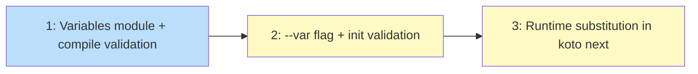

# PLAN: Template variable substitution

## Status

Draft

## Scope summary

Add `--var KEY=VALUE` support to `koto init` with compile-time reference validation,
init-time allowlist sanitization, and runtime substitution in gate commands and
directive text. Produces a reusable `Variables` API for downstream features (#71).

## Decomposition strategy

**Horizontal.** Three issues matching the design's implementation phases, built
layer-by-layer. The type system and substitution module come first because the CLI
flag needs them for storage, and runtime integration needs both. No walking skeleton
needed -- components have clear, stable interfaces and the dependency chain is linear.

## Issue outlines

### Issue 1: feat(engine): add Variables substitution module and compile-time validation

**Complexity:** testable

**Goal:** Create the `Variables` substitution module, narrow the event type from
`serde_json::Value` to `String`, and add compile-time variable reference validation.

**Acceptance criteria:**
- [ ] `variables` field in `EventPayload::WorkflowInitialized` and
      `WorkflowInitializedPayload` changed to `HashMap<String, String>`
- [ ] Existing serialization and round-trip tests pass with the narrowed type
- [ ] New module `src/engine/substitute.rs` with `Variables` struct, `from_events()`
      (with re-validation), and `substitute()` method
- [ ] `substitute()` replaces `{{KEY}}` patterns; panics on undefined references
- [ ] Unclosed `{{` and non-matching patterns pass through unchanged
- [ ] `CompiledTemplate::validate()` scans directives and gate commands for `{{KEY}}`
      patterns, rejecting undeclared variable references
- [ ] Unit tests for substitution regex, edge cases, re-validation, and compile-time
      validator

**Dependencies:** None

**Downstream:** Issues 2 and 3 depend on the `String` event type, allowlist
validation function, and `Variables::substitute()`.

---

### Issue 2: feat(cli): add --var flag to koto init with validation

**Complexity:** testable

**Goal:** Accept `--var KEY=VALUE` on `koto init`, validate against template
declarations, sanitize, and store in the `WorkflowInitialized` event.

**Acceptance criteria:**
- [ ] `koto init` accepts `--var KEY=VALUE` as a repeatable flag
- [ ] Parse by splitting on first `=`; error on missing `=` or empty key
- [ ] Duplicate keys produce an error
- [ ] Unknown keys (not in template's `variables` block) produce an error
- [ ] Missing required variables produce an error
- [ ] Optional variables not provided receive their default value
- [ ] All values validated against `^[a-zA-Z0-9._/-]+$`; forbidden characters error
- [ ] Resolved map stored in `WorkflowInitialized` event
- [ ] Templates with no `variables` block still work
- [ ] Integration tests for all happy and error paths

**Dependencies:** Issue 1

**Downstream:** Issue 3 depends on populated variables in the event log.

---

### Issue 3: feat(cli): wire variable substitution into koto next

**Complexity:** testable

**Goal:** Construct `Variables` from events in `handle_next`, substitute in gate
commands and directive text, covering all 6 directive branches and the `--to` path.

**Acceptance criteria:**
- [ ] `handle_next` constructs `Variables::from_events(&events)` after reading the
      event log; propagates re-validation errors
- [ ] Gate closure substitutes variable values in command strings before
      `evaluate_gates`
- [ ] Directive text substituted in all `NextResponse` branches (GateBlocked,
      EvidenceRequired variants, Integration, IntegrationUnavailable, SignalReceived)
- [ ] `--to` code path substitutes directive text before response
- [ ] Helper function avoids scattering substitution across branches
- [ ] `dispatch_next` in `src/cli/next.rs` remains unchanged (I/O-free)
- [ ] End-to-end tests: gate command substitution, directive text substitution,
      `--to` path substitution
- [ ] Re-validation failure produces a structured error (not panic)

**Dependencies:** Issues 1 and 2

**Downstream:** None (leaf node).

## Dependency graph

**Legend**: Blue = ready, Yellow = blocked

## Implementation sequence

**Critical path:** 1 → 2 → 3 (fully serial)

**Parallelization:** None. Each issue depends on the previous. This is expected
for a horizontal decomposition with layered components.

**Estimated scope:** 3 issues, all testable complexity. The implementation touches
5 files across 3 packages (engine, template, cli).
