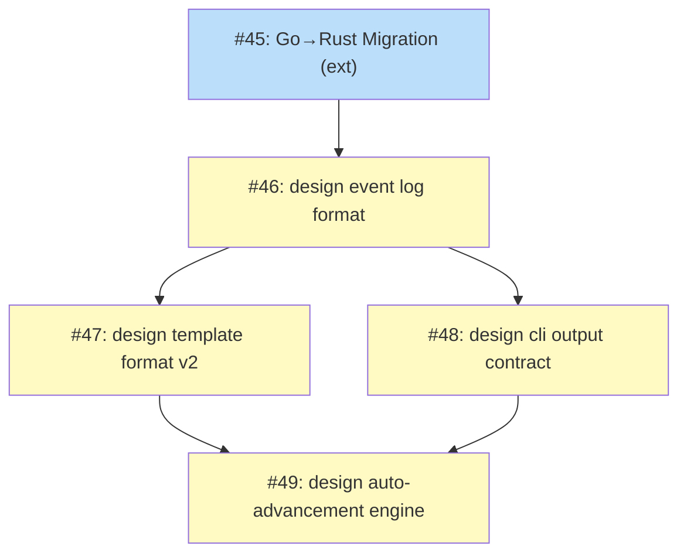

# PLAN: Unified koto next Command

## Status

Active

## Scope Summary

Produce the five issues required to implement the unified `koto next` command: a Go→Rust migration (#45, already filed) followed by four tactical design documents covering event log format, template format v2, CLI output contract, and auto-advancement engine. Each design issue spawns one accepted design that feeds implementation.

## Decomposition Strategy

**Horizontal decomposition.** The strategic design `DESIGN-unified-koto-next.md` defines four Required Tactical Designs in a clear dependency order. Each tactical design is a prerequisite for the next and maps directly to a row in that table. Walking skeleton doesn't apply here — the work is documentation production, not code, so there's no integration risk to surface early. Horizontal decomposition matches the sequential nature of the design requirements.

Phase 0 (Go→Rust Migration, koto #45) was filed independently and is included here as the gating prerequisite. The four design issues cover Phases 1–4.

## Issue Outlines

_(omitted in multi-pr mode — see Implementation Issues below)_

## Implementation Issues

### Milestone: [Unified koto next Command](https://github.com/tsukumogami/koto/milestone/6)

| Issue | Dependencies | Complexity |
|-------|--------------|------------|
| [#45: feat: migrate koto from Go to Rust](https://github.com/tsukumogami/koto/issues/45) | None | simple |
| _Rewrite the koto CLI in Rust. All subsequent tactical designs target the Rust implementation, so this must be accepted before design work on the event log, template format, CLI contract, or advancement engine begins._ | | |
| [#46: docs(koto): design event log format](https://github.com/tsukumogami/koto/issues/46) | [#45](https://github.com/tsukumogami/koto/issues/45) | simple |
| _Define the JSONL event log format: six event types, epoch boundary rule, atomicity guarantees, and JSONL-vs-JSON-array evaluation. The event taxonomy and schema_version must be settled before templates or CLI output can be designed._ | | |
| [#47: docs(koto): design template format v2](https://github.com/tsukumogami/koto/issues/47) | [#46](https://github.com/tsukumogami/koto/issues/46) | simple |
| _With the event taxonomy accepted, design the new `accepts`/`when`/`integration` YAML blocks that replace the flat `transitions: []string` field. Covers mutual exclusivity validation and the breaking change to the template compiler._ | | |
| [#48: docs(koto): design cli output contract](https://github.com/tsukumogami/koto/issues/48) | [#46](https://github.com/tsukumogami/koto/issues/46) | simple |
| _Design the `koto next` JSON output schema: four response variants, `expects` field derivation from the event log, error codes, exit codes, and `--with-data`/`--to` flag behavior. Parallel with #47 — both depend only on #46._ | | |
| [#49: docs(koto): design auto-advancement engine](https://github.com/tsukumogami/koto/issues/49) | [#46](https://github.com/tsukumogami/koto/issues/46), [#47](https://github.com/tsukumogami/koto/issues/47), [#48](https://github.com/tsukumogami/koto/issues/48) | simple |
| _Design the event log replay loop, advancement logic with cycle detection, stopping conditions, integration runner, `koto rewind`, and SIGTERM/SIGINT signal handling. Requires the event format (#46), template semantics (#47), and CLI contract (#48) to all be accepted first._ | | |

## Dependency Graph

**Legend**: Green = done, Blue = ready, Yellow = blocked, Purple = needs-design, Orange = tracks-design/tracks-plan

## Implementation Sequence

**Critical path:** #45 → #46 → #47 → #49 (or #45 → #46 → #48 → #49 — equal length, 4 steps)

**Recommended order:**

1. #45 (external) — Go→Rust Migration must be accepted before any tactical design targets the Rust implementation
2. #46 — event log format; unblocks #47 and #48
3. #47 and #48 — template format v2 and CLI output contract can proceed in parallel after #46 is accepted
4. #49 — auto-advancement engine requires all three predecessors

**Parallelization:** After #46 is accepted, #47 and #48 can be worked concurrently, reducing wall-clock time by one design cycle.
