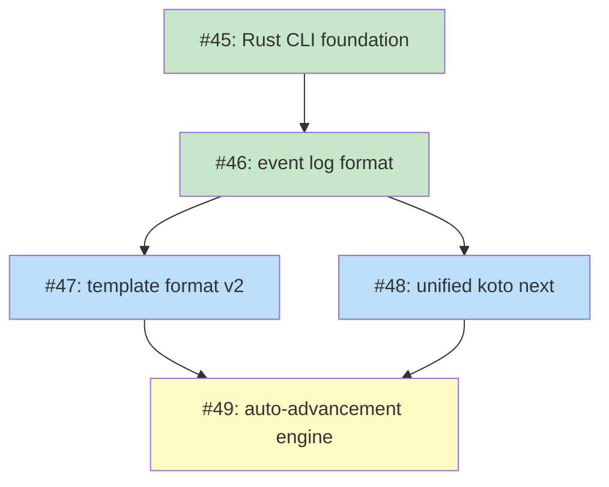

# PLAN: Unified koto next Command

## Status

Active

## Scope Summary

Deliver a fully functional Rust CLI for koto through five issues: a Rust CLI foundation (#45) followed by four design+implementation issues covering event log format, template format v2, CLI output contract, and auto-advancement engine. Each issue produces both an accepted design document and the corresponding Rust implementation.

## Decomposition Strategy

**Horizontal decomposition.** The strategic design `DESIGN-unified-koto-next.md` defines four tactical design phases in a clear dependency order. Each phase produces a design doc (prerequisite for the next phase) and implements the designed behavior in Rust. Walking skeleton doesn't apply — the dependency chain is inherently sequential.

Issue #45 establishes the Rust CLI foundation: a minimal skeleton with five commands and a simple JSONL state format. Issues #46–#49 grow the CLI incrementally. After all five issues are closed, koto is a fully functional Rust CLI with complete workflow orchestration capability.

## Issue Outlines

_(omitted in multi-pr mode — see Implementation Issues below)_

## Implementation Issues

### Milestone: [Unified koto next Command](https://github.com/tsukumogami/koto/milestone/6)

| Issue | Dependencies | Complexity |
|-------|--------------|------------|
| [#45: feat(koto): implement Rust CLI foundation](https://github.com/tsukumogami/koto/issues/45) | None | testable |
| _Establish the Rust single-crate binary with five commands (`version`, `init`, `next`, `rewind`, `workflows`) plus `template compile`. Uses simple JSONL state (one event per line, current state = last event's `state` field). No `koto transition`, no gate evaluation, no evidence — intentionally minimal. Deletes Go source._ | | |
| [#46: feat(koto): implement event log format](https://github.com/tsukumogami/koto/issues/46) | [#45](https://github.com/tsukumogami/koto/issues/45) | critical |
| _Design and implement the full JSONL event schema: six typed event types with `seq` monotonic counter, epoch boundary rule for evidence replay, and state derivation via log replay. Replaces #45's simple JSONL with the production schema._ | | |
| [#47: feat(koto): implement template format v2](https://github.com/tsukumogami/koto/issues/47) | [#46](https://github.com/tsukumogami/koto/issues/46) | critical |
| _Design and implement `accepts`/`when`/`integration` YAML blocks replacing `transitions: []string`. Includes mutual exclusivity validation at compile time and updated template loader in the Rust CLI._ | | |
| [#48: feat(koto): implement unified koto next command](https://github.com/tsukumogami/koto/issues/48) | [#46](https://github.com/tsukumogami/koto/issues/46) | critical |
| _Design and implement the full `koto next` output contract: five response variants, `--with-data` evidence submission, `--to` directed transitions (replacing `koto transition`), gate evaluation, and correct exit codes. Parallel with #47 — both depend only on #46._ | | |
| [#49: feat(koto): implement auto-advancement engine](https://github.com/tsukumogami/koto/issues/49) | [#46](https://github.com/tsukumogami/koto/issues/46), [#47](https://github.com/tsukumogami/koto/issues/47), [#48](https://github.com/tsukumogami/koto/issues/48) | critical |
| _Design and implement the event log replay loop, advancement logic with cycle detection and all stopping conditions, integration runner, `koto cancel`, and SIGTERM/SIGINT signal handling. Leaf node — completing this delivers a fully functional CLI._ | | |

## Dependency Graph

**Legend**: Green = done, Blue = ready, Yellow = blocked, Purple = needs-design, Orange = tracks-design/tracks-plan

## Implementation Sequence

**Critical path:** #45 → #46 → #47 → #49 (or #45 → #46 → #48 → #49 — equal length, 4 steps)

**Recommended order:**

1. #45 — Rust CLI foundation: five commands, simple JSONL, template compile; deletes Go source
2. #46 — full event log schema; unblocks #47 and #48
3. #47 and #48 — template format v2 and unified `koto next` can proceed in parallel after #46 is merged
4. #49 — auto-advancement engine; completing this delivers a fully functional CLI

**Parallelization:** After #46 merges, #47 and #48 can be worked concurrently, reducing wall-clock time by one implementation cycle.

**State advance gap:** Between #45 and #48, the CLI cannot advance workflow state. This is intentional — `koto transition` is removed, and its replacement (`koto next --to`) is implemented in #48. The CLI skeleton (#45) proves the architecture; full workflow capability lands with #48.
