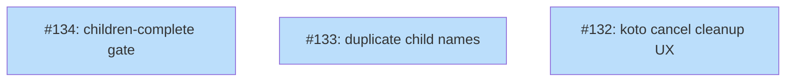

# PLAN: koto 0.8.1 bugfixes

## Status

Active

## Scope Summary

Three bugs surfaced by the first user of koto 0.8.0 when running Plan Orchestrator Mode (serial multi-child workflows). All three must ship before the 0.8.1 patch release. The blocking issue is #134 — the `children-complete` gate fails to observe children that were cleaned up after completion, which causes the orchestrator to re-spawn them indefinitely. The other two are follow-ons and UX fixes.

## Decomposition Strategy

**Horizontal.** The three issues touch independent subsystems (session lifecycle, batch gate accounting, CLI UX) and can be implemented in parallel by separate contributors. There is no end-to-end slice to walk — each bug is already its own slice. Sequencing prefers #134 first because it is the release-blocker and because fixing it simplifies the reproduction path for #133.

## Issue Outlines

_(omitted in multi-pr mode — see Implementation Issues below)_

## Implementation Issues

| Issue | Dependencies | Complexity |
|-------|--------------|------------|
| [#134: bug(engine): children-complete gate does not observe sessions cleaned up after completion](https://github.com/tsukumogami/koto/issues/134) | None | critical |
| _Root cause of the orchestrator stall. The gate currently counts only live sessions, so a child that reaches `done` and is cleaned up vanishes from the gate's view. Fix: persist per-child completion outcomes (e.g. on the parent state or in a completion record the gate can read), so `completed`/`all_complete` stay accurate after cleanup._ | | |
| [#133: bug(engine): duplicate child workflow names allowed without error](https://github.com/tsukumogami/koto/issues/133) | None | testable |
| _Secondary symptom of #134 but valuable on its own: `koto init` silently creates a second session with the same name when one already exists. Fix: reject same-name init with a clear error. Orchestrators that want retry semantics must cancel+cleanup explicitly._ | | |
| [#132: bug(cli): koto cancel leaves workflow in DB; session cleanup required as separate step](https://github.com/tsukumogami/koto/issues/132) | None | simple |
| _UX fix. `koto cancel` pauses a workflow but leaves it in the DB, so `koto init <same-name>` fails with a confusing error. Fix: either make `cancel` fully remove the session, or add `--cleanup` and document the split clearly in the help text and user skill._ | | |

## Dependency Graph

**Legend**: Green = done, Blue = ready, Yellow = blocked

## Implementation Sequence

**Critical path:** #134 alone. It is the release-blocker; the other two do not gate on it.

**Recommended order:**

1. **#134 first** — fixes the orchestrator stall that motivated this patch.
2. **#133 in parallel** — independent defensive invariant; fixing #134 does not eliminate the need for this check, since agents can still manually (or accidentally) re-init a name.
3. **#132 last** — UX polish; no urgency once #134 is merged, but belongs in the same patch so the `cancel → init same name` foot-gun is closed end-to-end.

**Parallelization:** All three issues can be worked concurrently. Cross-issue conflicts are unlikely — #134 touches the batch gate logic, #133 touches session init, #132 touches CLI argument handling.

**Release gate:** 0.8.1 ships once all three issues are closed and the orchestrator end-to-end flow (coordinator + worker + cleanup) is verified green.
