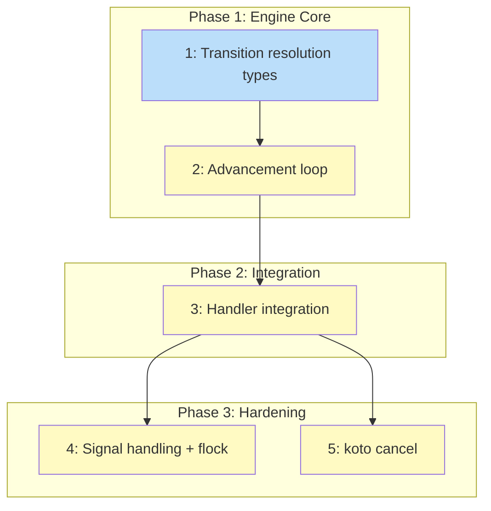

# PLAN: Auto-Advancement Engine

## Status

Done

## Scope Summary

Add an auto-advancement loop to `koto next` that chains through workflow states until hitting a stopping condition. Includes transition resolution, the advancement loop with cycle detection and chain limit, handler integration replacing single-shot dispatch, signal handling with advisory flock, and a `koto cancel` subcommand.

## Decomposition Strategy

**Horizontal decomposition.** The design's four implementation phases are naturally layered: pure transition resolution logic first, then the loop that consumes it, then CLI handler integration, then cross-cutting concerns (signal handling, file locking) and a new subcommand. Each layer has a stable interface contract defined in the design, so building bottom-up avoids rework. Walking skeleton was not appropriate because the transition resolution function is a prerequisite for everything else -- there's no meaningful vertical slice without it.

## Issue Outlines

### Issue 1: feat(engine): add transition resolution types and function

**Complexity**: testable

**Goal**: Add the foundational types and pure transition resolution function that the auto-advancement engine needs. This introduces `TransitionResolution`, `StopReason`, `AdvanceResult`, `AdvanceError`, and the `resolve_transition()` function in `src/engine/advance.rs`. These types define the contract between the advancement loop and the rest of the engine, while `resolve_transition()` handles the core matching logic that determines which transition to take based on submitted evidence.

**Acceptance Criteria**:
- [ ] New file `src/engine/advance.rs` created and added to `src/engine/mod.rs`
- [ ] `TransitionResolution` enum: `Resolved(String)`, `NeedsEvidence`, `Ambiguous(Vec<String>)`, `NoTransitions`
- [ ] `StopReason` enum: `Terminal`, `GateBlocked(BTreeMap<String, GateResult>)`, `EvidenceRequired`, `Integration { name, output }`, `IntegrationUnavailable { name }`, `CycleDetected { state }`, `ChainLimitReached`, `SignalReceived`
- [ ] `AdvanceResult` struct: `final_state`, `advanced`, `stop_reason`
- [ ] `AdvanceError` enum for errors returned by `advance_until_stop()`
- [ ] `resolve_transition()` pure function implementing the design's resolution algorithm (conditional matching, fallback, ambiguity detection)
- [ ] Evidence merging helper: `merge_epoch_evidence()` with last-write-wins per field
- [ ] Unit tests: unconditional, conditional match, fallback, ambiguous, no-transitions, needs-evidence, evidence merging
- [ ] All existing tests pass (`cargo test`)

**Dependencies**: None

---

### Issue 2: feat(engine): add advancement loop

**Complexity**: critical

**Goal**: Implement `advance_until_stop()` in `src/engine/advance.rs` -- the core advancement loop that chains through workflow states until hitting a stopping condition. The function takes I/O closures for gate evaluation, event appending, and integration invocation, making it fully unit-testable without filesystem or process dependencies.

**Acceptance Criteria**:
- [ ] `advance_until_stop()` with the signature from the design (takes closures for append_event, evaluate_gates, invoke_integration, plus shutdown AtomicBool)
- [ ] Per-iteration logic in the design's specified order: shutdown check, cycle detection, terminal check, integration re-invocation prevention, integration invocation, gate evaluation, transition resolution, event append
- [ ] Chain limit of 100 transitions; returns `StopReason::ChainLimitReached`
- [ ] Re-invocation prevention: checks for existing `integration_invoked` event before calling the integration closure
- [ ] States reached by auto-advance start with empty evidence (fresh epoch)
- [ ] Unit tests with mock closures: auto-advance chain (3+ states), gate-blocked stop, evidence-required stop, cycle detection, integration stop, chain limit

**Dependencies**: Issue 1

---

### Issue 3: feat(koto): integrate advancement loop into handle_next

**Complexity**: critical

**Goal**: Wire `advance_until_stop()` into the existing `handle_next` handler, replacing single-shot `dispatch_next` with the advancement loop. After this change, `koto next` chains through auto-advanceable states in a single invocation.

**Acceptance Criteria**:
- [ ] `handle_next` calls `advance_until_stop()` with I/O closures for the default path (no `--to` flag)
- [ ] The `--to` directed transition path remains single-shot by design
- [ ] Evidence merged from current epoch before calling the engine
- [ ] `append_event` closure wraps existing persistence + in-memory event list
- [ ] `evaluate_gates` closure closes over working directory
- [ ] `invoke_integration` closure stubs to `IntegrationUnavailable`
- [ ] `StopReason` mapped to `NextResponse` via single match expression
- [ ] `advanced` field in `NextResponse` reflects whether transitions were made
- [ ] Integration test: 4-state workflow (plan -> implement -> verify -> done); single `koto next` reaches `verify` with `advanced: true`
- [ ] Integration test: evidence submission triggers auto-advance chain (reject -> implement -> verify)
- [ ] All existing `handle_next` tests pass

**Dependencies**: Issue 2

---

### Issue 4: feat(koto): add signal handling and file locking

**Complexity**: testable

**Goal**: Add signal handling and advisory file locking so that SIGTERM/SIGINT triggers clean shutdown between loop iterations, and concurrent `koto next` calls fail immediately instead of risking interleaved writes.

**Acceptance Criteria**:
- [ ] `signal-hook` crate added to Cargo.toml
- [ ] `handle_next` registers SIGTERM/SIGINT handlers setting an `AtomicBool`
- [ ] The `AtomicBool` is passed to `advance_until_stop` as the `shutdown` parameter
- [ ] Non-blocking exclusive `flock` on state file before entering the advancement loop
- [ ] If flock cannot be acquired, exit code 1 with error message about concurrent access
- [ ] Flock released when advancement loop completes
- [ ] Unit test: `StopReason::SignalReceived` when `AtomicBool` is set
- [ ] Integration test: concurrent `koto next` calls -- second one fails with exit code 1
- [ ] All existing tests pass

**Dependencies**: Issue 3

---

### Issue 5: feat(koto): add koto cancel subcommand

**Complexity**: testable

**Goal**: Add a `koto cancel` subcommand that appends a `WorkflowCancelled` event to the event log. `handle_next` checks for this event before entering the advancement loop so cancelled workflows cannot be advanced further.

**Acceptance Criteria**:
- [ ] `WorkflowCancelled` variant in `EventPayload`
- [ ] `Command::Cancel` variant accepting a workflow name argument
- [ ] `handle_cancel`: loads state, rejects double-cancel, rejects already-terminal, appends `WorkflowCancelled`, prints confirmation JSON
- [ ] `handle_next` pre-loop check: returns `NextErrorCode::TerminalState` with "workflow has been cancelled" when `WorkflowCancelled` found
- [ ] Integration test: cancel then `koto next` returns terminal-state error
- [ ] Integration test: double-cancel returns error
- [ ] Integration test: cancel already-terminal returns error
- [ ] `koto cancel` appears in CLI help text

**Dependencies**: Issue 3

## Dependency Graph

**Legend**: Green = done, Blue = ready, Yellow = blocked

## Implementation Sequence

**Critical path:** Issue 1 -> Issue 2 -> Issue 3 -> Issue 4 (or 5)

**Recommended order:**
1. Issue 1 -- types and transition resolution (foundation)
2. Issue 2 -- advancement loop (consumes types)
3. Issue 3 -- handler integration (the big refactor, includes the functional test scenario)
4. Issues 4 and 5 -- signal handling/flock and koto cancel (independent, can proceed in parallel)

**Parallelization:** After Issue 3, Issues 4 and 5 can be worked in parallel. The first three issues are strictly sequential.
