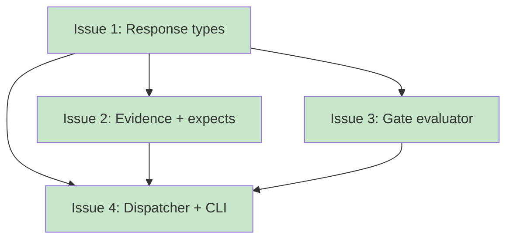

# PLAN: koto CLI Output Contract

## Status

Done

## Scope Summary

Implement the full `koto next` CLI output contract: response types with five JSON variants, evidence submission (`--with-data`), directed transitions (`--to`), command gate evaluation with process group isolation, evidence validation, expects derivation, and structured error handling with six error codes.

## Decomposition Strategy

**Horizontal decomposition.** Components have clear interfaces and a natural dependency order: types first, then domain logic, then I/O, then wiring. The response type definitions are a prerequisite for all other components since evidence validation, gate evaluation, and the dispatcher all reference those types. Walking skeleton doesn't apply -- there's no meaningful vertical slice without the type definitions in place.

## Issue Outlines

### Issue 1: feat(koto): implement response types and serialization

**Complexity:** testable

**Goal:** Define the complete set of response and error types that form the `koto next` output contract. This includes the `NextResponse` enum (5 variants), `NextError` enum (6 error codes), all supporting types, and a custom `Serialize` implementation that produces the correct JSON shape per variant. Unit tests assert serialized output matches the design's field presence table exactly.

**Acceptance Criteria:**

- [ ] `src/cli/next_types.rs` exists and is included in `src/cli/mod.rs`
- [ ] `NextResponse` enum has five variants: `EvidenceRequired`, `GateBlocked`, `Integration`, `IntegrationUnavailable`, `Terminal`
- [ ] Each variant carries the fields specified in the design's field presence table (state, directive, advanced, expects, blocking_conditions, integration)
- [ ] Custom `impl Serialize for NextResponse` using `serialize_map` writes the correct fields per variant, including the `action` field (`"execute"` or `"done"`) and `"error": null`
- [ ] Fields marked "no" in the field presence table are absent from JSON output; fields marked "null" serialize as `null`
- [ ] `NextError` struct with `code: NextErrorCode`, `message: String`, `details: Vec<ErrorDetail>`
- [ ] `NextErrorCode` enum with six variants: `GateBlocked`, `InvalidSubmission`, `PreconditionFailed`, `IntegrationUnavailable`, `TerminalState`, `WorkflowNotInitialized`
- [ ] `NextErrorCode` serializes as snake_case strings via `#[serde(rename_all = "snake_case")]`
- [ ] Supporting types defined: `ExpectsSchema`, `ExpectsFieldSchema` (with `field_type` serialized as `"type"`), `TransitionOption`, `BlockingCondition` (with `condition_type` serialized as `"type"`), `IntegrationOutput`, `IntegrationUnavailableMarker`, `ErrorDetail`
- [ ] `ExpectsSchema.options` uses `#[serde(skip_serializing_if = ...)]` to omit when empty
- [ ] `ExpectsFieldSchema.values` uses `#[serde(skip_serializing_if = ...)]` to omit when empty
- [ ] Exit code derivation: a method on `NextErrorCode` maps each variant to its exit code (1 for transient errors, 2 for caller errors)
- [ ] Unit tests for each `NextResponse` variant asserting the serialized JSON matches expected output
- [ ] Unit tests for `NextError` serialization with error code and details
- [ ] All tests pass with `cargo test`

**Dependencies:** None.

### Issue 2: feat(koto): implement evidence validation and expects derivation

**Complexity:** testable

**Goal:** Implement `validate_evidence()` and `derive_expects()` -- the two pure functions that bridge template schema declarations and the agent-facing output contract. Evidence validation enforces strict checking of `--with-data` JSON payloads against a state's `accepts` schema. Expects derivation assembles an `ExpectsSchema` from template `accepts` and `when` conditions so agents know exactly what to submit.

**Acceptance Criteria:**

- [ ] `validate_evidence(data: &serde_json::Value, accepts: &BTreeMap<String, FieldSchema>) -> Result<(), EvidenceValidationError>` is implemented in `src/engine/evidence.rs`
- [ ] `EvidenceValidationError` is a domain error in `src/engine/` (not `NextError`) containing field-level details; the CLI layer maps it to `NextError` with `InvalidSubmission` code
- [ ] Validation rejects payloads missing required fields, returning per-field error details
- [ ] Validation rejects payloads with type mismatches: `string` expects JSON string, `number` expects JSON number, `boolean` expects JSON bool, `enum` expects JSON string matching one of `FieldSchema.values`
- [ ] Validation rejects payloads containing fields not declared in the `accepts` schema (strict unknown-field rejection)
- [ ] All validation errors are collected (no short-circuit) so the agent sees every problem in one response
- [ ] `derive_expects(state: &TemplateState) -> Option<ExpectsSchema>` is implemented in `src/cli/next_types.rs`
- [ ] Returns `None` when the state has no `accepts` block
- [ ] Sets `event_type` to the constant `"evidence_submitted"`
- [ ] Maps each `FieldSchema` to `ExpectsFieldSchema`, renaming `field_type` to `type` in serialization
- [ ] Populates `options` from transitions that have `when` conditions; omits `options` entirely when no transitions have `when`
- [ ] Unit tests cover: missing required field, wrong type for each supported type, unknown field rejection, valid payload acceptance, enum value mismatch, multiple errors in one payload
- [ ] Unit tests cover expects derivation: state with accepts and conditional transitions, state with accepts and no conditional transitions, state without accepts

**Dependencies:** Issue 1 (response types and serialization).

### Issue 3: feat(koto): implement gate evaluator

**Complexity:** critical

**Goal:** Implement the gate evaluator in `src/gate.rs` that spawns shell commands in isolated process groups with configurable timeouts, evaluates all gates without short-circuiting, and returns structured results via a `GateResult` enum.

**Acceptance Criteria:**

- [ ] `src/gate.rs` exists with `GateResult` enum (`Passed`, `Failed { exit_code: i32 }`, `TimedOut`, `Error { message: String }`)
- [ ] `evaluate_gates()` function takes `&BTreeMap<String, Gate>` and `&Path` (working directory), returns `BTreeMap<String, GateResult>`
- [ ] Each gate command is spawned via `sh -c "<command>"` in a new process group using `libc::setpgid` in a `pre_exec` hook
- [ ] Timeout uses the `wait-timeout` crate (already a dependency); default is 30 seconds when `gate.timeout == 0`
- [ ] On timeout, the entire process group is killed via `libc::killpg` with `SIGKILL`
- [ ] All gates are evaluated regardless of individual results (no short-circuit)
- [ ] Gate commands run with `working_dir` as their current directory
- [ ] Module is gated with `#[cfg(unix)]` since `setpgid`/`killpg` are POSIX-only
- [ ] `pub mod gate;` added to `src/lib.rs` (or `src/main.rs`) with `#[cfg(unix)]` gate
- [ ] `libc` added to `Cargo.toml` as `[target.'cfg(unix)'.dependencies]`
- [ ] Integration tests cover: passing gate (exit 0), failing gate (exit non-zero), timed-out gate (sleep exceeding timeout), error case (non-existent command), multiple gates with mixed results
- [ ] All existing tests pass (`cargo test`)

**Dependencies:** Issue 1 (response types and serialization).

### Issue 4: feat(koto): implement koto next dispatcher and CLI integration

**Complexity:** critical

**Goal:** Implement the pure `dispatch_next()` function that classifies the current state into a `NextResponse` variant or `NextError`, wire `--with-data` and `--to` flags into the CLI handler, and replace the current `koto next` stub with the full output contract.

**Acceptance Criteria:**

- [ ] Pure function `dispatch_next()` taking state, template_state, advanced flag, gate_results, and CLI flags; returns `Result<NextResponse, NextError>`
- [ ] Classification order: terminal -> gates failed -> integration available -> integration unavailable -> accepts block -> evidence required (fallback)
- [ ] `advanced` field is populated by the caller (true when an event was appended before dispatching)
- [ ] Unit tests covering all classification branches with mock inputs (no I/O)
- [ ] `--with-data <json>` flag on `Command::Next` for evidence submission
- [ ] `--to <target>` flag on `Command::Next` for directed transitions
- [ ] `--with-data` and `--to` are mutually exclusive (exit code 2 if both provided)
- [ ] `--with-data` payload size limit enforced at parse time (1MB)
- [ ] Handler: load state, validate evidence if `--with-data`, append events, evaluate gates, call dispatcher, serialize response, exit with correct code
- [ ] `--to` path: append `directed_transition` event, re-derive machine state, dispatch on new state (skip gate evaluation); the agent always receives a self-describing response about the resulting state
- [ ] Exit code mapping: success=0, transient errors (gate_blocked, integration_unavailable)=1, caller errors=2, config errors=3

**Dependencies:** Issue 1, Issue 2, Issue 3.

## Dependency Graph

**Legend**: Green = done, Blue = ready, Yellow = blocked, Purple = needs-design, Orange = tracks-design/tracks-plan

## Implementation Sequence

**Critical path:** Issue 1 -> Issue 2 -> Issue 4 (or Issue 1 -> Issue 3 -> Issue 4, equal length)

**Recommended order:**

1. Issue 1 -- response types and serialization (foundation for everything else)
2. Issue 2 -- evidence validation and expects derivation (parallel with Issue 3)
3. Issue 3 -- gate evaluator (parallel with Issue 2)
4. Issue 4 -- dispatcher and CLI integration (leaf node, wires everything together)

**Parallelization:** After Issue 1 completes, Issues 2 and 3 can proceed in parallel, reducing the critical path to 3 sequential steps.
