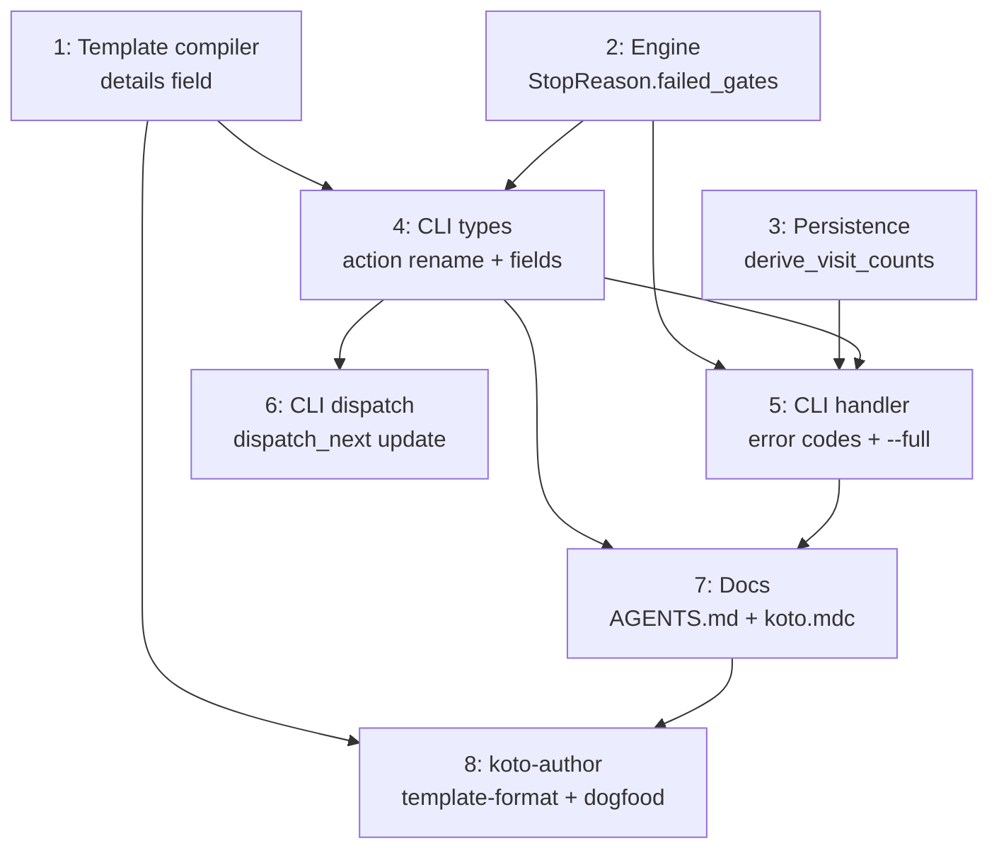

# PLAN: koto next output contract

## Status

Done

## Scope summary

Redesign the koto next output contract: descriptive action values, gate-with-evidence-fallback visibility, directive/details split, error code restructuring, structured error migration, and documentation updates across AGENTS.md, koto.mdc, and koto-author materials.

## Decomposition strategy

**Horizontal decomposition.** This is a refactoring of existing code with clear layer boundaries. Each issue builds one component fully. The layers have stable interfaces (TemplateState fields feed the Serialize impl, StopReason feeds the handler mapping). No walking skeleton needed because the existing end-to-end path already works -- we're changing the output format, not building a new pipeline.

Sequencing follows the design's three phases: engine/type changes first (no wire format impact), then wire format changes (the breaking changes), then documentation (ships with the wire format changes).

## Issue outlines

### 1. Template compiler: `<!-- details -->` splitting and TemplateState.details field

**Goal:** Add `details: String` to `TemplateState` in `src/template/types.rs`. Extend `extract_directives` in `src/template/compile.rs` to split state markdown sections on `<!-- details -->`. Content before the marker becomes `directive`, content after becomes `details`. States without the marker produce empty `details`.

**Acceptance criteria:**
- [ ] `TemplateState` has `details: String` with `#[serde(default, skip_serializing_if = "String::is_empty")]`
- [ ] `extract_directives` splits on `<!-- details -->` (first occurrence wins)
- [ ] States without the marker produce empty `details` and identical `directive` to current behavior
- [ ] `koto template compile` succeeds with templates containing `<!-- details -->`
- [ ] Unit tests verify splitting behavior, no-marker behavior, and multiple-marker behavior

**Dependencies:** None (first issue).

**Complexity:** testable

### 2. Engine: StopReason::EvidenceRequired gains failed_gates

**Goal:** Change `StopReason::EvidenceRequired` from a unit variant to a struct variant carrying `Option<BTreeMap<String, GateResult>>`. Hoist `gate_results` out of the gate evaluation block in `advance_until_stop`. Pass gate data when gates failed and the state has an accepts block.

**Acceptance criteria:**
- [ ] `StopReason::EvidenceRequired { failed_gates: Option<BTreeMap<String, GateResult>> }` compiles
- [ ] When gates fail on a state with accepts, `failed_gates` is `Some(gate_results)`
- [ ] When no gates fail (or no gates defined), `failed_gates` is `None`
- [ ] All existing tests updated for destructuring pattern (`EvidenceRequired { .. }`)
- [ ] New test: gate-with-evidence-fallback carries gate data through StopReason

**Dependencies:** None (independent of issue 1).

**Complexity:** testable

### 3. Persistence: derive_visit_counts

**Goal:** Add `derive_visit_counts(events: &[Event]) -> HashMap<String, usize>` to `src/engine/persistence.rs`. Counts state entries from Transitioned, DirectedTransition, and Rewound events.

**Acceptance criteria:**
- [ ] Function exists and follows the `derive_*` pattern (pure function, `&[Event]` input)
- [ ] Counts all three entry event types
- [ ] Returns empty map for empty event list
- [ ] Unit tests cover: empty events, single visit, multiple visits, rewind visits, directed transitions

**Dependencies:** None (independent of issues 1-2).

**Complexity:** testable

### 4. CLI types: action rename, blocking_conditions on EvidenceRequired, details field

**Goal:** Change the `Serialize` impl on `NextResponse` to write descriptive action values. Add `blocking_conditions: Vec<BlockingCondition>` to `EvidenceRequired`. Add `details: Option<String>` to all non-terminal variants. Extract `blocking_conditions_from_gates` shared helper. Extend `with_substituted_directive` to substitute variables in `details`.

**Acceptance criteria:**
- [ ] EvidenceRequired serializes as `action: "evidence_required"`
- [ ] GateBlocked serializes as `action: "gate_blocked"`
- [ ] Integration serializes as `action: "integration"`
- [ ] IntegrationUnavailable serializes as `action: "integration_unavailable"`
- [ ] `"done"` and `"confirm"` unchanged
- [ ] EvidenceRequired JSON includes `blocking_conditions` (empty array when no gates)
- [ ] Non-terminal variants include `details` when `Some`, omit when `None`
- [ ] `with_substituted_directive` applies `{{VAR}}` substitution to `details`
- [ ] `blocking_conditions_from_gates` helper exists and is used by all conversion sites
- [ ] All ~12 serialization tests updated for new action values

**Dependencies:** Issues 1, 2 (needs TemplateState.details and StopReason.failed_gates).

**Complexity:** testable

### 5. CLI handler: error code restructuring and --full flag

**Goal:** Add `TemplateError`, `PersistenceError`, `ConcurrentAccess` to `NextErrorCode`. Split the `Err(advance_err)` catch-all into per-variant mapping. Migrate unstructured error paths to `NextError` format. Add `--full` flag to CLI arg parsing. Integrate `derive_visit_counts` into the handler to conditionally populate `details`.

**Acceptance criteria:**
- [ ] `template_error` (exit 3) for CycleDetected, ChainLimitReached, AmbiguousTransition, DeadEndState, UnresolvableTransition, UnknownState
- [ ] `persistence_error` (exit 3) for PersistenceError
- [ ] `concurrent_access` (exit 1) for lock contention
- [ ] No unstructured error paths remain (all use NextError format)
- [ ] `--full` flag forces `details` inclusion regardless of visit count
- [ ] First visit (count == 1) includes `details`, subsequent visits omit it
- [ ] Integration tests verify error codes and exit codes for each failure category
- [ ] Integration tests verify details first-visit/subsequent-visit behavior

**Dependencies:** Issues 2, 3, 4 (needs StopReason.failed_gates, derive_visit_counts, and updated NextResponse types).

**Complexity:** testable

### 6. CLI dispatch: update dispatch_next for new contract

**Goal:** Update `dispatch_next` in `src/cli/next.rs` to use the shared `blocking_conditions_from_gates` helper. Update the doc comment (five -> six variants). Ensure the `--to` code path produces the same response shapes as the advancement loop path.

**Acceptance criteria:**
- [ ] `dispatch_next` uses `blocking_conditions_from_gates` (no inline conversion)
- [ ] Doc comment reflects six response variants
- [ ] `dispatch_next` tests updated for new action values
- [ ] `--to` responses match the same action value contract as the loop path

**Dependencies:** Issue 4 (needs the shared helper and updated NextResponse).

**Complexity:** simple

### 7. Documentation: AGENTS.md, koto.mdc, cli-usage.md

**Goal:** Update all caller-facing documentation to reflect the new contract. AGENTS.md gets new action values, error codes, blocking_conditions on EvidenceRequired, details field, advanced definition. koto.mdc gets a full rewrite to current API (remove stale `koto transition` references).

**Acceptance criteria:**
- [ ] No `action: "execute"` references remain in AGENTS.md
- [ ] AGENTS.md error table includes template_error, persistence_error, concurrent_access
- [ ] AGENTS.md documents blocking_conditions on EvidenceRequired
- [ ] AGENTS.md documents details field and --full flag
- [ ] AGENTS.md includes advanced field definition
- [ ] koto.mdc uses koto next --to (no koto transition references)
- [ ] koto.mdc response examples match new action values

**Dependencies:** Issues 4, 5 (needs finalized action values and error codes).

**Complexity:** simple

### 8. koto-author: template-format.md, workflow updates, dogfooding

**Goal:** Update the koto-author skill to teach the `<!-- details -->` split. Document it in template-format.md as a Layer 1 concept. Add feature-to-action mapping. Update the koto-author template to dogfood the marker on longer states. Update at least one example template.

**Acceptance criteria:**
- [ ] template-format.md documents `<!-- details -->` as a first-class format concept
- [ ] template-format.md includes feature-to-action-value mapping table
- [ ] koto-author template uses `<!-- details -->` on at least one state (state_design or template_drafting)
- [ ] At least one example template demonstrates the `<!-- details -->` convention
- [ ] koto-author SKILL.md execution loop references distinct action values

**Dependencies:** Issues 1, 7 (needs the template format finalized and docs updated).

**Complexity:** simple

## Dependency graph

## Implementation sequence

**Critical path:** 1 -> 4 -> 5 -> 7 -> 8

**Parallelization opportunities:**
- Issues 1, 2, 3 are fully independent and can be implemented in parallel
- Issue 6 can run in parallel with issue 5 (both depend on 4)
- Issue 8 can start after issues 1 and 7

**Recommended order for a single implementer:**
1. Issues 1 + 2 + 3 (independent foundation work)
2. Issue 4 (integrates all three)
3. Issues 5 + 6 (both depend on 4, can be done together)
4. Issue 7 (docs, after code is final)
5. Issue 8 (koto-author updates, after docs)
