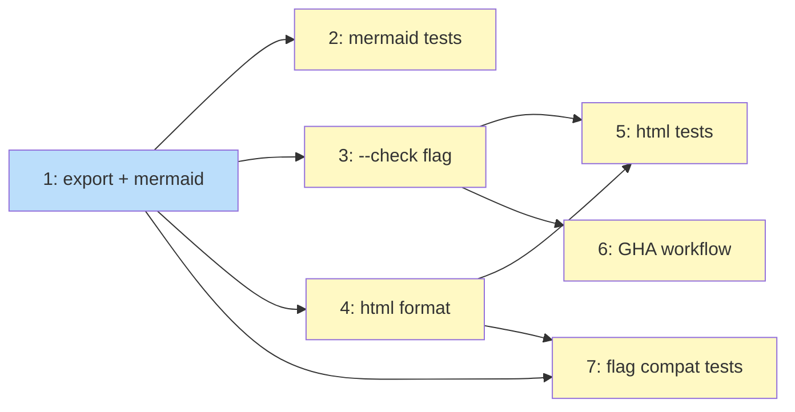

# PLAN: Visual Workflow Preview

## Status

Done

## Scope Summary

Implement `koto template export --format mermaid|html` with `--check` for CI
freshness verification, `--open` for browser convenience, and a reusable GHA
workflow for cross-repo enforcement. Covers PRD requirements R1-R15.

## Decomposition Strategy

**Horizontal.** Components have clear stable interfaces (mermaid.rs, html.rs,
check.rs are independent modules consumed by the CLI handler). The Mermaid
format is already a thin e2e slice that exercises the full pipeline
(resolve_template -> generate -> output). Each issue builds one component
fully before the next.

## Issue Outlines

### 1. feat(cli): add template export subcommand with mermaid format

**Goal:** Add the `export` subcommand with `ExportArgs`, `ExportFormat` enum,
`validate_export_flags()`, `resolve_template()`, and `to_mermaid()`. Mermaid
output to stdout by default, `--output` for file writing. LF line endings.

**Acceptance criteria:**
- [ ] `koto template export workflow.md` prints Mermaid stateDiagram-v2 to stdout
- [ ] `koto template export workflow.md --output workflow.mermaid.md` writes to file
- [ ] `--format mermaid` is the default when `--format` is omitted
- [ ] `resolve_template()` accepts both `.md` and `.json` inputs
- [ ] `validate_export_flags()` rejects all R15 invalid combinations with clear errors
- [ ] `to_mermaid()` produces stateDiagram-v2 with states, transitions, `[*]` markers, gate notes
- [ ] Output uses LF line endings on all platforms

**Dependencies:** None

**Design sections:** Solution Architecture (CLI handler, src/export/mermaid.rs), Decision 1, Decision 2

### 2. test(export): mermaid output validation and determinism

**Goal:** Integration tests that validate Mermaid output against fixture
templates. Verify determinism (byte-identical across runs), edge cases
(single-state template), gate annotations, and transition labels.

**Acceptance criteria:**
- [ ] Fixture template export produces expected Mermaid syntax
- [ ] `[*]` markers present for initial and terminal states
- [ ] `when` conditions appear as transition labels
- [ ] Gate names appear as `note` annotations
- [ ] Exporting the same template twice produces byte-identical output
- [ ] Single-state template with no transitions produces valid Mermaid
- [ ] `.md` and `.json` inputs produce identical output for the same template

**Dependencies:** Issue 1

**Design sections:** Implementation Approach Phase 1

### 3. feat(export): add --check freshness flag

**Goal:** Implement `CheckResult` enum and `check_freshness()` in
`src/export/check.rs`. Wire into the CLI handler. Exit 0 if fresh, exit 1
if stale or missing. Print actionable error message with fix command.

**Acceptance criteria:**
- [ ] `--check` with fresh file exits 0
- [ ] `--check` with stale file exits 1, prints fix command to stderr
- [ ] `--check` with missing file exits 1, identifies missing file
- [ ] `--check` without `--output` produces error (caught by validate_export_flags)
- [ ] Fix command in error message resolves the drift when executed
- [ ] Error output goes to stderr as plain text, not JSON

**Dependencies:** Issue 1

**Design sections:** Solution Architecture (check.rs), Decision 5

### 4. feat(export): add html format with interactive cytoscape.js diagram

**Goal:** Create `src/export/preview.html` and implement `generate_html()` in
`src/export/html.rs`. Add `--format html` support. Add `opener` crate for
`--open` flag. HTML includes Cytoscape.js + dagre from CDN with SRI hashes,
dark mode, start marker, tooltips, click-to-highlight (one hop), pan/zoom.

**Acceptance criteria:**
- [ ] `--format html --output workflow.html` produces self-contained HTML
- [ ] HTML renders an interactive graph with nodes matching template states
- [ ] Hover tooltips show gate name/command and evidence schemas
- [ ] Click-to-highlight traces direct incoming/outgoing edges (one hop)
- [ ] `prefers-color-scheme: dark` media query present with appropriate colors
- [ ] `[*]` start marker node connected to initial state
- [ ] All CDN script tags have SRI integrity hashes
- [ ] HTML has no server-side directives; all references are CDN URLs or inline
- [ ] `--open` launches default browser via opener crate
- [ ] `--format html` without `--output` produces error
- [ ] `</` escaped as `<\/` in injected JSON (script context injection prevention)
- [ ] Output uses LF line endings

**Dependencies:** Issue 1

**Design sections:** Solution Architecture (html.rs, preview.html), Decision 3, Decision 4

### 5. test(export): html output validation and determinism

**Goal:** Integration tests for HTML export covering content validation,
determinism, and `--check` support for HTML format.

**Acceptance criteria:**
- [ ] Generated HTML contains compiled template data
- [ ] HTML contains CDN script tags with SRI hashes
- [ ] HTML contains no server-side directives
- [ ] Exporting the same template twice as HTML produces byte-identical output
- [ ] `--format html --check` works (fresh/stale/missing cases)
- [ ] Generated HTML for a 30-state template is under 30 KB
- [ ] HTML works when served as a static page (no server-side processing)

**Dependencies:** Issue 3, Issue 4

**Design sections:** Implementation Approach Phase 3

### 6. ci: add reusable GHA workflow for template freshness checks

**Goal:** Create `.github/workflows/check-template-freshness.yml` with
`workflow_call` trigger. Download koto binary via `gh release download`.
Glob-based template discovery. `--check` enforcement with `::error`
annotations. Test from koto's own CI.

**Acceptance criteria:**
- [ ] Workflow accepts `template-paths`, `koto-version`, `check-html`, `html-output-dir` inputs
- [ ] Downloads koto release binary (not build from source)
- [ ] Expands glob pattern and runs `--check` for each template
- [ ] Stale/missing diagrams produce `::error` annotations with fix commands
- [ ] Works when called from another repo via `uses:` with tag reference
- [ ] Caller YAML is under 10 lines for basic setup

**Dependencies:** Issue 3

**Design sections:** Solution Architecture (GHA workflow), Decision 6

### 7. test(export): flag compatibility and error handling

**Goal:** Tests for all R15 flag compatibility rules and error handling for
invalid inputs (non-existent file, malformed JSON, compilation failure).

**Acceptance criteria:**
- [ ] `--format html` without `--output` produces clear error
- [ ] `--open` without `--format html` produces clear error
- [ ] `--open` with `--check` produces clear error
- [ ] `--check` without `--output` produces clear error
- [ ] Non-existent input file produces clear error with exit code 2
- [ ] Malformed JSON input produces clear error
- [ ] Template that fails compilation produces clear error
- [ ] Export of a 30-state template completes in under 500ms

**Dependencies:** Issue 1, Issue 4

**Design sections:** Decision 5 (validate_export_flags)

## Implementation Issues

_(single-pr mode: no GitHub issues created)_

## Dependency Graph

**Legend**: Blue = ready, Yellow = blocked

## Implementation Sequence

**Critical path:** Issue 1 -> Issue 4 -> Issue 5

**Parallelization:**
- After Issue 1: Issues 2, 3, 4 can start in parallel
- After Issues 3 + 4: Issues 5, 6, 7 can start in parallel

**Recommended order for sequential execution:**
1. Issue 1 (export subcommand + mermaid) -- foundation
2. Issue 3 (--check flag) -- enables CI testing early
3. Issue 4 (html format) -- largest single issue
4. Issue 2 (mermaid tests) -- can slot in anytime after 1
5. Issue 5 (html tests) -- validates 3 + 4 together
6. Issue 7 (flag compat tests) -- validates error handling
7. Issue 6 (GHA workflow) -- last, needs a release binary to test properly
