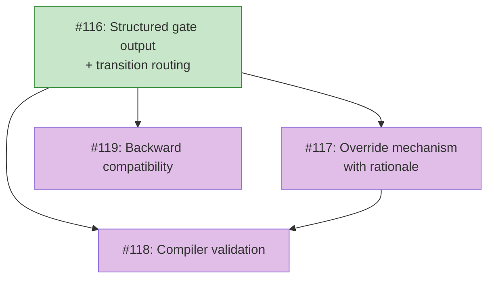

# ROADMAP: Gate-transition contract

## Status

Active

## Theme

Gates in koto are boolean pass/fail checks decoupled from transition routing.
Template authors work around this by adding `accepts` blocks with `override`
enum values on deterministic gate states. Overrides have no audit trail. Gates
can't express richer outcomes than pass/fail.

This roadmap sequences the work to replace the boolean gate model with
structured gate output that feeds into transition routing, add an override
mechanism with rationale capture, and validate the full gate/transition/override
contract at compile time.

Each feature is independently shippable. Feature 1 alone delivers structured
gate output with automated routing. Feature 2 adds the override mechanism on
top. Feature 3 adds compiler safety. Feature 4 ensures nothing breaks for
existing templates.

## Features

### Feature 1: Structured gate output and transition routing ([#116](https://github.com/tsukumogami/koto/issues/116))
**Dependencies:** None
**Status:** Complete ([#120](https://github.com/tsukumogami/koto/pull/120))
**Upstream:** [PRD-gate-transition-contract](../prds/PRD-gate-transition-contract.md) (R1, R2, R3, R4a, R11)

Gates produce structured data matching their gate type's schema. Gate output
feeds into transition `when` clauses via namespaced fields
(`gates.<name>.<field>`). The transition resolver gains dot-path traversal to
match nested gate data alongside flat agent evidence.

This is the foundation. Without structured output, overrides have nothing to
substitute and the compiler has nothing to validate.

Scope:
- Gate type schema registry (command, context-exists, context-matches)
- `GateResult` extended to carry structured data per gate type's schema
- Gate output injected into the evidence map under `gates.*` namespace
- `resolve_transition` gains dot-path traversal for nested `when` conditions
- `koto next` response includes structured gate output in `blocking_conditions`
  when gates don't pass (R4a)
- `error` field on all gate types for timeout/spawn errors
- Event ordering via sequence numbers (R11)

Design doc: [DESIGN-structured-gate-output](../designs/current/DESIGN-structured-gate-output.md)

### Feature 2: Override mechanism ([#117](https://github.com/tsukumogami/koto/issues/117))
**Dependencies:** Feature 1
**Status:** Not started
**Upstream:** [PRD-gate-transition-contract](../prds/PRD-gate-transition-contract.md) (R4, R5, R5a, R6, R7, R8, R12)

`koto overrides record` substitutes a gate's output with override data (either
the gate's `override_default` or agent-provided `--with-data`). Override events
capture the rationale, actual gate output, and substituted values. `koto
overrides list` queries all overrides across the session.

Depends on Feature 1 because overrides substitute structured gate data -- there
needs to be data to substitute.

Scope:
- `koto overrides record <name> --gate <gate> --rationale "reason"`
- Optional `--with-data` for explicit override values (validated against gate
  type schema)
- `override_default` per gate type (built-in defaults) and per gate instance
  (template-declared custom defaults)
- `GateOverrideRecorded` event type with full context
- `derive_overrides` cross-epoch query function
- `koto overrides list` CLI subcommand
- Override events sticky within epoch, read by `koto next` during gate evaluation
- `gates` top-level key reserved in evidence validation (R7)
- Rationale size limit (R12)

Design doc: TBD

### Feature 3: Compiler validation ([#118](https://github.com/tsukumogami/koto/issues/118))
**Dependencies:** Feature 1, Feature 2
**Status:** Not started
**Upstream:** [PRD-gate-transition-contract](../prds/PRD-gate-transition-contract.md) (R9)

The template compiler validates the full gate/transition/override contract at
compile time: gate types are registered, override defaults match schemas,
`when` clauses reference valid gate fields, and override defaults lead to at
least one valid transition.

Depends on Features 1 and 2 because the compiler needs to know both the gate
schema model and the override default model to validate the contract.

Scope:
- Validate gate types are registered
- Validate `override_default` matches gate type schema
- Validate `when` clause `gates.*` references point to valid gates and fields
- Reachability check: override defaults applied to all gates produce at least
  one valid transition (best-effort for non-enum fields)
- Warn on gates whose output isn't referenced by any `when` clause

Design doc: TBD

### Feature 4: Backward compatibility ([#119](https://github.com/tsukumogami/koto/issues/119))
**Dependencies:** Feature 1
**Status:** Not started
**Upstream:** [PRD-gate-transition-contract](../prds/PRD-gate-transition-contract.md) (R10)

Existing templates work without changes. Gates on states where no `when`
clause references `gates.*` fields use the legacy boolean pass/block behavior.
Templates using `accepts` blocks with `override` enum values continue to work
as plain evidence submission.

This can be built alongside Feature 1 since it's about preserving existing
behavior while the new model is added.

Scope:
- Legacy gate behavior when `when` clauses don't reference `gates.*`
- Compiler warnings (not errors) for gates without `when` references
- Existing `accepts` block workaround patterns preserved
- No implicit schema generation for legacy gates

Design doc: TBD (likely part of Feature 1's design doc)

## Sequencing rationale

Feature 1 (structured output + routing) is the foundation. Everything else
depends on gates producing data that the resolver can match on.

Feature 4 (backward compat) should be built alongside Feature 1 since it's
about how the new model coexists with the old one. They're logically separate
(different requirements) but implemented together.

Feature 2 (override mechanism) depends on Feature 1 because overrides
substitute structured gate data. Building overrides before gates produce
data would be building on the old boolean model -- which is what the current
PRD-override-gate-rationale attempted before we realized the gate model
needed to change first.

Feature 3 (compiler validation) depends on both Features 1 and 2. The compiler
needs the complete picture (schemas + override defaults + transitions) to
validate the contract. Building validation incrementally as features land
is possible but the reachability check specifically needs the full model.

## Implementation Issues

### Milestone: [Gate-transition contract](https://github.com/tsukumogami/koto/milestone/9)

| Issue | Dependencies | Tier |
|-------|--------------|------|
| ~~[#116: structured gate output and transition routing](https://github.com/tsukumogami/koto/issues/116)~~ ✓ | None | testable |
| ~~_Gates produce structured data per gate type schema. Gate output feeds into transition `when` clauses via `gates.*` namespace. Resolver gains dot-path traversal. Foundation for all other features._~~ | | |
| [#117: gate override mechanism with rationale](https://github.com/tsukumogami/koto/issues/117) | [#116](https://github.com/tsukumogami/koto/issues/116) | testable |
| _`koto overrides record` substitutes gate output with default or agent-provided data. Override events capture rationale and full context. `koto overrides list` for session-wide queries._ | | |
| [#118: gate-transition contract compiler validation](https://github.com/tsukumogami/koto/issues/118) | [#116](https://github.com/tsukumogami/koto/issues/116), [#117](https://github.com/tsukumogami/koto/issues/117) | testable |
| _Compiler validates gate types are registered, override defaults match schemas, `when` clauses reference valid fields, and override defaults produce reachable transitions._ | | |
| [#119: backward compatibility for legacy gate templates](https://github.com/tsukumogami/koto/issues/119) | [#116](https://github.com/tsukumogami/koto/issues/116) | testable |
| _Existing templates work without changes. Legacy boolean behavior when `when` clauses don't reference `gates.*`. Likely implemented alongside #116._ | | |

### Dependency graph

**Legend**: Purple = needs-design, Green = complete

## Progress

- Feature 1 (#116): Complete (PR #120)
- Feature 2 (#117): Not started
- Feature 3 (#118): Not started
- Feature 4 (#119): Not started
