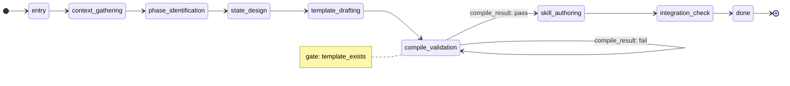

```mermaid
stateDiagram-v2
    direction LR
    [*] --> entry
    compile_validation --> skill_authoring : compile_result: pass
    compile_validation --> compile_validation : compile_result: fail
    context_gathering --> phase_identification
    entry --> context_gathering
    integration_check --> done
    phase_identification --> state_design
    skill_authoring --> integration_check
    state_design --> template_drafting
    template_drafting --> compile_validation
    done --> [*]
    note left of compile_validation
        gate: template_exists
    end note
```
